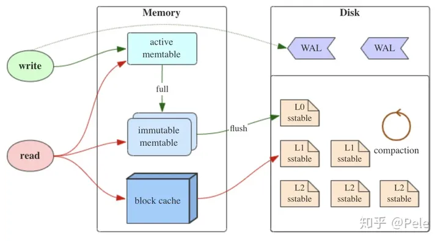

# LSM树初见

lsm树（(Log-Structured-Merge-Tree），lsm树本质上时一种存储结构，类似于K-V等，是其和B+树以及红黑树这种严格的树状数据结构不一样。HBase，LevelDB，RocksDB这些NoSQL存储都采用LSM树存储结构。

## 1.lsm树的核心思想

如上可知，lsm树支持读写操作。对于更新（修改和删除）也支持，只是具有延迟性（不会一次性将磁盘所有数据修改完，而是逐层修改）。

三个重要组成部分：

（1）memtable

memtable是内存中的数据结构，保存最近更新的数据，需要根据key值来有序的组织数据的存储。由于内存断电失效，如果需要实现持久化的存储，那么需要提前将每个操作写入日志，日志存储在磁盘中，这个操作称作WAL。

（2）*Immutable(不可变的) MemTable*

Immutable memtable用于当memtable达到最大的文件大小时，其首先会将数据写入WAL中，然后将现在的memtable切换（重新标记）为immutable的，并且同时会创建一个新的memtable以及新的wal日志。转存过程不需要阻塞写操作。

wal的创建仅限于启动时（没有wal）；memtable达到最大文件大小时；当wal日志达到预设的最大文件大小时。

（3）sstable（*Sorted String Table)）

其为有序键值对的集合，每个sstable表的键值是有一定的键值范围的，为了加快索引速度，可以再建立索引的索引或者是使用布隆过滤器（其他过滤器也可）等来加快key的查找。

存在冗余存储（对于某个key，除掉最新的其他都为冗余的，但只有level0是存在冗余的情况的，因为后面层级的sstable是需要compact获得的，而compact保证了key的唯一性）。

读数据时需要从最新的倒着来进行查询，逐层进行查询，最坏的情况是查询到最后一层，可以通过建立索引的索引以及使用布隆过滤器实现key查询的加速。

## 2.lsm树的compact操作

主要两种基本策略：size-triered和leveled。

三个不同的概念：

- 读放大 读取数据的实际读取数据量大于实际的数据量：LSM树先从memtable读，不再从sstable读。
- 写放大 写入数据时的实际写入量大于实际数据量，例如compact操导致的合并。
- 空间放大 数据实际占用磁盘大于实际磁盘的占用空间，冗余存储以及层级的存储。

（1）size-tiered策略

这策略是每一层sstable大小相近，并且限制其数量为N，当达到这个数量时，再将sstable compact成下一层更大的sstable。缺点是最后一层的sstable会非常大，且只有sstable compact时才会消除冗余的key。

（2）leveld策略

每一层设置文件占用总大小的限制M，以及将其划分为大小相近的多个sstable，并且保证了。当超过这个限制M时，则至少在本层选择一个sstable文件，然后根据这个文件的键值范围，和下一层的sstable进行比对，将键值范围有重合的进行合并，这样就可以保证key在一层是全局有序的（level0除外，因为其是由内存里面的immuatable拷贝而来，可能存在key的冗余）

如下图的示例（level1中选择的sstable和level2

的键值重合的sstable进行compact）

由该策略可以分析，空间放大的情况在一定情况下得到缓解，但是对于写放大而言，其存在一种情况是上一层的键值范围和下一层所有的sstable重叠，那么compact设计下一层全部数据，会将写放大。