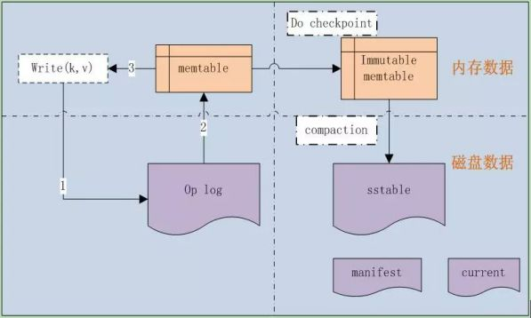
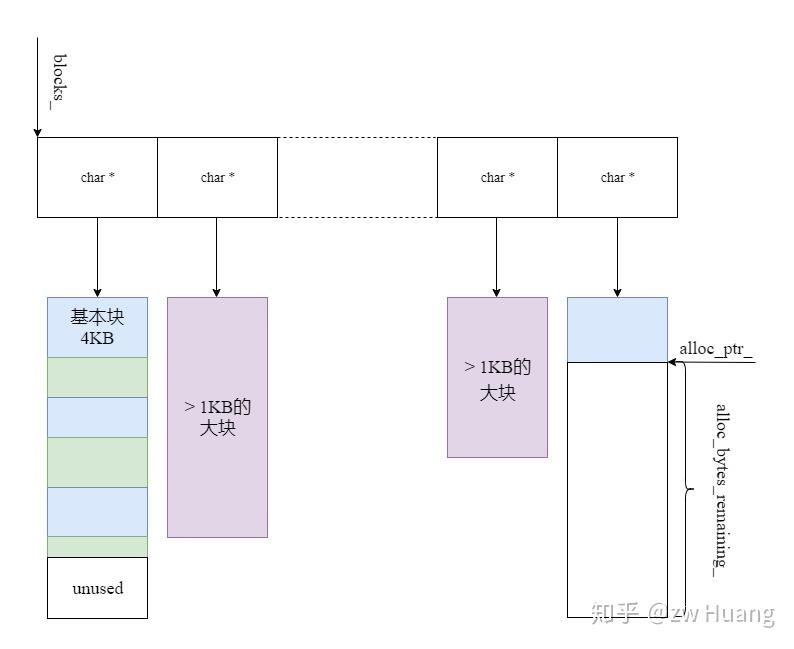
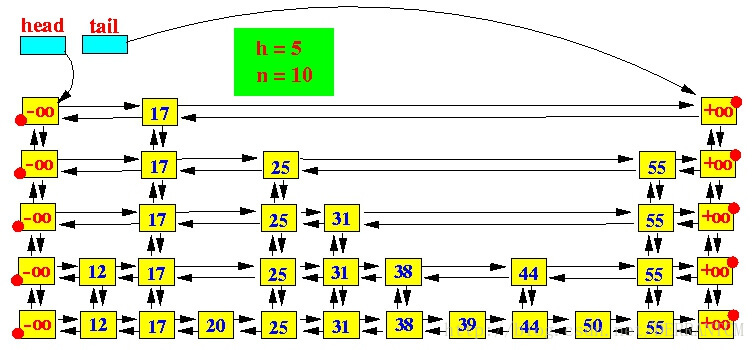

leveldb的基本框架



## 1.  **约定**：

leveldb对数字存储是小端对齐的，集int32或者int64转化为char*的函数中，是先低位再高位的顺序。

可变长的数据，int32和int64格式化为字符串数据类型大部分是变长存储，对于varint，每个byte有效为7位，最高位8通常表示结束，1通常表示后面还有一个byte数据，否则表示结束 。

字符比较基于unsigned char

## 2.  基本数据结构介绍

#### 2.1 slice

包含一个length和一个指向外部字节数组的指针。允许字符串中包含’‘\0’.

const char和string皆可转为Slice；Slice可转为string，取数据指针const char。

#### 2.2 Status

Leveldb的返回状态，将错误号和返回信息封装为Status类，其将错信息都封装为了一个字符串数组。其包含了信息长度，信息编码，信息内容三部分。一般成功NULL，失败则返回一个state_.

Status内置了

```c++
enum Code {
    kOk = 0,
    kNotFound = 1,
    kCorruption = 2,
    kNotSupported = 3,
    kInvalidArgument = 4,
    kIOError = 5
  };
//每一个code对应一种status
```

#### 2.3 Arena

内存分配一般采取预分配一块较大的内存，然后使用小内存时再从大内存里面进行分配，arena内存管理就是用了这种思想，可解决频繁开辟内存的开销问题，但可能会浪费一些内存。



本质上arena时一个内存池，它做的是申请内存以及释放内存。一个memtable一般对应一个arena内存池，当使用其分配内存时，如果当前空间足够则可以使用当前块分配内存，如果当前块空间不够，这时如果申请内存大于1KB，那么需要new一个该大小的新的块，如果申请内存小于1KB，那么需要new一个4KB的块。arena释放内存是由arena统一析构来释放全部内存，而不是调用delete或者free函数。

此外其还实现了一个对齐函数，可以判断当前块的alloc_ptr指针是否是指定位数对齐的，不是则需要开辟的内存是原始大小和需要对齐歪歪开辟的内存。

#### 2.4 Skip list

常用的高效查找方法：

（1）有序数组

（2）二叉查找树

（3）平衡二叉树（AVL树，**红黑树，B-树，B+树**）

（4）跳跃表，skip list

skip list为跳跃表，是一种代替平衡二叉树的数据结构，应用概率保证平衡，其可以避免了相对复杂的平衡二叉树的操作，以及其实现更加简洁和节省空间。



查找从顶层开始，插入从底层开始。

#### 2.5 Cache，Random，Hash，CRC32，Histgram等

