github地址：https://github.com/yanfeizhang/coder-kung-fu
# 第1章 绪论
####待解决问题
- 过多的TIME_WAIT?一个TIME_WAIT的连接会有哪些开销？
- 长连接开销？短连接/长连接；一条空闲的TCP连接有多大开销?
- cpu消耗？端口不充足时，connect系统调用的CPU消耗大幅增加?
- 不同的语言网络性能差别大？epoll工作原理/同步阻塞，异步阻塞网络IO
- 访问127.0.0.1网卡？本机网路IO和跨机相比的优势？数据过网卡？性能优势？节约的开销？
- 软中断和硬中断，为什么软中断的收发两类中断的数量相差巨大。Linux的top查看CPU开销;us用户空间占比,sy内核空间占比,hi硬中断占比,si软中断占比。
- 零拷贝怎么回事？
- DPDK 旁路网络IO技术，不过内核？
# 第2章 内核时如何接收网络包的
## 相关实际问题
- RingBuffer是什么？其分配的内存为什么会丢包，是预分配还是动态增长
- 网络软/硬中断的协作
- Linux的ksoftirqd内核线程作用？目前是一个CPU一个对应的内核线程
- 多队列的网卡能提升网络性能？
- tcpdump的使用；iptable/netfilter包过滤器工作在内核哪一层？tcpdump能转到iptable过滤掉的包吗？
## 数据如何从网卡到协议栈？
### Linux网络收发包总览
针对TCP/IP的五层模型;==Linux内核/网卡驱动主要针对链路层，网络层，传输层三层上的功能
Linux视角下的网络模型：
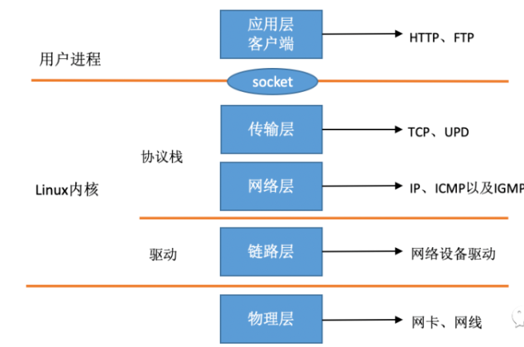
下面是内核收包的路径：
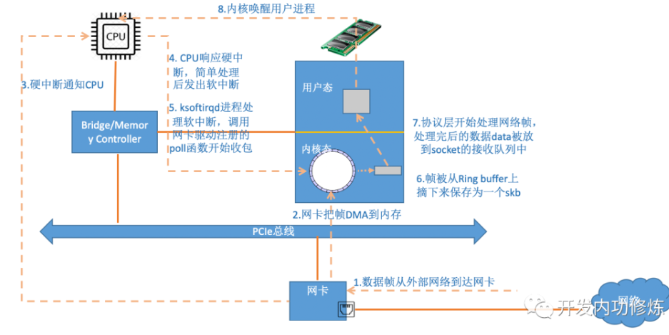
解析：
- 网卡接收到来自外部的数据帧
- 网卡把数据帧DMA到内存；==这里DMA传送数据到内存，不需要通知CPU吗？==
- 网卡再向内存发出硬中断
- CPU相应硬中断，经历上半部的中断后，快速释放CPU,发出软中断
- ksoftirqd线程处理软中断，调用网卡驱动程序注册的poll函数轮询收包
- 数据帧从RingBuffer摘下保存为skb（网络模块的核心结构体）
- 协议层处理数据帧，处理完的data放到socket的接收接收对立中。
- 内核唤醒用户进程（数据到达
### Linux启动
在Linux驱动，内核协议栈等模块能接收网卡数据包前，需要准备工作。例如网卡设备子系统初始化，注册的各个协议处理函数，ksoftirqd内核线程的创建。
#### 创建ksotfirqd内核线程

内核启动时会自动创建软中断内核处理线程ksoftirqd；在创建后，其会进入线程循环函数，等待软中断的到来。
#### 网络子系统初始化
网络子系统初始化，为每一个CPU初始化softnet_data;也会为两种收发软中断信号注册处理函数
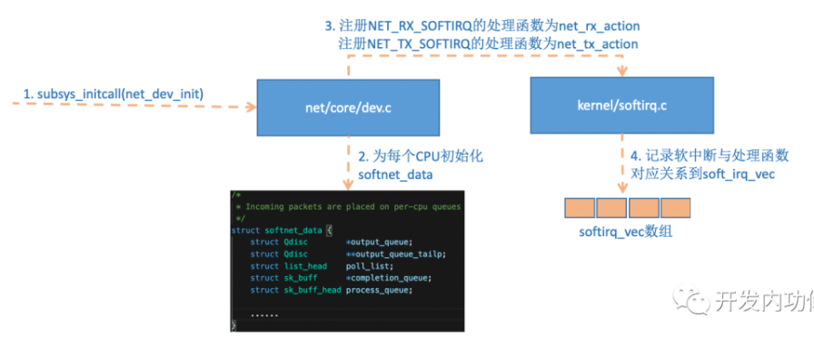
Linux内核采用subsys_initcall来初始化各个子系统。这里的net_dev_init就是网络子系统初始化，其中软中断注册的处理函数也在初始化时使用open_softirq实现，这里注册的<软中端信号，处理函数>二元组，额外使用softirq_vec变量来进行记录。

#### 协议栈注册
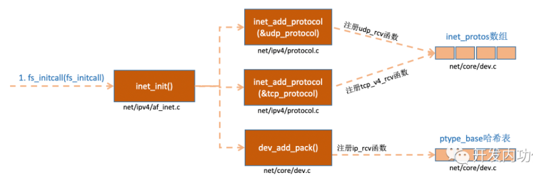
inet_add_protocol把tcp，udp的对应处理函数注册到inet_protos数组中，在“dev_add_pack”中ip的处理函数注册到ptype_base哈希表中。
#### 网卡驱动初始化
每个驱动程序，使用module_init向内核注册一个初始化函数。驱动程序被加载，内核自动调用这个初始化函数。

在pci_register_driver调用完成后，Linux内核可以获取驱动的相关信息。
```c
//file: drivers/net/ethernet/intel/igb/igb_main.c

static struct pci_driver igb_driver = {

    .name     = igb_driver_name,
    .id_table = igb_pci_tbl,
    .probe    = igb_probe,
    .remove   = igb_remove,
    ......

};

static int __init igb_init_module(void){

    ......
    ret = pci_register_driver(&igb_driver);
    return ret;

}
```
之后调用igb_probe函数方法，使网卡处于ready状态。igb_probe执行过程：
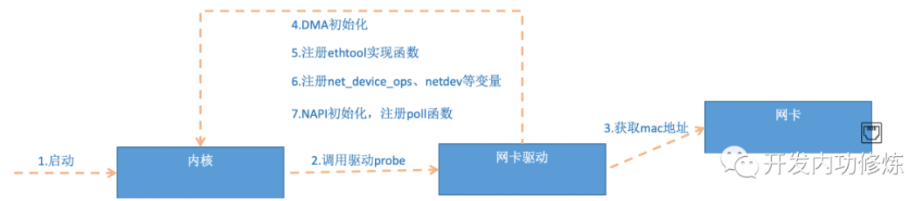
网卡驱动实现了ethtool所需接口，完成函数地址注册。之所以能使用ethtool查看网络收发包统计，修改网卡自适应模式，调整RX队列的数量和大小，其使用的是网卡驱动的东西。第6步注册net_device_ops变量，包含igb_open，这个函数在网卡启动时调用。
```c
//file: drivers/net/ethernet/intel/igb/igb_main.c

static const struct net_device_ops igb_netdev_ops = {

  .ndo_open               = igb_open,
  .ndo_stop               = igb_close,
  .ndo_start_xmit         = igb_xmit_frame,
  .ndo_get_stats64        = igb_get_stats64,
  .ndo_set_rx_mode        = igb_set_rx_mode,
  .ndo_set_mac_address    = igb_set_mac,
  .ndo_change_mtu         = igb_change_mtu,
  .ndo_do_ioctl           = igb_ioctl,

 ......
```
第7步注册NAPI机制需要的poll函数，即igb_poll函数。
```c
static int igb_alloc_q_vector(struct igb_adapter *adapter,
                  int v_count, int v_idx,
                  int txr_count, int txr_idx,
                  int rxr_count, int rxr_idx){
    ......
    /* initialize NAPI */
    netif_napi_add(adapter->netdev, &q_vector->napi,
               igb_poll, 64);

}
```
#### 启动网卡
 初始化完成就可以启动网卡，启用网卡时，会使用net_device_ops中初始化的变量，如ndo_open会被调用，其指向了igb_open方法。igb_open通常做的事：
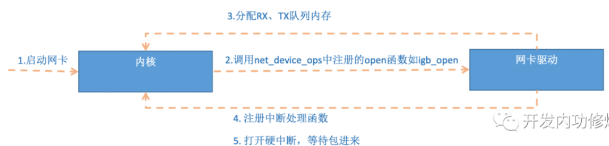
==内存，rx/tx队列，ringbuffer关系==？**理解可能有问题**
```c
//file: drivers/net/ethernet/intel/igb/igb_main.c
static int __igb_open(struct net_device *netdev, bool resuming){

    /* allocate transmit descriptors */
    err = igb_setup_all_tx_resources(adapter);

    /* allocate receive descriptors */
    err = igb_setup_all_rx_resources(adapter);

    /* 注册中断处理函数 */
    err = igb_request_irq(adapter);
    if (err)
        goto err_req_irq;

    /* 启用NAPI */
    for (i = 0; i < adapter->num_q_vectors; i++)
        napi_enable(&(adapter->q_vector[i]->napi));
    ......
/*其中igb_setup_all_rx_resources分配了ringbuffer，建立内存和rx队列的关系（这里有一个重要的点是，内存，rx/tx队列，ringbuffer三者关系
）
ringbuffer：循环队列，有读写两个指针。
rx/tx队列：接收和发送队列，这个是基于ringbuffer来实现的。
内存：本质上rx/tx队列是一块预分配内存，这里就是为什么网卡驱动需要建立内存和rx/tx队列的映射关系；预分配内存是为了防止每次访问都需要经过os内核，浪费时间
*/
}
```
下面是ringbuffer的实现，以rx接收队列为例：
```c
//单个接收队列的产生
int igb_setup_rx_resources(struct igb_ring *rx_ring)
{
	struct device *dev = rx_ring->dev;
	int size;

	size = sizeof(struct igb_rx_buffer) * rx_ring->count;

	rx_ring->rx_buffer_info = vzalloc(size);//igb_rx_buffer是内核使用，由vzalloc申请
	if (!rx_ring->rx_buffer_info)
		goto err;

	/* Round up to nearest 4K */
	rx_ring->size = rx_ring->count * sizeof(union e1000_adv_rx_desc);
	rx_ring->size = ALIGN(rx_ring->size, 4096);

	rx_ring->desc = dma_alloc_coherent(dev, rx_ring->size,//e1000_adv_rx_desc是网卡硬件使用，由dma_alloc_coherent分配
					   &rx_ring->dma, GFP_KERNEL);
	if (!rx_ring->desc)
		goto err;

	rx_ring->next_to_alloc = 0;
	rx_ring->next_to_clean = 0;
	rx_ring->next_to_use = 0;

	return 0;
//所以一个ringbuffer其实由两个环形队列数组组成，一个给内核使用，一个给网卡硬件使用。细节见P22
err:
	vfree(rx_ring->rx_buffer_info);
	rx_ring->rx_buffer_info = NULL;
	dev_err(dev, "Unable to allocate memory for the Rx descriptor ring\n");
	return -ENOMEM;
}

/**
 *  igb_setup_all_rx_resources - wrapper to allocate Rx resources
 *				 (Descriptors) for all queues
 *  @adapter: board private structure
 *
 *  Return 0 on success, negative on failure
 **/
static int igb_setup_all_rx_resources(struct igb_adapter *adapter)
{
	struct pci_dev *pdev = adapter->pdev;
	int i, err = 0;

	for (i = 0; i < adapter->num_rx_queues; i++) {
		err = igb_setup_rx_resources(adapter->rx_ring[i]);//构建num_rx_queues个接收队列
		if (err) {
			dev_err(&pdev->dev,
				"Allocation for Rx Queue %u failed\n", i);
			for (i--; i >= 0; i--)
				igb_free_rx_resources(adapter->rx_ring[i]);
			break;
		}
	}

	return err;
}
```
下面就是中断函数的注册：
```c
static int igb_request_irq(struct igb_adapter *adapter){
    if (adapter->msix_entries) {
        err = igb_request_msix(adapter);
        if (!err)
            goto request_done;
        ......
    }

}

static int igb_request_msix(struct igb_adapter *adapter){

    ......
    for (i = 0; i < adapter->num_q_vectors; i++) {
        ...
        err = request_irq(adapter->msix_entries[vector].vector,
                  igb_msix_ring, 0, q_vector->name,
    }
/*其函数栈的调用是igb_open->igb_request_irq->igb_request_msix;
在igb_request_msix中可看到，其为每一个队列都注册了一个中断处理函数igb_request_msix；这样其实是天然支持收到的包对应不同的中断，从而被不同的CPU继续处理（需要修改irqbalance，或者/proc/irq/IRQ_NUMBER/smp_affinity的属性来修改中断和CPU的绑定行为）
*/
```
### 迎接数据到来
#### 硬中断处理
其过程如图：
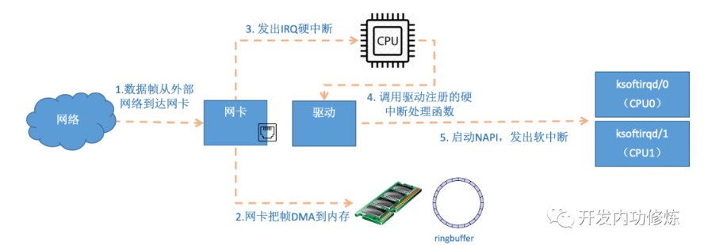
首先网卡接收数据，然后网卡在分配给自己的ringbuffer中寻找可用的内存位置，DMA引擎再把数据DMA到内存的相应位置。在DMA操作完成，发给CPU一个硬中断，再调用前面的硬中断处理函数处理，再使用NAPI机制，发出软中断。
NAPI机制的poll函数不以中断形式来读取数据，以poll方法来轮询数据，减少中断的出发时间。甚至poll函数可以对ringbuffer的包进行检查，将相关的包进行合并。合并中断请求，将sk_buffer交付给上层处理。后面对ringbuffer的清理等。
==ringbuffer满的时候，新的数据包将被丢弃,ifcofig的overruns字段表示丢包数，如果有丢包，可以使用ethtool函数来增大队列长度==
硬中断处理函数igb_msix_ring：
```c
static irqreturn_t igb_msix_ring(int irq, void *data)
{
	struct igb_q_vector *q_vector = data;

	/* Write the ITR value calculated from the previous interrupt. */
	igb_write_itr(q_vector);//记录硬中断的频率
	napi_schedule(&q_vector->napi);
	return IRQ_HANDLED;
}
/*这里是硬中断处理函数，又进行到了napi_schedule机制的调度
```
```c
static inline void ____napi_schedule(struct softnet_data *sd,
				     struct napi_struct *napi)
{
	list_add_tail(&napi->poll_list, &sd->poll_list);
	__raise_softirq_irqoff(NET_RX_SOFTIRQ);
}
//这里往per-cpu变量softnet_data变量中的poll_list添加了napi机制napi_struct的poll函数，接着又出发了软终端NET_RX_SOFTIRQ，转对应的处理函数。
/*可以看出硬中断只做了硬中断频率统计，napi的数据结构出发，将poll函数注册到softnet_data的poll_list列表；最后发出一个软中断，硬中断完成。
```
#### ksoftirqd内核线程处理软中断
软中断处理的流程：
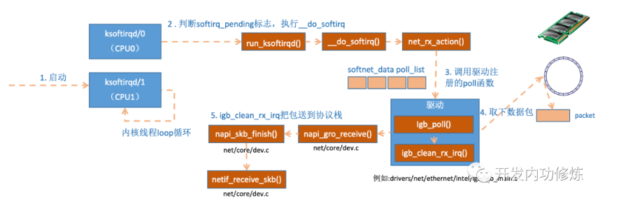
前面已经提到ksoftirqd内核线程已经有ksoftirq_should_run以及run_ksoftirqd这两个函数在循环跑。
```c
static int ksoftirqd_should_run(unsigned int cpu){//这个local_softirq_pending()会读取NET_RX_SOFTIRQ，硬中断则是写入标记。
    return local_softirq_pending();

}

#define local_softirq_pending() \    __IRQ_STAT(smp_processor_id(), __softirq_pending)


static void run_ksoftirqd(unsigned int cpu){//然后进入该函数执行，如果确有软中断，则会执行__do_softirq
    local_irq_disable();
    if (local_softirq_pending()) {
        __do_softirq();
        rcu_note_context_switch(cpu);
        local_irq_enable();
        cond_resched();
        return;
    }
    local_irq_enable();

}

//__do_softirq具体实现，其会判断当前cpud的软中断类型，调用其注册的action方法
asmlinkage void __do_softirq(void){
   do {
		if (pending & 1) {
			unsigned int vec_nr = h - softirq_vec;
			int prev_count = preempt_count();

			kstat_incr_softirqs_this_cpu(vec_nr);//cpu是用cpu = smp_processor_id()定义的，和硬中断一样。

			trace_softirq_entry(vec_nr);
			h->action(h);
			trace_softirq_exit(vec_nr);
			if (unlikely(prev_count != preempt_count())) {
				printk(KERN_ERR "huh, entered softirq %u %s %p"
				       "with preempt_count %08x,"
				       " exited with %08x?\n", vec_nr,
				       softirq_to_name[vec_nr], h->action,
				       prev_count, preempt_count());
				preempt_count() = prev_count;
			}

			rcu_bh_qs(cpu);
		}
		h++;
		pending >>= 1;
	} while (pending);

}
```
硬中断设置软中断标记，ksoftirq判断是否有软中断到达；是基于smp_processor_id()的，即硬中断在哪个CPU被响应，那软中段就在那个CPU处理
==如果出现Linux的软中断消耗CPU都在一个核上，那么需要将硬中断的亲和性打散到不同CPU上==
对应net_rx_action函数实现：
```c
static void net_rx_action(struct softirq_action *h)
{
	struct softnet_data *sd = &__get_cpu_var(softnet_data);
	unsigned long time_limit = jiffies + 2;//time_limit和budget用于控制中断处理函数主动退出，保证网络包接收的中断处理程序不会一直霸占CPU。其中budget时可以通过设置内核参数来调整
	int budget = netdev_budget;
	void *have;

	local_irq_disable();//禁止硬中断，避免在进行中断处理函数时，cpu继续响应硬中断，避免重复将napi_poll写入poll_list。

	while (!list_empty(&sd->poll_list)) {//核心逻辑，对softnet_data中的poll_list进行遍历，执行网卡驱动注册的poll函数。即igb驱动的poll函数。
		struct napi_struct *n;
		int work, weight;

		/* If softirq window is exhuasted then punt.
		 * Allow this to run for 2 jiffies since which will allow
		 * an average latency of 1.5/HZ.
		 */
		if (unlikely(budget <= 0 || time_after_eq(jiffies, time_limit)))
			goto softnet_break;

		local_irq_enable();

		/* Even though interrupts have been re-enabled, this
		 * access is safe because interrupts can only add new
		 * entries to the tail of this list, and only ->poll()
		 * calls can remove this head entry from the list.
		 */
		n = list_first_entry(&sd->poll_list, struct napi_struct, poll_list);

		have = netpoll_poll_lock(n);

		weight = n->weight;

		/* This NAPI_STATE_SCHED test is for avoiding a race
		 * with netpoll's poll_napi().  Only the entity which
		 * obtains the lock and sees NAPI_STATE_SCHED set will
		 * actually make the ->poll() call.  Therefore we avoid
		 * accidentally calling ->poll() when NAPI is not scheduled.
		 */
		work = 0;
		if (test_bit(NAPI_STATE_SCHED, &n->state)) {
			work = n->poll(n, weight);
			trace_napi_poll(n);
		}

		WARN_ON_ONCE(work > weight);

		budget -= work;

		local_irq_disable();

		/* Drivers must not modify the NAPI state if they
		 * consume the entire weight.  In such cases this code
		 * still "owns" the NAPI instance and therefore can
		 * move the instance around on the list at-will.
		 */
		if (unlikely(work == weight)) {
			if (unlikely(napi_disable_pending(n))) {
				local_irq_enable();
				napi_complete(n);
				local_irq_disable();
			} else {
				if (n->gro_list) {
					/* flush too old packets
					 * If HZ < 1000, flush all packets.
					 */
					local_irq_enable();
					napi_gro_flush(n, HZ >= 1000);
					local_irq_disable();
				}
				list_move_tail(&n->poll_list, &sd->poll_list);
			}
		}

		netpoll_poll_unlock(have);
	}
out:
	net_rps_action_and_irq_enable(sd);

#ifdef CONFIG_NET_DMA
	/*
	 * There may not be any more sk_buffs coming right now, so push
	 * any pending DMA copies to hardware
	 */
	dma_issue_pending_all();
#endif

	return;

softnet_break:
	sd->time_squeeze++;
	__raise_softirq_irqoff(NET_RX_SOFTIRQ);
	goto out;
}
```
其中igb_poll函数做的是：
```c
**
 *  igb_poll - NAPI Rx polling callback
 *  @napi: napi polling structure
 *  @budget: count of how many packets we should handle
 **/
static int igb_poll(struct napi_struct *napi, int budget)
{
	struct igb_q_vector *q_vector = container_of(napi,
						     struct igb_q_vector,
						     napi);
	bool clean_complete = true;

#ifdef CONFIG_IGB_DCA
	if (q_vector->adapter->flags & IGB_FLAG_DCA_ENABLED)
		igb_update_dca(q_vector);
#endif
	if (q_vector->tx.ring)
		clean_complete = igb_clean_tx_irq(q_vector);//实现了对igb_clean_rx_trq的调用

	if (q_vector->rx.ring)
		clean_complete &= igb_clean_rx_irq(q_vector, budget);

	/* If all work not completed, return budget and keep polling */
	if (!clean_complete)
		return budget;

	/* If not enough Rx work done, exit the polling mode */
	napi_complete(napi);
	igb_ring_irq_enable(q_vector);

	return 0;
}

```
对待igb_clean_rx_irq的调用，其作用是把ringbuffer包发送到协议栈：
```c
static bool igb_clean_rx_irq(struct igb_q_vector *q_vector, const int budget)
{
	struct igb_ring *rx_ring = q_vector->rx.ring;
	struct sk_buff *skb = rx_ring->skb;
	unsigned int total_bytes = 0, total_packets = 0;
	u16 cleaned_count = igb_desc_unused(rx_ring);

	do {
		union e1000_adv_rx_desc *rx_desc;

		/* return some buffers to hardware, one at a time is too slow */
		if (cleaned_count >= IGB_RX_BUFFER_WRITE) {
			igb_alloc_rx_buffers(rx_ring, cleaned_count);
			cleaned_count = 0;
		}

		rx_desc = IGB_RX_DESC(rx_ring, rx_ring->next_to_clean);

		if (!igb_test_staterr(rx_desc, E1000_RXD_STAT_DD))
			break;

		/* This memory barrier is needed to keep us from reading
		 * any other fields out of the rx_desc until we know the
		 * RXD_STAT_DD bit is set
		 */
		rmb();//读数据的内存屏障

		/* retrieve a buffer from the ring */
		skb = igb_fetch_rx_buffer(rx_ring, rx_desc, skb);//这里是将数据帧从ringbuffer上取下来

		/* exit if we failed to retrieve a buffer */
		if (!skb)
			break;

		cleaned_count++;

		/* fetch next buffer in frame if non-eop */
		if (igb_is_non_eop(rx_ring, rx_desc))//这里也是将数据帧取下来，eop判断？
			continue;

		/* verify the packet layout is correct */
		if (igb_cleanup_headers(rx_ring, rx_desc, skb)) {//对skb进行校验
			skb = NULL;
			continue;
		}

		/* probably a little skewed due to removing CRC */
		total_bytes += skb->len;

		/* populate checksum, timestamp, VLAN, and protocol */
		igb_process_skb_fields(rx_ring, rx_desc, skb);//设置skb的timestamp，checksum,protocol等字段

		napi_gro_receive(&q_vector->napi, skb);

		/* reset skb pointer */
		skb = NULL;

		/* update budget accounting */
		total_packets++;
	} while (likely(total_packets < budget));

	/* place incomplete frames back on ring for completion */
	rx_ring->skb = skb;

	u64_stats_update_begin(&rx_ring->rx_syncp);
	rx_ring->rx_stats.packets += total_packets;
	rx_ring->rx_stats.bytes += total_bytes;
	u64_stats_update_end(&rx_ring->rx_syncp);
	q_vector->rx.total_packets += total_packets;
	q_vector->rx.total_bytes += total_bytes;

	if (cleaned_count)
		igb_alloc_rx_buffers(rx_ring, cleaned_count);//skb从ringbuffer取下后，申请新的skb重新挂到ringbuffer。

	return (total_packets < budget);
}
```
==一个数据帧可能有多个ringbuffer的占用，获取一个数据帧用一个sk_buff表示，循环获取，直到帧的尾部==
napi_gro_receive实现：
```C
gro_result_t napi_gro_receive(struct napi_struct *napi, struct sk_buff *skb)
{
	skb_gro_reset_offset(skb);//网卡gro特性，将相关的小包合成一个大包，减少传送到网络栈的包数

	return napi_skb_finish(dev_gro_receive(napi, skb), skb);
}
EXPORT_SYMBOL(napi_gro_receive);

//napi_skb_finish实现
static gro_result_t napi_skb_finish(gro_result_t ret, struct sk_buff *skb)
{
	switch (ret) {
	case GRO_NORMAL:
		if (netif_receive_skb(skb))//将数据包送到协议栈中
			ret = GRO_DROP;
		break;

	case GRO_DROP:
		kfree_skb(skb);
		break;

	case GRO_MERGED_FREE:
		if (NAPI_GRO_CB(skb)->free == NAPI_GRO_FREE_STOLEN_HEAD)
			kmem_cache_free(skbuff_head_cache, skb);
		else
			__kfree_skb(skb);
		break;

	case GRO_HELD:
	case GRO_MERGED:
		break;
	}

	return ret;
}
```
#### 网络协议栈处理
具体为netif_receive_skb操作，网络协议栈处理流程：
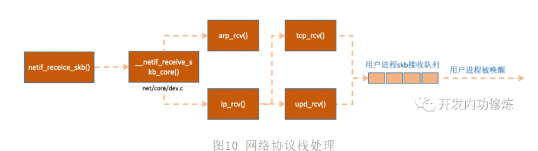
```c
/**
 *	netif_receive_skb - process receive buffer from network
 *	@skb: buffer to process
 *
 *	netif_receive_skb() is the main receive data processing function.
 *	It always succeeds. The buffer may be dropped during processing
 *	for congestion control or by the protocol layers.
 *
 *	This function may only be called from softirq context and interrupts
 *	should be enabled.
 *
 *	Return values (usually ignored):
 *	NET_RX_SUCCESS: no congestion
 *	NET_RX_DROP: packet was dropped
 */
int netif_receive_skb(struct sk_buff *skb)
{
	net_timestamp_check(netdev_tstamp_prequeue, skb);

	if (skb_defer_rx_timestamp(skb))
		return NET_RX_SUCCESS;

#ifdef CONFIG_RPS
	if (static_key_false(&rps_needed)) {
		struct rps_dev_flow voidflow, *rflow = &voidflow;
		int cpu, ret;

		rcu_read_lock();

		cpu = get_rps_cpu(skb->dev, skb, &rflow);

		if (cpu >= 0) {
			ret = enqueue_to_backlog(skb, cpu, &rflow->last_qtail);
			rcu_read_unlock();
			return ret;
		}
		rcu_read_unlock();
	}
#endif
	return __netif_receive_skb(skb);
}
EXPORT_SYMBOL(netif_receive_skb);

//接着调用
static int __netif_receive_skb(struct sk_buff *skb)
{
	int ret;

	if (sk_memalloc_socks() && skb_pfmemalloc(skb)) {
		unsigned long pflags = current->flags;

		/*
		 * PFMEMALLOC skbs are special, they should
		 * - be delivered to SOCK_MEMALLOC sockets only
		 * - stay away from userspace
		 * - have bounded memory usage
		 *
		 * Use PF_MEMALLOC as this saves us from propagating the allocation
		 * context down to all allocation sites.
		 */
		current->flags |= PF_MEMALLOC;
		ret = __netif_receive_skb_core(skb, true);
		tsk_restore_flags(current, pflags, PF_MEMALLOC);
	} else
		ret = __netif_receive_skb_core(skb, false);//

	return ret;
}

//接着调用
static int __netif_receive_skb_core(struct sk_buff *skb, bool pfmemalloc){
    ......

    //pcap逻辑，这里会将数据送入抓包点。tcpdump就是从这个入口获取包的  
      list_for_each_entry_rcu(ptype, &ptype_all, list) {//tcpdump通过虚拟协议方式工作，将抓包函数以协议方式挂到ptype_all上面
        if (!ptype->dev || ptype->dev == skb->dev) {
            if (pt_prev)
                ret = deliver_skb(skb, pt_prev, orig_dev);
            pt_prev = ptype;
        }
    }
    ......
    list_for_each_entry_rcu(ptype,挂到i
            &ptype_base[ntohs(type) & PTYPE_HASH_MASK], list) {
        if (ptype->type == type &&
            (ptype->dev == null_or_dev || ptype->dev == skb->dev ||
             ptype->dev == orig_dev)) {
            if (pt_prev)
                ret = deliver_skb(skb, pt_prev, orig_dev);//这个deliver_skb函数其实就是调用对应的协议层的处理函数，ip协议则是ip_rcv；arp则是arp_rcv.
            pt_prev = ptype;
        }
    }

}
```
其中tcpdump会执行到packet_create上，
```c
static int packet_create(struct net *net, struct socket *sock, int protocol,
			 int kern)
{
	struct sock *sk;
	struct packet_sock *po;
	__be16 proto = (__force __be16)protocol; /* weird, but documented */
	int err;

	...

	/*
	 *	Attach a protocol block
	 */

	spin_lock_init(&po->bind_lock);
	mutex_init(&po->pg_vec_lock);
	po->prot_hook.func = packet_rcv;

	if (sock->type == SOCK_PACKET)
		po->prot_hook.func = packet_rcv_spkt;

	po->prot_hook.af_packet_priv = sk;

	if (proto) {
		po->prot_hook.type = proto;
		register_prot_hook(sk);//z这个函数将tcpdump用到的协议挂到ptype_all上
	}

	mutex_lock(&net->packet.sklist_lock);
	sk_add_node_rcu(sk, &net->packet.sklist);
	mutex_unlock(&net->packet.sklist_lock);

	preempt_disable();
	sock_prot_inuse_add(net, &packet_proto, 1);
	preempt_enable();

	return 0;
out:
	return err;
}
```
接下来__netif_receive_skb_core函数取出protocol，根据数据包取出的协议信息，再遍历协议上注册的回调函数列表。pytpe_base是哈希表，协议函数地址就存储在哈希表中。后面调用deliver_skb函数，调用对应的协议层处理函数，ip_rcv，arp_rcv等
#### IP层处理
==Linux在IP层做了啥？==
```c
/file: net/ipv4/ip_input.c

int ip_rcv(struct sk_buff *skb, struct net_device *dev, struct packet_type *pt, struct net_device *orig_dev){

    ......
    return NF_HOOK(NFPROTO_IPV4, NF_INET_PRE_ROUTING, skb, dev, NULL,
               ip_rcv_finish);

}//NF_HOOK为钩子函数，为日常工作中用到的iptables netfilter过滤，复杂的netfilter规则，消耗过多的CPU资源，加大网络延迟。
//最后指向了ip_rcv_finish函数


static int ip_rcv_finish(struct sk_buff *skb)
{
	const struct iphdr *iph = ip_hdr(skb);
	struct rtable *rt;

	if (sysctl_ip_early_demux && !skb_dst(skb) && skb->sk == NULL) {
		const struct net_protocol *ipprot;
		int protocol = iph->protocol;

		ipprot = rcu_dereference(inet_protos[protocol]);
		if (ipprot && ipprot->early_demux) {
			ipprot->early_demux(skb);
			/* must reload iph, skb->head might have changed */
			iph = ip_hdr(skb);
		}
	}

	/*
	 *	Initialise the virtual path cache for the packet. It describes
	 *	how the packet travels inside Linux networking.
	 */
	if (!skb_dst(skb)) {
		int err = ip_route_input_noref(skb, iph->daddr, iph->saddr,//这里将ip_local_deliver赋值给dst.input
					       iph->tos, skb->dev);
		if (unlikely(err)) {
			if (err == -EXDEV)
				NET_INC_STATS_BH(dev_net(skb->dev),
						 LINUX_MIB_IPRPFILTER);
			goto drop;
		}
	}

#ifdef CONFIG_IP_ROUTE_CLASSID
	if (unlikely(skb_dst(skb)->tclassid)) {
		struct ip_rt_acct *st = this_cpu_ptr(ip_rt_acct);
		u32 idx = skb_dst(skb)->tclassid;
		st[idx&0xFF].o_packets++;
		st[idx&0xFF].o_bytes += skb->len;
		st[(idx>>16)&0xFF].i_packets++;
		st[(idx>>16)&0xFF].i_bytes += skb->len;
	}
#endif

	if (iph->ihl > 5 && ip_rcv_options(skb))
		goto drop;

	rt = skb_rtable(skb);
	if (rt->rt_type == RTN_MULTICAST) {
		IP_UPD_PO_STATS_BH(dev_net(rt->dst.dev), IPSTATS_MIB_INMCAST,
				skb->len);
	} else if (rt->rt_type == RTN_BROADCAST)
		IP_UPD_PO_STATS_BH(dev_net(rt->dst.dev), IPSTATS_MIB_INBCAST,
				skb->len);

	return dst_input(skb);//这里调用了dst_inpt,dst_input主要是调用input方法，即路由子系统的ip_local_deliver

drop:
	kfree_skb(skb);
	return NET_RX_DROP;
}

//ip_local_deliver，将ip包传递给更高层的传输层协议
/*
 * 	Deliver IP Packets to the higher protocol layers.
 */
int ip_local_deliver(struct sk_buff *skb)
{
	/*
	 *	Reassemble IP fragments.
	 */

	if (ip_is_fragment(ip_hdr(skb))) {
		if (ip_defrag(skb, IP_DEFRAG_LOCAL_DELIVER))
			return 0;
	}

	return NF_HOOK(NFPROTO_IPV4, NF_INET_LOCAL_IN, skb, skb->dev, NULL,
		       ip_local_deliver_finish);//继续调用对应的finish函数
}

static int ip_local_deliver_finish(struct sk_buff *skb)
{
	struct net *net = dev_net(skb->dev);

	__skb_pull(skb, skb_network_header_len(skb));

	rcu_read_lock();
	{
		int protocol = ip_hdr(skb)->protocol;//获取更高层的协议
		const struct net_protocol *ipprot;
		int raw;

	resubmit:
		raw = raw_local_deliver(skb, protocol);

		ipprot = rcu_dereference(inet_protos[protocol]);//inet_protos如前面所说，保存在传输层tcp，udp的处理函数的地址
		if (ipprot != NULL) {
			int ret;

			if (!ipprot->no_policy) {//根据包的协议的不同来进行网络包的分发，skb包传递到更高层协议udp，tcp进行处理
				if (!xfrm4_policy_check(NULL, XFRM_POLICY_IN, skb)) {
					kfree_skb(skb);
					goto out;
				}
				nf_reset(skb);
			}
			ret = ipprot->handler(skb);
			if (ret < 0) {
				protocol = -ret;
				goto resubmit;
			}
			IP_INC_STATS_BH(net, IPSTATS_MIB_INDELIVERS);
		} else {
			if (!raw) {
				if (xfrm4_policy_check(NULL, XFRM_POLICY_IN, skb)) {
					IP_INC_STATS_BH(net, IPSTATS_MIB_INUNKNOWNPROTOS);
					icmp_send(skb, ICMP_DEST_UNREACH,
						  ICMP_PROT_UNREACH, 0);
				}
				kfree_skb(skb);
			} else {
				IP_INC_STATS_BH(net, IPSTATS_MIB_INDELIVERS);
				consume_skb(skb);
			}
		}
	}
 out:
	rcu_read_unlock();

	return 0;
}
```
### 收包小结
用户执行完recvfrom调用，用户进程通过系统调用进入内核态工作，接收队列无数据，进程进入睡眠状态被os挂起。在收包前linux的准备工作：
- 创建softirqd线程，设置线程函数should_run和run。
- 协议栈注册和网络子系统初始化，包括对softnet_data的初始化，对收发中断信号的处理函数的注册，对各钟网络协议，如：arp，icmp,ip,udp等协议的注册。
- 网卡驱动的初始化，主要是，网卡MAC地址获取，DMA的初始化，ethtool函数注册，net_device_ops等网卡变脸初始化，NAPI的poll函数的注册。
- 启动网卡，执行igb_open函数，分配rx,tx队列的内存，注册硬中断处理函数，打开硬中断。
这是内核在准备收包前的重要工作，数据到来时，走硬中断，软中断，协议栈等环节：
- 网卡把数据帧DMA到内存的Ringbuffer中，向CPU发起硬中断通知
- CPU响应中断请求，调用启动网卡时对应的硬中断处理函数。其只是将NAPI的poll函数地址赋给softnet_data数据里的poll_list，记录中断次数，发起软中断请求
- 内核线程ksoftirqd收到软中断请求，关闭硬中断。转到对应的接收中断处理函数，递归逐步调用poll函数，调用igb_clean_rx_irq进行数据帧的取以及合并。进行到netif_receive_skb，其根据协议进行分发，将skb包送到ip_rcv等注册的函数中
- ip_rcv函数，通过ip_local_deliver将包送到udp,tcp更上层。
## 本章总结
### Ringbuffer到底是什么，ringbuffer为什么会丢包？
==注意区分ringbuffer内存是预分配好的，但是上面的存储的数据skb是可以igb_poll动态申请分配的==
ringbuffer是一块特殊的内存区域，网卡收数据再DMA到这块区域，然后软中断收包（igb_poll函数里的igb_rx_clean_irq函数进行skb包的合并处理，以及再申请）
ringbuffer的大小和长度有限制，可通过ethtool工具查看。
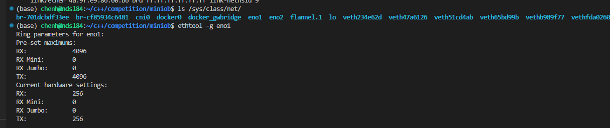
这里只设置了接收/发送队列大小为256.
```shell
ethtool -S eno1 ##查看是否有ringbuffer包一处，*_errors项
ethtool -G eno1 rx 4096 tx 4096 ##设置接收/发送ringbuffer大小为指定大小
##ringbuffer过大虽然不易溢出，但排队包会增多，增大网络延时；核心其实是增快内核消费skb包的速度
```
### 网络相关的硬软中断是什么？
网卡送到ringbuffer,发起硬中断，主要做了硬中断频率记录，poll_list双向链表添加NAPI的poll函数，触发软中断。
软终端对softnet_data的poll_list进行遍历，执行poll函数，收取skb包，发到下一个协议栈中，如ip_rcv函数。
### Linux的ksoftirqd内核线程作用？
每个CPU一个softirqd内核线程，其包含所有的软中断处理逻辑。其中收发软中断次数不平衡，接收软中断次数远远高于发送软中断的次数。
### 为什么网卡开启多队列能提升网络性能？
基本现在的主流网卡都支持多队列.
```shell
ethtool -l eno1 ##可以查看该以太网接口的多队列信息
ethtool -L eno1 combined 32 ##设置该以太网接口的实际队列数量
```
值得注意的是每个队列有独立的，不同的中断号，故不同队列可向不同的CPU发起硬中断通知，注意硬中断和软中端是在一个smp_processos_id的，即硬中断在那个CPU处理，软中断就在。故可以设置每个队列中断号的CPU亲和性，将不同队列的处理打散到不同CPU上，这样提高网络性能。
### tcpdump如何工作？
tcpdump工作在设备层,调用packet_create将抓包函数以协议方式挂到ptype_all上，__netif_receive_skb_core函数在将包发到ip_rcv等协议栈前，先发到ptype_all的抓包点上，tcpdump基于这个抓包点来进行工作。
### tcpdump能否转到被iptables封禁的包？
tcpdump工作在ip_rcv处理函数之前，在设备层，netfilter工作在ip，arp等层。netfilter是在tcpdump后面工作的。故不影响。
==在收包时，tcpdump在netfilter之前，故不影响tcpdump抓包；但是对发包过程来说，netfilter在tcpdump之前，故会影响发包的tcpdump抓包==
### 网络接收过程中的CPU开销如何查看？
使用top/htop指令，查看hi以及si,即硬中断和软中断的次数。
### DPDK是什么？
数据包接收，内核需要非常复杂的工作，在数据接收完之后，还需要将数据copy到用户空间内存。还涉及阻塞的用户进程唤醒等。开销很大
有什么办法能绕过内核协议栈，直接从网卡接收数据?
这样繁杂的内核协议栈处理，内核态到用户态内存的拷贝开销，唤醒用户进程的开销都可以省掉了。==DPDK技术==就是其中一种。
# 第3章 内核是如何与用户进程协作的
- 同步阻塞的开销？
- 多路复用epoll为什么提高网络性能？
- epoll也阻塞？为什么还是高性能。
- 为什么redis的网络性能很突出？
## socket的直接创建
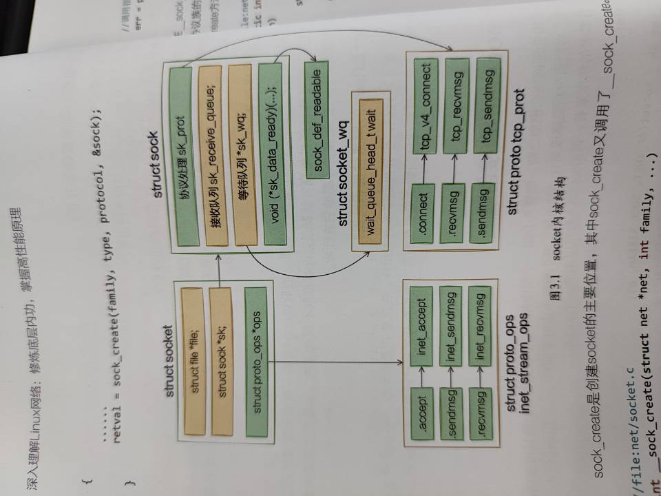
以上就是socket的内核结构表示。**当软中断上收到数据包时会通过调用sk_data_ready函数指针->sock_def_readable()来唤醒在sock上等待的进程**。socket的创建花费一次系统调用的开销。
## 内核和用户进程协作之阻塞方式
同步阻塞：使用方便，性能较差，如下图：
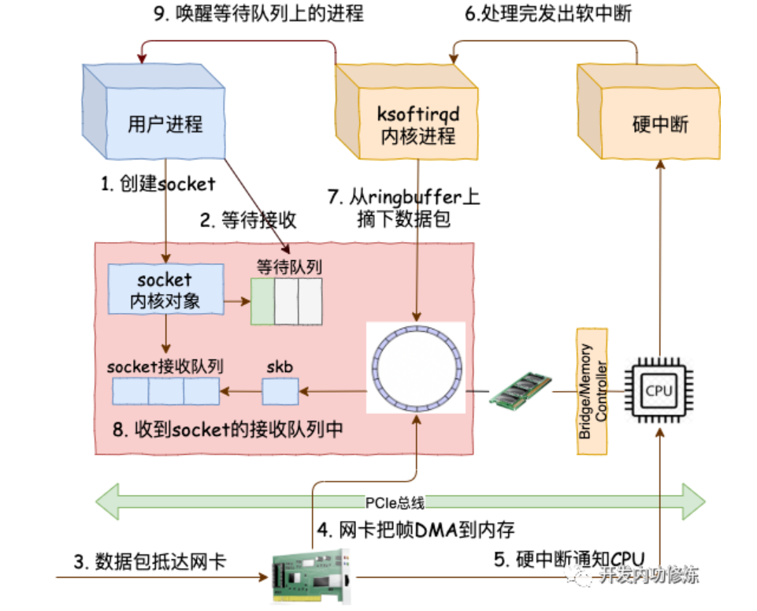
### 等待接收消息
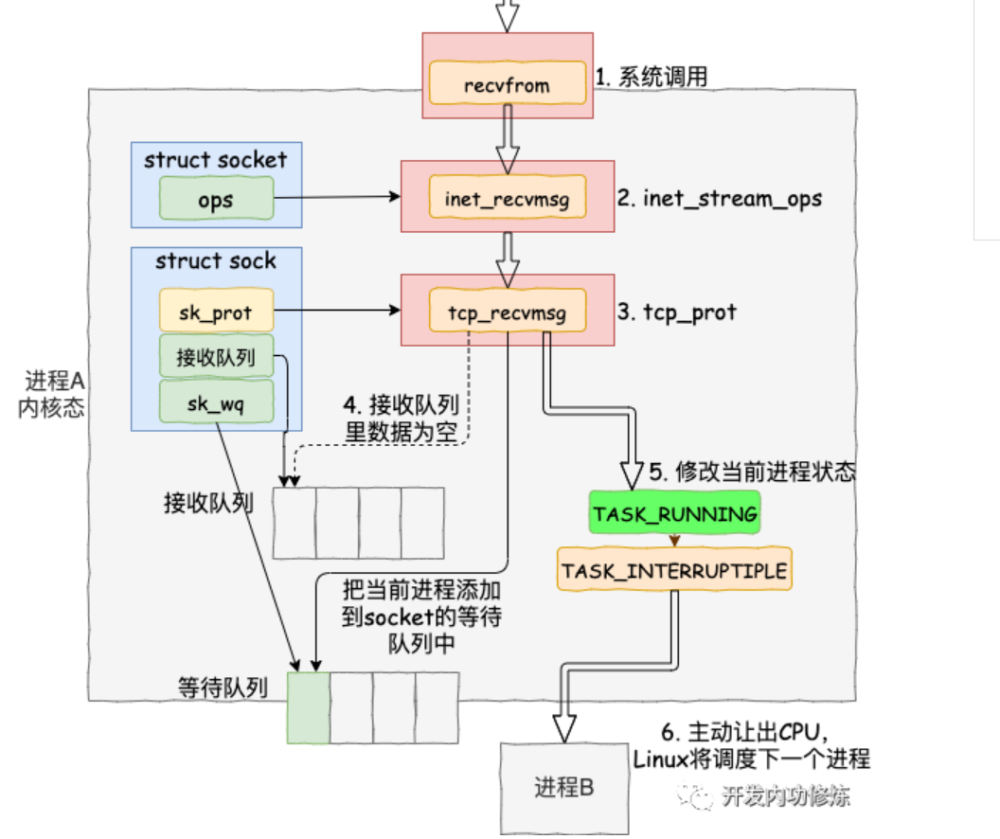
- 首先用户进程调用recv，实质调用recvfrom系统调用。
- 访问socket内核对象的ops，调用inet_recvmsg()->访问sock内核对象的sk_prot的tcp_recvmsg()。
- 遍历接收队列，如果没有足够的数据，那么就会调用sk_wait_data阻塞当前进程。
阻塞细节：注册了等待队列项wait;首先将当前进程的current关联新的注册的新的回调函数autoremove_wake_function中;找出socket的等待队列（理解为同一类等待事件队列）;插入wait项到socket等待队列中，修改当前进程的状态（运行态到阻塞态）
- ==内核在收完数据后即产生就绪事件时，查找等待队列，找到对应的回调函数和进程==，调用sk_wait_event让出cpu，有一次进程上下文的切换。

### 软中断模块
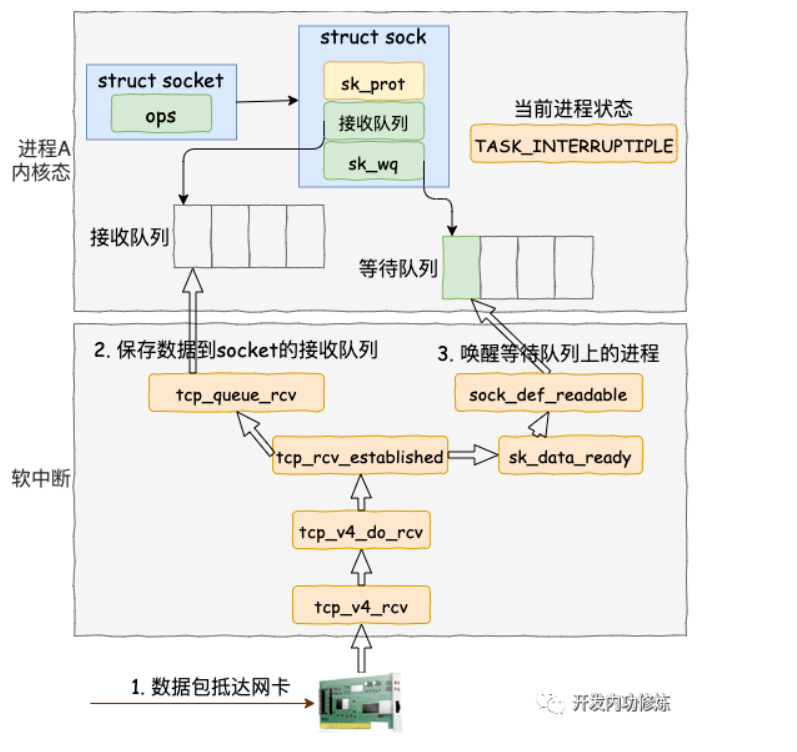
如上图所示，软中断收skb包，走ip处理函数流程后，tcp数据包则走tcp处理函数；保存数据到socket的接收队列中，唤醒等待队列（调用前面socket创建的内核对象sock的sock_def_readable()）上的进程。
```c
//file: net/ipv4/tcp_input.c
int tcp_rcv_established(struct sock *sk, struct sk_buff *skb,
   const struct tcphdr *th, unsigned int len)
{
 ......

 //接收数据到队列中
 eaten = tcp_queue_rcv(sk, skb, tcp_header_len,
            &fragstolen);

 //数据 ready，唤醒 socket 上阻塞掉的进程
sk->sk_data_ready(sk, 0);
}

//tcp_queue_rcv()函数
//file: net/ipv4/tcp_input.c
static int __must_check tcp_queue_rcv(struct sock *sk, struct sk_buff *skb, int hdrlen,
    bool *fragstolen)
{
 //把接收到的数据放到 socket 的接收队列的尾部
 if (!eaten) {
  __skb_queue_tail(&sk->sk_receive_queue, skb);
  skb_set_owner_r(skb, sk);
 }
 return eaten;
}

//sk_data_ready()函数即对应sock_def_readale()函数
//file: net/core/sock.c
static void sock_def_readable(struct sock *sk, int len)
{
 struct socket_wq *wq;

 rcu_read_lock();
 wq = rcu_dereference(sk->sk_wq);

 //有进程在此 socket 的等待队列
 if (wq_has_sleeper(wq))
  //唤醒等待队列上的进程
  wake_up_interruptible_sync_poll(&wq->wait, POLLIN | POLLPRI |
      POLLRDNORM | POLLRDBAND);
 sk_wake_async(sk, SOCK_WAKE_WAITD, POLL_IN);
 rcu_read_unlock();
}

// wake_up_interruptible_sync_poll()来唤醒，具体函数
//file: kernel/sched/core.c
void __wake_up_sync_key(wait_queue_head_t *q, unsigned int mode,
   int nr_exclusive, void *key)
{
 unsigned long flags;
 int wake_flags = WF_SYNC;

 if (unlikely(!q))
  return;

 if (unlikely(!nr_exclusive))
  wake_flags = 0;

 spin_lock_irqsave(&q->lock, flags);
 __wake_up_common(q, mode, nr_exclusive, wake_flags, key);
 spin_unlock_irqrestore(&q->lock, flags);
}

//wake_up_common
//file: kernel/sched/core.c
static void __wake_up_common(wait_queue_head_t *q, unsigned int mode,
   int nr_exclusive, int wake_flags, void *key)
{
 wait_queue_t *curr, *next;

 list_for_each_entry_safe(curr, next, &q->task_list, task_list) {
  unsigned flags = **curr**->flags;

  if (curr->func(curr, mode, wake_flags, key) &&
    (flags & WQ_FLAG_EXCLUSIVE) && !--nr_exclusive)
   break;
 }
}
//wake_up_common实现唤醒进程，nr_exclusive为1，表示即使多个进程阻塞在同一socket上，也只唤醒一个进程，避免“惊群”效应.在对应的socket的等待队列中找到一个curr等待项，调用curr->func即前面的autoremove_wake_function中。然后走到default_wake_function（）
//file: kernel/sched/core.c
int default_wake_function(wait_queue_t *curr, unsigned mode, int wake_flags,
     void *key)
{
 return try_to_wake_up(curr->private, mode, wake_flags);
}
//这里的curr->private即前面所述的当前进程，即对应的进程。这个执行完成后：
//socket上等待而阻塞的进程被推入运行队列了，会产生一次切换进程上下文的开销。
```
### 同步阻塞总结
两次进程上下文切换，一次用户进程阻塞用户态到阻塞态。一次就绪，阻塞态到用户态。**==一次上下文切换大概几微秒==**。
这种同步阻塞模式基本无法在现在的实际需求下使用，即使是客户端。所以需要更加高效的网路模式，即下面的select，poll，epoll模式。

