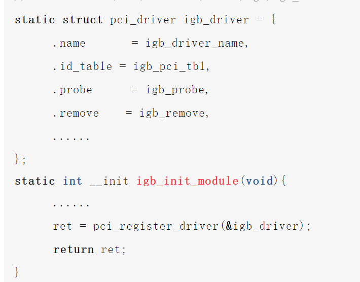

github地址：https://github.com/yanfeizhang/coder-kung-fu
# 第1章 绪论
####待解决问题
- 过多的TIME_WAIT?一个TIME_WAIT的连接会有哪些开销？
- 长连接开销？短连接/长连接；一条空闲的TCP连接有多大开销?
- cpu消耗？端口不充足时，connect系统调用的CPU消耗大幅增加?
- 不同的语言网络性能差别大？epoll工作原理/同步阻塞，异步阻塞网络IO
- 访问127.0.0.1网卡？本机网路IO和跨机相比的优势？数据过网卡？性能优势？节约的开销？
- 软中断和硬中断，为什么软中断的收发两类中断的数量相差巨大。Linux的top查看CPU开销;us用户空间占比,sy内核空间占比,hi硬中断占比,si软中断占比。
- 零拷贝怎么回事？
- DPDK 旁路网络IO技术，不过内核？
# 第2章 内核时如何接收网络包的
## 相关实际问题
- RingBuffer是什么？其分配的内存为什么会丢包，是预分配还是动态增长
- 网络软/硬中断的协作
- Linux的ksoftirqd内核线程作用？目前是一个CPU一个对应的内核线程
- 多队列的网卡能提升网络性能？
- tcpdump的使用；iptable/netfilter包过滤器工作在内核哪一层？tcpdump能转到iptable过滤掉的包吗？
## 数据如何从网卡到协议栈？
### Linux网络收发包总览
针对TCP/IP的五层模型;==Linux内核/网卡驱动主要针对链路层，网络层，传输层三层上的功能
Linux视角下的网络模型：

下面是内核收包的路径：

解析：
- 网卡接收到来自外部的数据帧
- 网卡把数据帧DMA到内存；==这里DMA传送数据到内存，不需要通知CPU吗？==
- 网卡再向内存发出硬中断
- CPU相应硬中断，经历上半部的中断后，快速释放CPU,发出软中断
- ksoftirqd线程处理软中断，调用网卡驱动程序注册的poll函数轮询收包
- 数据帧从RingBuffer摘下保存为skb（网络模块的核心结构体）
- 协议层处理数据帧，处理完的data放到socket的接收接收对立中。
- 内核唤醒用户进程（数据到达
### Linux启动
在Linux驱动，内核协议栈等模块能接收网卡数据包前，需要准备工作。例如网卡设备子系统初始化，注册的各个协议处理函数，ksoftirqd内核线程的创建。
#### 创建ksotfirqd内核线程

内核启动时会自动创建软中断内核处理线程ksoftirqd；在创建后，其会进入线程循环函数，等待软中断的到来。
#### 网络子系统初始化
网络子系统初始化，为每一个CPU初始化softnet_data;也会为两种收发软中断信号注册处理函数

Linux内核采用subsys_initcall来初始化各个子系统。这里的net_dev_init就是网络子系统初始化，其中软中断注册的处理函数也在初始化时使用open_softirq实现，这里注册的<软中端信号，处理函数>二元组，额外使用softirq_vec变量来进行记录。

#### 协议栈注册

inet_add_protocol把tcp，udp的对应处理函数注册到inet_protos数组中，在“dev_add_pack”中ip的处理函数注册到ptype_base哈希表中。
#### 网卡驱动初始化
每个驱动程序，使用module_init向内核注册一个初始化函数。驱动程序被加载，内核自动调用这个初始化函数。

在pci_register_driver调用完成后，Linux内核可以获取驱动的相关信息。
