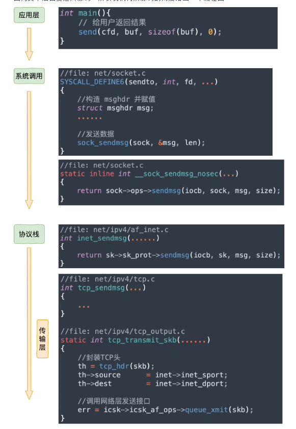
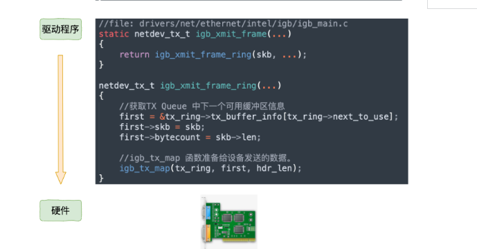
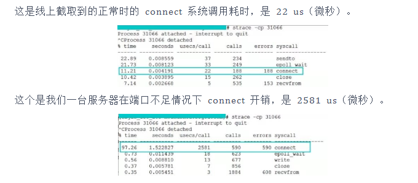

github地址：https://github.com/yanfeizhang/coder-kung-fu
# 第1章 绪论
####待解决问题
- 过多的TIME_WAIT?一个TIME_WAIT的连接会有哪些开销？
- 长连接开销？短连接/长连接；一条空闲的TCP连接有多大开销?
- cpu消耗？端口不充足时，connect系统调用的CPU消耗大幅增加?
- 不同的语言网络性能差别大？epoll工作原理/同步阻塞，异步阻塞网络IO
- 访问127.0.0.1网卡？本机网路IO和跨机相比的优势？数据过网卡？性能优势？节约的开销？
- 软中断和硬中断，为什么软中断的收发两类中断的数量相差巨大。Linux的top查看CPU开销;us用户空间占比,sy内核空间占比,hi硬中断占比,si软中断占比。
- 零拷贝怎么回事？
- DPDK 旁路网络IO技术，不过内核？
# 第2章 内核时如何接收网络包的
## 相关实际问题
- RingBuffer是什么？其分配的内存为什么会丢包，是预分配还是动态增长
- 网络软/硬中断的协作
- Linux的ksoftirqd内核线程作用？目前是一个CPU一个对应的内核线程
- 多队列的网卡能提升网络性能？
- tcpdump的使用；iptable/netfilter包过滤器工作在内核哪一层？tcpdump能转到iptable过滤掉的包吗？
## 数据如何从网卡到协议栈？
### Linux网络收发包总览
针对TCP/IP的五层模型;==Linux内核/网卡驱动主要针对链路层，网络层，传输层三层上的功能
Linux视角下的网络模型：

下面是内核收包的路径：

解析：
- 网卡接收到来自外部的数据帧
- 网卡把数据帧DMA到内存；==这里DMA传送数据到内存，不需要通知CPU吗？==
- 网卡再向内存发出硬中断
- CPU相应硬中断，经历上半部的中断后，快速释放CPU,发出软中断
- ksoftirqd线程处理软中断，调用网卡驱动程序注册的poll函数轮询收包
- 数据帧从RingBuffer摘下保存为skb（网络模块的核心结构体）
- 协议层处理数据帧，处理完的data放到socket的接收接收对立中。
- 内核唤醒用户进程（数据到达
### Linux启动
在Linux驱动，内核协议栈等模块能接收网卡数据包前，需要准备工作。例如网卡设备子系统初始化，注册的各个协议处理函数，ksoftirqd内核线程的创建。
#### 创建ksotfirqd内核线程

内核启动时会自动创建软中断内核处理线程ksoftirqd；在创建后，其会进入线程循环函数，等待软中断的到来。
#### 网络子系统初始化
网络子系统初始化，为每一个CPU初始化softnet_data;也会为两种收发软中断信号注册处理函数

Linux内核采用subsys_initcall来初始化各个子系统。这里的net_dev_init就是网络子系统初始化，其中软中断注册的处理函数也在初始化时使用open_softirq实现，这里注册的<软中端信号，处理函数>二元组，额外使用softirq_vec变量来进行记录。

#### 协议栈注册

inet_add_protocol把tcp，udp的对应处理函数注册到inet_protos数组中，在“dev_add_pack”中ip的处理函数注册到ptype_base哈希表中。
#### 网卡驱动初始化
每个驱动程序，使用module_init向内核注册一个初始化函数。驱动程序被加载，内核自动调用这个初始化函数。

在pci_register_driver调用完成后，Linux内核可以获取驱动的相关信息。
```c
//file: drivers/net/ethernet/intel/igb/igb_main.c

static struct pci_driver igb_driver = {

    .name     = igb_driver_name,
    .id_table = igb_pci_tbl,
    .probe    = igb_probe,
    .remove   = igb_remove,
    ......

};

static int __init igb_init_module(void){

    ......
    ret = pci_register_driver(&igb_driver);
    return ret;

}
```
之后调用igb_probe函数方法，使网卡处于ready状态。igb_probe执行过程：

网卡驱动实现了ethtool所需接口，完成函数地址注册。之所以能使用ethtool查看网络收发包统计，修改网卡自适应模式，调整RX队列的数量和大小，其使用的是网卡驱动的东西。第6步注册net_device_ops变量，包含igb_open，这个函数在网卡启动时调用。
```c
//file: drivers/net/ethernet/intel/igb/igb_main.c

static const struct net_device_ops igb_netdev_ops = {

  .ndo_open               = igb_open,
  .ndo_stop               = igb_close,
  .ndo_start_xmit         = igb_xmit_frame,
  .ndo_get_stats64        = igb_get_stats64,
  .ndo_set_rx_mode        = igb_set_rx_mode,
  .ndo_set_mac_address    = igb_set_mac,
  .ndo_change_mtu         = igb_change_mtu,
  .ndo_do_ioctl           = igb_ioctl,

 ......
```
第7步注册NAPI机制需要的poll函数，即igb_poll函数。
```c
static int igb_alloc_q_vector(struct igb_adapter *adapter,
                  int v_count, int v_idx,
                  int txr_count, int txr_idx,
                  int rxr_count, int rxr_idx){
    ......
    /* initialize NAPI */
    netif_napi_add(adapter->netdev, &q_vector->napi,
               igb_poll, 64);

}
```
#### 启动网卡
 初始化完成就可以启动网卡，启用网卡时，会使用net_device_ops中初始化的变量，如ndo_open会被调用，其指向了igb_open方法。igb_open通常做的事：

==内存，rx/tx队列，ringbuffer关系==？**理解可能有问题**
```c
//file: drivers/net/ethernet/intel/igb/igb_main.c
static int __igb_open(struct net_device *netdev, bool resuming){

    /* allocate transmit descriptors */
    err = igb_setup_all_tx_resources(adapter);

    /* allocate receive descriptors */
    err = igb_setup_all_rx_resources(adapter);

    /* 注册中断处理函数 */
    err = igb_request_irq(adapter);
    if (err)
        goto err_req_irq;

    /* 启用NAPI */
    for (i = 0; i < adapter->num_q_vectors; i++)
        napi_enable(&(adapter->q_vector[i]->napi));
    ......
/*其中igb_setup_all_rx_resources分配了ringbuffer，建立内存和rx队列的关系（这里有一个重要的点是，内存，rx/tx队列，ringbuffer三者关系
）
ringbuffer：循环队列，有读写两个指针。
rx/tx队列：接收和发送队列，这个是基于ringbuffer来实现的。
内存：本质上rx/tx队列是一块预分配内存，这里就是为什么网卡驱动需要建立内存和rx/tx队列的映射关系；预分配内存是为了防止每次访问都需要经过os内核，浪费时间
*/
}
```
下面是ringbuffer的实现，以rx接收队列为例：
```c
//单个接收队列的产生
int igb_setup_rx_resources(struct igb_ring *rx_ring)
{
	struct device *dev = rx_ring->dev;
	int size;

	size = sizeof(struct igb_rx_buffer) * rx_ring->count;

	rx_ring->rx_buffer_info = vzalloc(size);//igb_rx_buffer是内核使用，由vzalloc申请
	if (!rx_ring->rx_buffer_info)
		goto err;

	/* Round up to nearest 4K */
	rx_ring->size = rx_ring->count * sizeof(union e1000_adv_rx_desc);
	rx_ring->size = ALIGN(rx_ring->size, 4096);

	rx_ring->desc = dma_alloc_coherent(dev, rx_ring->size,//e1000_adv_rx_desc是网卡硬件使用，由dma_alloc_coherent分配
					   &rx_ring->dma, GFP_KERNEL);
	if (!rx_ring->desc)
		goto err;

	rx_ring->next_to_alloc = 0;
	rx_ring->next_to_clean = 0;
	rx_ring->next_to_use = 0;

	return 0;
//所以一个ringbuffer其实由两个环形队列数组组成，一个给内核使用，一个给网卡硬件使用。细节见P22
err:
	vfree(rx_ring->rx_buffer_info);
	rx_ring->rx_buffer_info = NULL;
	dev_err(dev, "Unable to allocate memory for the Rx descriptor ring\n");
	return -ENOMEM;
}

/**
 *  igb_setup_all_rx_resources - wrapper to allocate Rx resources
 *				 (Descriptors) for all queues
 *  @adapter: board private structure
 *
 *  Return 0 on success, negative on failure
 **/
static int igb_setup_all_rx_resources(struct igb_adapter *adapter)
{
	struct pci_dev *pdev = adapter->pdev;
	int i, err = 0;

	for (i = 0; i < adapter->num_rx_queues; i++) {
		err = igb_setup_rx_resources(adapter->rx_ring[i]);//构建num_rx_queues个接收队列
		if (err) {
			dev_err(&pdev->dev,
				"Allocation for Rx Queue %u failed\n", i);
			for (i--; i >= 0; i--)
				igb_free_rx_resources(adapter->rx_ring[i]);
			break;
		}
	}

	return err;
}
```
下面就是中断函数的注册：
```c
static int igb_request_irq(struct igb_adapter *adapter){
    if (adapter->msix_entries) {
        err = igb_request_msix(adapter);
        if (!err)
            goto request_done;
        ......
    }

}

static int igb_request_msix(struct igb_adapter *adapter){

    ......
    for (i = 0; i < adapter->num_q_vectors; i++) {
        ...
        err = request_irq(adapter->msix_entries[vector].vector,
                  igb_msix_ring, 0, q_vector->name,
    }
/*其函数栈的调用是igb_open->igb_request_irq->igb_request_msix;
在igb_request_msix中可看到，其为每一个队列都注册了一个中断处理函数igb_request_msix；这样其实是天然支持收到的包对应不同的中断，从而被不同的CPU继续处理（需要修改irqbalance，或者/proc/irq/IRQ_NUMBER/smp_affinity的属性来修改中断和CPU的绑定行为）
*/
```
### 迎接数据到来
#### 硬中断处理
其过程如图：

首先网卡接收数据，然后网卡在分配给自己的ringbuffer中寻找可用的内存位置，DMA引擎再把数据DMA到内存的相应位置。在DMA操作完成，发给CPU一个硬中断，再调用前面的硬中断处理函数处理，再使用NAPI机制，发出软中断。
NAPI机制的poll函数不以中断形式来读取数据，以poll方法来轮询数据，减少中断的出发时间。甚至poll函数可以对ringbuffer的包进行检查，将相关的包进行合并。合并中断请求，将sk_buffer交付给上层处理。后面对ringbuffer的清理等。
==ringbuffer满的时候，新的数据包将被丢弃,ifcofig的overruns字段表示丢包数，如果有丢包，可以使用ethtool函数来增大队列长度==
硬中断处理函数igb_msix_ring：
```c
static irqreturn_t igb_msix_ring(int irq, void *data)
{
	struct igb_q_vector *q_vector = data;

	/* Write the ITR value calculated from the previous interrupt. */
	igb_write_itr(q_vector);//记录硬中断的频率
	napi_schedule(&q_vector->napi);
	return IRQ_HANDLED;
}
/*这里是硬中断处理函数，又进行到了napi_schedule机制的调度
```
```c
static inline void ____napi_schedule(struct softnet_data *sd,
				     struct napi_struct *napi)
{
	list_add_tail(&napi->poll_list, &sd->poll_list);
	__raise_softirq_irqoff(NET_RX_SOFTIRQ);
}
//这里往per-cpu变量softnet_data变量中的poll_list添加了napi机制napi_struct的poll函数，接着又出发了软终端NET_RX_SOFTIRQ，转对应的处理函数。
/*可以看出硬中断只做了硬中断频率统计，napi的数据结构出发，将poll函数注册到softnet_data的poll_list列表；最后发出一个软中断，硬中断完成。
```
#### ksoftirqd内核线程处理软中断
软中断处理的流程：

前面已经提到ksoftirqd内核线程已经有ksoftirq_should_run以及run_ksoftirqd这两个函数在循环跑。
```c
static int ksoftirqd_should_run(unsigned int cpu){//这个local_softirq_pending()会读取NET_RX_SOFTIRQ，硬中断则是写入标记。
    return local_softirq_pending();

}

#define local_softirq_pending() \    __IRQ_STAT(smp_processor_id(), __softirq_pending)


static void run_ksoftirqd(unsigned int cpu){//然后进入该函数执行，如果确有软中断，则会执行__do_softirq
    local_irq_disable();
    if (local_softirq_pending()) {
        __do_softirq();
        rcu_note_context_switch(cpu);
        local_irq_enable();
        cond_resched();
        return;
    }
    local_irq_enable();

}

//__do_softirq具体实现，其会判断当前cpud的软中断类型，调用其注册的action方法
asmlinkage void __do_softirq(void){
   do {
		if (pending & 1) {
			unsigned int vec_nr = h - softirq_vec;
			int prev_count = preempt_count();

			kstat_incr_softirqs_this_cpu(vec_nr);//cpu是用cpu = smp_processor_id()定义的，和硬中断一样。

			trace_softirq_entry(vec_nr);
			h->action(h);
			trace_softirq_exit(vec_nr);
			if (unlikely(prev_count != preempt_count())) {
				printk(KERN_ERR "huh, entered softirq %u %s %p"
				       "with preempt_count %08x,"
				       " exited with %08x?\n", vec_nr,
				       softirq_to_name[vec_nr], h->action,
				       prev_count, preempt_count());
				preempt_count() = prev_count;
			}

			rcu_bh_qs(cpu);
		}
		h++;
		pending >>= 1;
	} while (pending);

}
```
硬中断设置软中断标记，ksoftirq判断是否有软中断到达；是基于smp_processor_id()的，即硬中断在哪个CPU被响应，那软中段就在那个CPU处理
==如果出现Linux的软中断消耗CPU都在一个核上，那么需要将硬中断的亲和性打散到不同CPU上==
对应net_rx_action函数实现：
```c
static void net_rx_action(struct softirq_action *h)
{
	struct softnet_data *sd = &__get_cpu_var(softnet_data);
	unsigned long time_limit = jiffies + 2;//time_limit和budget用于控制中断处理函数主动退出，保证网络包接收的中断处理程序不会一直霸占CPU。其中budget时可以通过设置内核参数来调整
	int budget = netdev_budget;
	void *have;

	local_irq_disable();//禁止硬中断，避免在进行中断处理函数时，cpu继续响应硬中断，避免重复将napi_poll写入poll_list。

	while (!list_empty(&sd->poll_list)) {//核心逻辑，对softnet_data中的poll_list进行遍历，执行网卡驱动注册的poll函数。即igb驱动的poll函数。
		struct napi_struct *n;
		int work, weight;

		/* If softirq window is exhuasted then punt.
		 * Allow this to run for 2 jiffies since which will allow
		 * an average latency of 1.5/HZ.
		 */
		if (unlikely(budget <= 0 || time_after_eq(jiffies, time_limit)))
			goto softnet_break;

		local_irq_enable();

		/* Even though interrupts have been re-enabled, this
		 * access is safe because interrupts can only add new
		 * entries to the tail of this list, and only ->poll()
		 * calls can remove this head entry from the list.
		 */
		n = list_first_entry(&sd->poll_list, struct napi_struct, poll_list);

		have = netpoll_poll_lock(n);

		weight = n->weight;

		/* This NAPI_STATE_SCHED test is for avoiding a race
		 * with netpoll's poll_napi().  Only the entity which
		 * obtains the lock and sees NAPI_STATE_SCHED set will
		 * actually make the ->poll() call.  Therefore we avoid
		 * accidentally calling ->poll() when NAPI is not scheduled.
		 */
		work = 0;
		if (test_bit(NAPI_STATE_SCHED, &n->state)) {
			work = n->poll(n, weight);
			trace_napi_poll(n);
		}

		WARN_ON_ONCE(work > weight);

		budget -= work;

		local_irq_disable();

		/* Drivers must not modify the NAPI state if they
		 * consume the entire weight.  In such cases this code
		 * still "owns" the NAPI instance and therefore can
		 * move the instance around on the list at-will.
		 */
		if (unlikely(work == weight)) {
			if (unlikely(napi_disable_pending(n))) {
				local_irq_enable();
				napi_complete(n);
				local_irq_disable();
			} else {
				if (n->gro_list) {
					/* flush too old packets
					 * If HZ < 1000, flush all packets.
					 */
					local_irq_enable();
					napi_gro_flush(n, HZ >= 1000);
					local_irq_disable();
				}
				list_move_tail(&n->poll_list, &sd->poll_list);
			}
		}

		netpoll_poll_unlock(have);
	}
out:
	net_rps_action_and_irq_enable(sd);

#ifdef CONFIG_NET_DMA
	/*
	 * There may not be any more sk_buffs coming right now, so push
	 * any pending DMA copies to hardware
	 */
	dma_issue_pending_all();
#endif

	return;

softnet_break:
	sd->time_squeeze++;
	__raise_softirq_irqoff(NET_RX_SOFTIRQ);
	goto out;
}
```
其中igb_poll函数做的是：
```c
**
 *  igb_poll - NAPI Rx polling callback
 *  @napi: napi polling structure
 *  @budget: count of how many packets we should handle
 **/
static int igb_poll(struct napi_struct *napi, int budget)
{
	struct igb_q_vector *q_vector = container_of(napi,
						     struct igb_q_vector,
						     napi);
	bool clean_complete = true;

#ifdef CONFIG_IGB_DCA
	if (q_vector->adapter->flags & IGB_FLAG_DCA_ENABLED)
		igb_update_dca(q_vector);
#endif
	if (q_vector->tx.ring)
		clean_complete = igb_clean_tx_irq(q_vector);//实现了对igb_clean_rx_trq的调用

	if (q_vector->rx.ring)
		clean_complete &= igb_clean_rx_irq(q_vector, budget);

	/* If all work not completed, return budget and keep polling */
	if (!clean_complete)
		return budget;

	/* If not enough Rx work done, exit the polling mode */
	napi_complete(napi);
	igb_ring_irq_enable(q_vector);

	return 0;
}

```
对待igb_clean_rx_irq的调用，其作用是把ringbuffer包发送到协议栈：
```c
static bool igb_clean_rx_irq(struct igb_q_vector *q_vector, const int budget)
{
	struct igb_ring *rx_ring = q_vector->rx.ring;
	struct sk_buff *skb = rx_ring->skb;
	unsigned int total_bytes = 0, total_packets = 0;
	u16 cleaned_count = igb_desc_unused(rx_ring);

	do {
		union e1000_adv_rx_desc *rx_desc;

		/* return some buffers to hardware, one at a time is too slow */
		if (cleaned_count >= IGB_RX_BUFFER_WRITE) {
			igb_alloc_rx_buffers(rx_ring, cleaned_count);
			cleaned_count = 0;
		}

		rx_desc = IGB_RX_DESC(rx_ring, rx_ring->next_to_clean);

		if (!igb_test_staterr(rx_desc, E1000_RXD_STAT_DD))
			break;

		/* This memory barrier is needed to keep us from reading
		 * any other fields out of the rx_desc until we know the
		 * RXD_STAT_DD bit is set
		 */
		rmb();//读数据的内存屏障

		/* retrieve a buffer from the ring */
		skb = igb_fetch_rx_buffer(rx_ring, rx_desc, skb);//这里是将数据帧从ringbuffer上取下来

		/* exit if we failed to retrieve a buffer */
		if (!skb)
			break;

		cleaned_count++;

		/* fetch next buffer in frame if non-eop */
		if (igb_is_non_eop(rx_ring, rx_desc))//这里也是将数据帧取下来，eop判断？
			continue;

		/* verify the packet layout is correct */
		if (igb_cleanup_headers(rx_ring, rx_desc, skb)) {//对skb进行校验
			skb = NULL;
			continue;
		}

		/* probably a little skewed due to removing CRC */
		total_bytes += skb->len;

		/* populate checksum, timestamp, VLAN, and protocol */
		igb_process_skb_fields(rx_ring, rx_desc, skb);//设置skb的timestamp，checksum,protocol等字段

		napi_gro_receive(&q_vector->napi, skb);

		/* reset skb pointer */
		skb = NULL;

		/* update budget accounting */
		total_packets++;
	} while (likely(total_packets < budget));

	/* place incomplete frames back on ring for completion */
	rx_ring->skb = skb;

	u64_stats_update_begin(&rx_ring->rx_syncp);
	rx_ring->rx_stats.packets += total_packets;
	rx_ring->rx_stats.bytes += total_bytes;
	u64_stats_update_end(&rx_ring->rx_syncp);
	q_vector->rx.total_packets += total_packets;
	q_vector->rx.total_bytes += total_bytes;

	if (cleaned_count)
		igb_alloc_rx_buffers(rx_ring, cleaned_count);//skb从ringbuffer取下后，申请新的skb重新挂到ringbuffer。

	return (total_packets < budget);
}
```
==一个数据帧可能有多个ringbuffer的占用，获取一个数据帧用一个sk_buff表示，循环获取，直到帧的尾部==
napi_gro_receive实现：
```C
gro_result_t napi_gro_receive(struct napi_struct *napi, struct sk_buff *skb)
{
	skb_gro_reset_offset(skb);//网卡gro特性，将相关的小包合成一个大包，减少传送到网络栈的包数

	return napi_skb_finish(dev_gro_receive(napi, skb), skb);
}
EXPORT_SYMBOL(napi_gro_receive);

//napi_skb_finish实现
static gro_result_t napi_skb_finish(gro_result_t ret, struct sk_buff *skb)
{
	switch (ret) {
	case GRO_NORMAL:
		if (netif_receive_skb(skb))//将数据包送到协议栈中
			ret = GRO_DROP;
		break;

	case GRO_DROP:
		kfree_skb(skb);
		break;

	case GRO_MERGED_FREE:
		if (NAPI_GRO_CB(skb)->free == NAPI_GRO_FREE_STOLEN_HEAD)
			kmem_cache_free(skbuff_head_cache, skb);
		else
			__kfree_skb(skb);
		break;

	case GRO_HELD:
	case GRO_MERGED:
		break;
	}

	return ret;
}
```
#### 网络协议栈处理
具体为netif_receive_skb操作，网络协议栈处理流程：

```c
/**
 *	netif_receive_skb - process receive buffer from network
 *	@skb: buffer to process
 *
 *	netif_receive_skb() is the main receive data processing function.
 *	It always succeeds. The buffer may be dropped during processing
 *	for congestion control or by the protocol layers.
 *
 *	This function may only be called from softirq context and interrupts
 *	should be enabled.
 *
 *	Return values (usually ignored):
 *	NET_RX_SUCCESS: no congestion
 *	NET_RX_DROP: packet was dropped
 */
int netif_receive_skb(struct sk_buff *skb)
{
	net_timestamp_check(netdev_tstamp_prequeue, skb);

	if (skb_defer_rx_timestamp(skb))
		return NET_RX_SUCCESS;

#ifdef CONFIG_RPS
	if (static_key_false(&rps_needed)) {
		struct rps_dev_flow voidflow, *rflow = &voidflow;
		int cpu, ret;

		rcu_read_lock();

		cpu = get_rps_cpu(skb->dev, skb, &rflow);

		if (cpu >= 0) {
			ret = enqueue_to_backlog(skb, cpu, &rflow->last_qtail);
			rcu_read_unlock();
			return ret;
		}
		rcu_read_unlock();
	}
#endif
	return __netif_receive_skb(skb);
}
EXPORT_SYMBOL(netif_receive_skb);

//接着调用
static int __netif_receive_skb(struct sk_buff *skb)
{
	int ret;

	if (sk_memalloc_socks() && skb_pfmemalloc(skb)) {
		unsigned long pflags = current->flags;

		/*
		 * PFMEMALLOC skbs are special, they should
		 * - be delivered to SOCK_MEMALLOC sockets only
		 * - stay away from userspace
		 * - have bounded memory usage
		 *
		 * Use PF_MEMALLOC as this saves us from propagating the allocation
		 * context down to all allocation sites.
		 */
		current->flags |= PF_MEMALLOC;
		ret = __netif_receive_skb_core(skb, true);
		tsk_restore_flags(current, pflags, PF_MEMALLOC);
	} else
		ret = __netif_receive_skb_core(skb, false);//

	return ret;
}

//接着调用
static int __netif_receive_skb_core(struct sk_buff *skb, bool pfmemalloc){
    ......

    //pcap逻辑，这里会将数据送入抓包点。tcpdump就是从这个入口获取包的  
      list_for_each_entry_rcu(ptype, &ptype_all, list) {//tcpdump通过虚拟协议方式工作，将抓包函数以协议方式挂到ptype_all上面
        if (!ptype->dev || ptype->dev == skb->dev) {
            if (pt_prev)
                ret = deliver_skb(skb, pt_prev, orig_dev);
            pt_prev = ptype;
        }
    }
    ......
    list_for_each_entry_rcu(ptype,挂到i
            &ptype_base[ntohs(type) & PTYPE_HASH_MASK], list) {
        if (ptype->type == type &&
            (ptype->dev == null_or_dev || ptype->dev == skb->dev ||
             ptype->dev == orig_dev)) {
            if (pt_prev)
                ret = deliver_skb(skb, pt_prev, orig_dev);//这个deliver_skb函数其实就是调用对应的协议层的处理函数，ip协议则是ip_rcv；arp则是arp_rcv.
            pt_prev = ptype;
        }
    }

}
```
其中tcpdump会执行到packet_create上，
```c
static int packet_create(struct net *net, struct socket *sock, int protocol,
			 int kern)
{
	struct sock *sk;
	struct packet_sock *po;
	__be16 proto = (__force __be16)protocol; /* weird, but documented */
	int err;

	...

	/*
	 *	Attach a protocol block
	 */

	spin_lock_init(&po->bind_lock);
	mutex_init(&po->pg_vec_lock);
	po->prot_hook.func = packet_rcv;

	if (sock->type == SOCK_PACKET)
		po->prot_hook.func = packet_rcv_spkt;

	po->prot_hook.af_packet_priv = sk;

	if (proto) {
		po->prot_hook.type = proto;
		register_prot_hook(sk);//z这个函数将tcpdump用到的协议挂到ptype_all上
	}

	mutex_lock(&net->packet.sklist_lock);
	sk_add_node_rcu(sk, &net->packet.sklist);
	mutex_unlock(&net->packet.sklist_lock);

	preempt_disable();
	sock_prot_inuse_add(net, &packet_proto, 1);
	preempt_enable();

	return 0;
out:
	return err;
}
```
接下来__netif_receive_skb_core函数取出protocol，根据数据包取出的协议信息，再遍历协议上注册的回调函数列表。pytpe_base是哈希表，协议函数地址就存储在哈希表中。后面调用deliver_skb函数，调用对应的协议层处理函数，ip_rcv，arp_rcv等
#### IP层处理
==Linux在IP层做了啥？==
```c
/file: net/ipv4/ip_input.c

int ip_rcv(struct sk_buff *skb, struct net_device *dev, struct packet_type *pt, struct net_device *orig_dev){

    ......
    return NF_HOOK(NFPROTO_IPV4, NF_INET_PRE_ROUTING, skb, dev, NULL,
               ip_rcv_finish);

}//NF_HOOK为钩子函数，为日常工作中用到的iptables netfilter过滤，复杂的netfilter规则，消耗过多的CPU资源，加大网络延迟。
//最后指向了ip_rcv_finish函数


static int ip_rcv_finish(struct sk_buff *skb)
{
	const struct iphdr *iph = ip_hdr(skb);
	struct rtable *rt;

	if (sysctl_ip_early_demux && !skb_dst(skb) && skb->sk == NULL) {
		const struct net_protocol *ipprot;
		int protocol = iph->protocol;

		ipprot = rcu_dereference(inet_protos[protocol]);
		if (ipprot && ipprot->early_demux) {
			ipprot->early_demux(skb);
			/* must reload iph, skb->head might have changed */
			iph = ip_hdr(skb);
		}
	}

	/*
	 *	Initialise the virtual path cache for the packet. It describes
	 *	how the packet travels inside Linux networking.
	 */
	if (!skb_dst(skb)) {
		int err = ip_route_input_noref(skb, iph->daddr, iph->saddr,//这里将ip_local_deliver赋值给dst.input
					       iph->tos, skb->dev);
		if (unlikely(err)) {
			if (err == -EXDEV)
				NET_INC_STATS_BH(dev_net(skb->dev),
						 LINUX_MIB_IPRPFILTER);
			goto drop;
		}
	}

#ifdef CONFIG_IP_ROUTE_CLASSID
	if (unlikely(skb_dst(skb)->tclassid)) {
		struct ip_rt_acct *st = this_cpu_ptr(ip_rt_acct);
		u32 idx = skb_dst(skb)->tclassid;
		st[idx&0xFF].o_packets++;
		st[idx&0xFF].o_bytes += skb->len;
		st[(idx>>16)&0xFF].i_packets++;
		st[(idx>>16)&0xFF].i_bytes += skb->len;
	}
#endif

	if (iph->ihl > 5 && ip_rcv_options(skb))
		goto drop;

	rt = skb_rtable(skb);
	if (rt->rt_type == RTN_MULTICAST) {
		IP_UPD_PO_STATS_BH(dev_net(rt->dst.dev), IPSTATS_MIB_INMCAST,
				skb->len);
	} else if (rt->rt_type == RTN_BROADCAST)
		IP_UPD_PO_STATS_BH(dev_net(rt->dst.dev), IPSTATS_MIB_INBCAST,
				skb->len);

	return dst_input(skb);//这里调用了dst_inpt,dst_input主要是调用input方法，即路由子系统的ip_local_deliver

drop:
	kfree_skb(skb);
	return NET_RX_DROP;
}

//ip_local_deliver，将ip包传递给更高层的传输层协议
/*
 * 	Deliver IP Packets to the higher protocol layers.
 */
int ip_local_deliver(struct sk_buff *skb)
{
	/*
	 *	Reassemble IP fragments.
	 */

	if (ip_is_fragment(ip_hdr(skb))) {
		if (ip_defrag(skb, IP_DEFRAG_LOCAL_DELIVER))
			return 0;
	}

	return NF_HOOK(NFPROTO_IPV4, NF_INET_LOCAL_IN, skb, skb->dev, NULL,
		       ip_local_deliver_finish);//继续调用对应的finish函数
}

static int ip_local_deliver_finish(struct sk_buff *skb)
{
	struct net *net = dev_net(skb->dev);

	__skb_pull(skb, skb_network_header_len(skb));

	rcu_read_lock();
	{
		int protocol = ip_hdr(skb)->protocol;//获取更高层的协议
		const struct net_protocol *ipprot;
		int raw;

	resubmit:
		raw = raw_local_deliver(skb, protocol);

		ipprot = rcu_dereference(inet_protos[protocol]);//inet_protos如前面所说，保存在传输层tcp，udp的处理函数的地址
		if (ipprot != NULL) {
			int ret;

			if (!ipprot->no_policy) {//根据包的协议的不同来进行网络包的分发，skb包传递到更高层协议udp，tcp进行处理
				if (!xfrm4_policy_check(NULL, XFRM_POLICY_IN, skb)) {
					kfree_skb(skb);
					goto out;
				}
				nf_reset(skb);
			}
			ret = ipprot->handler(skb);
			if (ret < 0) {
				protocol = -ret;
				goto resubmit;
			}
			IP_INC_STATS_BH(net, IPSTATS_MIB_INDELIVERS);
		} else {
			if (!raw) {
				if (xfrm4_policy_check(NULL, XFRM_POLICY_IN, skb)) {
					IP_INC_STATS_BH(net, IPSTATS_MIB_INUNKNOWNPROTOS);
					icmp_send(skb, ICMP_DEST_UNREACH,
						  ICMP_PROT_UNREACH, 0);
				}
				kfree_skb(skb);
			} else {
				IP_INC_STATS_BH(net, IPSTATS_MIB_INDELIVERS);
				consume_skb(skb);
			}
		}
	}
 out:
	rcu_read_unlock();

	return 0;
}
```
### 收包小结
用户执行完recvfrom调用，用户进程通过系统调用进入内核态工作，接收队列无数据，进程进入睡眠状态被os挂起。在收包前linux的准备工作：
- 创建softirqd线程，设置线程函数should_run和run。
- 协议栈注册和网络子系统初始化，包括对softnet_data的初始化，对收发中断信号的处理函数的注册，对各钟网络协议，如：arp，icmp,ip,udp等协议的注册。
- 网卡驱动的初始化，主要是，网卡MAC地址获取，DMA的初始化，ethtool函数注册，net_device_ops等网卡变脸初始化，NAPI的poll函数的注册。
- 启动网卡，执行igb_open函数，分配rx,tx队列的内存，注册硬中断处理函数，打开硬中断。
这是内核在准备收包前的重要工作，数据到来时，走硬中断，软中断，协议栈等环节：
- 网卡把数据帧DMA到内存的Ringbuffer中，向CPU发起硬中断通知
- CPU响应中断请求，调用启动网卡时对应的硬中断处理函数。其只是将NAPI的poll函数地址赋给softnet_data数据里的poll_list，记录中断次数，发起软中断请求
- 内核线程ksoftirqd收到软中断请求，关闭硬中断。转到对应的接收中断处理函数，递归逐步调用poll函数，调用igb_clean_rx_irq进行数据帧的取以及合并。进行到netif_receive_skb，其根据协议进行分发，将skb包送到ip_rcv等注册的函数中
- ip_rcv函数，通过ip_local_deliver将包送到udp,tcp更上层。
## 本章总结
### Ringbuffer到底是什么，ringbuffer为什么会丢包？
==注意区分ringbuffer内存是预分配好的，但是上面的存储的数据skb是可以igb_poll动态申请分配的==
ringbuffer是一块特殊的内存区域，网卡收数据再DMA到这块区域，然后软中断收包（igb_poll函数里的igb_rx_clean_irq函数进行skb包的合并处理，以及再申请）
ringbuffer的大小和长度有限制，可通过ethtool工具查看。

这里只设置了接收/发送队列大小为256.
```shell
ethtool -S eno1 ##查看是否有ringbuffer包一处，*_errors项
ethtool -G eno1 rx 4096 tx 4096 ##设置接收/发送ringbuffer大小为指定大小
##ringbuffer过大虽然不易溢出，但排队包会增多，增大网络延时；核心其实是增快内核消费skb包的速度
```
### 网络相关的硬软中断是什么？
网卡送到ringbuffer,发起硬中断，主要做了硬中断频率记录，poll_list双向链表添加NAPI的poll函数，触发软中断。
软终端对softnet_data的poll_list进行遍历，执行poll函数，收取skb包，发到下一个协议栈中，如ip_rcv函数。
### Linux的ksoftirqd内核线程作用？
每个CPU一个softirqd内核线程，其包含所有的软中断处理逻辑。其中收发软中断次数不平衡，接收软中断次数远远高于发送软中断的次数。
### 为什么网卡开启多队列能提升网络性能？
基本现在的主流网卡都支持多队列.
```shell
ethtool -l eno1 ##可以查看该以太网接口的多队列信息
ethtool -L eno1 combined 32 ##设置该以太网接口的实际队列数量
```
值得注意的是每个队列有独立的，不同的中断号，故不同队列可向不同的CPU发起硬中断通知，注意硬中断和软中端是在一个smp_processos_id的，即硬中断在那个CPU处理，软中断就在。故可以设置每个队列中断号的CPU亲和性，将不同队列的处理打散到不同CPU上，这样提高网络性能。
### tcpdump如何工作？
tcpdump工作在设备层,调用packet_create将抓包函数以协议方式挂到ptype_all上，__netif_receive_skb_core函数在将包发到ip_rcv等协议栈前，先发到ptype_all的抓包点上，tcpdump基于这个抓包点来进行工作。
### tcpdump能否转到被iptables封禁的包？
tcpdump工作在ip_rcv处理函数之前，在设备层，netfilter工作在ip，arp等层。netfilter是在tcpdump后面工作的。故不影响。
==在收包时，tcpdump在netfilter之前，故不影响tcpdump抓包；但是对发包过程来说，netfilter在tcpdump之前，故会影响发包的tcpdump抓包==
### 网络接收过程中的CPU开销如何查看？
使用top/htop指令，查看hi以及si,即硬中断和软中断的次数。
### DPDK是什么？
数据包接收，内核需要非常复杂的工作，在数据接收完之后，还需要将数据copy到用户空间内存。还涉及阻塞的用户进程唤醒等。开销很大
有什么办法能绕过内核协议栈，直接从网卡接收数据?
这样繁杂的内核协议栈处理，内核态到用户态内存的拷贝开销，唤醒用户进程的开销都可以省掉了。==DPDK技术==就是其中一种。
# 第3章 内核是如何与用户进程协作的
- 同步阻塞的开销？
- 多路复用epoll为什么提高网络性能？
- epoll也阻塞？为什么还是高性能。
- 为什么redis的网络性能很突出？
## socket的直接创建

以上就是socket的内核结构表示。**当软中断上收到数据包时会通过调用sk_data_ready函数指针->sock_def_readable()来唤醒在sock上等待的进程**。socket的创建花费一次系统调用的开销。
## 内核和用户进程协作之阻塞方式
同步阻塞：使用方便，性能较差，如下图：

### 等待接收消息

- 首先用户进程调用recv，实质调用recvfrom系统调用。
- 访问socket内核对象的ops，调用inet_recvmsg()->访问sock内核对象的sk_prot的tcp_recvmsg()。
- 遍历接收队列，如果没有足够的数据，那么就会调用sk_wait_data阻塞当前进程。
阻塞细节：注册了等待队列项wait;首先将当前进程的current关联新的注册的新的回调函数autoremove_wake_function中;找出socket的等待队列（理解为同一类等待事件队列）;插入wait项到socket等待队列中，修改当前进程的状态（运行态到阻塞态）
- ==内核在收完数据后即产生就绪事件时，查找等待队列，找到对应的回调函数和进程==，调用sk_wait_event让出cpu，有一次进程上下文的切换。

### 软中断模块

如上图所示，软中断收skb包，走ip处理函数流程后，tcp数据包则走tcp处理函数；保存数据到socket的接收队列中，唤醒等待队列（调用前面socket创建的内核对象sock的sock_def_readable()）上的进程。
```c
//file: net/ipv4/tcp_input.c
int tcp_rcv_established(struct sock *sk, struct sk_buff *skb,
   const struct tcphdr *th, unsigned int len)
{
 ......

 //接收数据到队列中
 eaten = tcp_queue_rcv(sk, skb, tcp_header_len,
            &fragstolen);

 //数据 ready，唤醒 socket 上阻塞掉的进程
sk->sk_data_ready(sk, 0);
}

//tcp_queue_rcv()函数
//file: net/ipv4/tcp_input.c
static int __must_check tcp_queue_rcv(struct sock *sk, struct sk_buff *skb, int hdrlen,
    bool *fragstolen)
{
 //把接收到的数据放到 socket 的接收队列的尾部
 if (!eaten) {
  __skb_queue_tail(&sk->sk_receive_queue, skb);
  skb_set_owner_r(skb, sk);
 }
 return eaten;
}

//sk_data_ready()函数即对应sock_def_readale()函数
//file: net/core/sock.c
static void sock_def_readable(struct sock *sk, int len)
{
 struct socket_wq *wq;

 rcu_read_lock();
 wq = rcu_dereference(sk->sk_wq);

 //有进程在此 socket 的等待队列
 if (wq_has_sleeper(wq))
  //唤醒等待队列上的进程
  wake_up_interruptible_sync_poll(&wq->wait, POLLIN | POLLPRI |
      POLLRDNORM | POLLRDBAND);
 sk_wake_async(sk, SOCK_WAKE_WAITD, POLL_IN);
 rcu_read_unlock();
}

// wake_up_interruptible_sync_poll()来唤醒，具体函数
//file: kernel/sched/core.c
void __wake_up_sync_key(wait_queue_head_t *q, unsigned int mode,
   int nr_exclusive, void *key)
{
 unsigned long flags;
 int wake_flags = WF_SYNC;

 if (unlikely(!q))
  return;

 if (unlikely(!nr_exclusive))
  wake_flags = 0;

 spin_lock_irqsave(&q->lock, flags);
 __wake_up_common(q, mode, nr_exclusive, wake_flags, key);
 spin_unlock_irqrestore(&q->lock, flags);
}

//wake_up_common
//file: kernel/sched/core.c
static void __wake_up_common(wait_queue_head_t *q, unsigned int mode,
   int nr_exclusive, int wake_flags, void *key)
{
 wait_queue_t *curr, *next;

 list_for_each_entry_safe(curr, next, &q->task_list, task_list) {
  unsigned flags = curr->flags;

  if (curr->func(curr, mode, wake_flags, key) &&
    (flags & WQ_FLAG_EXCLUSIVE) && !--nr_exclusive)
   break;
 }
}
//wake_up_common实现唤醒进程，nr_exclusive为1，表示即使多个进程阻塞在同一socket上，也只唤醒一个进程，避免“惊群”效应.在对应的socket的等待队列中找到一个curr等待项，调用curr->func即前面的autoremove_wake_function中。然后走到default_wake_function（）
//file: kernel/sched/core.c
int default_wake_function(wait_queue_t *curr, unsigned mode, int wake_flags,
     void *key)
{
 return try_to_wake_up(curr->private, mode, wake_flags);
}
//这里的curr->private即前面所述的当前进程，即对应的进程。这个执行完成后：
//socket上等待而阻塞的进程被推入运行队列了，会产生一次切换进程上下文的开销。
```
### 同步阻塞总结
两次进程上下文切换，一次用户进程阻塞用户态到阻塞态。一次就绪，阻塞态到用户态。**==一次上下文切换大概几微秒==**。
这种同步阻塞模式基本无法在现在的实际需求下使用，即使是客户端。所以需要更加高效的网路模式，即下面的select，poll，epoll模式。
## 内核和用户进程协作之epoll
### epoll内核对象的创建

上图中，epoll_create时，内核创建一个struct eventpoll的内核对象，并将其关联到当前进程的已打开文件列表中。

eventpoll在file结构中的private_data中，而file是打开文件表中的一项。
eventpoll对应有wait_queue_head_t(即等待队列)：软中断数据就绪的时候会通过 wq 来找到阻塞在 epoll 对象上的用户进程。
list_head(即就绪队列)：当有的连接就绪的时候，内核会把就绪的连接放到 rdllist 链表里。这样应用进程只需要判断链表就能找出就绪进程，而不用去遍历整棵树。
rb_root（即红黑树）：为了支持对海量连接的高效查找、插入和删除，eventpoll 内部使用了一棵红黑树。通过这棵树来管理用户进程下添加进来的所有 socket 连接。
```c
//file: fs/eventpoll.c
static int ep_alloc(struct eventpoll **pep)
{
    struct eventpoll *ep;

    //申请 epollevent 内存
    ep = kzalloc(sizeof(*ep), GFP_KERNEL);

    //初始化等待队列头
    init_waitqueue_head(&ep->wq);

    //初始化就绪列表
    INIT_LIST_HEAD(&ep->rdllist);

    //初始化红黑树指针
    ep->rbr = RB_ROOT;

    ......
}
```
### ==为epoll添加socket==
事先分配好socket，已经创建好eventpoll对象。如下图为epoll添加两个socket的进程：

```c
// file：fs/eventpoll.c
SYSCALL_DEFINE4(epoll_ctl, int, epfd, int, op, int, fd,
        struct epoll_event __user *, event)
{
    struct eventpoll *ep;
    struct file *file, *tfile;

    //根据 epfd 找到 eventpoll 内核对象
    file = fget(epfd);
    ep = file->private_data;

    //根据 socket 句柄号， 找到其 file 内核对象
    tfile = fget(fd);

    switch (op) {
    case EPOLL_CTL_ADD:
        if (!epi) {
            epds.events |= POLLERR | POLLHUP;
            error = ep_insert(ep, &epds, tfile, fd);
        } else
            error = -EEXIST;
        clear_tfile_check_list();
        break;
}
}

//对于ep_insert函数，所有注册在这个函数中完成
//file: fs/eventpoll.c
static int ep_insert(struct eventpoll *ep, 
                struct epoll_event *event,
                struct file *tfile, int fd)
{
    //3.1 分配并初始化 epitem
    //分配一个epi对象
    struct epitem *epi;
    if (!(epi = kmem_cache_alloc(epi_cache, GFP_KERNEL)))
        return -ENOMEM;

    //对分配的epi进行初始化
    //epi->ffd中存了句柄号和struct file对象地址
    INIT_LIST_HEAD(&epi->pwqlist);
    epi->ep = ep;//设置epitem的指针指向内核的eventpoll。
    ep_set_ffd(&epi->ffd, tfile, fd);//将套接字的句柄和file传递给epitem对象的ffd。

    //3.2 设置 socket 等待队列
    //定义并初始化 ep_pqueue 对象
    struct ep_pqueue epq;
    epq.epi = epi;
    init_poll_funcptr(&epq.pt, ep_ptable_queue_proc);

    //调用 ep_ptable_queue_proc 注册回调函数 
    //实际注入的函数为 ep_poll_callback
    revents = ep_item_poll(epi, &epq.pt);

    ......
    //3.3 将epi插入到 eventpoll 对象中的红黑树中
    ep_rbtree_insert(ep, epi);
    ......
}

```
针对ep_insert()函数
- 分配并初始化epitem， 即对epitem的值进行初始化。（主要是epitem的ffd的值设置为socket的fd和file句柄，以及ep指向eventpoll对象）
- 设置socket的等待队列，将ep_poll_callback设置为数据就绪时的回调函数。

如上图，实质上是获取在socket的sock对象下的等待队列的表头wait_queue_head_t,然后以后等待队列项就插入到这个等待队列（==值得注意的是这个等待队列是socket的，而不是epfd的==）。
前面介绍的是等待队列项的private会被设置为当前进程的current，但这里不再需要设置，因为socket是由epoll来进行管理的。
软中断将数据送到socket的接收队列后，通过注册的回调函数通知epoll对象。
- 插入红黑树，即再分配完epitem对象后，将其插入红黑树。为什么红黑树？红黑树可以让epoll在查找效率，插入效率，内存开销等多方面较为均衡。
### epoll_wait等待接收
epoll_wait观察eventpoll->rdllist里有没有数据，无数据就创建一个等待队列项，将其添加到eventpoll的等待队列上，然后阻塞掉自己。

如上图主要有四步操作：
- 检查就绪队列上是否有就绪的socket，ep_events_avaliable()判断有没有可处理事件。
- 定义等待事件并关联到当前进程，设置等待队列项。
- 将等待队列项插入eventpoll的等待队列中（因为可能多个进程监听同一个epfd，所以需要等待队列，会引发epoll惊群效应）
- 让出cpu，开始进行睡眠。

### 数据来了

epoll涉及的各个回调函数：
- 在socket的sock的sk_data_ready()函数这里，设置就绪处理函数：sock_def_readable
- 在socket的等待队列中，设置回调函数ep_poll_callback,private设置为NULL
- 在epoll的等待队列中，设置回调函数default_wake_function,private设置为current。
**将数据接收到接收队列**
网卡收到数据->dma传送，硬软中断，走ip->tcp协议处理，走前面的路子，将数据放到socket的接收队列。
**查找就绪回调函数**
大部分类似与3.1节，但是呢，这里的sock_def_readable往下走的调用栈到wake_up_common这里，只是找到等待项的回调函数ep_poll_callback,而不用关系等待项的进程项，因为回调函数不一定有唤醒进程的操作。
**执行socket的就绪回调函数**
```c
//file: fs/eventpoll.c
static int ep_poll_callback(wait_queue_t *wait, unsigned mode, int sync, void *key)
{
    //获取 wait 对应的 epitem
    struct epitem *epi = ep_item_from_wait(wait);

    //获取 epitem 对应的 eventpoll 结构体
    struct eventpoll *ep = epi->ep;

    //1. 将当前epitem 添加到 eventpoll 的就绪队列中
    list_add_tail(&epi->rdllink, &ep->rdllist);

    //2. 查看 eventpoll 的等待队列上是否有在等待
    if (waitqueue_active(&ep->wq))
        wake_up_locked(&ep->wq);
}
//大致流程是通过等待任务项的base指针找到对应的epitem项，然后找到对应的eventpoll，将当前的epitem放入到eventpoll的就绪队列上。
//最后会检查eventpoll的等待队列是否有等待项，有的话就递归调用到对应项的回调函数default_wake_function，并且唤醒进程。
```
**执行epoll就绪通知**
default_wake_function,通过curr->private唤醒相应进程。此后进程推入可运行队列，并可以被重新调度运行。在用户方看来，进程只是从epoll_wait阻塞处继续执行，并且返回eventpoll的rdlist中的就绪事件。

### 小结

在实际运用中，一般epoll_wait不会阻塞，只要客户端的活够多。服务端的活就多。
- 阻塞到底怎么回事？
进程因为等待某个事件而主动让出cpu的操作。
- 同步阻塞IO的开销?
每阻塞一次就需要两次进程的上下文切换，同步阻塞一个进程同时只能等待一条连接。所以服务端已没人用同步阻塞IO
- 多路epoll为什么提高网络性能？
极大程度的减少了无用的进程上下文切换以及让进程更专注处理网络请求。
- epoll也是阻塞的？
没错，epoll_wait没有就绪事件时，进程就会阻塞在这里，但是连接这么多请求都没就绪的，这个阻塞并不影响性能。
为什么redis的网络性能突出？
redis的主要业务逻辑是在本机内存上的数据的读写，几乎无网络，硬盘IO。主服务程序做成单线程（如果实在有更高的性能需求，Redis6.0开始支持多线程版本了），避免不必要的进程上下文切换和IPC通信代价。
**很多的服务和网络IO框架一般采用多进程配合，如谁来等待事件，谁来处理事件，谁来发送结果。即大家常说的Reactor和Proactor模型**。

# 第4章  内核如何发送网络包
## 相关实际问题
- 查看内核发送数据消耗的CPU，看sy还是si？
- 查看/proc/softirqs，net_rx比net_tx大得多？
- 发送网络数据涉及那些内存拷贝？
- 零拷贝的工作机理
- Kafka性能突出？为什么？
## 网络包收发过程总览

源码角度的流程图：



以上是经过用户进程应用层到系统调用，再到协议栈，经过tcp，ip协议包装，再到邻居子系统（链路层进行skb到传输队列）；经过网络设备子系统，选择传输队列发送到硬件，硬件再调用驱动程序实际发送数据的过程。
实际发送数据完成，需要释放缓存队列内存等。如下

==这里有一个比较重要的地方是，硬中断触发的是net_rx软中断，然后再调用驱动执行发送完成操作，清除tx_buffer。所以这里是为什么net_rx比net_tx要大很多的原因之一==
## 网卡驱动准备
和内核接收数据一样，在启动网卡的时候，igb_open（）函数中，需要分配传输队列。
```c
//file: drivers/net/ethernet/intel/igb/igb_main.c
int igb_setup_tx_resources(struct igb_ring *tx_ring)
{
 //1.申请 igb_tx_buffer 数组内存
 size = sizeof(struct igb_tx_buffer) * tx_ring->count;
 tx_ring->tx_buffer_info = vzalloc(size);

 //2.申请 e1000_adv_tx_desc DMA 数组内存
 tx_ring->size = tx_ring->count * sizeof(union e1000_adv_tx_desc);
 tx_ring->size = ALIGN(tx_ring->size, 4096);
 tx_ring->desc = dma_alloc_coherent(dev, tx_ring->size,
        &tx_ring->dma, GFP_KERNEL);

 //3.初始化队列成员
 tx_ring->next_to_use = 0;
 tx_ring->next_to_clean = 0;
}
//这里主要发送队列的数组有两种，一种是dma用的数组内存，一种是内核用的数组内存。
//内核用的指针数组在协议栈处理出来后，在邻居设备子系统进行处理成skb挂到传输队列上，后面在网络设备子系统时，用dma的bd数组将传输队列的skb发送到网卡。
```
## 数据从用户进程到网卡的详细过程
### send系统调用的实现
- 在内核把真的socket找出来，其记录了各协议栈函数地址
- 构造一个msghdr对象，传入用户数据，如buffer的地址，数据长度。

如上图，首先send系统调用调用真正的sendto系统调用，然后找到对应的socket，构造msghdr对象。对应socket可依次调用ops的inet_sendmsg（）函数，再调用sk_prot的tcp等协议栈函数。
```c
SYSCALL_DEFINE4(send, int, fd, void __user *, buff, size_t, len,
  unsigned int, flags)
{
 return sys_sendto(fd, buff, len, flags, NULL, 0);
}

SYSCALL_DEFINE6(......)
{
 //1.根据 fd 查找到 socket
 sock = sockfd_lookup_light(fd, &err, &fput_needed);

 //2.构造 msghdr
 struct msghdr msg;
 struct iovec iov;

 iov.iov_base = buff;
 iov.iov_len = len;
 msg.msg_iovlen = 1;

 msg.msg_iov = &iov;
 msg.msg_flags = flags;
 ......
//前面两步即完成了通过fd找到对应的socket，以及完成了对用户数据的封装为msghdr
 //3.发送数据
 sock_sendmsg(sock, &msg, len);//最后发送数据，其实是调用sock->ops->sendmsg,即inet_sendmsg()函数。
}
```
### 传输层处理
#### 传输层拷贝
inet_sendmsg()函数中，会调用socket的对应的协议处理函数，对于tcp就是tcp_senmsg()。

```c
//file: net/ipv4/af_inet.c
int inet_sendmsg(......)
{
 ......
 return sk->sk_prot->sendmsg(iocb, sk, msg, size);//tcp则调用tcp_sendmsg（）函数
}

//tcp_sendmsg()函数

//file: net/ipv4/tcp.c
int tcp_sendmsg(...)
{
 while(...){
  while(...){
   //获取发送队列
   skb = tcp_write_queue_tail(sk);

   //申请skb 并拷贝
   ......
  }
 }
}
//file: include/net/tcp.h这个函数主要是获取socket的发送队列
static inline struct sk_buff *tcp_write_queue_tail(const struct sock *sk)
{
 return skb_peek_tail(&sk->sk_write_queue);
}

//file: net/ipv4/tcp.c
int tcp_sendmsg(struct kiocb *iocb, struct sock *sk, struct msghdr *msg,
  size_t size)
{
 //获取用户传递过来的数据和标志
 iov = msg->msg_iov; //用户数据地址
 iovlen = msg->msg_iovlen; //数据块数为1
 flags = msg->msg_flags; //各种标志

 //遍历用户层的数据块
 while (--iovlen >= 0) {

  //待发送数据块的地址
  unsigned char __user *from = iov->iov_base;

  while (seglen > 0) {

   //需要申请新的 skb
   if (copy <= 0) {

    //申请 skb，并添加到发送队列的尾部
    skb = sk_stream_alloc_skb(sk,
         select_size(sk, sg),
         sk->sk_allocation);

    //把 skb 挂到socket的发送队列上
    skb_entail(sk, skb);
   }

   // skb 中有足够的空间
   if (skb_availroom(skb) > 0) {
    //拷贝用户空间的数据到内核空间，同时计算校验和
    //from是用户空间的数据地址 
    skb_add_data_nocache(sk, skb, from, copy);
   } 
   ......
  }
 }
}
```
如下面的流程，其实是获取socket的等待队列的最后一个skb，然后将用户空间的数据拷贝到这个新的skb（这里就有一次或者几次内存拷贝）。如果需要申请新的skb（剩余空间不足），就可将新申请的skb挂到发送队列的尾部

下面是何时内核将skb的写队列发送出去：
```c
//file: net/ipv4/tcp.c
int tcp_sendmsg(...)
{
 while(...){
  while(...){
   //申请内核内存并进行拷贝

   //发送判断
   if (forced_push(tp)) {//未发送数据超过最大窗口的一半，则立即发送数据
    tcp_mark_push(tp, skb);
    __tcp_push_pending_frames(sk, mss_now, TCP_NAGLE_PUSH);
   } else if (skb == tcp_send_head(sk))//判断skb是否为第一个待发送队列的skb，是就立即推送数据，主要用在实时性要求较高的场景中
    tcp_push_one(sk, mss_now);  
   }
   continue;
  }
 }
}//当以上条件均没有满足的时候，这次只是将用户的要发送数据拷贝到内核结束
```
#### 传输层发送
上面的tcp_write_xmit和tcp_push_one，==最终都会执行tcp_write_xmit（）函数，这个函数主要处理拥塞控制，滑动窗口的相关工作==。
```c
//file: net/ipv4/tcp_output.c
static bool tcp_write_xmit(struct sock *sk, unsigned int mss_now, int nonagle,
      int push_one, gfp_t gfp)
{
 //循环获取待发送 skb
 while ((skb = tcp_send_head(sk))) 
 {
  //滑动窗口相关
  cwnd_quota = tcp_cwnd_test(tp, skb);
  tcp_snd_wnd_test(tp, skb, mss_now);
  tcp_mss_split_point(...);
  tso_fragment(sk, skb, ...);
  ......

  //真正开启发送
  tcp_transmit_skb(sk, skb, 1, gfp);
 }
}

//下面是真正发送的主过程
//file: net/ipv4/tcp_output.c
static int tcp_transmit_skb(struct sock *sk, struct sk_buff *skb, int clone_it,
    gfp_t gfp_mask)
{
 //1.克隆新 skb 出来
 if (likely(clone_it)) {
  skb = skb_clone(skb, gfp_mask);
  ......
 }

 //2.封装 TCP 头
 th = tcp_hdr(skb);
 th->source  = inet->inet_sport;
 th->dest  = inet->inet_dport;
 th->window  = ...;
 th->urg   = ...;
 ......

 //3.调用网络层发送接口
 err = icsk->icsk_af_ops->queue_xmit(skb, &inet->cork.fl);//这里其实是调用了ip层的ip_queue_xmit函数
}
//克隆skb，原因是后续网卡发送完成，skb会被释放掉，tcp支持丢失重传，收到对方ack前，skb不能释放.只有收到ack才会真正删除
//修改skb中的tcp头
```
如下图的大致流程：

下面是发送函数的第二件事修改skb的tcp头，skb中有所有协议的头，在设置tcp头时，只需要将指针指向skb的合适的位置。

### 网络层发送处理
网络层主要处理的事：路由项查找，ip头设置，netfilter过滤，skb切分（大于MTU）等

对应的源码：
```c
//file: net/ipv4/ip_output.c
int ip_queue_xmit(struct sk_buff *skb, struct flowi *fl)
{
 //检查 socket 中是否有缓存的路由表
 rt = (struct rtable *)__sk_dst_check(sk, 0);
 if (rt == NULL) {
  //没有缓存则展开查找
  //则查找路由项， 并缓存到 socket 中
  rt = ip_route_output_ports(...);
  sk_setup_caps(sk, &rt->dst);
 }

 //为 skb 设置路由表
 skb_dst_set_noref(skb, &rt->dst);

 //设置 IP header
 iph = ip_hdr(skb);
 iph->protocol = sk->sk_protocol;
 iph->ttl      = ip_select_ttl(inet, &rt->dst);
 iph->frag_off = ...;

 //发送
 ip_local_out(skb);
}
```
首先路由项查找和设置，先在socket查找路由表地址，无则展开查找。找到后需要缓存路由项到socket，然后为skb设置路由表，将路由表地址存储在skb中。然后定位skb的ip头的位置并且设置ip头。
```c
//file: net/ipv4/ip_output.c  
int ip_local_out(struct sk_buff *skb)
{
 //执行 netfilter 过滤
 err = __ip_local_out(skb);
//iptables配置了规则，这里将会检测规则。如果设置了非常负责的netfilter规则，这个函数将导致进程cpu开销大增。
 //开始发送数据
 if (likely(err == 1))
  err = dst_output(skb);
 ......
}

//如下面，这里找到skb的路由表，调用路由表的output方法。就是一个函数指针指向ip_output()函数
//file: include/net/dst.h
static inline int dst_output(struct sk_buff *skb)
{
 return skb_dst(skb)->output(skb);
}
//file: net/ipv4/ip_output.c
int ip_output(struct sk_buff *skb)
{
 //统计
 .....

 //再次交给 netfilter，完毕后回调 ip_finish_output，然后执行ip_finish_output2，目的是发送过程进入下一层邻居子系统
 return NF_HOOK_COND(NFPROTO_IPV4, NF_INET_POST_ROUTING, skb, NULL, dev,
    ip_finish_output,
    !(IPCB(skb)->flags & IPSKB_REROUTED));
}

//这里调用ip_finish_output，首先和mtu比较，判断skb是否执行分片。
//file: net/ipv4/ip_output.c
static int ip_finish_output(struct sk_buff *skb)
{
 //大于 mtu 的话就要进行分片了
 if (skb->len > ip_skb_dst_mtu(skb) && !skb_is_gso(skb))
  return ip_fragment(skb, ip_finish_output2);
 else
  return ip_finish_output2(skb);
}

//file: net/ipv4/ip_output.c
static inline int ip_finish_output2(struct sk_buff *skb)
{
 //根据下一跳 IP 地址查找邻居项，找不到就创建一个
 nexthop = (__force u32) rt_nexthop(rt, ip_hdr(skb)->daddr);  
 neigh = __ipv4_neigh_lookup_noref(dev, nexthop);
 if (unlikely(!neigh))
  neigh = __neigh_create(&arp_tbl, &nexthop, dev, false);

 //继续向下层传递
 int res = dst_neigh_output(dst, neigh, skb);
}
```
qq早期，尽量控制数据包尺寸小于mtu。分片带来的问题：
- 额外切分处理，有性能开销
- 一个分片丢失，整个skb需要重传。
### 邻居子系统
位于网络层和数据链路层中间的一个系统。为网络层提供下层封装。

邻居子系统主要查找/创建邻居项，创建邻居项会发送实际arp请求。
```c
//file: include/net/arp.h
//下面是ip_finish_output2的调用的ipv4_neigh_lookup_noref()函数，主要实现的是在arp缓存中查找，传入的是路由的下一跳的ip地址信息。
extern struct neigh_table arp_tbl;
static inline struct neighbour *__ipv4_neigh_lookup_noref(
 struct net_device *dev, u32 key)
{
 struct neigh_hash_table *nht = rcu_dereference_bh(arp_tbl.nht);

 //计算 hash 值，加速查找
 hash_val = arp_hashfn(......);
 for (n = rcu_dereference_bh(nht->hash_buckets[hash_val]);
   n != NULL;
   n = rcu_dereference_bh(n->next)) {
  if (n->dev == dev && *(u32 *)n->primary_key == key)
   return n;
 }
}

//但是如果在arp缓存中未找到，就需要创建一个邻居。
//file: net/core/neighbour.c
struct neighbour *__neigh_create(......)
{
 //申请邻居表项
 struct neighbour *n1, *rc, *n = neigh_alloc(tbl, dev);

 //构造赋值
 memcpy(n->primary_key, pkey, key_len);
 n->dev = dev;
 n->parms->neigh_setup(n);

 //最后添加到邻居 hashtable 中,这里将邻居项添加到了arp的hashtable中，但是表项的值还没有具体值，因为mac地址还未获取
 rcu_assign_pointer(nht->hash_buckets[hash_val], n);
 ......
}

//调用dest_neigh_output继续传递skb，
//file: include/net/dst.h
static inline int dst_neigh_output(struct dst_entry *dst, 
     struct neighbour *n, struct sk_buff *skb)
{
 ......
 return n->output(n, skb);//实际指向的是neigh_resolve_output（）函数
}
//file: net/core/neighbour.c
int neigh_resolve_output(){

 //注意：这里可能会触发 arp 请求，这里当arp缓存没有对应邻居项时，触发arp请求（arp协议），获取下一条ip地址的对应的mac地址
 if (!neigh_event_send(neigh, skb)) {

  //neigh->ha 是 MAC 地址
  dev_hard_header(skb, dev, ntohs(skb->protocol),
           neigh->ha, NULL, skb->len);//将mac地址封装到skb的mac头中
  //发送
  dev_queue_xmit(skb);//将skb传递给linux网络设备子系统
 }
}
```
### 网络设备子系统、

```c
//file: net/core/dev.c 
int dev_queue_xmit(struct sk_buff *skb)
{
 //选择发送队列,网卡可能有多个发送队列，选一个队列来进行发送
 txq = netdev_pick_tx(dev, skb);

 //获取与此队列关联的排队规则
 q = rcu_dereference_bh(txq->qdisc);

 //如果有队列，则调用__dev_xmit_skb 继续处理数据
 if (q->enqueue) {
  rc = __dev_xmit_skb(skb, q, dev, txq);
  goto out;
 }

 //没有队列的是回环设备和隧道设备
 ......
}

//下面进行等待队列的规则寻找，根据用户的XPS配置来选择队列，否则自动计算
u16 __netdev_pick_tx(struct net_device *dev, struct sk_buff *skb)
{
 //获取 XPS 配置
 int new_index = get_xps_queue(dev, skb);

 //自动计算队列
 if (new_index < 0)
  new_index = skb_tx_hash(dev, skb);}

//下面dev_xmit_skb处理数据，分为可以绕开排队系统和正常排队两种
//file: net/core/dev.c
static inline int __dev_xmit_skb(struct sk_buff *skb, struct Qdisc *q,
     struct net_device *dev,
     struct netdev_queue *txq)
{
 //1.如果可以绕开排队系统
 if ((q->flags & TCQ_F_CAN_BYPASS) && !qdisc_qlen(q) &&
     qdisc_run_begin(q)) {
  ......
 }

 //2.正常排队
 else {

  //入队，先将skb按照排队规则入选中的发送队列的队
  q->enqueue(skb, q)

  //开始发送
  __qdisc_run(q);
 }
}

//while循环不对的取出发送队列中的skb来进行发送，主要占用的时用户进程的系统态时间sy。当quota用尽或者其他进程需要cpu，则触发软中断，延后处理。
//file: net/sched/sch_generic.c
void __qdisc_run(struct Qdisc *q)
{
 int quota = weight_p;//这个配额的作用是限制在一定时间内可以发送的数据包数量或发送的数据量，可用于实现流量控制，拥塞控制。

 //循环从队列取出一个 skb 并发送
 while (qdisc_restart(q)) {
  
  // 如果发生下面情况之一，则延后处理：
  // 1. quota 用尽
  // 2. 其他进程需要 CPU
  if (--quota <= 0 || need_resched()) {
   //将触发一次 NET_TX_SOFTIRQ 类型 softirq
   __netif_schedule(q);
   break;
  }
 }
}
```
如上代码所述，在将这个循环里，只有当quota用尽或者是其他进程需要调度时，才会触发net_tx软中断来进行延后处理。而其他只会占用用户进程的系统态时间。==**对于接收来说，都需要经过net_rx软中断，但是对于发送来说，只是当quota用尽或者其他进程需要调度时才会触发net_tx软中断，这是第二个服务器上net_rx比net_tx要多的原因**==。
```c
static inline int qdisc_restart(struct Qdisc *q)//这里是否是将发送队列的skb数据发送到网卡？？？？
{
 //从 qdisc 中取出要发送的 skb
 skb = dequeue_skb(q);
 ...

 return sch_direct_xmit(skb, q, dev, txq, root_lock);
}
//file: net/sched/sch_generic.c
int sch_direct_xmit(struct sk_buff *skb, struct Qdisc *q,
   struct net_device *dev, struct netdev_queue *txq,
   spinlock_t *root_lock)
{
 //调用驱动程序来发送数据
 ret = dev_hard_start_xmit(skb, dev, txq);
}
```
### 软中断调度
发送网络包是系统态的cpu用尽或者其他进程需要调度，调用__netif_reschedule()函数来触发一次软中断。

```c
//file: net/core/dev.c
static inline void __netif_reschedule(struct Qdisc *q)
{
 sd = &__get_cpu_var(softnet_data);//
 q->next_sched = NULL;
 *sd->output_queue_tailp = q;
 sd->output_queue_tailp = &q->next_sched;
 ......
 raise_softirq_irqoff(NET_TX_SOFTIRQ);
}
```
软中断发送数据的处理是，首先是设置softnet_data的一个数据项output_queue为发送队列。触发软中断，执行软中断的处理函数。而执行这个处理函数的消耗的cpu记录在si里。
```c
//file: net/core/dev.c
static void net_tx_action(struct softirq_action *h)
{
 //通过 softnet_data 获取发送队列
 struct softnet_data *sd = &__get_cpu_var(softnet_data);

 // 如果 output queue 上有 qdisc
 if (sd->output_queue) {//这里获取的softnet_data的output_queue实际上是前面我们设置的发送队列。

  // 将 head 指向第一个 qdisc
  head = sd->output_queue;

  //遍历 qdsics 列表
  while (head) {
   struct Qdisc *q = head;
   head = head->next_sched;

   //发送数据
   qdisc_run(q);//和前面的进程用户态一样，走qdisc_restart,-》sch_direct_xmit-》dev_hard_start_xmit。
  }
 }
}
```
### igb网卡驱动发送
对于普通的用户进程的内核态或者是软中断处理的函数，最后都会走到dev_hard_start_xmit函数。

源码：
```c
//file: net/core/dev.c
int dev_hard_start_xmit(struct sk_buff *skb, struct net_device *dev,
   struct netdev_queue *txq)
{
 //获取设备的回调函数集合 ops
 const struct net_device_ops *ops = dev->netdev_ops;

 //获取设备支持的功能列表
 features = netif_skb_features(skb);

 //调用驱动的 ops 里面的发送回调函数 ndo_start_xmit 将数据包传给网卡设备
 skb_len = skb->len;
 rc = ops->ndo_start_xmit(skb, dev);//ndo_start_xmit是net_device_ops的一个实现的函数。对应了一个回调函数igb_xmit_frame.
 //就像第二章中的ndo_open对应的是igb_open函数。
}

//下面这个函数在网卡驱动初始化的时候被赋值
//file: drivers/net/ethernet/intel/igb/igb_main.c
static netdev_tx_t igb_xmit_frame(struct sk_buff *skb,
      struct net_device *netdev)
{
 ......
 return igb_xmit_frame_ring(skb, igb_tx_queue_mapping(adapter, skb));
}

netdev_tx_t igb_xmit_frame_ring(struct sk_buff *skb,
    struct igb_ring *tx_ring)
{
 //获取TX Queue 中下一个可用缓冲区信息
 first = &tx_ring->tx_buffer_info[tx_ring->next_to_use];
 first->skb = skb;
 first->bytecount = skb->len;
 first->gso_segs = 1;

 //igb_tx_map 函数准备给设备发送的数据。这里是将发送队列的数据实际发送到网卡设备的发送缓冲区
 igb_tx_map(tx_ring, first, hdr_len);
}
```

igb_tx_map主要的功能便是将ringbuffer上取下来的元素，并且将skb挂到上面的内核用的地址映射到网卡能够访问的内存dma区域。
```c
//file: drivers/net/ethernet/intel/igb/igb_main.c
static void igb_tx_map(struct igb_ring *tx_ring,
      struct igb_tx_buffer *first,
      const u8 hdr_len)
{
 //获取下一个可用描述符指针
 tx_desc = IGB_TX_DESC(tx_ring, i);

 //为 skb->data 构造内存映射，以允许设备通过 DMA 从 RAM 中读取数据
 dma = dma_map_single(tx_ring->dev, skb->data, size, DMA_TO_DEVICE);

 //遍历该数据包的所有分片,为 skb 的每个分片生成有效映射
 for (frag = &skb_shinfo(skb)->frags[0];; frag++) {

  tx_desc->read.buffer_addr = cpu_to_le64(dma);
  tx_desc->read.cmd_type_len = ...;
  tx_desc->read.olinfo_status = 0;
 }

 //设置最后一个descriptor
 cmd_type |= size | IGB_TXD_DCMD;
 tx_desc->read.cmd_type_len = cpu_to_le32(cmd_type);

 /* Force memory writes to complete before letting h/w know there
  * are new descriptors to fetch
  */
 wmb();
}
```
当所有描述符已建好，且skb的所有数据映射到dma地址后，驱动才会真正将dma的内存区域数据发送到网卡发送缓冲区。

## ringbuffer内存回收
数据从发送完成，工作还未结束，需要清理ringbuffer的内存。
网卡触发一个硬中断，硬中断触发一个软中断net_rx_softirq。即走igb_poll->igb_clean_tx_irq.

==无论硬中断是有数据接收，还是发送完成的通知，都会触发net_rx_softirq的软中断==
```c
//file: drivers/net/ethernet/intel/igb/igb_main.c
static bool igb_clean_tx_irq(struct igb_q_vector *q_vector)
{
 //free the skb
 dev_kfree_skb_any(tx_buffer->skb);

 //clear tx_buffer data
 tx_buffer->skb = NULL;
 dma_unmap_len_set(tx_buffer, len, 0);

 // clear last DMA location and unmap remaining buffers */
 while (tx_desc != eop_desc) {
 }
}
//主要是清理skb数据，解除了dma数组的映射。skb并未真正删除，需要收到对方的ack后，skb才会真正删除。
```
## 本章总结

- 我们在监控内核发送数据消耗的cpu时，看sy还是si？
发送过程中，90%以上的工作都是在用户进程内核态消耗掉的，除了触发软中断的情况，即这时消耗的是si。所以监控网络IO对服务器的cpu开销时，不仅看si，更应该将sy也考虑进来。
- 服务器查看/proc/softirqs时，为什么net_rx要比net_tx大得多。
第一个原因，在硬中断后，无论是接收数据还是发送完成的通知，都是触发的net_rx软中断。
第二个原因，在网络设备子系统发送发送队列的数据到ringbuffer的时候，除了在配额时间quota用尽或者有其他进程需要调度的情况下，才会触发net_tx软中断；而大部分时间是可以直接使用用户进程的内核系统时间即sy来完成。而接收的情况则是接受一次，必触发一次net_rx软中断。
- 发送网络数据的时候涉及那些内存拷贝工作？
一是申请完skb，需要将msghdr的用户数据拷贝到skb中，数据量大是花销大。
二是传输层到网络层需要拷贝skb，保存原始的skb，只进行浅拷贝，所指向的数据不进行拷贝。
三是在ip判断mtu和skb的大小时，如果是需要分片，那么需要将一个skb拷贝为多个小的skb（不必要）
- 零拷贝是怎样的？

如上图所示，read硬盘上的数据来send的时候，首先需要从文件dma拷贝到pagecache，再从pagecache拷贝到用户进程的内存，然后用户进程内存再到socket的发送缓冲区，再往后走。。。
但是零拷贝的实现是可以直接从pagecahe直接拷贝到socket的发送缓冲区，省略了两次拷贝到用户空间内存的拷贝，这个实现主要是通过sendfile来实现的。
- 为什么kafka的效果很好？
原因很多，其中之一就是使用了sendfile的系统调用来发送数据包。（节省了两次数据拷贝）

# 第五章 深度理解本机网络IO
## 相关实际问题
- 127.0.0.1本机网络IO需要过网卡码？
跨机网络需要网卡，但本机127.0.0.1通信需要经过网卡码？
- 数据包在内核走向和外网发送相比流程上有什么差别？
- 访问本机服务，使用127.0.0.1能比使用本机IP（192.168.x.x）快码？
本机IO通信有两种方法，一是通过127.0.0.1；一是通过192.168.x.x。

## 跨机网络通信过程

## 本机发送过程
和跨机时有差别，主要是路由和驱动程序

### 网络层路由

以上是网络层路由的大体过程。
```c
//file: net/ipv4/ip_output.c
int ip_queue_xmit(struct sk_buff *skb, struct flowi *fl)
{
 //检查 socket 中是否有缓存的路由表
 rt = (struct rtable *)__sk_dst_check(sk, 0);
 if (rt == NULL) {
  //没有缓存则展开查找
  //则查找路由项， 并缓存到 socket 中
  rt = ip_route_output_ports(...);//这里进行路由项的设置查找，->ip_route_output_flow->ip_route_output_key->fib_lookup函数
  sk_setup_caps(sk, &rt->dst);
 }
}

//获取1路由表，一是local，二是main
//file:include/net/ip_fib.h
static inline int fib_lookup(struct net *net, const struct flowi4 *flp,
        struct fib_result *res)
{
 struct fib_table *table;

 table = fib_get_table(net, RT_TABLE_LOCAL);//对于本机的IP，路由项在local就可以找到，所以这里之后就可以返回
 if (!fib_table_lookup(table, flp, res, FIB_LOOKUP_NOREF))
  return 0;

 table = fib_get_table(net, RT_TABLE_MAIN);
 if (!fib_table_lookup(table, flp, res, FIB_LOOKUP_NOREF))
  return 0;
 return -ENETUNREACH;
}

//file: net/ipv4/route.c
struct rtable *__ip_route_output_key(struct net *net, struct flowi4 *fl4)
{
 if (fib_lookup(net, fl4, &res)) {//在local，main中查找目的ip的路由项
 }
 if (res.type == RTN_LOCAL) {//如果是本机的路由项，则使用本机的lo虚拟网卡
  dev_out = net->loopback_dev;
  ...
 }

 rth = __mkroute_output(&res, fl4, orig_oif, dev_out, flags);
 return rth;
}
```
后面网络层和跨机网络IO类似，进行netfilter过滤，需要分片（本机lo虚拟网卡的MTU比实际网卡eth要大得多，前者为65535，后者物理网一般是1500）也分片。
### 本机IP路由
本机ip用192.168.x.x和127.0.0.1在性能上有什么区别码？
啮合在初始化local路由表是，将local所有的路由项设置为了RT_LOCAL，这样都会使用lo虚拟网卡。
访问本机的IP(如192.168.x.x，127.0.0.1，以及本机的局域网ip地址)，使用的都是虚拟网卡lo，数据不需要经过物理网卡（但访问其他局域网的主机需要）。
### 网络设备子系统
前面已经说到。这里主要时选取发送队列，skb按排队规则入队，然后再出队并发送，可能触发软中断，延迟处理发送。
但是对于本机的网络IO，因为是一个lo的回环设备，所以不存在队列的问题，所以直接进入dev_hard_start_xmit。
```c
//file: net/core/dev.c
int dev_queue_xmit(struct sk_buff *skb)
{
 q = rcu_dereference_bh(txq->qdisc);
 if (q->enqueue) {//回环设备这里为 false
  rc = __dev_xmit_skb(skb, q, dev, txq);//前面的跨机IO，走这里的队列流程
  goto out;
 }

 //开始回环设备处理
 if (dev->flags & IFF_UP) {
  dev_hard_start_xmit(skb, dev, txq, ...);//直接进入该函数走驱动程序来进行数据发送,这个函数可以通过dev来区分不同的网络设备，如虚拟网卡lo和物理网卡eth等
  ...
 }
}


//file: net/core/dev.c
int dev_hard_start_xmit(struct sk_buff *skb, struct net_device *dev,
   struct netdev_queue *txq)
{
 //获取设备驱动的回调函数集合 ops
 const struct net_device_ops *ops = dev->netdev_ops;//获取对应网络设备的回调函数的集合

 //调用驱动的 ndo_start_xmit 来进行发送
 rc = ops->ndo_start_xmit(skb, dev);//这里会调用loopback设备的对应的回调函数，这里对应的时loopback_xmit
 ...
}

//下面这个是对应的
//file:drivers/net/loopback.c
static const struct net_device_ops loopback_ops = {
 .ndo_init      = loopback_dev_init,
 .ndo_start_xmit= loopback_xmit,
 .ndo_get_stats64 = loopback_get_stats64,
};

//使用loopback设备，则调用loopback_xmit的回调函数。
//file:drivers/net/loopback.c
static netdev_tx_t loopback_xmit(struct sk_buff *skb,
     struct net_device *dev)
{
 //剥离掉和原 socket 的联系
 skb_orphan(skb);

 //调用netif_rx
 if (likely(netif_rx(skb) == NET_RX_SUCCESS)) {
 }
}
```

如上图，在网络设备子系统这一层，直接通过dev_queue_xmit->dev_hard_start_xmit，最后再到驱动程序里的回调函数"loopback_xmit"
如下图所示，loopback_xmit的大致做的事情：去除skb上的socket的指针，将其加入一个队列，再触发软中断。

==本机网络IO，传输层下面的skb可以不用释放，直接传输给接收方。==
调用netif_rx->netif_rx_internal->enqueue_to_backlog
```c
//file: net/core/dev.c
static int enqueue_to_backlog(struct sk_buff *skb, int cpu,
         unsigned int *qtail)
{
 sd = &per_cpu(softnet_data, cpu);//获取softnet_data

 ...
 __skb_queue_tail(&sd->input_pkt_queue, skb);//将skb加入到softnetdata里的input_pkt_queue中

 ...
 ____napi_schedule(sd, &sd->backlog);//调用napi_schedule来触发软中断
}

//file:net/core/dev.c
static inline void ____napi_schedule(struct softnet_data *sd,
         struct napi_struct *napi)
{
 list_add_tail(&napi->poll_list, &sd->poll_list);
 __raise_softirq_irqoff(NET_RX_SOFTIRQ);//注意这里触发的是net_rx软中断，本质是因为不经过网卡，所以省略掉了硬中断，但是硬中断后面的软中断释放数据还是需要的。
}
```
## 本机接收过程
发送过程触发软中断

```c
//对于igb网卡，poll实际调用igb_poll函数，对于loopback网卡，实际调用的是再net_dev_init函数里初始化softnetdata的poll的process_backlog函数
//file: net/core/dev.c
static void net_rx_action(struct softirq_action *h){
 while (!list_empty(&sd->poll_list)) {
  work = n->poll(n, weight);
 }
}

//file:net/core/dev.c
static int __init net_dev_init(void)
{
 for_each_possible_cpu(i) {
  sd->backlog.poll = process_backlog;//softnet_data的poll默认初始化为process_backlog，而物理网卡一般会初始化为如igb_poll一样的处理函数
 }
}
static int process_backlog(struct napi_struct *napi, int quota)
{
 while(){
  while ((skb = __skb_dequeue(&sd->process_queue))) {//这里是将sd->process_queue的链表上的包取下来处理
   __netif_receive_skb(skb);//送往协议栈
  }

  //skb_queue_splice_tail_init()函数用于将链表a连接到链表b上，
  //形成一个新的链表b，并将原来a的头变成空链表。
  qlen = skb_queue_len(&sd->input_pkt_queue);
  if (qlen)
   skb_queue_splice_tail_init(&sd->input_pkt_queue,
         &sd->process_queue);
 }
}
```
如代码所示，在软中断处理函数，调用到注册的默认的poll函数，process_backlog.这里首先将softnetdata的process_queue的链表的数据取下来，然后通过netif_receive_sk发送到协议栈进行处理。后面则是将sd的process_queue的指针指向sd的input_pkt_queue,并且将input_pkt_queue释放掉。
## 本章总结
- 127.0.0.1本机网络IO需要经过网卡吗？
不需要，因为在发送过程的网络层，选择路由项时会选择local路由项，这样后面就不会经过物理网卡，而是选择虚拟网卡lo。
- 数据包在内核中什么走向，和外网发送相比流程区别？
本机网络IO是需要ringbuffer等的驱动队列开销。但是本机则是直接将skb(发送端“驱动程序”保存到的softdata的input_pkt_queue,直接发送给接收端)。但是还是需要走网络协议栈，走邻居子系统，走网络设备层（即使在这一层，基本时直接过度到下一层，没有进行什么操作，下面到驱动程序层，这里没有对ringbuffer的操作，只是将skb挂到sd的input_pkt_queue上）
==本机网络IO可以绕开协议栈的开销，但是需要动用eBPF，使用eBPF的sockmap和sk redirect（直接将一个套接字的数据重定向到另一个套接字）技术，达到真正不走协议栈==
- 访问本机服务时，使用127.0.0.1和192.168.x.x更快吗
5.3节可知，所有的本机IP会被初始化在本地的路由项中，最终都会走lo虚拟网卡，所以其实是没有差别的。都是走的虚拟网卡，走的数据路径都是一样的。
# 第6章 深度理解TCP连接的建立过程
## 相关实际问题
- 为什么服务端程序需要先listen一下？
listen内部做了什么？
- 半连接队列和全连接队列的长度确定？  
这两个数据结构在内核中是什么样的？
- "can not assign requested address"报错出错的原因？
错误产生以及解决方法？
- 一个客户端端口可以同时放在两条连接上吗?
已经有客户端和一个端口建立established的服务，下次连接其他服务端，这个端口还能使用吗？
- 服务端的半/全连接队列满了会怎么样？
如何确定队列溢出了？
- 新连接的socket内核对象建立时间？
是在accept的时候建立吗？
- 建立一条tcp连接所需时间？
接口耗时是一个衡量服务接口的重要指标。
- 把服务器部署在北京，给纽约的用户访问？
- 服务器负载正常，但是cpu被拉满了？
即负载在正常范围内，但是cpu却拉的很高。接近100%。
## 深入理解listen
### listen系统调用
```c
//file: net/socket.c
SYSCALL_DEFINE2(listen, int, fd, int, backlog)
{
 //根据 fd 查找 socket 内核对象
 sock = sockfd_lookup_light(fd, &err, &fput_needed);//从fd态转为内核对象socket
 if (sock) {
  //获取内核参数 net.core.somaxconn
  somaxconn = sock_net(sock->sk)->core.sysctl_somaxconn;
  if ((unsigned int)backlog > somaxconn)//比较用户传入的backlog（和全连接和半连接队列有关系）和net.core.somaxconn，谁小谁往下传。
   backlog = somaxconn;
  
  //调用协议栈注册的 listen 函数
  err = sock->ops->listen(sock, backlog);//指向inet_lsiten函数
  ......
}
}
```
### 协议栈listen
```c
//file: net/ipv4/af_inet.c
int inet_listen(struct socket *sock, int backlog)
{
 //还不是 listen 状态（尚未 listen 过）
 if (old_state != TCP_LISTEN) {
  //开始监听
  err = inet_csk_listen_start(sk, backlog);
 }

 //设置全连接队列长度
 sk->sk_max_ack_backlog = backlog;
}

//file: net/ipv4/inet_connection_sock.c
int inet_csk_listen_start(struct sock *sk, const int nr_table_entries)//当该套接字还没有监听时，需要这个函数来进行接收队列的申请和初始化。
{
 struct inet_connection_sock *icsk = inet_csk(sk);

 //icsk->icsk_accept_queue 是接收队列，详情见 2.3 节 
 //接收队列内核对象的申请和初始化，详情见 2.4节 
 int rc = reqsk_queue_alloc(&icsk->icsk_accept_queue, nr_table_entries);
 //这里重要的是接收队列的数据结构的定义，接收队列的申请以及初始化。
 ......
}
```
 sk->sk_max_ack_backlog = backlog;这里可以设置这个socket的全连接队列的长度。==即服务端的全连接长度和执行listen函数时传入的backlog和net.core.somaxconn之间的较小的那个值；全连接队列溢出，考虑增加队列长度时，可以同时考虑这两个参数==

如上图，在inet_csk_listen_start函数中，为什么能将sock转换为inet_connection,如上所示，其实各个数据结构的socket之间存在包含关系，最开始传入的socket是tcp_sock。类似c++的父子类的转换，这里是可以强制转换的。
### 接收队列的定义
icsk->icsk_accept_queue定义在inet_connection_sock下，是内核用来接收客户端请求的主要数据结构，全连接队列，半连接队列在这个数据结构下实现。

```c
//file: include/net/inet_connection_sock.h
struct inet_connection_sock {//这是tcp_sock转换为inet_connection_sock的数据结构后
 /* inet_sock has to be the first member! */
 struct inet_sock   icsk_inet;
 struct request_sock_queue icsk_accept_queue;//接收队列
 ......
}
//file: include/net/request_sock.h
struct request_sock_queue {
 //全连接队列，全连接队列采用先入先出的形式进行管理，所以通过头和尾以链表的形式管理
 struct request_sock *rskq_accept_head;
 struct request_sock *rskq_accept_tail;

 //半连接队列
 struct listen_sock *listen_opt;
 ......
};

//file: 
struct listen_sock {
 u8   max_qlen_log;//和半连接队列的长度有关
 u32   nr_table_entries;//和半连接队列的长度有关
 ......
 struct request_sock *syn_table[0];//哈希表进行管理，在第三次握手快速的查找出第一次握手留存的request_sock。
};
```
### 接收队列的申请和初始化
现在了解了inet_connection_sock里的icsk_accept_queue的结构组成，现在看怎样申请和初始化这个对象：
```c
//file: net/ipv4/inet_connection_sock.c
int inet_csk_listen_start(struct sock *sk, const int nr_table_entries)
{
 ...
 int rc = reqsk_queue_alloc(&icsk->icsk_accept_queue, nr_table_entries);
 ...
}

//主要涉及request_sock_queue内核对象的创建和初始化。包括内存申请，半连接队列的长度计算，全连接队列头的初始化等
//file: net/core/request_sock.c
int reqsk_queue_alloc(struct request_sock_queue *queue,
        unsigned int nr_table_entries)
{
 size_t lopt_size = sizeof(struct listen_sock);
 struct listen_sock *lopt;

 //计算半连接队列的长度
 nr_table_entries = min_t(u32, nr_table_entries, sysctl_max_syn_backlog);//需要和系统设置的backlog进行比较取较小的那一个
 nr_table_entries = ......

 //为 listen_sock 对象申请内存，这里包含了半连接队列
 lopt_size += nr_table_entries * sizeof(struct request_sock *);//这里计算的是哈希表，而真正的半连接的request_sock对象是在握手过程中分配的
 if (lopt_size > PAGE_SIZE)
  lopt = vzalloc(lopt_size);//连续物理空间分配
 else
  lopt = kzalloc(lopt_size, GFP_KERNEL);//在页内分配，不保证物理连续

 //全连接队列头初始化
 queue->rskq_accept_head = NULL;

 //半连接队列设置
 lopt->nr_table_entries = nr_table_entries;
 queue->listen_opt = lopt;
 ......
}
//大致流程是计算出半连接队列的长度，根据实际大小进行实际的内存分配，再进行全连接队列头的初始化化为NULL，最后将初始化的半连接队列挂到request_sock_queue的listen_opt上。
```
### 半连接队列的长度计算
```c

//file: net/core/request_sock.c
int reqsk_queue_alloc(struct request_sock_queue *queue,
        unsigned int nr_table_entries)//nr_table_entries为net.core.somaxconn和backlog之间的最小值
{
 //计算半连接队列的长度
 nr_table_entries = min_t(u32, nr_table_entries, sysctl_max_syn_backlog);//这里sysctl_max_syn_backlog为内核参数，用于限制半连接队列的最大的数量
 nr_table_entries = max_t(u32, nr_table_entries, 8);//不能比8小
 nr_table_entries = roundup_pow_of_two(nr_table_entries + 1);//用来进行对齐，将数量对齐的2的整数次幂

 //为了效率，不记录 nr_table_entries
 //而是记录 2 的几次幂等于 nr_table_entries
 for (lopt->max_qlen_log = 3;//意思只记录2的幂数来表示半连接队列的长度，为了性能
      (1 << lopt->max_qlen_log) < nr_table_entries;
      lopt->max_qlen_log++);
 ......
}
```

如上图，可见半连接队列的长度主要是由tcp_max_syn_backlog，net.core.somaxconn,backlog三者来共同确定最终的半连接队列的大小。==半连接队列的长度=min(backlog,somaxconn,tcp_max_syn_backlog)+1的向上取整的2的整数次幂==。半连接队列溢出需要同时考虑这三个参数。
### listen过程小结
listen的主要工作是进行接收队列的申请和初始化，包括全连接队列和半连接队列。
着重了解了全连接队列长度，半连接队列长度计算，
## 深入了解connect

### connect调用链展开
首先调用connect的系统调用，找到fd对应的socket的内核对象，然后调用socket的ops的inet_stream_connect函数
```c
/*
 *	Connect to a remote host. There is regrettably still a little
 *	TCP 'magic' in here.
 */
int inet_stream_connect(struct socket *sock, struct sockaddr *uaddr,
			int addr_len, int flags)
{
	struct sock *sk = sock->sk;//将socket内核对象的sock对象赋值给局部值
	int err;
	long timeo;

	if (addr_len < sizeof(uaddr->sa_family))
		return -EINVAL;

	lock_sock(sk);//上锁，对sock的状态操作，读写，需要加锁，用完再释放

	if (uaddr->sa_family == AF_UNSPEC) {
		err = sk->sk_prot->disconnect(sk, flags);
		sock->state = err ? SS_DISCONNECTING : SS_UNCONNECTED;
		goto out;
	}

	switch (sock->state) {
	default:
		err = -EINVAL;
		goto out;
	case SS_CONNECTED:
		err = -EISCONN;
		goto out;
	case SS_CONNECTING:
		err = -EALREADY;
		/* Fall out of switch with err, set for this state */
		break;
	case SS_UNCONNECTED://新创建的socket的状态就是SS_UNCONNECTED，
		err = -EISCONN;
		if (sk->sk_state != TCP_CLOSE)//tcp连接只有关闭才往下走
			goto out;

		err = sk->sk_prot->connect(sk, uaddr, addr_len);//这里主要是调用sock的sk_prot对应的tcp_v4_coonect函数
		if (err < 0)
			goto out;

		sock->state = SS_CONNECTING;//设置状态为正在连接

		/* Just entered SS_CONNECTING state; the only
		 * difference is that return value in non-blocking
		 * case is EINPROGRESS, rather than EALREADY.
		 */
		err = -EINPROGRESS;
		break;
	}
	......
}

//tcp_connect主要做的事。
//file: net/ipv4/tcp_ipv4.c
int tcp_v4_connect(struct sock *sk, struct sockaddr *uaddr, int addr_len)
{
 //设置 socket 状态为 TCP_SYN_SENT
 tcp_set_state(sk, TCP_SYN_SENT);

 //动态选择一个可用的端口，动态帅选出可用的端口
 err = inet_hash_connect(&tcp_death_row, sk);

 //函数用来根据 sk 中的信息，构建一个完成的 syn 报文，并将它发送出去。
 err = tcp_connect(sk);
}
```
### 选择可用的端口
```c
//inet_sk_offset根据要连接的目的ip和端口等信息生成一个随机数
//__inet_check_established检查是否和现有的established状态连接冲突的时候用的函数
//file:net/ipv4/inet_hashtables.c
int inet_hash_connect(struct inet_timewait_death_row *death_row,
        struct sock *sk)
{
 return __inet_hash_connect(death_row, sk, inet_sk_port_offset(sk),
   __inet_check_established, __inet_hash_nolisten);
}


//file:net/ipv4/inet_hashtables.c
int __inet_hash_connect(...)
{
 //是否绑定过端口，判断是否使用过bind函数，调用过，就会选好端口设置再snum；没有的话snum就为0.
 const unsigned short snum = inet_sk(sk)->inet_num;

 //获取本地端口配置
 inet_get_local_port_range(&low, &high);
  remaining = (high - low) + 1;//读取net.ipv4.ip_local_port_range这个内核参数，获取管理员配置的可用的端口范围。默认是32768，61000

 if (!snum) {
  //遍历查找
  for (i = 1; i <= remaining; i++) {//offset为前面提到的生成的随机数，从某个随机数开始，遍历整个可用的端口，直到有可用端口为止。
   port = low + (i + offset) % remaining;
   ...
  }
 }
}

//file:net/ipv4/inet_hashtables.c
int __inet_hash_connect(...)
{
 for (i = 1; i <= remaining; i++) {
  port = low + (i + offset) % remaining;

  //查看是否是保留端口，是则跳过，即看port是否在net.ipv4.ip_local_reserved_ports中
  if (inet_is_reserved_local_port(port))
   continue;

  // 查找和遍历已经使用的端口的哈希链表
  head = &hinfo->bhash[inet_bhashfn(net, port,
    hinfo->bhash_size)];
  inet_bind_bucket_for_each(tb, &head->chain) {

   //如果端口已经被使用，有其他连接使用
   if (net_eq(ib_net(tb), net) &&
       tb->port == port) {

                //通过 check_established 继续检查是否可用，如果返回值为0，该端口可以继续使用
    if (!check_established(death_row, sk,
       port, &tw))
     goto ok;
   }
  }
	tb = inet_bind_bucket_create(hinfo->bind_bucket_cachep,
					net, head, port);//找到一个不是保留端口且也不在使用过的端口的哈希链表hinfo->bhash中的端口，这个函数就会申请一个inet_bind_bucket来记录端口已经使用，并且也是加入到哈希表中了。
	.......
  //未使用的话，直接 ok
  goto ok;
 }

 return -EADDRNOTAVAIL;//这个错误就对应着“cannot assign requested address”,出现这个错误表名没有可用端口。这就需要取查看ip_local_port_range是不是设置的范围太小了
ok: 
 ...  
}
```
### 端口被使用过怎么办
在上述所述中，net_eq判断有端口使用后，在check_established后，如果返回值为0，还可以继续使用。为什么一个端口可复用？
- 连接1：192.168.1.101 5000 192.168.1.100 8090
- 连接2：192.168.1.101 5000 192.168.1.100 8091
==如上两个四元组，check_established检查现有tcp连接中是否四元组和现有的四元组完全一致，如果不一致，则可以使用。==
```c
//如下是check_established的调用的函数
//file: net/ipv4/inet_hashtables.c
static int __inet_check_established(struct inet_timewait_death_row *death_row,
        struct sock *sk, __u16 lport,
        struct inet_timewait_sock **twp)
{
 //找到hash桶
 struct inet_ehash_bucket *head = inet_ehash_bucket(hinfo, hash);//

 //遍历看看有没有四元组一样的，一样的话就报错
 sk_nulls_for_each(sk2, node, &head->chain) {
  if (sk2->sk_hash != hash)
   continue;
  if (likely(INET_MATCH(sk2, net, acookie,
          saddr, daddr, ports, dif)))
   goto not_unique;
 }

unique:
 //要用了，记录，返回 0 （成功）
 return 0;
not_unique:
 return -EADDRNOTAVAIL; 
}
```
遍历由established的socket组成的哈希表，遍历哈希表，使用INET_MATCH查看是否可用（对_saddr,_daddr,_ports）进行比较，tcp连接不只有ip，端口可能有其他项构成五元组，七元组等这里统称为四元组。一有完全匹配的四元组，则返回-EADDRNOTAVAIL，对应前面的“cannot assign requested address”错误。==这里有个潜在的知识是，一个客户机不是只能最大连接65535条连接，只要服务端够多，一个端口对应多个服务端口，可建立百万连接==
### 发起syn请求
获得可用端口后，正式开始发送syn请求，在tcp_v4_connect的tcp_connect中
```c

//file:net/ipv4/tcp_output.c
int tcp_connect(struct sock *sk)
{
 //申请并设置 skb
 buff = alloc_skb_fclone(MAX_TCP_HEADER + 15, sk->sk_allocation);
 tcp_init_nondata_skb(buff, tp->write_seq++, TCPHDR_SYN);

 //添加到发送队列 sk_write_queue 上
 tcp_connect_queue_skb(sk, buff);

 //实际发出 syn
 err = tp->fastopen_req ? tcp_send_syn_data(sk, buff) :
       tcp_transmit_skb(sk, buff, 1, sk->sk_allocation);

 //启动重传定时器
 inet_csk_reset_xmit_timer(sk, ICSK_TIME_RETRANS,
      inet_csk(sk)->icsk_rto, TCP_RTO_MAX);
}
```
经过上面的skb申请以及设置skb，再添加skb到socket的sk_write_queue发送队列上，熟悉·的tcp_transmit_skb将该包发给ip层处理函数。最后启动超时重传器，超时重发（这个定时器的初始值不同内核版本不一样，1s,3s都是有可能的）。
### connect小结
==即客户端执行connect函数，本地socket设置为TCP_SYN_SENT，选用可用端口，再发出SYN握手请求，并启用超时重传==
**这里需要注意的是，如果ip_local_port_range中的很多端口都用了，那么很可能在执行connect调用时，需要循环执行多轮才能找到可用的端口，这将会导致connect系统调用的开销增加**
如在connect之前，该socket使用了bind，则connect会使用bind的绑定的端口（==传入了端口则首先使用该端口，没有传入或传入0，还是会自动选择一个==，对于客户端的socket还是不建议使用bind进行绑定）。
## 完整tcp连接建立过程

### 服务端响应SYN
服务端，所有TCP包括客户端的SYN的握手请求经过网卡，软中断，再到tcp_v4_rcv。根据（skb）中的tcp头的信息的目的ip查到处于listen状态的socket（即socket的sock的下面的inet_connection_sock的等待队列（包含全连接和半连接队列）），继续进入tcp_v4_so_rcv（）处理
```c
//file: net/ipv4/tcp_ipv4.c
int tcp_v4_do_rcv(struct sock *sk, struct sk_buff *skb)
{
 ...
 //服务器收到第一步握手 SYN 或者第三步 ACK 都会走到这里
 if (sk->sk_state == TCP_LISTEN) {
  struct sock *nsk = tcp_v4_hnd_req(sk, skb);
 }

 if (tcp_rcv_state_process(sk, skb, tcp_hdr(skb), skb->len)) {
  rsk = sk;
  goto reset;
 }
}

//首先查看当前的sokcet处于listen状态，执行tcp_v4_hnd_req查看半连接队列，第一次响应SYN，半连接队列为空，直接返回
//file:net/ipv4/tcp_ipv4.c
static struct sock *tcp_v4_hnd_req(struct sock *sk, struct sk_buff *skb)
{
 // 查找 listen socket 的半连接队列
 struct request_sock *req = inet_csk_search_req(sk, &prev, th->source,
          iph->saddr, iph->daddr);
 ...
 return sk;
}

//file:net/ipv4/tcp_input.c
int tcp_rcv_state_process(struct sock *sk, struct sk_buff *skb,
     const struct tcphdr *th, unsigned int len)
{
 switch (sk->sk_state) {
  //第一次握手
  case TCP_LISTEN:
   if (th->syn) { //判断是 SYN 握手包
    ...
    if (icsk->icsk_af_ops->conn_request(sk, skb) < 0)//conn_request是函数指针，指向tcp_v4_conn_request
     return 1;
 ......
}  
}
}

//file: net/ipv4/tcp_ipv4.c
int tcp_v4_conn_request(struct sock *sk, struct sk_buff *skb)
{
 //看看半连接队列是否满了
 if (inet_csk_reqsk_queue_is_full(sk) && !isn) {
  want_cookie = tcp_syn_flood_action(sk, skb, "TCP");//半连接队列是否开启tcp_cookies参数，队列满且未开启tcp_syncookies，则直接丢弃syn包
  if (!want_cookie)
   goto drop;
 }

 //在全连接队列满的情况下，如果有 young_ack（半连接队列保持的计数器，记录的是有SYN到达，没有被SYN_ACK重传定时器重传过的SYN_ACK,且未完成三次握手的sk数量），那么直接丢
 if (sk_acceptq_is_full(sk) && inet_csk_reqsk_queue_young(sk) > 1) {
  NET_INC_STATS_BH(sock_net(sk), LINUX_MIB_LISTENOVERFLOWS);
  goto drop;
 }
 ...
 //分配 request_sock 内核对象
 req = inet_reqsk_alloc(&tcp_request_sock_ops);//这里创建的request_sock对象便于加入半连接的哈希表中

 //构造 syn+ack 包，即SYN_ACK包
 skb_synack = tcp_make_synack(sk, dst, req,
  fastopen_cookie_present(&valid_foc) ? &valid_foc : NULL);

 if (likely(!do_fastopen)) {
  //发送 syn + ack 响应，将SYN_ACK报视作skb包正常发送出去
  err = ip_build_and_send_pkt(skb_synack, sk, ireq->loc_addr,
    ireq->rmt_addr, ireq->opt);

  //添加到半连接队列，并开启计时器，添加到对应的sk的半连接哈希表，并且设置了超时重传的机制
  inet_csk_reqsk_queue_hash_add(sk, req, TCP_TIMEOUT_INIT);
 }else ...
}
```
小结就是，服务端响应客户端的syn包，像正常的网络包一样，解析syn包装成的skb包，分析目标IP地址找到对应的socket的半连接队列，查看半连接队列或者全连接队列（young_ack判断）是否满了，满则丢弃，否则申请request_sock，发送syn_ack包。request_sock添加到对应的socket的半连接队列，并且设置超时重传机制。
### 客户端响应SYN_ACK
客户端收到服务端发来的synack包，进入tcp_rcv_state_process函数。
```c
//file:net/ipv4/tcp_input.c
//除了 ESTABLISHED 和 TIME_WAIT，其他状态下的 TCP 处理都走这里
int tcp_rcv_state_process(struct sock *sk, struct sk_buff *skb,
     const struct tcphdr *th, unsigned int len)
{
 switch (sk->sk_state) {//
  //服务器收到第一个ACK包
  case TCP_LISTEN:
   ...
  //客户端第二次握手处理 
  case TCP_SYN_SENT://和服务端不一样，此时客户端的socket的状态应该处于TCP_SYN_SENT状态
   //处理 synack 包
   queued = tcp_rcv_synsent_state_process(sk, skb, th, len);
   ...
   return 0;
}
}

//这里是对syn_ack包的处理
//file:net/ipv4/tcp_input.c
static int tcp_rcv_synsent_state_process(struct sock *sk, struct sk_buff *skb,
      const struct tcphdr *th, unsigned int len)
{
 ...

 tcp_ack(sk, skb, FLAG_SLOWPATH);

 //连接建立完成 
 tcp_finish_connect(sk, skb);

 if (sk->sk_write_pending ||
   icsk->icsk_accept_queue.rskq_defer_accept ||
   icsk->icsk_ack.pingpong)
  //延迟确认...
 else {
  tcp_send_ack(sk);
 }
}

//这里是tcp_ack调用的tcp_clean_rtx_queue函数
//file: net/ipv4/tcp_input.c
static int tcp_clean_rtx_queue(struct sock *sk, int prior_fackets,
       u32 prior_snd_una)
{
 //删除发送队列，即前面的tcn_v4_connect发送包含SYN包的skb的关联的socket的发送队列
 ...

 //删除定时器。即前面的超时重传的syn包的重传定时器
 tcp_rearm_rto(sk);
}

//这里是用于
//file: net/ipv4/tcp_input.c
void tcp_finish_connect(struct sock *sk, struct sk_buff *skb)
{
 //修改 socket 状态
 tcp_set_state(sk, TCP_ESTABLISHED);//将socket的状态从TCP_LISTEN转换未TCP_ESTABLISHED

 //初始化拥塞控制,这里设置传输层的拥塞控制的初始化函数
 tcp_init_congestion_control(sk);
 ...

 //保活计时器打开，这个保活计时器的作用是保证tcp套接字在长时间没有活动的情况下防止被关闭
 if (sock_flag(sk, SOCK_KEEPOPEN))
  inet_csk_reset_keepalive_timer(sk, keepalive_time_when(tp));
}


//file:net/ipv4/tcp_output.c
void tcp_send_ack(struct sock *sk)
{
 //申请和构造 ack 包
 buff = alloc_skb(MAX_TCP_HEADER, sk_gfp_atomic(sk, GFP_ATOMIC));
 ...

 //发送出去，故技重施，将ack包包装成skb包进行发送
 tcp_transmit_skb(sk, buff, 0, sk_gfp_atomic(sk, GFP_ATOMIC));
}
```
小结就是客户端响应synack，首先清除掉发送队列和超时重传器，然后重新设置socket状态，拥塞控制算法，以及打开保活计时器，最后再申请构造ack包，然后再发送出去。
### 服务端响应ACK
```c
//file: net/ipv4/tcp_ipv4.c
int tcp_v4_do_rcv(struct sock *sk, struct sk_buff *skb)
{
 ...
 if (sk->sk_state == TCP_LISTEN) {
  struct sock *nsk = tcp_v4_hnd_req(sk, skb);//由于第三次握手，这里的半连接队列里面以及有了第一次握手的信息，所以会执行，而不是什么都不做返回。
 }

 if (tcp_rcv_state_process(sk, skb, tcp_hdr(skb), skb->len)) {
  rsk = sk;
  goto reset;
 }
}

//file:net/ipv4/tcp_ipv4.c
static struct sock *tcp_v4_hnd_req(struct sock *sk, struct sk_buff *skb)
{
 ...
 struct request_sock *req = inet_csk_search_req(sk, &prev, th->source,
          iph->saddr, iph->daddr);//查找半连接的哈希表找到对应的request_sock后返回，然后执行tcp_check_req.
 if (req)
  return tcp_check_req(sk, skb, req, prev, false);
 ...
}

//file：net/ipv4/tcp_minisocks.c
struct sock *tcp_check_req(struct sock *sk, struct sk_buff *skb,
      struct request_sock *req,
      struct request_sock **prev,
      bool fastopen)
{
 ...
 //创建子 socket
 child = inet_csk(sk)->icsk_af_ops->syn_recv_sock(sk, skb, req, NULL);//函数指针，指向的是tcp_v4_syn_recv_sock函数
 ...

 //清理半连接队列
 inet_csk_reqsk_queue_unlink(sk, req, prev);
 inet_csk_reqsk_queue_removed(sk, req);

 //添加全连接队列
 inet_csk_reqsk_queue_add(sk, req, child);
 return child;
}

//file:net/ipv4/tcp_ipv4.c
const struct inet_connection_sock_af_ops ipv4_specific = {
 ......
 .conn_request      = tcp_v4_conn_request,
 .syn_recv_sock     = tcp_v4_syn_recv_sock,//这里对应上面的函数指针，这是结构体内进行初始化
}
//三次握手接近就算是完毕了，这里创建 sock 内核对象
struct sock *tcp_v4_syn_recv_sock(struct sock *sk, struct sk_buff *skb,
      struct request_sock *req,
      struct dst_entry *dst)
{    
 //判断接收队列是不是满了
 if (sk_acceptq_is_full(sk))//继续判断全连接队列是否满了，满了就修改计数器然后丢弃
  goto exit_overflow;

 //创建 sock && 初始化
 newsk = tcp_create_openreq_child(sk, req, skb);//！注意这里的重点？为什么需要创建新的sock对象，原因是基于四元组的存在，一个socket是可以同时连接多个客户端的请求的，这就意味着我们需要为每个请求创建一个新的sock对象来对应，这样每个请求对应的sock是独立的，都有自己独立的sock状态以及缓冲区，如接收队列等
}

//这里是进行半连接队列的清理，即清理掉对应的request_sock
//file: include/net/inet_connection_sock.h 
static inline void inet_csk_reqsk_queue_unlink(struct sock *sk, struct request_sock *req,
 struct request_sock **prev)
{
 reqsk_queue_unlink(&inet_csk(sk)->icsk_accept_queue, req, prev);
}

//将握手成功的srequest_sock对象加入到全连接队列的链表尾部
//file:net/ipv4/syncookies.c
static inline void inet_csk_reqsk_queue_add(struct sock *sk,
      struct request_sock *req,
      struct sock *child)
{
 reqsk_queue_add(&inet_csk(sk)->icsk_accept_queue, req, sk, child);
}

//file: include/net/request_sock.h
static inline void reqsk_queue_add(...)
{
 req->sk = child;//将全连接队列的对应的request_sock的sock对象设置为前面先创建的子sock内核对象
 sk_acceptq_added(parent);

 if (queue->rskq_accept_head == NULL)
  queue->rskq_accept_head = req;
 else
  queue->rskq_accept_tail->dl_next = req;

 queue->rskq_accept_tail = req;//将新的req对象添加到全连接队列的链表尾部
 req->dl_next = NULL;
}

//第三次握手时，tcp_rcv_state_process的路径不太一样。是走子sock对象进来的（即前面的tcp_v4_hnd_req为新的连接创立的新的子sock对象）
//file:net/ipv4/tcp_input.c
int tcp_rcv_state_process(struct sock *sk, struct sk_buff *skb,
     const struct tcphdr *th, unsigned int len)
{
 ...
 switch (sk->sk_state) {

  //服务端第三次握手处理
  case TCP_SYN_RECV://子sock对象的状态时TCP_SYN_RECV

   //改变状态为连接
   tcp_set_state(sk, TCP_ESTABLISHED);//将这个状态修改为TCP_ESTABLISHED
   ...
 }
}
```
小结就是，将半连接队列的对象删除，创建新的子sock对象，设置req的sock为新的子sock对象，最后将其加入到全连接队列链表尾，设置sock的状态为TCP_LISTEN状态。
### 服务端accept
```c
//file: net/ipv4/inet_connection_sock.c
struct sock *inet_csk_accept(struct sock *sk, int flags, int *err)
{
 //从全连接队列中获取
 struct request_sock_queue *queue = &icsk->icsk_accept_queue;//获取当前socket的等待队列
 req = reqsk_queue_remove(queue);//获取等待队列的全连接队列的链表头元素

 newsk = req->sk;
 return newsk;//返回这个request_sock的sock对象
}

//file:include/net/request_sock.h
static inline struct request_sock *reqsk_queue_remove(struct request_sock_queue *queue)
{
 struct request_sock *req = queue->rskq_accept_head;

 queue->rskq_accept_head = req->dl_next;
 if (queue->rskq_accept_head == NULL)
  queue->rskq_accept_tail = NULL;

 return req;
}
```
小结就是从socket的全连接队列取一个request_sock对象的sock返回给用户进程。
### 连接建立过程总结

- 1. 服务器 listen 时，计算了全/半连接队列的长度，还申请了相关内存并初始化。
- 2. 客户端 connect 时，把本地 socket 状态设置成了 TCP_SYN_SENT，选则一个可用的端口，发出 SYN 握手请求并启动重传定时器。
- 3. 服务器响应 ack 时，会判断下接收队列是否满了，满的话可能会丢弃该请求。否则发出 synack，申请 request_sock 添加到半连接队列中，同时启动定时器。
- 4. 客户端响应 synack 时，清除了 connect 时设置的重传定时器，把当前 socket 状态设置为 ESTABLISHED，开启保活计时器后发出第三次握手的 ack 确认。
- 5. 服务器响应 ack 时，把对应半连接对象删除，创建了新的 sock 后加入到全连接队列中，最后将新连接状态设置为 ESTABLISHED。
- 6. accept 从已经建立好的全连接队列中取出一个返回给用户进程
==握手过程中有很多定时器，发生丢包，再到达定时器时间时，会重新上传，重试次数由tcp_syn_retries和tcp_synack_retries来控制==
一条TCP连接需要消耗多长时间？
- 一类是内核消耗CPU进行接收，发送，协议栈处理等，包括系统调用，软中断，上下文切换等，耗时在几微秒。
- 网路传输，经过网线，路由器，交换机，相比本机传输高得多，在几毫秒到几百毫秒。
一般网络处理考虑网络延时即可：
一个RTT即衡量一台服务器到另一台服务器的来回的延迟时间，TCP需要三次传输，加上CPU开销，大于1.5RTT一点。客户端在SYN_ACK确认后就可以发送数据，所以在客户端看来只有1个RTT多一点。对于服务端，以它的视角看，从接收SYN起，其实也是1个RTT多一点。**以上都是正常TCP连接耗时，下面讨论异常情况**
## 异常TCP连接建立情况
后端接口性能指标中一类重要指标就是接口耗时。
### connect系统调用耗时失控
前面简单介绍过，connect系统调用的主要工作时端口选择。
一个线上问题是cpu负载正常，但使用率却是几乎到100%。事发原因是可用端口不是特别充足。这就回到了inet_has_connect函数的ip_local_port_range的随机位置开始循环一遍查找可用的端口。
```c
//在循环内部，等待锁和在哈希表中的搜寻操作，自旋锁不会释放cpu，当可用端口几乎用尽时，每次循环可用端口数量这么多次，会消耗大量的cpu'资源
//file:net/ipv4/inet_hashtables.c
int __inet_hash_connect(...)
{
 inet_get_local_port_range(&low, &high);
 remaining = (high - low) + 1;

 for (i = 1; i <= remaining; i++) {
  // 其中 offset 是一个随机数
  port = low + (i + offset) % remaining;
  head = &hinfo->bhash[inet_bhashfn(net, port,
     hinfo->bhash_size)];

  //加锁
  spin_lock(&head->lock); 

  //一大段的选择端口逻辑
  //......
  //选择成功就 goto ok
  //不成功就 goto next_port

  next_port:
   //解锁
   spin_unlock(&head->lock); 
 }
}
```

在同一端口，当端口充足和不充足的两种情况下，时间消耗有百倍差距。这种情况的解决办法无非就是，增加可用端口数或者尽快的释放掉不用的连接端口（TIME_WAIT），长连接等
### 第一次握手丢包
#### 半连接队列满
即服务端收syn包时，先判断半连接队列是否满，满而且tcp_syncookies设置为0，就会直接丢弃syn包。
==syn_flood攻击就是耗光服务器端的半连接队列，这样正常用户的syn请求会被丢弃，使得其建立不了连接。==
#### 全连接队列满
接下来判断全连接队列是否满，如果全连接队列满，且同时已经有young_ack(还未重传syn_ack,但是已经发送了syn_ack,没有第三次握手)。那么会丢弃该syn握手包。
#### 客户端发起重试
服务端对syn包丢弃没有响应，客户端收不到syn_ack，由于开启了syn重传定时器，这样等到定时后，重新发送syn包（耗时，一般1s甚至几秒后）
```c
//启用了超时重传
//file:net/ipv4/tcp_output.c
int tcp_connect(struct sock *sk)
{
 ...
 //实际发出 syn
 err = tp->fastopen_req ? tcp_send_syn_data(sk, buff) :
       tcp_transmit_skb(sk, buff, 1, sk->sk_allocation);

 //启动重传定时器
 inet_csk_reset_xmit_timer(sk, ICSK_TIME_RETRANS,
      inet_csk(sk)->icsk_rto, TCP_RTO_MAX);
}

//对应的超时重传处理函数
//file:ipv4/tcp_output.c
void tcp_connect_init(struct sock *sk)
{
 //初始化为 TCP_TIMEOUT_INIT 
 inet_csk(sk)->icsk_rto = TCP_TIMEOUT_INIT;
 ...
}

//file: include/net/tcp.h
#define TCP_TIMEOUT_INIT ((unsigned)(1*HZ)) //设置为1s


//这里时收到synack包后，需要清理synack包
//file:net/ipv4/tcp_input.c
void tcp_rearm_rto(struct sock *sk)
{
 inet_csk_clear_xmit_timer(sk, ICSK_TIME_RETRANS);//进行定时器的清除
}
```
如果是超时（==其实连接状态的tcp超时重传也是在这里完成的==）的情况，则会进入回调函数，调用tcp_write_timer重传。
```c
//file: net/ipv4/tcp_timer.c
static void tcp_write_timer(unsigned long data)
{
 tcp_write_timer_handler(sk);
 ...
}

void tcp_write_timer_handler(struct sock *sk)
{
 //取出定时器类型。
 event = icsk->icsk_pending;

 switch (event) {
 case ICSK_TIME_RETRANS://根据不同的定时器类型，这里是握手重传，也有可能连接状态的重传
  icsk->icsk_pending = 0;
  tcp_retransmit_timer(sk);//这里完成重传 
  break;
 ......
 }
}

//file: net/ipv4/tcp_timer.c
void tcp_retransmit_timer(struct sock *sk)
{
 ...

 //超过了重传次数则退出
 if (tcp_write_timeout(sk))//超过设置次数，这里的实现逻辑比较复杂，对syn握手包的重传次数是通过net.ipv4.tcp_syn_retires,但也不是比较次数，而是转换成时间进行对比。**故内核参数和实际重传参数不一致不用惊讶**。
  goto out;

 //重传
 if (tcp_retransmit_skb(sk, tcp_write_queue_head(sk)) > 0) {//重新发出skb包，发送该sock的发送队列的头元素skb
  //重传失败
  ......
 }

//退出前重新设置下一次超时时间
out_reset_timer:
 //计算超时时间
 if (sk->sk_state == TCP_ESTABLISHED ){//已经是连接状态
  ......
 } else {//处于非连接状态
  icsk->icsk_rto = min(icsk->icsk_rto << 1, TCP_RTO_MAX);//左移一位，不超过设置最大值
 }

 //设置
 inet_csk_reset_xmit_timer(sk, ICSK_TIME_RETRANS, icsk->icsk_rto, TCP_RTO_MAX); 
}
```
重传多次，由于超时重传时间的增加，将极大影响用户的使用体验。
==此外，可能影响其他用户，如使用进程池/线程池模式提供服务，如果是采用php-fpm模式，即如果是阻塞类的进程，在连接时如果过多进程阻塞在超时重传，那么进程/线程池可用进程/线程大量减少，导致服务产生拥堵，甚至可能挂掉==
### 第三次握手丢包
```c
//第三次握手主要工作是判断socket的全连接队列是否满，创建新的sock对象，取下半连接队列对应的request_sock，更新这个request_sock的sock为新创建的sock，然后连接到全连接队列队尾，最后设置sock状态为established
//file: net/ipv4/tcp_ipv4.c
struct sock *tcp_v4_syn_recv_sock(struct sock *sk, ...)
{    
    //判断接收队列是不是满了
    if (sk_acceptq_is_full(sk))
        goto exit_overflow;
    ...
exit_overflow:
 NET_INC_STATS_BH(sock_net(sk), LINUX_MIB_LISTENOVERFLOWS);
 ...
}
```
这里判断socket的全连接队列是否队满，队满则会直接丢弃这个ack握手包，但是不同的是这里是服务端进行重发synack包给客户端，客户端再次响应后，服务端这里又继续以前的操作。服务端重试net.ipv4.tcp_synack_retries控制次数后就会放弃。这时客户端在第一次发出ack包后发的所有的数据都会被服务端所无视，除非连接建立成功。
### 握手异常总结
- 端口不充足，调整ip_local_port_range加大端口范围；复用连接，使用长连接削减频繁的握手处理，开启tcp_rw_reuse(启用TIME_WAIT的快速回收机制),tcp_tw_recycle(使用时间戳，而不是2MSL（通常几分钟);
- 第一次握手丢包，即半连接队列满且tcp_syncookies为0；全连接队列满，已有未完成的半连接请求。
- 服务器第三次握手，全连接队列满，服务端发送synack重试。

上面是使用ss -nlt查看os的recv-Q以及send-Q，如果recv-Q逼近send-Q，不需要等到丢包就可扩大全连接队列。
发生丢包解决方案：
打开tcp_syncookies,加大连接队列长度,尽快调用accept（应用程序尽快在握手成功后取走全连接socket），尽早拒绝（即已经做了加大对列等处理还是溢出，服务端就应该直接报错返回给客户端，而不是一味的超时重传等待），尽量减少tcp连接的次数（如长连接代替短连接）.
## 如何查看是否有连接队列溢出发生
### 全连接队列溢出判断
#### 全连接溢出丢包
全连接队列溢出记录到ListenOverflows这个MIB，对应到SNMP的ListenDrops项。
```c
//这时第一次握手时，服务端查看全连接队列是否满，这里涉及 LINUX_MIB_LISTENOVERFLOWS， LINUX_MIB_LISTENDROPS两个MIB
//file: net/ipv4/tcp_ipv4.c
int tcp_v4_conn_request(struct sock *sk, struct sk_buff *skb)
{
 //看看半连接队列是否满了
 ...

 //看看全连接队列是否满了
 if (sk_acceptq_is_full(sk) && inet_csk_reqsk_queue_young(sk) > 1) {
  NET_INC_STATS_BH(sock_net(sk), LINUX_MIB_LISTENOVERFLOWS);
  goto drop;
 }
 ...
drop:
 NET_INC_STATS_BH(sock_net(sk), LINUX_MIB_LISTENDROPS);
 return 0;
}

//对于第三次握手的全连接队列溢出判断，也是这两个mib
//file: net/ipv4/tcp_ipv4.c
struct sock *tcp_v4_syn_recv_sock(...)
{
 if (sk_acceptq_is_full(sk))
  goto exit_overflow;
 ...
exit_overflow:
 NET_INC_STATS_BH(sock_net(sk), LINUX_MIB_LISTENOVERFLOWS); 
exit:
 NET_INC_STATS_BH(sock_net(sk), LINUX_MIB_LISTENDROPS);
 return NULL;
} 
//这两个MIB被整合进了SNMP
```
#### netstat工具源码
执行netstat -s可以从SNMP中将以上两个MIB显示出来。
通过watch "netstat -s | grep overflowed"可以查看的是全连接队列溢出次数，通过这个命令观察前后两次的次数是否一样即可判断全连接队列是否溢出。
### 半连接队列溢出判断
半连接队列溢出是修改的LINUX_MIB_LISTENDROPS，全连接和半连接队列溢出时都会增加这个MIB的值。所以 即使这个值发生改变，也不知道时哪个队列溢出了。
所以最简单的办法是检查tcp_syncookies是否为1。为1即为真，半连接队列不可能发生溢出，即使不为1，也可修改为1，解决半连接队列的溢出问题。
还有就是可以通过netstat -antp | grep SYN_RECV查看对应的listen的SYN_RECV数量，再和以前提到的计算半连接队列长度的计算值比较，达到了这个计算值则说明半连接队列差不多溢出了。
## 本章总结
- 为什么服务端程序需要先listen一下？
listen做了创建，初始化半连接和全连接队列这些内核中重要数据结构。
- 半连接队列和全连接队列长度如何确定？
半连接队列，考虑min(backlog,somanxconn,tcp_max_syn_backlog)+1再向上取整到2的整数幂（大于等于16），故修改半连接队列长度需综合考虑三者。针对全连接队列长度，即min(somaxconn,backlog).
- ”cannot assign requested address"报错是怎么回事？如何解决？
在客户端循环寻找可用的随机端口（从ip_local_port_range中的一个位置开始循环判断，剔除保留端口，规避已用端口），循环完找不到可用端口则报错。
- 一个客户端端口可以用在两条连接上吗？
可以的，因为在connect判断端口是否可用时是通过四元组来判断的。只要服务器的ip,端口不同则端口可用，所以客户端可以构造百万连接。
- 服务器半/全连接队列满了咋办？
首先判断半/全连接队列是否溢出；再tcp_syncookies,或者增大半/全连接长度等。
- 新连接的sock对象啥时候建立？
第三次握手的时候，创建好保存到全连接队列的request_sock中，accept可以直接取出。
- 建立一次TCP消耗对少时间？
正常握手连接是1.5个RTT多一点（接收，发送，cpu等时间开销），单针对客户端/服务端来说是1个RTT多一点。握手异常，进行重传，那时间就久了。
- 服务器部署在北京，给纽约用户访问？
由于距离远，1个RTT太久了，会影响秒级服务，所以一般当地建机房等。
- 服务器负载正常，cpu拉满了？
即connect系统调用，端口不充足的问题。白白消耗cpu资源循环。
# 第7章 一条tcp连接消耗多少内存
## 相关实际问题
- 内核如何管理内存？
- 如何查看内核使用内存信息？
- 服务器上一条ESTABLISHED状态的空连接需消耗多少内存？
- 机器上出现3万个TIME_WAIT，内存开销会大吗？
## Linux内核如何管理内存
内核不想应用程序那样提供虚拟内存机制，内核对自己的场景，使用SLAB/SLUB的内存管理机制。

如图slab的内存管理，依次划分为node，zone(DMA,Normal等区域)，伙伴系统，页。
### node划分
dmidecode可查看主板上cpu详细信息。

如上是现代cpu和内存的架构，即NUMA架构。

以上numactl --hardware可查看计算机中的每个numa节点的包含cpu以及内存大小。

### zone划分

以上，对于一个node可划分为多个zone。
- ZONE_DMA：地址段最低的一块内存区域，供IO设备访问。
- ZONE_DMA32:zone支持32位地址总线的DMA设备，针对64位系统有效。
- ZONE_NORMAL:对于x86系统，除了前两个其他都是ZONE_NORMAl.
cat /proc/zoneinfo查看系统的zone划分：（通过每个zone的managed的页数乘以页大小（一般4KB）得到最终的zone区域大小）

以下是node，zone，page关系

### 基于伙伴系统管理空闲页面
如下：
```c
//file: include/linux/mmzone.h
#define MAX_ORDER 11
struct zone {
    free_area   free_area[MAX_ORDER];
    ......
}//zone里面的空闲区域是一个链表，大小位11，从4K到4MB有11种类型的空闲链表。
```

上图位伙伴系统大致作用，每一个大小的空闲块（这个空闲块是由连续的页组成的）链表都分为unmoveable(不可移动类型，不能用于页面置换的)，moveable(可移动类型，可用于页面置换)，relclaimable（可回收类型，即系统可以回收利用的页，可以是可移动或不可移动的）

以上是通过cat /proc/pagetypeinfo得到的每个zone的伙伴系统的各个大小空闲块的可用数量。
struct page * alloc_pages(gfp_t gfp_mask, unsigned int order)这个函数可申请伙伴系统的连续内存。

上图为分配页的过程。在释放页的时候，可能将两个小伙伴释放为更大块的连续内存。
### slab分配器/==后面学习内存模块再详细了解==
基于伙伴系统的页分配器，一个页一般为4KB太大了，而实际很多时候内核的申请对象只有1KB甚至几百字节。所以直接分配一个页太浪费了。所以在伙伴系统上又搞了一个slab/slub分配器。
slab分配器特点。一个slab只分配特定大小，甚至已经有了特定的内核对象使用。
```c
//file: include/linux/slab_def.h
struct kmem_cache {
    struct kmem_cache_node **node//这个在一个numa的node结点中，我目前将其看作是一个node的”特殊的zone“，一个node可以有多个特殊的"zone"
    ......
}

//file: mm/slab.h
struct kmem_cache_node {//一个kmem_cache对应一个kmem_cache_node进行管理。包含满，半满，空三个链表。
    struct list_head slabs_partial; 
    struct list_head slabs_full;
    struct list_head slabs_free;
    ......
}
```

如上图，满/半满/空链表，即对应的那些将页划分为固定大小的slab的状态，如果slab全分配则这个slab链接到满链表，如果slab全空闲，则这个slab链接到空链表。半满则在中间。
==当kmem_cache的内存不够时，则需要调用基于伙伴系统的分配器请求整页连续分配==
```c
//file: mm/slab.c
static void *kmem_getpages(struct kmem_cache *cachep, 
         gfp_t flags, int nodeid)
{
    ......
    flags |= cachep->allocflags;
    if (cachep->flags & SLAB_RECLAIM_ACCOUNT)
        flags |= __GFP_RECLAIMABLE;

    page = alloc_pages_exact_node(nodeid, ...);
    ......
}

//file: include/linux/gfp.h
static inline struct page *alloc_pages_exact_node(int nid, 
        gfp_t gfp_mask,unsigned int order)
{
    return __alloc_pages(gfp_mask, order, node_zonelist(nid, gfp_mask));//最终调用的是伙伴系统的分配空闲块的函数
}
```

如上图，有专用和通用的kmem_cache。

如上图为cat /proc/slabinfo查看内核所有的kmem_cache

如上图是slabtop查看按照占用内存大小排列。
其中size指一个obj的大小，objperslab表示一个slab对应的obj数量，最后pagesperslab即一个slab对应多少页。可验证前面两个参数。
slab管理器提供若干接口函数：
```c
kmem_cache_create: 方便地创建一个基于 slab 的内核对象管理器。
kmem_cache_alloc: 快速为某个对象申请内存
kmem_cache_free: 归还对象占用的内存给 slab 管理器
```
### 小结

如上，内存分为node，zone，伙伴系统管理页。以及内核为自己打造的高效管理内存分配slab机制，有专用和通用的kmem_cache，可以使用kmem_cache的相关函数来处理，如kmem_cache_create,...alloc,...free等。slab分配器不是没有内存碎片，而是器内存碎片很小几乎没有，相比于高性能可以省略掉。
## TCP连接相关内核对象
