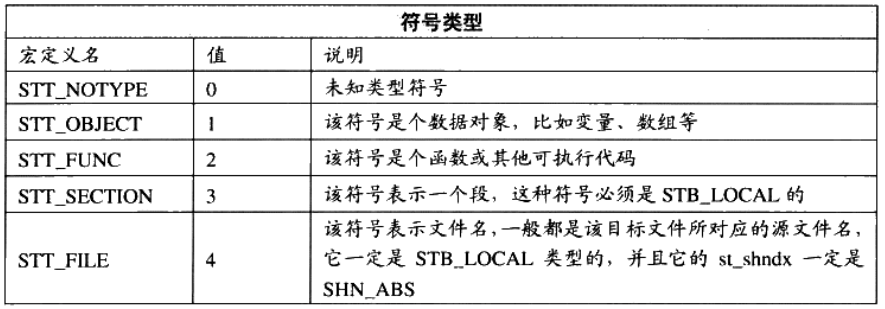
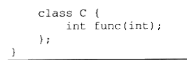
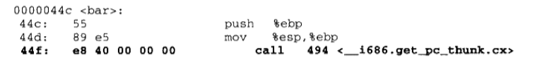

# 大致规划：
2023.9.15 简介
2023.9.16-9.17 静态装载
2023.9.18-9.20 动态装载
2023.9.21-9.24 库与运行库
# 第一部分 序章

## 早期计算机架构

无论是低速设备（键盘，鼠标等），还是高速设备（磁盘，cpu等）都连在一个bus总线上，为了协调各设备的速度以及让cpu和各设备通信，故每个设备需要一个IO控制器。

cpu核心频率的增高，内存跟不上，产生了与内存频率一致的总线。

为协调cpu，内存，高速图形设备，北桥芯片产生。低速设备一起连接？复杂，故

设计了南桥芯片，采用PCI/ISA总线以及南北桥设计的硬件结构：


## SMP和多核

SMP名为对称多处理器，每一个核在系统的地位和发挥功能一样，相互对称。适用于将一个大问题分解为若干个互不相干的子问题。这样能的大幅提升效率。

多核处理器和SMP之间是有细微差别的，因为多核处理器多个cpu核心之间是共享缓存等昂贵的部件，SMP则是独立的。一般来说，除非是很深入的优化（在缓存共享等方面由细微差别），否则可将SMP和多处理器看作一个概念。

## 系统软件

管理计算机本身的软件

平台性软件：操作系统内核，驱动程序，运行库，其他系统工具。（操作系统内核学习要开展！！！）

程序开发软件：编译器，汇编器，链接器，开发库等。（本书着重**连接器和开发库**，编译器和汇编器需要学习！！！）

**至理名言**：**计算机任何领域的问题都可以增加一个间接的中间层来解决**


最上层使用运行库（提供应用程序编程接口）提供的接口来编写应用程序或者开发工具，运行库基于系统调用（内核）提供的接口来封装，以软件中断来使用系统调用。更进一步操作系统内核通过驱动程序来操作硬件。驱动程序通过硬件厂商提供的硬件规格（硬件接口）进行编写。

## os发展

 多道系统（无优先级，只能时序进行），分时系统（每个程序运行一会儿，没有优先级等，容易死循环（==无法被抢占==）等死机），**多任务系统**（进程概念的引出，优先级调度，很小的时间片，抢占式），**目前在使用的**。

## 设备驱动

驱动程序是操作系统的一部分，但它与操作系统之间有一定的独立性，==驱动程序通常由硬件生厂商来开发==。os屏蔽了底层的磁盘细节，物理扇区，磁道等，抽象出逻辑扇区。1）使用read系统调用读文件时。2）文件系统判断文件位于的逻辑扇区的区间。3）向硬盘驱动程序发送一个读取该逻辑扇区区间的请求，4）磁盘驱动程序收到请求后就向硬件发出硬件命令（最常见为读写I/O端口寄存器来实现向硬件发送IO命令，x86有65536个寄存器，不同硬件被分配到了不同的IO端口地址，CPU提供“in”/“out”实实现硬件端口的读写）。==IDE接口==

## 内存使用（内存不够）

1）**虚拟地址**的引出，地址空间的不隔离（程序破坏等）
2）内存使用率极低，运行多个程序时，内存不够，需要大量的换入换出到磁盘，拷贝花销大
3）程序运行地址不确定，每次装入时分配空间不一样，但是访问数据或指令跳转的目标地址基本是固定（物理地址这里不变）的，**涉及程序的重定位**

- 隔离性：虚拟地址和物理地址来实现
- 分段：操作系统设置映射函数，虚拟地址到物理地址的实际转换由硬件来做。可解决问题一和三，但是内存使用率还是不会变。==程序的局部性原理，只加载程序的一部分数据==
- 分页：虚拟地址空间的页叫做虚拟页（VP，物理地址空间的页叫做物理页（PP，磁盘中的页叫做磁盘页（DP。可对每个页设置权限，例如读写权限，以实现保护机制。MMU单元一般集成在CPU的内部，用于是实现虚拟地址到物理地址的转换。
  

## 线程初识
### 线程基础
- 线程即轻量级进程，程序执行的最小单元，标准线程组成：线程ID，当前指令指针（PC），寄存器集合和堆栈。同进程下的线程共享程序的内存空间（代码段，数据段，堆），其他进程级的资源（打开文件，信号），如图

- 多线程优点
1）某个操作陷入长时间等待，只能睡眠状态无法继续执行。多线程执行可有效利用等待时间执行其他线程
2）计算操作耗时，计算线程和用户交互线程可分离开，保证和用户交互不中断
3）程序逻辑要求并发操作
4）多核计算机，单线程无法发挥计算机的全部能力
5）对与多进程应用，多线程在数据共享方面的效率要高很多；原因是多线程可共享进程内的内存空间以及一些资源。进程内线程间通信效率要高于进程外通信效率。
- 线程访问权限
线程的私有存储空间
1）栈：一般无法被其他线程访问，除非有线程知道其堆栈地址
2）线程局部存储（TLS）：TLS是某些OS为线程单独提供的私有空间，容量有限
3）寄存器：寄存器是执行流的基本数据，线程私有

- 线程调度与优先级
1）运行状态和进程相似：就绪，运行，等待
2）线程优先级可以手动设置，如linux可以通过pthread库来设置。系统可根据线程的表现动态调整优先级；IO密集型的线程总比CPU密集型的线程更容易得到优先级的提升；避免线程被饿死，等待时间长则提升优先级
- 可抢占和不可抢占的线程，不可抢占线程中，线程调度时机只会发生在线程等待某些事件时，以及主动放弃时间片时
- Linux多线程
1）Windows中线程和进程的实现和教科书一样标准，Windows有明确API来产生进程和线程：CreateProcess/CreateThread。对linux而言，线程不是一个通用的概念。
2）Linux将所有的执行实体（线程或者进程等）都称作任务。Linux不同任务下可以选择共享内存空间，实际上来说共享同一内存空间的就是线程。Linux下创建新的任务

3）父任务的fork返回一个子任务ID，而新产生的子任务fork则返回0。==新fork任务和原任务共享一个可写时复制的内存空间，任意任务试图修改内存空间时，复制一份给修改方单独使用==
4）fork产生一个新的任务时，新任务可调用exec执行新的可执行文件；使用clone来产生新的线程

### 线程安全，多线程程序并发时数据的一致性问题
- 竞争与原子操作
线程不安全本质是因为多线程对同一个数进行操作，导致读写时的不一致性。为啥会出现这样的情况？本质是因为对这种共享数据的操作，例如i++，这种其实是会分解位很多条指令来执行，当很多线程同时对该数操作时，不同线程的指令执行是相互插入的，所以导致结果有不确定性，执行结果出错。如果系统提供了对这种加法的原子操作指令，即变为了原子指令，那么就不用担心结果的不确定性，只适用与简单场合
- 同步与锁
数据的访问同步，即只能有最多一个线程对数据进行访问，将数据访问原子化了
使用锁实现数据同步，锁是一种非强制的机制，分为获取锁和释放锁两步，下面为锁的实现
1）二元信号量，最简单的一种锁，两种状态（占用和非占用）
2）多元信号量，对允许多个线程并发访问资源适用，即常说的信号量机制
3）互斥量，和二元信号量相似，资源仅允许同时被一个线程访问，不同的是信号量可被任意线程捕获并释放，但互斥量则是哪个线程获取了互斥量就要负责释放这个锁
4）临界区，比互斥量更加严格，互斥量和信号量在系统是任何进程可见的，但是临界区的作用范围仅限于本进程，其他进程则无法获取该锁
5）读写锁，特定场合下的同步，读写锁能允许多个进程读取，读写锁有自由，共享，独占三种状态，如图：

6）条件变量，一种同步手段，线程可以等待条件变量以及唤醒条件变量。一个条件变量可以被多个线程等待。当该条件变量被唤醒（理解为等待某事件，事件发生了），所有等待该条件变量的线程都可以回复执行
- 可重入与线程安全
1）可重入函数：这个函数没被执行完成，由于外部因素或者内部调用，又一次进入该函数执行。可重入函数(多线程环境的线程安全)必须的特征：

- 过度优化，编译器技术存在很多自主优化的情况，这些自主优化可能会导致线程的不安全
1）编译器为提高变量访问速度，将变量放到了某个寄存器，==由于不同线程的寄存其是相互独立的，所以对变量加锁也不保证结果的正确性==
2）CPU的动态调度，执行程序为提高效率会交换指令顺序，故编译器在优化时，也可能为了效率而交换毫不相干的指令的执行顺序，从而导致代码的执行结果和我们预期的不一致
这个预期是r1,r2至少一个为1                                   实际上交换执行顺序后，r1,r2可能都为0              
  
可以使用**volatile**关键字来阻止这个过度优化，其可以做到

使用该关键字可以解决寄存器缓存的问题，但是还是不能解决第二个指令乱序的问题，因为即使编译器这里停止调整顺序，但在CPU动态调度时，其还是可能执行换序的执行
另一个换序问题，单例模式（Singleton）中的double-check:

单例模式，一般允许这个线程只有一个类的实例，这个代码第一个if首先判断这个实例存不存在，不存在，再加锁，这样减少了锁的粒度；然后再进行if的判断，再产生一个新的实例。双重if可以将加锁的调用开销降到最低，加锁可以解决多线程竞争的麻烦。
**问题**
pInst=new T有三个步骤：分配内存->调用构造函数->将内存地址赋值给pInst。然而CPU是乱序执行的，意味着第二和第三步是乱序的。当第三步先执行时，如果另外的线程来对GetInstance（显然这是不可重入的函数）进行调用，那么PInst会返回一个确切的没有被初始构造的实例的地址给用户使用，可能会造成程序的崩溃（取决于具体的类的设计）。由此可见，CPU的乱序执行会极大的干扰我们的线程安全能力，所以需要一种可以阻止CPU换序的方法：
然而现在没有一种通用的可移植的阻止CPU换序的方法，通常可以调用CPU提供的barrier指令，可以阻止CPU将该指令前的指令交换到barrier之后。例如在POWERPC中的一条指令lwsync:

### 多线程内部情况
用户使用的时用户态的用户线程，然而用户态线程不一定对应操作系统内核里同等数量的内核线程。下面是三种线程模型：
#### 一对一模型
用户态的线程唯一对应一个内核使用的线程。然内核线程可能不存在与之对应的用户线程。
一对一模型的优点是可以做到用户线程和内核线程一致，故一个线程因为某些原因阻塞时，其他线程不会受到影响。一对一模型可让对多线程程序在多处理器系统上表现更好。
缺点：许多操作系统限制了内核线程的数量，故会使用户的线程数量受限。操作系统的内核线程调度时，上下文切换开销大，导致用户线程执行效率下降。
#### 多对一模型
多对一模型将多个线程映射到一个内核线程上。能提高用户的线程数量，相对减少内核线程的数量，从而减少内核的调度开销。
缺点：一个用户线程阻塞，那么所有与内核进程相关的用户线程均无法执行，因为内核线程阻塞了。
#### 多对多模型
将多个用户线程映射到少数，至少两个及以上的内核线程上。可以解决一对一模型中的对用户线程数量的限制以及多对一模型中的单点阻塞问题

# 第二部分 静态链接
## 第二章 编译和链接
通常IDE和编译器提供的默认配置，编译和链接参数对于大部分的应用程序开发已经够用，但是你只知道这些配置的参数，却不知道背后的原理，不知道它做了些什么，那又怎么根据性能瓶颈来选择对应的优化配置参数呢？
### 被隐藏的过程
gcc编译4步骤：预处理（预编译）->编译->汇编->链接；下面是具体的过程：

- 预编译
预编译的命令：
```shell
  gcc -E test_2chapter.cc -o test_2chapter.i
  #或者
  cpp test_2chapter.cc -o test_2chapter.i
```
==预编译过程中主要做的事==(主要处理以”#“开始的预编译指令，包括头文件，#define等)：
1）将所有"#define"删除，并且展开所有的宏
2）处理所有的条件编译指令。"#if","#endif","elif","else","ifdef"
3）处理"#include"预编译指令，将所有包含的文件插入到预编译指令的位置，递归的插入，因为头文件的递归包含
4）删除所有注释，"//"，"/* */"
5）添加行号以及文件标识，后面编译错误或警告显示行号（常见的情况）
6）保留所有的#pragma编译器指令，这个可以控制编译器的一些行为，例如优化控制，警告控制，链接控制等
==当我们无法判断宏定义正确或在头文件包含是否正确时，可查看预编译文件来解决这个问题==
- 编译
编译过程就是把预处理完的文件.i，进行一系列词法分析，语法分析，语义分析，优化后生成的相应的汇编代码文件.s,为程序构建的核心部分，等效的编译命令
```shell
gcc -S test_2chapter.i -o test_2chapter.s
```
也可以将预编译和编译整合到一起
```shell
gcc -S test_2chapter.cc  -o test_2chapter.s
```
不同的语言预编译和编译的程序不一样
|  编程语言      | 编译后台程序  | 
| ---- | ----|
| c语言| ccl|
| c++语言     |    cclplus | 
| OBjective-C     | cclobj|
|    fortran  |     f771 |      
|   Java| jcl|

==实际上来说gcc的命令是这些后台程序的包装，根据不同的参数去调用预编译编译程序ccl,汇编器as，链接器ld==
- 汇编
汇编器将汇编代码.s转换为机器可以执行的指令.o，汇编器的汇编过程相对于编译器来说比较简单，无复杂的语法/语义/指令优化，只能根据汇编指令和机器指令的对照表一一翻译
```shell
as test_2chapter.s -o test_2chapter.o
gcc  -C test test_2chapter.cc -o test_2chapter.o
gcc  -C test test_2chapter.cc -o test_2chapter.o
```
- 链接
为什么需要链接（因为使用了很多三方库？），为什么需要把这些库连接起来得到可执行文件？==本书重点==
### 编译器做了什么
如果没有编译器，我们只能使用汇编语言和机器语言来编写程序，但是值得注意的是，这样编写的程序是依赖与特定的硬件平台的，如果换了平台，程序就需要重新编写（显然不行）。所以编译器出现，我们可以尽可能少的考虑计算机本身硬件的影响，而尽可能多的关注程序的逻辑。编译过程一般有6步：扫描，语法分析，语义分析，源代码优化，代码生成，目标代码优化。
#### 扫描/词法分析
源代码程序输入到扫描器，进行词法分析，将源代码的字符运用类似有限状态机的算法将源代码的字符序列分割成一系列符号（token）。
这些token一般可以分为几类：
**关键字，标识符，字面量（数字，字符串），特殊符号（加号，等号等）**
扫描器在扫面分割字符的同时，同时将标识符存放到了符号表，将数字，字符串常量存放到文字表等
工具：lex程序可按用户描述好的词法规则对源代码进行字符串的分割。故编译器开发者只需要指定好既定的词法分割规则，而不用单独开发一个独立的词法扫描器。
==有预处理的语言，如C语言，其宏替换和文件包含等预处理工作一般是归入单独的预处理器，而不是交给编译器==
#### 语法分析
语法分析器对扫描器产生的token进行语法分析生成语法树，分析过程采用(上下文无关语法分析，下推自动机)。

如上图为语法树，其可以将表达式分解为一种树状表示。该语法树可以区分各种运算符的优先级，比如括号（）在乘号*前面，故其一般为（）的子节点；运算符的含义也确定了，例如星号*既可以是指针取内容也可以是乘法表达式，语法分析阶段就需要对这些内容进行区分，如果表达式不合法，各种括号不匹配，表达式中缺少操作符等，编译器就会报语法分析阶段的错误。
工具：语法分析有现成的工具yacc，可根据用户给定的语法规则对输入的记号序列进行解析，从而构建语法树。编程语言不同只需要改变语法规则，而无需为每一个编译器编写语法分析器（和编译器对硬件平台类似），故语法分析器又叫做"编译器编译器"。
#### 语义分析
语法分析只能完成对表达式的语法层面的分析，却不知道其真实的含义。编译器所能分析的语义是静态语义（编译可确定），动态语义则是在程序运行时才能确定的语义。
**静态语义**：类型的声明以及类型的匹配，类型的转换。
**动态语义**：动态语义在运行时的错误，比如将0作为除数是一个运行期语义的错误。
在语义分析阶段之后，语法树的表达式都表示了类型，有些类型需要做隐式转换，语义分析程序需在语法树中插入相应的转换节点。所以语义分析主要做的事是进行表达式含义的解析，并添加类型到语法树的各个节点中。并且还对符号表里的符号类型也做了更新。
#### 中间语言生成/源代码优化
源码级优化器，例如编译时可以确定的值，例如字符常量加法（2+6等），源代码优化器将语法树转换成中间代码，其一般与目标机器和运行时环境无关。中间代码类型：
三地址码，P-代码。

如图，转化为三地址码的形式，但是为了这种三地址码的表达方式，加入了许多的临时变量，源代码优化器可将2+6的值在编译时直接计算出来，那么就可以直接替换掉临时变量，减少变量。
中间代码的出现使编译器分为编译器前端以及编译器后端。（==这不就是LLVM的思想，或许LLVM就是借鉴的这种思想==）
编译器前端：负责产生机器无关的中间代码。
编译器后端：将中间代码转换成目标机器代码。
跨平台编译器可使用同一个编译器前端，以及针对不同机器平台的数个后端。
#### 目标代码生成和优化
编译器后端主要是：代码生成器，目标代码优化器。
代码生成器：代码生成器主要将中间代码转化为目标机器代码。依赖于目标机器（不同字长，寄存器，整数数据类型，浮点数数据类型等）。代码生成器将中间代码转换成下面的代码序列：

目标代码优化器可以对上述的目标代码进行优化，选择合适的寻址方式，使用位移代替乘法运算，删除多余的指令。上述图片的乘法就可以使用基址比例变址寻址的lea指令来完成，然后使用mov完成赋值操作。
现代编译器有着异常复杂的结构，由于现代高级编程语言的复杂性以及CPU的复杂性（流水线，多发射，超标量等诸多复杂特性），所以编译器的机器指令优化非常复杂。为了在编译过程中支持多
多种硬件平台，允许编译器编译出多种目标CPU的代码。
经过这些编译步骤后：变量的地址其实还没有确定，如何得到变量的地址，如果变量定义在同一个编译单元里，编译器可以为index，array分配空间，确定地址，如果是在其他的模块呢，事实上，定义在其他模块的全局变量以及函数的最终运行的绝对地址需要在最终链接时才能最终确定。现代编译器将源代码文件（即变量，函数的定义）编译为一个未链接目标文件（静态库.a/动态库.so）。
### 链接器年龄比编译器长
打孔年代，用地址标识指令，但是如果目标指令地址发生变换，则对应的打的孔要对应发生变换，重新计算目标地址的过程被叫做重定位。这种方式繁琐，所以后面出现了汇编语言，用符号来标识目标(变量，函数)地址，这样极大的解放生产力，方便进行重新开发。汇编语言的出现逐渐带来了程序的膨胀（生产力爆棚），程序膨胀带来程序的模块化，模块间的变量的相互如何引用，引出来链接的主题：

### 模块拼装-静态链接
复杂软件需要分割为独立的小模块进行独立编译，再"组装"起来，即链接过程。包括了地址和空间分配，符号决议，重定位等。
对于符号决议：

现代编译链接过程：在模块A中使用模块B中的函数foo()，在编译模块A时，由于模块独立编译，不知道这个函数的入口地址；所以暂时将调用foo()函数的指令的目标地址搁置，等待链接器将模块A，B链接起来时，模块A再根据符号foo来自动查找foo()函数的地址。
对：

这是在目标文件B里面使用目标文件A的全局变量var，在编译目标文件B时，编译器不知道变量var的目标地址，故首先将目标地址即var的地址置为0，再在链接目标文件A，B时来修正。如果变量var的地址确定为0x10000，链接器就会修改指令目标地址为0x10000，这个过程叫做重定位。
### 本章小结

## 第三章 目标文件里有什么
目标文件即为编译器经过源代码生成的文件，目标文件从结构上来说它是已经编译后的可执行文件的格式，只是没有经过链接的过程，有些符号或者地址还没有经过重定位进行调整，但其本身是按照可执行文件格式来存储的。
### 目标文件格式
PC平台流行的可执行文件格式，Windows下的PE（Portable Executable）和Linux的ELF(Executable Linkable Format)，都为COFF(Common file format)格式变种。
可执行文件，目标文件，windows和Linux下的静态库和动态库都是按照可执行文件格式（PE-COFF，ELF）来存储的。
ELF文件格式有4种：


==我们可以根据这个图得到哪些文件可以连接然后生成哪些文件==
COFF由Unix System V Release 3提出的格式规范，微软再基于COFF格式，指定了PE标准。System V Realease 4在COFF基础上引入了ELF格式。COFF格式的主要贡献是在目标文件里引入了"段"机制。
ELF文件主要有三个重要索引表：
- ELF header：文件开始，描述整个文件的组织。
- Program header table：告诉系统如何创建进程映像，构建进程映像的目标文件必须有程序头部表，可重定位文件不需要。
- Section header table:包含描述文件节区的信息，每个节区在表中都有一项，每一项给出诸如节区名称，节区大小这类信息。用于链接的目标文件必须包含节区头部表，其他则是可有可无。
- sections/segments：segments从运行的角度来描述elf文件，sections则是从链接的角度来描述elf文件。通常一个segment包含了多个section。

### 目标文件是什么样的
程序编译后额机器指令被放在代码段里，常见的是".code"/".text"，全局变量和局部静态变量被放在数据段，一般为".data"。
ELF的文件头描述整个文件属性：文件是否可执行，静态链接/动态链接，入口地址（对于可执行文件）,目标硬件，目标操作系统等。
对于c语言来说，其编译后的执行语句都编译成机器代码，保存在".text"段，已初始化的全局变量和局部静态变量在“.data”段，未初始化的全局变量和局部静态变量一般在".bss"段。==可执行文件必须记录未初始化的全局变量以及局部静态变量的大小总和==，记作.bss段
为什么程序的数据和指令需要分开？即分开的好处：
- 程序装载后，数据和指令映射的虚存区域不同，数据区是可读写的，但代码区是只读的。==权限细分==
- 现代CPU的缓存机制，将数据和指令分离可以提高程序的局部性，且现代CPU的指令缓存和数据缓存是分离的，故程序的指令和数据被分开存放有利于提高缓存命中率。
- 运行多个程序副本时，指令一样，只是数据不一样（类比为现代操作系统只用加载一份动态库到内存中，可以理解为只需要一份就可，不同进程只是数据不一样，动态库指令一样）。 
### 挖掘SimpleSection.o
首先编译文件得到目标文件SimpleSection.o，使用binutils的工具objdump工具查看目标文件内部结构

其中".rodata"为只读数据段，用于存储常量或者静态不修改字符串等其他只读数据，".comment"为注释信息段，用于存储版本信息，编译器信息等：

，".note.GNU-stack"为堆栈提示段，指示栈能否执行等。"eh_frame"段包含异常处理框架信息，支持程序的异常处理以及堆栈跟踪等。
下面时该目标文件个段的基本分布：

size命令查看目标文件的各段的大小：

#### 代码段
使用objdump -s -d来查看代码段的具体内容，-s将段内容以十六进制方式打印出来，-d可包含指令的段反汇编

#### 数据段和只读数据段
.data只保存全局静态变量以及局部静态变量，一般来说字符串常量存储在只读数据段.rodata。.rodata段存放只读数据，如程序的只读变量（const变量）和字符串常量。'.rodata'段不光在语义上支持C++的const关键字，操作系统加载时可将".rodata"映射为只读；可搭配只读存储器例如ROM使用，保证程序的安全性。
有时候编译器会把字符串常量放到".data"段，而不是放在".rodata"段（==取决于编译器，以及编译选项吗？==）
此外不同编译器还涉及到变量存放的字节序问题，即大小端问题。
#### bss段
".bss"段一般存放的是未初始化的全局变量以及局部静态变量。对于SimpleSection.c文件中，global_uninit_var和static_var2而言一个被存放在bss段，由size命令可以看到其为8，对于书上的bss段只有4字节，因为global_uninit_var没有被放在任何段，只是未定义的“COMMON”服符号；==这和语言以及编译器是高度相关的==，一些不存放在bss段，而是预留未定义的全局变量符号，在最终的链接成可执行文件时再在bss分配空间，一般加上static修饰的内部可见的未初始化静态变量时存放在bss段的。
对于下图：

x1放在bss段中，x2放在data段中，因为x1虽然赋值初始化了，但其实赋值为0，编译器会直接优化掉，因为未初始化的都为0.
#### 其他段
ELF文件除了.text/.data/.bss这三个最常用段外，还有：

除了这些加"."的前缀是系统保留的以外，应用程序可以使用一些非系统保留的文字作为段名，如在ELF文件中插入“music”段，存放一首mp3的音乐，elf文件运行时可以读取该段并且播放这首MP3,自定义段的段名最好不加前缀"."，避免和系统的段冲突。一个elf文件可以有几个相同段名的段。
==objcopy工具的使用==：
该工具可以完成一种目标文件格式到另一种目标文件转换，即可以将图片/MP3音乐/词典之类的东西转换成目标文件的一个段等。
#### 自定义段
一般来将，具体的变量函数存放的段是固定的。但为了一些特定功能，如满足硬件内存/IO的地址布局或者像Linux内核里面完成一些初始化和用户空间复制时出现页错误异常。gcc提供一个扩展机制，使程序员可指定变量所处的段：

### ELF文件结构描述
包含了ELF文件头，段表，各段信息，符号表/字符表；节表，节信息等
#### 文件头
使用readelf来解析目标文件的文件头：

elf文件头结构及相关常数定义在“/usr/include/elf.h”中,里面定义了很多的数据结构；这些数据结构和elf头部文件的文件结构相对应。如：

###### ELF魔数，最前面的“Magic”16个字节对应数据结构中的e_ident成员。
a.out格式最开始的两个字节为0x01，0x07；PE/COFF文件最开始两个字节为0x4d，0x5a。可以用魔数来确定文件的类型，在加载可执行文件时会确认魔数是否正确，正确才会加载。
==魔数的由来==
为什么a.out格式的魔数时0x01,0x07；故事是：UNIX在PDP小型机上产生，在文件开始放入跳转指令，负责跳过接下来的7个机器字的文件头到可执行文件的真正入口。0x01和0x07正好是PDP跳转7个机器字的指令。==核心其实是为了保持和以前系统的兼容性==，所以一直保留到今天。==类似著名的 马屁股和航天飞机的故事==.
##### 文件类型
e_type标识文件类型，一般有三种文件类型：

##### 机器类型
ELF格式可以在多种平台使用，同一ELF文件不可在不同的平台下使用，只是遵循一个ELF标准。e_machine不同的值：

#### 段表
段表是保存目标文件中段基本属性的结构（段名，段的长度，文件中的偏移，读写权限等）；编译器/链接器/装载器是靠段表来定位和访问各个段的属性。如图：

共有13个段，首段为NULL,故有效段为12个。这个其实就是该目标文件的段表，每一项描述一个段，描述段的结构体称为段描述符，定义在elf.h文件中。段表的大小为段的个数*sizeof(段描述子)
##### 段的类型
段的名字只在编译和链接过程中有意义，并不是真的段的类型。段的属性主要由段的类型和段的标志位决定。如图段的类型


##### 段的标志位
标志位只表示该段在进程虚拟地址空间的属性，例如：可写？/可执行?等。如图：

对系统保留段，段类型和段的标志位表：


##### 段的链接信息
如段的类型和链接相关，例如重定位表，符号表等。其他类型段这两项无意义。

#### 重定位表
链接器在处理目标文件时，需要对目标文件中某些部位进行重定位，即代码段和数据段对绝对地址引用的位置；每一个需要重定位的代码段和数据段都需要一个重定位表，每一个重定位表同时是elf文件的一个段。
#### 字符串表
elf文件中用到了很多字符串。其存储方式是将字符串以单个字符的形式集中起来放到一个表，使用字符串表中的偏移来引用字符串。如：


通常有两个字符串表，一个是字符串表（用于elf文保存普通的字符串，如符号）；一个是段表字符串（用来保存段表中用到的字符串，例如段名）
### 链接的接口-符号
在链接中，统一将函数和变量称为符号，函数名与变量名叫做符号名。每个目标文件都有一个相应的符号表，每个定义的符号都有一个符号值；一般对变量或者函数来说，其值就是指其地址。符号表中符号分类：
- 定义在本目标文件的全局符号，可以被其他目标文件引用
- 本目标文件引用了全局符号，但是没有定义在本目标文件，一般叫做外部符号，即符号引用
- 段名，符号由编译器产生，值即为该段的起始地址
- 局部符号，编译单元内部可见，如"static_var"等定义的局部静态变量。调试器可以使用这些符号来分析程序或崩溃时的核心转储文件
- 行号信息，目标文件指令和源代码代码行的对应关系
==一般在链接过程中，只关注第一二类符号；其他只是局部可见的==
使用readelf，objdump，nm可查看elf文件的符号表：

#### elf符号表结构
符号表通常也是文件中的一个段，一个符号项是有一个elf文件的对应的数据结构来表示。
**符号类型与绑定信息**：


**符号所在段**：定义在本目标文件中，则表示符号所在段在段表中下标。如符号不是定义在本文件中：

**符号值**：三种情况
- 目标文件中，如果该符号定义了且不是”COMMON“块的（例如main，funcl等），其表示在段中（由符号所在段st_shndx给出）的偏移
- 在目标文件中，符号是”COMMON块“类型的，则符号值表示其对齐属性
- 可执行文件中，符号值表示符号的虚拟地址

如上图，这是和符号表项相对应的输出格式。
#### 特殊符号
ld作为链接器在链接生成可执行文件时，会产生很多特殊的符号，如：

这些符号是可以直接在编写代码时直接引用的
#### 符号修饰与函数签名
目标文件编写的函数或变量如果和要使用的库里的重名会产生冲突，于是可以加上符号修饰；一般c语言源代码文件在编译后，所有全局变量或者函数的符号名前都会加上下划线”_“；而Fortran语言是前后都加上下划线"_"。但是如果同一语言编写的多个目标文件有符号吃冲突时，怎样做？所以后面c++这样后来设计的语言加上了命名空间来规避。不同编译器有不同行为，可能会加上下划线也可能不加现在；可以手动设置编译参数来决定是否符号前加上下划线。
**c++符号修饰**：函数签名包括了函数的信息（参数类型，所在类，命名空间等），在编译器和链接器处理符号（这里是函数名）时，使每个函数签名对应一个==修饰后名称==。编译器在将源代码编译成目标文件时，会将函数和变量一起修饰，形成**符号名**。所以相同函数名的函数由于函数签名的不同，所生成的目标文件的对应的函数的符号名其实是不同的。如图：


在编译器进行修饰后，6个函数签名对应的最终的符号名：

至于gcc编译器对待函数签名的修饰标准，==er。后面看编译器再看==
对于变量来说，其名字修饰机制里没有加上其参数类型，所以对待一个变量，无论其实浮点型，整型，还是一个全局对象，其最终的符号名是一样的；==是否导致了gcc编译器不能有同名的变量声明在同一个作用域里面？多重定义的问题由来==
**需要注意的是**：不同的编译器一般名字修饰机制是不一样的。
==不同编译器一般采用不同的名字修饰方法，所以不同编译器产生的目标文件无法相互链接==。
#### extern "C"
C++编译器会将extern ”C“内部的代码当作C代码进行处理。
如下图实验：


提前根据名字修饰规知道变量var的修饰后符号名，直接用符号名引用变量值成功。
如果c/c++语言都包含了一个C语言的库函数的一个函数，例如string.h中的memset函数。
对C语言编写的，其可以将memset函数修饰为可以识别的符号名和库进行链接。但对于C++语言，需要使用extern "C"来处理这个函数，避免其按照C++的名字修饰规则生成符号名，导致不能和C库的相应函数链接。那么怎样在不写两套代码的情况下处理这种情况，如图：

==__cplusplus宏可以用于判断当前的C++语言的标准以及判断代码是否是C++代码==
#### 弱符号和强符号
符号多重定义，多个目标文件含有相同名字的==全局==符号会出现该错误。编译器默认函数和初始化的全局变量为强符号，未初始化的全局变量为弱符号。

其中，strong，main皆为强符号；weak，weak2皆为弱符号。ext为外部引用，两者都不是。
链接器按照下面规则选择被多次定义的全局符号：
- 如果在不同目标文件中，有多个同名强符号定义，链接器会报符号重定义错误。
- 如果一个符号为强符号，其他为弱符号，则选择强符号。
- 如果都为弱符号，选取占用空间最大的一个。）应该尽量避免这种情况。
**弱引用和强引用**：目标文件到可执行文件，对外部目标文件的符号引用需要被正确决议。找不到符号定义会符号未定义出错。处理弱引用时，符号有定义，链接器对符号的引用决议；如果未定义，链接器对引用不报错。弱引用和弱符号用于库的链接，弱符号和COMMON块联系紧密。
gcc里可使用 ”__attribute__((weakref))“来声明外部函数的引用为弱引用，未初始化的话，链接器默认值为0.
弱符号和弱引用作用很大。一是库里的弱符号可以被用户定义的强符号覆盖；二是程序对扩展模块的引用定义为弱引用，当扩展模块和程序链接在一起时，功能模块可正常使用，去掉某些功能模块，也可正常链接。==裁剪组合更加方便==
### 调试信息
目标文件可能也保存调试信息，编译器需要知道源代码和目标代码间的关系。gcc加上“-g”，编译器会在目标文件里产生调试信息。readelf查看。ELF文件采用一个DWARF的标准调试信息格式。==调试信息通常在目标文件和可执行文件中有较大比重，在开发完程序需要发布时需要去掉这些调试信息==
## 第四章 静态链接
### 空间地址分配
链接器如何将各个段的输出合并到输出文件/输出文件空间如何分配给输入文件。
#### 按序叠加
即多个目标文件的代码段，数据段，bss段等依次叠加；如果输入文件很多，造成最终的可执行文件有大量段存在，浪费存储空间，如果是x86的分页机制，可能有大量内存碎片，因为一个段至少一个页。
#### 相似段合并
代码段和代码段合并，bss段和bss段合并等。对待代码段和数据段，链接器需要在可执行文件以及虚拟地址空间中都分配空间；对于bss段来说，分配空间仅限于虚拟地址空间在文件中没有内容。
**两步链接法**：
- 空间与地址分配：扫面所有输入文件，收集各个段的长度，属性，位置，合并这些段，重新建立映射（建立段表？）收集每个输入文件的符号表，统一放到全局符号表。
- 符号解析与重定位：读取输入文件中的段数据，重定位信息，进行符号解析与重定位，调整代码中的地址。
链接后的地址是进程中的虚拟地址，即VMA。链接前VMA是0,因为还未分配，默认为0.链接后就可以分配虚拟地址。值得注意的是为什么其分配的虚拟地址不是从0开始分配的?
这是和操作系统的进程虚拟地址空间分配规则有关的。Linux下，elf可执行文件默认从0x08048000开始分配。
#### 符号地址的确定
在前面分配空间完成后，需要计算各个符号的虚拟地址，其实就是计算各个符号在段内的偏移量X，因为段的起始地址是确定的.只需要起始地址加上X就可以得到最终符号的地址。这样计算完成后再更新全局符号表，得到符号最终的地址。
### 符号解析与重定位
#### 重定位
对于未初始化的变量和函数来说，在位链接前，目标文件中的变量地址以及函数偏移量暂时以某些值来代替；在链接后，变量地址，以及函数的偏移量就确定了；如图：
重定位前：

重定位后：

#### 重定位表
一个重定位表往往就是一个elf文件中的一个段。每个需要被重定位的地方叫做重定位入口，入口偏移是相对于入口在需要被重定位的段中的位置。
在Intel x86的32位处理器中，重定位表对应一个数组，每个数组元素都是一个重定位入口：


#### 符号解析
在链接器对某个符号的引用进行重定位时，需要确定符号的目标地址。这是去查看全局符号表，找到对应符号在进行重定位。在链接器扫描完所有目标文件后，这些未定义的全局符号必须能在全局符号表中找到，否则未定义错误。
#### 指令修正方式
寻址方式：
近址/远址；绝对/相对；寻址长度（8位，16，32，64）。32位x86有两种指令寻址方式：绝对近址32位寻址/相对近址32位寻址


### COMMON块
多个符号同名但类型不一致的情况：
- 两个及以上强符号类型不一致
- 一个强符号，其他弱符号，类型不一致
- 两个及以上弱符号类型不一致
第一种情况非法，后面两种情况再分析：
编译器和链接器都支持COMMON块的机制，==不同目标文件的COMMON块空间大小不一致，以最大一块为准==。
COMMON类型链接规则是针对弱符号，如果出现强符号，最终的输出文件中符号所占空间和强符号相同。
问题：==为什么未初始化全局变量和未初始化的局部静态变量不一样，前者在COMMON块，后者在BSS段？==
正是由于COMMON块的变量在编译时无法确定其真正的大小，所以无法为其在BSS段分配空间；但是在链接器链接过程中可以确定弱符号大小，可在最终的输出目标文件中为其在BSS段分配空间。
==这里有一个多个文件出现同一个变量的多个定义（粗心忘记使用extern），为解决这个问题。编译器和链接器直接把未初始化全局变量都当作COMMON类型处理==
可使用gcc的"-fno-common"或者'__attribute'扩展·来将所有未初始化全局变量不用COMMON块形式处理。此时的符号就变成了一个强符号，冲突则会报错。
### C++相关问题
C++的==重复代码消除以及全局构造与析构==需要编译器和链接器共同支持才能完成工作。
C++的各种特性，如虚拟函数，函数重载，继承，异常等，使数据结构异常复杂。编译器和链接器间不能通用，导致C++程序的二进制兼容是个问题。
#### 重复代码消除
C++编译器很多时候会产生重复的代码，如模板，外部内联函数，虚函数表；可能在不同目标文件生成重复的代码。
一个有效做法：将每个模板的实例代码都单独放在一个段，每个段只有一个模板实例。
对模板来说，不同的参数类型实例化的模板都保存在不同的段中；这是不同目标文件的相同参数类型实例化的模板，其模板函数修饰后名称一样，在链接器链接时只需要选择一个进行链接，这样解决了多目标文件模板实例重复代码的问题。对于外部内联函数以及虚函数表也是如此。
==这种方法虽能基本解决代码重复问题，但是如果不同的编译单元，即目标文件使用的编译选项或者编译器版本不一致==，这是链接器对待相同名称的段还是会随机选择一个段作为链接输入，同时有警告信息。
##### 函数级别链接
程序和目标文件异常大，一个目标文件可能有成千上百函数，变量。如果只用到其中一部分，但是却需要连接整个，太庞大了；所以可以使用函数级别链接。
其可以让目标文件所有函数单独保存为一个段，像前面的模板函数一样。链接器需要一些函数时就可以链接进去，不需要就丢弃。可以减少输出文件的长度。
visual c++以及Gcc（-ffunction-sections,-fdata-sections）都可以有编译选项来实现函数级别链接。缺点是，这会减慢编译和链接过程，目标函数段数量增加，重定位变得更加复杂。
#### 全局构造与析构
c/c++程序在main函数调用之前，为了程序顺利执行，需初始化进程执行环境，如堆分配初始化，线程子系统；C++的全局对象构造函数执行；析构函数在main函数之后被执行。
Linux系统一般程序的入口时"_start"，该函数是程序初始化部分的入口。在main之后，再返回初始化部分，进行一些清理工作，再结束进程。
elf文件中有两个特殊的段：
- .init，保存可执行指令，构成的初始化代码，main函数被调用前，Glibc初始化部分安排执行该代码
- .fini，保存进程终止指令，当main函数正常退出，Glibc安排执行这段代码
#### C++与ABI
==每个编译器都能编译出目标文件，那么不同编译器编译出来的目标文件能否相互链接？==   和二进制兼容性有关
我们把符号修饰标准，变量内存布局，函数调用方式与可执行二进制兼容性有关的叫做ABI
影响ABI的因素非常多，硬件，编程语言，编译器，链接器，操作系统等。决定目标文件是否二进制兼容：
内置类型（float，int等；以及存储器中的存储方式，大小端对齐方式），组合类型（struct，union，数组等的存储方式和内存分布），外部符号
（即符号修饰标准，以及是否加下划线等），函数调用方式（参数入栈顺序，返回值保持），堆栈的分布方式（参数的堆栈位置，参数传递方法等），寄存器使用约定（函数调用哪些可修改，哪些可保存）
c++时代，语言层面更加深了二进制兼容下的问题：
继承类体系的内存分布，虚函数调用，模板的实例化，外部符号修饰，全局对象析构/构造，RTTI的实现等
C++的二进制兼容性一直被人诟病，需要统一的C++ABI标准，但是GNU的gcc体系以及VISUAL c++两大体系互不兼容，问题长期存在。
### 静态库链接
一个静态库是一组目标文件的集合，很多目标文件压缩打包后形成一个文件。
对于c语言的运行库（glibc），包含了输入输出，文件操作，时间日期，内存管理等系统功能，glibc由成千上万源代码文件组成，编译也会生成相应数量文件，需要使用"ar"将这些功能.o文件压缩到一起，形成libc.a。

查看静态库的目标文件信息。
下面使用objdump -t查看libc.a

gcc编译参数"-fno-builtin"可以避免编译器进行自我优化，将只使用一个字符串参数的"printf"替换为"puts"。
ldd可以寻找自己所需的符号和所在的目标文件.
静态库链接的具体过程：

静态链接会将静态库中一些目标文件和编写的目标文件链接生成最终的可执行文件，可执行文件只需要链接用到的.o，而不是整个静态库的文件。==注意和动态链接的区别==
### 链接过程控制
大部分情况，链接器按照默认链接规则对目标文件进行链接，对一些特殊的程序，如内核，BIOS或其他嵌入式系统的程序等，一些内核驱动程序有受限的特殊条件：输出文件各个段虚拟地址，段的名称，段存放的顺序等对程序的各个段的地址有特殊要求。
#### 链接控制脚本
链接器控制整个链接过程有三种方法：
- s使用命令行给链接器指定参数。
- 链接指令放在目标文件，编译器可通过这种方法向链接器传递指令。
- 使用链接控制脚本。
ld会根据命令行的要求使用相应的链接脚本来控制链接过程；一般不同的机器平台以及输出文件格式有相应的链接脚本，也可自定义一个脚本为链接控制脚本
#### 最"小"程序
使用内嵌汇编，可避免使用了c运行库，不用使用main函数。


这边使用编译和链接命令来生成可执行文件，不用main函数原理是其实是更改elf文件的入口地址，elf文件头定义。。
#### 使用ld链接脚本
```c
ENTRY(nnomain)
SECTIONS{
    .=0x08048000+SIZEOF_HEADERS;
    tinytext : {*(.text) *(.data) *(.rodata)}
    /DISCARD/：{*(.comment)}
}
//设置函数进入点为nomian
//设置tinytext段开始的地址为=0x08048000+SIZEOF_HEADERS，SIZEOF_HEADERS为elf文件头的大小
//tinytext将后面三个段一次合并
//discard为丢弃后面的段
```
#### ld链接脚本语法简洁
ld链接脚本语法类似于c语言，下面是链接脚本语法中的个命令语句说明：


除此之外，还有很多命令语句格式，最重要和复杂的是SECTIONS命令。冒号后面的为contents，筛选满足条件的段。

### BFD库
不同的软硬件平台有着不同的目标文件格式，即使是同一格式也可能有差异。这样导致编译器，链接器很难处理不同平台的目标文件。这是需要一个统一接口可以对不同格式进行处理。
BFD库是一个GNU项目，希望用一种统一接口来处理不同的目标文件格式。其本身是binutils项目的一个子项目。现代Gcc（GNU中的汇编器，编译器等），链接器ld,调试器gdb，以及binutils中其他工具通过BFD库来处理目标文件，而不是直接操作目标文件。BFD开发库需要安装以使用。
## 第五章 Windows PE/COFF （ 简略看
### 链接指示信息
“.drevtve”段内容是编译器传递给链接器的指令，即编译器希望告诉链接器怎样链接这个目标文件。
总结：Windows下的可执行文件，动态链接等都使用PE文件格式。
# 第三部分 装载与动态链接
## 第六章 可执行文件的装载与进程
可执行文件只有装载到内存后才能被CPU执行，硬件MMU的产生，多进程，多用户，虚拟存储的操作系统出现后，可执行文件装载变得很复杂。
### 进程虚拟地址空间
cpu的位数决定虚拟地址空间的大小。硬件的寻址空间大小决定了最终的地址空间的理论上线。
我们可以通过c语言程序的指针的所占空间来计算虚拟地址空间大小；一般的，c语言指针大小和虚拟地址空间大小相同。
进程的虚拟空间是在操作系统的掌握中的，进程只能使用os分配给进程的地址，如果访问地址未经允许，那么操作系统捕获到这些访问后，会将这种访问当作非法操作。
对于虚拟地址空间的分配，其中1GB给内核态的用户空间，3GB给用户态的用户空间。原则上说，进程只能使用3GB的分配的虚拟空间，超过了的话只能换64位或者是使用“PAE”技术。
可以修改内核用户空间和用户的虚拟地址占比。1：3；2：2等
#### PAE技术
32位CPU下，虚拟地址空间大小只有4GB,但是对于物理地址来说，如1995年开始，奔腾Pro CPU开始采用36位的物理地址，可访问64GB的物理内存。
Intel通过修改页映射方式，使进程能访问到更多的物理内存。Intel把这个地址扩展方式叫做PAE.
应用程序如何使用这些超出的内存空间?对待应用程序中的正常大小的256GB虚拟地址空间用作窗口，应用程序可从物理地址超出4GB的部分，，申请多个不同过的物理块，大小为256GB。Windows下这种操作方式叫做AWE.Linux等类UNIX系统使用mmap来实现。
### 装载的方式
静态装入：将程序允许所需的指令和数据全部装入内存。
==动态装入==：程序运行的局部性原理，将不常用的数据放在磁盘，最常用部分放在内存。
动态装载常用方法：覆盖装入/页映射。利用程序的局部性原理。程序用到那个模块，再将那个模块装入内存，不用则暂时存在磁盘中。
#### 覆盖装入
覆盖装入将程序分为若干个块，编写一个小的辅助代码（覆盖管理器）来管理模块在内存中的驻留以及何时应该被替换掉。这样需要整理程序各个模块的调用依赖关系为树状结构来决定覆盖关系。

- 树状结构到从任意模块到根叫做调用路径。一个模块调用时，其调用路径上所有模块应该都在内存。
- 禁止跨树间调用，即A不可以和B，E，F等，当跨树间的模块依赖同一个模块H时，需要将该模块保存到main模块。
==显然这种以覆盖管理器的方式来决定程序的段的装载形式，是一种典型的用时间换取空间（能加载更多块）的方法==。
#### 页映射
页映射本身是虚拟存储机制的一部分。将内存和磁盘的数据和指令按照页来进行划分，故装载和操作的单位就为页。一般页大小为4KB.
将虚拟空间和物理空间都划分为页，当内存满是，需要使用FIFO,LRU等页替换算法来将该页替换近内存。这个装载过程是os的存储管理器在管。==目前几乎所有主流操作系统都使用这种方式来装载可执行文件，Windows的PE文件装载以及ELF文件装载都使用这样的方式==
### 从os角度看可执行文件的装载
页映射的动态装入，可执行文件页可被装载到任意页。虚拟存储中，现代的MMU提供地址转换功能，有硬件的地址转换以及页映射机制，os加载可执行文件有很大不同。
#### 进程的建立
通常是，一个程序伴随一个新进程创建，再装载相应的可执行文件且执行，流程：
- 创建一个独立的虚拟地址空间
- 读取可执行文件头，建立虚拟空间与可执行文件的映射关系
- cpu指令寄存器设置成可执行文件的入口地址，启动执行
**虚拟地址空间创建**：创建虚拟空间不是创建空间，而是创建页映射函数所需的相应数据结构。
**读取可执行文件头**，**建立虚拟地址空间和可执行文件映射关系**：即虚拟空间和可执行文件的映射关系。例如发生”页错误“，具体是，将”缺页“从磁盘读取到内存中，再设置缺页的虚拟页和物理页的关系。缺页即在物理内存中找不到对应的地址，需要切到虚拟地址，再映射到磁盘中对应可执行文件的对应位置，将页拷贝进物理内存。

如图，大小为0x000e1的段没对齐为0x1000(页为4096字节，即2^12，即0x1000)，起始地址0x08048000.
这种映射关系只是os内部的数据结构，==linux将进程虚拟地址空间的一个段叫做VMA（虚拟内存区域）==。os创建进程后，进程相应的数据结构设置一个”.text“段的VMA。这样就可以定位出物理页到虚拟页（VMA），然后对应可执行文件的对应位置（VMA和可执行文件的映射关系）。
**cpu执行寄存器设置成可执行文件入口**：os设置指令寄存器将控制权交给进程，进程开始执行。这个可执行文件入口地址，即elf文件头保存的入口地址，可以设置

#### 页错误
上面完后，可执行文件的指令和数据还未装入内存。
当cpu执行发生页错误时，首先cpu将控制权交给os，os的页错误处理例程进行处理。通过页表映射找到缺的虚拟页（VMA），再通过上述第二步中建立的映射数据结构，再计算该页面在可执行文件中的偏移，再分配一个物理页面，换入内存，建立虚拟页和物理页映射关系，再控制权交换给进程，继续执行。
下面时页错误的流程：

### 进程虚存空间分布
#### elf文件链接视图和执行视图
一个段对应一个VMA，容易产生页内的内存碎片，造成浪费。os一般只关注段的权限（可读，可写，可执行）。段的权限组合基本只有三种：代码段（可读可执行）；数据段，BSS段（可读可写）；只读数据段（只读）。
简单解决方案，相同权限的段可合并到一起，当作一个段进行映射。如图：

elf文件中还引入了一个概念"Segment"。这个概念的引入是从装载的角度考虑，即将我们前面提到的多个段合并为一个,这个叫做"Segment"。本质上叫，以前没有合并的段其实为”section“,而现在的segment一般由一个或多个section组成。==从链接角度看，elf文件按照”section“存储，从装载角度看，elf文件可按照”segment“划分==。系统是按照”segment“来映射可执行文件。
下面为可执行文件的"segment"信息显示，其只有几个”segment“,每个”segment“由多个”section”组成。

==只有可执行文件或者共享文件才有“segment”的程序头，而目标文件是不存在的。这个程序头描述elf文件如何被操作系统映射到进程的虚拟空间中==
一般来说只关心"LOAD"类型的segment是怎样映射的。如下图，相同权限的段一般归类到一个“segment”中，并且映射到同一个VMA。

从“Section”角度看，elf文件处于链接视图；从“segment”角度看，elf文件处于执行视图。
==对于elf可执行文件和共享库文件的程序头表，其和段表数据结构一样==下面是程序头表各字段含义:

针对LOAD类型的“segment”,其“segment”在内存中分配的空间大小应大于等于文件中实际的大小（p_memse>=p_filesz）。“多余部分”会被填充为0，这部分就对应着BSS段。(现在可能有改变)

#### 堆和栈
堆和栈在进程虚拟空间的表示也以VMA形式存在，如下图：

除了前两个为可执行文件的两个segment；其他的主/次设备号全为0，表示没有映射到文件中，这些VMA叫做匿名虚拟内存区域（AVMA）。堆和栈两个VMA几乎在所有的进程中存在。
特殊的VMA，例如“vdso“,其地址位于内核空间，用于进程和内核模块的通信等。一个进程可分为如下几种VMA区域：
- 代码VMA，权限只读，可执行，有映像文件。
- 数据VMA，权限可读写，可执行，有映像文件。
- 堆VMA，权限可读写，可执行，无映像文件，匿名的VMA，可向上扩展。
- 栈VMA，权限可读写，不可执行；无映像文件，匿名的VMA，可向下扩展。
如图为进程虚拟空间简略图：

#### 堆的最大申请数量
Linux下的虚拟地址空间分给进程是3GB,程序可实际使用的是多少？
和实际的操作系统版本，程序本身大小，用到的动态/静态库数量，程序栈数量等有关。甚至每次运行占用内存大小不同，和==随机地址空间分布技术==有关
#### ==**段地址对齐**==需要再看
下面这种是无论怎样，一个VMA只能是单独的物理页，不能和其他的VMA共享

而下面这种，有些uni采用，将可执行文件都以4KB大小划分到内存区域中，然后一个物理页是可以被映射到两个虚拟页中的。


#### 进程栈初始化
进程刚开始启动，需要进程运行环境（如系统环境变量，进程运行参数）。常见做法，os在进程启动前将信息提前保存到进程的虚拟空间的栈中（VMA的栈VMA）。
栈顶寄存器esp初始化后在堆栈顶部，前面4个字节表示命令行参数数量（argc），接着是指向参数字符串的指针（argv）。接着还有指向环境变量的指针。如图：

进程启动，程序库部分会把堆栈初始化信息的参数信息传给main()函数。
### Linux装载elf过程简介
调用execve()进行装载。execve()系统调用相应的入口是sys_execve()，进行了参数的检查复制后，调用do_execve()查找可执行文件，找到文件并读取前128字节。
然后，对开头4字节（z这是魔数，用来判定文件的类型，例如elf，a.out,java的可执行文件，还可能是shell或者sh，python等脚本语言）。
do_execve()解析完文件头部后，对不同文件类型调用不同的装载函数，如load_elf_binary()，load_aout_binary，load_scripts等。
load_elf_binary主要过程：
- elf可执行文件格式有效性，魔数等
- 寻找动态链接”.interp“段，设置动态链接器路径
- elf文件的程序头表描述，对elf文件映射，有代码，数据，只读数据。
- 初始化elf进程环境。
- 系统调用的返回地址改成elf可执行文件的入口点；静态链接入口点为e_entry；动态链接入口点动态链接器。
这样装载函数执行完，再逐步返回到sys_execve()系统调用，从内核返回用户态，返回地址为新的入口地址，开始执行，装载完成。
### windows pe的装载 简略看
相较elf简单，提前做了对齐，段也比较少。
### 小结

## 动态链接
### why?动态链接
- 内存和磁盘空间
静态链接虽然简单，但磁盘和内存空间浪费严重，系统程序越多，浪费的(内存/磁盘)空间越多。引出动态链接。
- 程序开发和发布
一个程序里面有多个三方库的包即.o库时，这是如果以静态链接形势进行编译，那么修改一下.o库的bug，需要重新编译整个程序，而动态链接正是为此准备。
- 动态链接
即程序运行时链接而不是编译时链接。链接器在链接时可以直接找到对应的共享模块，一方面节省了磁盘和内存的空间，一方面也减少了物理页面的换入换出（因为多进程共享一个模块，命中率高）。
- 程序可扩展性和兼容性
动态链接可在程序运行时动态选择要加载的程序模块.==可用来制作程序插件。==
**只需要保证接口的一致性，就可以实现**
缺点之一：请确保自己的共享库==版本管理是正确的，即版本的接口兼容问题==，否则会有许多新版的兼容问题。
- 动态链接基本实现
**动态链接库** VS **目标文件**：
动态链接需要有os的支持，动态链接，进程虚拟地址空间更复杂，以及存储管理，内存共享和进程线程等机制在动态链接下也会有些变化。
c程序在本质上被分成了程序主要模块和动态链接库。
程序装载时，os的动态链接库会把程序的所需的动态链接库装载到进程的虚拟地址空间，将程序未定义的符号都绑定到动态链接库中，进行重定位。
**动态链接将链接库这个过程从装载前延迟到装载时**，程序每装载一次就需要一次链接，导致程序性能下降。解决方法：==延迟绑定==，使静态链接和动态链接性能相差不过5%。
### 简单的动态链接example

如图展示了动态链接的过程，首先program1.c需要用到lib.c中的函数定义，lib.c首先被编译成目标文件lib.o，然后根据链接c运行库最后生成了lib.so的动态库文件。而下面就是program1.c编译成program.o；这里可以看到，即便是动态连接，其在链接时还是链接了lib.so。
**原因是链接器在链接时，如果链接文件是静态的目标文件.o，那么会直接链接到可执行文件，如果是链接的是动态.so文件，链接器会将program1.o中引用的动态库lib.so中的符号标记为动态链接，不进行地址重定位**。
- 动态链接程序运行时地址空间分布
首先动态链接库最终装载地址在编译时不确定，而是在装载时，装载器根据当前的地址空间的空闲情况，动态分配一块足够大的虚拟地址空间给相应的共享对象。动态链接器和普通共享对象一样映射到了进程的地址空间，在
==系统开始运行程序前，将控制权交给动态链接器，链接器完成所有动态链接的工作后，再重新交给程序。程序再从入口地址进行==。
### 地址无关的代码
#### 固定装载地址的困扰
共享库对象在装载时如何确定自己在进程虚拟地址空间中的位置？
保证不同的共享库在进程虚拟地址空间中的不同位置是有必要的。早期存在一些手动为共享库指定虚拟地址的情况，被称作静态共享库。
但是静态共享库存在许多问题，程序用到模块很多？，怎么在有限虚拟地址空间分配，版本升级？需要绝对的保证共享库中的全局函数和变量地址不变。防止应用程序在连接时
绑定了这些地址，导致出错。早期有些系统采用这些做法。==现已经被动态链接所取代==
解决固定装载地址的困扰，**即需要共享对象在编译时不能假设自己在进程虚拟地址空间中的位置**，避免可执行文件在编译时提前绑定共享对象的地址。
==可执行文件一般是第一个加载文件，可选择一个固定空闲地址==
#### 装载时重定位
前面的重定位是链接时重定位（所有的地址都可以根据符号表，来进行地址的绑定）,这个只适用于只有静态链接的情况,即在链接时就可以将所有对绝对地址的引用进行绑定，即确定。
在动态链接的时候，可执行文件和共享库模块是分离的，共享库模块装载映射到虚拟地址中后,再将其他模块引用共享模块的那一部分符号进行地址绑定，这就是装载时的重定位。
==这里有一个概念==：
共享模块在物理存储层面只有一份，不同进程使用相同的共享模块。对于共享模块中的代码段，即不可修改的段，如果有mov指令，其是直接移动到具体绝对地址的指令，这时对于不同的进程来说，其虚拟地址空间对应和的共享模块的装载地址不同，所以这样同一份指令无法做到多进程共享；对于数据段部分，共享模块对应不同进程有多个副本，可以实现装载时重定位。**这里共享模块中的代码段的mov指令的解决办法就是下面的地址无关代码**，gcc里的"-shared"和"-fPIC",前者是输出共享模块，后者为地址无关代码相关的。
#### 地址无关代码
装载时重定位可解决动态模块中的绝对地址引用问题。但是无法解决指令在多进程之间的共享，失去了节省内存的优势。解决方案是将指令部分需要修改的部分（例如mov的绝对地址指令部分分离出来），和数据段放在一起。保持指令部分可以不变，数据部分则每个进程有自己的一份副本，这就叫做地址无关代码的技术。
**共享模块地址引用四种情况:**
- 模块内部的函数调用，跳转等。
被调用函数和调用者在同一个模块，其相对位置固定。所以模块内部的跳转，函数调用都可以是，**相对地址调用或基于寄存器的相对调用，不需要（装载时）重定位**。
- 模块内部的数据访问，如模块中定义的全局变量，静态变量。
指令中不能有数据的绝对地址，所以都是使用相对寻址


如上图所示，先调用获取PC地址的函数，将返回的地址即add的地址0x454放入ecx寄存器，所以a的相对基址地址为：0x454+0x118c+0x28。 如果模块装载的基址是0x10000000，那么a的地址就是：0x10000000+0x454+0x118c+0x28。
- 模块外部的函数调用，跳转等。
和访问变量b的方法类似，获取函数地址在GOT表中的偏移，然后再一个间接调用。（方法简洁，但是有性能问题?）
- 模块外部的数据访问，其他模块定义的全局变量。
模块间的数据访问，模块间的数据访问地址需要在装载时确定。elf文件形式的做法时在数据段建立GOT表，代码引用一个其他模块的全局变量时，可通过GOT表的对应项简洁引用。如图：

链接器在装载时会查找每个变量所在地址，再填充GOT的每一项。GOT放在数据段，进程都有自己的副本可以修改。针对前面的反汇编计算。b的地址为:0x10000000+0x454+0x118c+(-8)(为0xfffffff8补码)=0x100015d8。

GOT表的模块中偏移是0x15d0,而变量b为其中第3项，一个项为4个字节，所以b的偏移地址为0x15d8,和反汇编计算结果吻合。
如图：

#### 共享模块的全局变量问题
对于全局变量而言时怎样的呢？
```c
extern int global;
int foo(){
  global=1;
}
//这段代码，global为全局变量，且未初始化放在.bss段
```
编译器编译这段时，无法确定global变量在同一模块中定义还是其他的共享对象。如果其他共享模块定义了该变量，由于本模块的.bss段也有一个变量副本，这就会造成一个变量多个位置，产生冲突。==ELF文件的解决办法是将所有使用这个变量的指令都**只使用**elf可执行文件中的那个副本==。
**当共享模块被装载时，如果可执行文件有某个全局变量的副本，动态链接器就把GOT表中的相应地址指向该副本**，==如果全局变量在共享模块中被初始化，那么动态链接器还要将该初始化值复制到可执行文件中的变量副本里==
--**Q&A**:
进程A，B都使用了lib.so中的全局变量G，进程A改变G时，B会受影响吗？
当然不会！lib.so的数据段部分对于每个进程是有自己的副本的。对于同一进程中的两个线程来说呢？因为共享一个虚拟地址空间，所以能看见线程对全局变量G的修改。
==其他==：对于相反的情况，两个进程需要共享一个共享对象的副本（例如用于进程间通信）。对于一个进程的两个线程，访问全局变量时需防止对方的干扰，故每个线程一个有全局变量的副本，这个副本存放区域为"线程私有存储(TLS)区域"。
#### 数据段地址无关性
```c++
static int a;
static int* p=&a;
//对于代码，指针p的地址就是一个绝对地址
```
可选择使用装载时重定位的方法，在装载时，对共享对象来说，如果数据段有绝对地址引用，编译器和链接器会产生重定位表，每个共享对象如果有这种类型的重定位入口，动态链接器会将共享对象进行重定位。
==代码不是地址无关的，则不能被多个进程共享，失去节省内存的优点。但装载时重定位的速度要快于使用地址无关代码，少了进行GOT表的间接地址寻址的过程==

### 延迟绑定(PLT)
动态链接比静态链接慢的原因**主要是**对全局和静态的数据访问进行复杂的GOT定位，再间接寻址。**另一个**是动态链接的链接工作在运行时完成，程序开始执行就要执行一次链接操作。
#### 延迟绑定的实现
动态链接下，程序模块间有大量的函数调用，一般全局变量少（减少耦合度），程序开始执行前，需要花费大量时间进行符号查找和重定位，影响性能。但其实不是所有模块的函数都会用到的，elf采用了一种叫做延迟绑定的方法，在函数第一次使用时才进行绑定。基于PLT(Procedure Linkage Table)来实现。
```c++
bar@plt:
jmp *(bar@GOT)
push n
push module_ID
jump _dl_runtime_resolve
//bar@plt为plt中的一个表项，即bar函数在plt表中的地址
//jmp函数则是跳转到bar@GOT表的该地址，显然，第一次由于未进行绑定，所以这个地址不是我们期望的bar函数地址。
//push n，n为bar函数在".rel.plt"（重定位表，保存符号）表中的下标；push module_ID，这个为对应的bar函数的模块ID。
//jump _dl_runtime_resolve主要负责根据上面传入的参数获取bar函数地址并写入bar@GOT中(应该是存储在.got.plt中)。
```
在上面操作完成一次绑定后，后面再调用bar@plt时，第一步就会直接跳转到有效的地址去。
.got保存全局变量引用的地址；.got.plt保存的是全局函数引用的地址。
.got.plt表的前三项，分别是：

其中前三项可以放在plt表中的第一项，每一项长度为16B，可存放三条指令。PLT数据结构：

段.plt通常是与地址无关的代码，可以和代码段一起合并成一个可读可执行的段装载。
### 动态链接的相关结构
静态链接：可执行文件装载后，将控制权交给可执行文件的入口地址。
动态链接：可执行文件装载后，将控制权交给动态链接器（在liux下为一个共享对象，即将控制权交给动态链接器的入口地址），进行完可执行文件的动态链接后，再交给可执行文件入口地址，程序再开始执行。
#### ".interp"段
".interp"段的内容主要是一个字符串，即可执行文件所需的动态链接器的路径。
**动态链接器在linux下是Glibc的一部分，属于系统库的级别**。
==修改可执行文件的动态链接器==：
- 在可执行文件编译时指定链接器的路径。如：gcc -Wl,-dynamic-linker,/new/linker/path -o executable source.c
- 修改系统的链接器路径指向想要的链接器路径，注意链接器的兼容性，最好不要改。
#### ".dynamic"段
保存了动态链接器的基本信息：依赖的共享对象，动态链接符号表的位置，动态链接重定位表的位置，共享对象初始化代码的地址等
如图为“.dynamic”数据结构中常见的类型值：

#### 动态符号表
为了完成动态链接，关键是依赖的符号和相关的文件信息。elf文件中有动态符号表专门保存模块间符号的导入导出关系。".dynsym"只保存于动态链接相关的符号（不包括模块私有变量），".symtab"保存所有的符号，包括动态连接的符号。动态符号表有一些辅助的表，例如动态符号字符串表。
#### 动态链接重定位表
装载时重定位可以将重定位表中对绝对地址的引用部分，进行地址的重写。对于使用了PIC技术的可执行文件来说，代码段不需要重定位，但是数据段还包含绝对地址的引用。由于got表都使用间接的寻址，所以这种绝对寻址方法不适用，所以还是需要装载时重定位。
.rel.dyn段修正".got"段以及数据段。.rel.plt修正.got.plt段（即函数位置）。这样重定位表中的不同重定位类型就有不同的地址计算方法。
==.got/.got.plt表的地址修正过程为：（1）根据重定位表的表项的重定位类型逐项查找（2）全局符号表查找对应的符号地址（3）将对应的符号地址根据重定位类型进行地址计算后，填入到对应的.got/.got.plt中==
对于绝对地址引用，这里有个例子。
```c
static int a;
static int* p=&a;
//可以了解的是a的地址相对起始地址偏移为B，模块装载地址为A，则p的值为A+B,这个值就直接覆写在重定位表中。
```
对于导入函数的重定位入口，只会出现在.rel.plt？**不是**.
在使用PIC时，外部函数的引用一定在.rel.plt，保存在.got.plt中；但是在不使用PIC时，就需要使用函数绝对地址来覆写这个符号，修改重定位表，需要进行重定位。导入函数就到了.rel.dyn中。
#### 动态链接时进程堆栈初始化信息
当os在可执行文件装载后，将控制权交给动态链接器的入口地址，动态链接器需要知道可执行文件和可执行文件有几个段，每个段属性，程序入口地址。这些由os传给动态链接器，保存在进程堆栈里。堆栈里处理进程执行环境和命令行参数外还保存了一些辅助信息数组，和可执行文件相关。
其紧跟在环境变量地址argv值后，（因为argv在程序启动直接传递给程序，其地址是相对可靠的，基于argv基址是相对可靠的（可以理解为固定的），这种相对地址的方式是提高代码的可移植性和灵活性）

### 动态链接的步骤和实现
三步：启动动态链接器->装载需要的共享对象->重定位和初始化。
#### 动态链接器自举
动态链接器不可以依赖于其他共享对象，动态链接器本身需要的全局和静态变量的重定位工作由其本身完成。
对于第二个，动态链接器在启动时应该有一定限制条件的启动代码，通常叫做==启动代码==。
自举代码大致执行过程：
- 寻找动态链接器共享对象的GOT段。
- GOT入口保存了".dynamic"段地址，根据这个段保存的信息（重定位表，符号表等），将所有需要进行重定位的符号进行重定位。这时就可以使用全局和静态变量。对于模块内部函数，如果是采用PIC模式编译代码，在GOT表重定位前也不可调用（这个因为PIC模式下，模块内部函数调用采用和模块外部函数调用一样的方式）。
- 在重定位完成后即可进行代码的自举。
#### 装载共享对象
动态链接器自举完成,将链接器本身的符号和可执行文件所有符号合并到一个符号表中（全局符号表）。
链接器去可执行文件的“.dynamic”段，去DT_NEEDED类型的入口查找可执行文件所需的共享对象。构成一个装载集合。当动态链接器选择的装载集合的一个共享对象有其他依赖对象时，也需要加入这个装载集合。这样构成一个装载的集合图结构。装载器一般采用深度优先或者广度优先来遍历这个图。每当一个共享对象装载，其符号表会合并到全局符号表中。
- ==**符号优先级**==
当共享模块中有两个模块定义了同一个符号？这时链接器怎样处理？
对于这样的情况，Linux下的动态链接器定义一个规则，==当一个符号需要被加入全局符号表时，如果相同的符号名已经存在，后面加入的符号会被忽略==。这种一个共享对象的全局符号被另一个共享对象覆盖的现象称作==共享对象全局符号介入==。**所以请小心使用**
==链接器如何处理符号冲突==
（1）多个.o目标文件参与静态链接，不允许强符号重定义，一强多弱选强，全弱选占用空间最多的。
（2）.a静态库和.o目标文件或者.so动态库文件链接时，这时符号的优先级取决于链接的顺序，谁先进入全局符号表，谁优先级高。
（3）.o和.so文件链接时，这种情况一般是可执行文件链接动态库,其实也是共享对象全局符号介入的问题。谁先谁符号优先级高。
- 全局符号介入与地址无关代码
对于地址无关代码，对模块内部调用/跳转；可当作是相对地址的调用/跳转。在全局符号介入以后，例如对于模块内部的bar()函数，其可能被其他模块的符号覆盖，这时就不能使用第一类的相对地址跳转，而应该是采用第三种方式，当作模块外部函数调用来处理，也要重定位".got.plt"表。
==为提高模块内部函数调用效率，可以把bar()函数定义成static函数，这时该函数只能在定义它的源文件中使用，可以隐藏函数符号不暴露在编译单元的符号表中，避免符号冲突，这样就不会产生全局符号介入，可使用第一类来进行函数调用。==
#### 重定位和初始化
在第一二步完成后，链接器开始遍历==可执行文件和每个共享对象的重定位表，将他们的GOT/PLT中每个需要重定位的位置进行修正==。根据重定位表的重定位入口类型配合全局符号表进行地址计算，再修正".got/.got.plt"表。重定位完成后，如有共享对象有“.init”段，就执行其中的代码，执行共享对象的初始化过程。如果有“.finit”段，进程退出时会执行".finit"段。例如共享对象中C++全局/静态对象的构造为".init"段，析构则为".finit"段。**对于可执行文件，如果有".init"/".finit"段，动态链接器不会执行，而是交给程序初始化代码负责执行**。这一且完成后，控制权转程序的入口。
#### Linux动态链接器的实现
execve()系统调用->可执行文件的装载->".interp"段找到动态链接器位置进行装载->动态链接器工作完成->控制权交给程序的入口。
Linux内核执行exceve()函数时不关心目标ELF文件文件是否可执行（e_type为ET_EXEC/ET_DYN）。简单按照程序头表描述装载后，将控制权交给ELF文件入口，静态链接就是程序执行地址，动态的话为".interp"段的动态链接器的地址。
**Q**&A：
动态链接器为动态还是静态链接？废话，不能依赖于其他对象，只能静态链接。
动态链接器本省必须时PIC?不是必须，只是基本这样实现，因为PIC可是代码段可以共享，而且初始化不用对代码段重定位。
动态链接器当作可执行文件运行，装载地址？由内核装载时决定，和其他共享库一样。
### 显式运行时链接
显式运行是连接是一种更加灵活的加载方式，也叫做运行时加载。程序自己在运行时控制加载指定的模块，可在不需要时进行卸载。这种运行时加载可以用来实现诸如插件，驱动（例如U盘？）的功能。例子:对于Web服务程序，需根据配置选择脚本解释器和数据库链接驱动。
共享对象VS动态库。==注意区分共享对象和动态库==
动态库和一般的共享对象在文件格式无区别。主要区别时：共享对象在启动前进行装载，重定位。动态库则是由动态链接器提供的API来进行装载，有4个函数;dlopen（打开动态库）,dlsym（查找符号）,dlerror（错误处理）,dlclose（关闭动态库）。
#### dlopen()
```c
void* dlopen(const char* filename,int flag);
//该函数为dlopen函数原型
//第一个参数为被加载的动态库路径，绝对路径尝试打开，相对路径则按一定的顺序查找该动态库文件。
/*
(1)环境变量LD_LIBRARY_PATH指定的一系列目录
（2）查找/etc/ld.so.cache的指定共享库路径
（3）/lib，/usr/lib路径
*/
//全局符号表，包括可执行文件，动态链接器加载的共享模块的符号，dlopen打开的动态库，并且有RTLD_GLOBAL标志的符号。
//第二个参数为flag，表示函数符号解析方式，有RTLD_LAZY(延迟时绑定),RTLD_NOW（装载时绑定,有符号未绑定，则dlerror捕获错误报错）
//
```
dlopen返回值时被加载的模块的句柄，后面需要用到。NULL则加载模块失败。dlopen函数加载模块过程和动态链接器的基本一致，完成装载，映射，重定位后，执行".init"代码返回。
#### dlsym()，运行时装载核心部分
```c++
void* dlsym(void* handle,char* symbol);
//第一个参数为dlopen()函数返回的句柄。第二个参数为要查找的符号的名字。
```
- 符号是函数，则返回函数地址。
- 符号是变量，返回变量的地址
- 符号是常量，返回常量的值。
**符号优先级**
动态链接实现：多个同名符号冲突，先接入的符优先，这种装载方式叫做装载序列。
以dlopen()打开的共享对象为根节点，对所依赖的对象进行广度优先遍历。这种叫做依赖序列。
通过全局符号表查找符号（即dlopen的第一个参数置为NULL，返回全局符号表），则使用装载序列。
通过共享对象进行符号查找，则采用依赖序列。
#### dlerror（）
用在其他三个函数，判断调用是否成功。
#### dlclose()函数
卸载一个已加载的模块。系统维护一个加载引用计数器，每次使用dlopen()加载时，相应的计算机加1，dlclose()时计数减一，当计数器为0，再真正进行卸载。先执行".finit"段代码，再将相应的符号从符号表中去除，取消进程空间和模块的映射关系，关闭模块文件。
如图为使用四个函数，运行时加载模块示例代码

#### 运行时装载的演示程序
本质