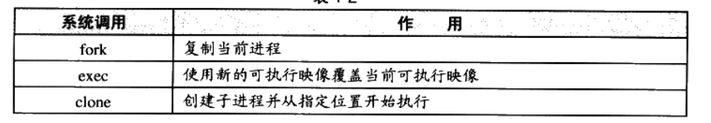

# 大致规划：
2023.9.15 简介
2023.9.16-9.17 静态装载
2023.9.18-9.20 动态装载
2023.9.21-9.24 库与运行库
# 第一部分 序章

## 早期计算机架构

无论是低速设备（键盘，鼠标等），还是高速设备（磁盘，cpu等）都连在一个bus总线上，为了协调各设备的速度以及让cpu和各设备通信，故每个设备需要一个IO控制器。

cpu核心频率的增高，内存跟不上，产生了与内存频率一致的总线。

为协调cpu，内存，高速图形设备，北桥芯片产生。低速设备一起连接？复杂，故

设计了南桥芯片，采用PCI/ISA总线以及南北桥设计的硬件结构：


## SMP和多核

SMP名为对称多处理器，每一个核在系统的地位和发挥功能一样，相互对称。适用于将一个大问题分解为若干个互不相干的子问题。这样能的大幅提升效率。

多核处理器和SMP之间是有细微差别的，因为多核处理器多个cpu核心之间是共享缓存等昂贵的部件，SMP则是独立的。一般来说，除非是很深入的优化（在缓存共享等方面由细微差别），否则可将SMP和多处理器看作一个概念。

## 系统软件

管理计算机本身的软件

平台性软件：操作系统内核，驱动程序，运行库，其他系统工具。（操作系统内核学习要开展！！！）

程序开发软件：编译器，汇编器，链接器，开发库等。（本书着重**连接器和开发库**，编译器和汇编器需要学习！！！）

**至理名言**：**计算机任何领域的问题都可以增加一个间接的中间层来解决**


最上层使用运行库（提供应用程序编程接口）提供的接口来编写应用程序或者开发工具，运行库基于系统调用（内核）提供的接口来封装，以软件中断来使用系统调用。更进一步操作系统内核通过驱动程序来操作硬件。驱动程序通过硬件厂商提供的硬件规格（硬件接口）进行编写。

## os发展

 多道系统（无优先级，只能时序进行），分时系统（每个程序运行一会儿，没有优先级等，容易死循环（==无法被抢占==）等死机），**多任务系统**（进程概念的引出，优先级调度，很小的时间片，抢占式），**目前在使用的**。

## 设备驱动

驱动程序是操作系统的一部分，但它与操作系统之间有一定的独立性，==驱动程序通常由硬件生厂商来开发==。os屏蔽了底层的磁盘细节，物理扇区，磁道等，抽象出逻辑扇区。1）使用read系统调用读文件时。2）文件系统判断文件位于的逻辑扇区的区间。3）向硬盘驱动程序发送一个读取该逻辑扇区区间的请求，4）磁盘驱动程序收到请求后就向硬件发出硬件命令（最常见为读写I/O端口寄存器来实现向硬件发送IO命令，x86有65536个寄存器，不同硬件被分配到了不同的IO端口地址，CPU提供“in”/“out”实实现硬件端口的读写）。==IDE接口==

## 内存使用（内存不够）

1）**虚拟地址**的引出，地址空间的不隔离（程序破坏等）
2）内存使用率极低，运行多个程序时，内存不够，需要大量的换入换出到磁盘，拷贝花销大
3）程序运行地址不确定，每次装入时分配空间不一样，但是访问数据或指令跳转的目标地址基本是固定（物理地址这里不变）的，**涉及程序的重定位**

- 隔离性：虚拟地址和物理地址来实现
- 分段：操作系统设置映射函数，虚拟地址到物理地址的实际转换由硬件来做。可解决问题一和三，但是内存使用率还是不会变。==程序的局部性原理，只加载程序的一部分数据==
- 分页：虚拟地址空间的页叫做虚拟页（VP，物理地址空间的页叫做物理页（PP，磁盘中的页叫做磁盘页（DP。可对每个页设置权限，例如读写权限，以实现保护机制。MMU单元一般集成在CPU的内部，用于是实现虚拟地址到物理地址的转换。
  

## 线程初识
### 线程基础
- 线程即轻量级进程，程序执行的最小单元，标准线程组成：线程ID，当前指令指针（PC），寄存器集合和堆栈。同进程下的线程共享程序的内存空间（代码段，数据段，堆），其他进程级的资源（打开文件，信号），如图

- 多线程优点
1）某个操作陷入长时间等待，只能睡眠状态无法继续执行。多线程执行可有效利用等待时间执行其他线程
2）计算操作耗时，计算线程和用户交互线程可分离开，保证和用户交互不中断
3）程序逻辑要求并发操作
4）多核计算机，单线程无法发挥计算机的全部能力
5）对与多进程应用，多线程在数据共享方面的效率要高很多；原因是多线程可共享进程内的内存空间以及一些资源。进程内线程间通信效率要高于进程外通信效率。
- 线程访问权限
线程的私有存储空间
1）栈：一般无法被其他线程访问，除非有线程知道其堆栈地址
2）线程局部存储（TLS）：TLS是某些OS为线程单独提供的私有空间，容量有限
3）寄存器：寄存器是执行流的基本数据，线程私有

- 线程调度与优先级
1）运行状态和进程相似：就绪，运行，等待
2）线程优先级可以手动设置，如linux可以通过pthread库来设置。系统可根据线程的表现动态调整优先级；IO密集型的线程总比CPU密集型的线程更容易得到优先级的提升；避免线程被饿死，等待时间长则提升优先级
- 可抢占和不可抢占的线程，不可抢占线程中，线程调度时机只会发生在线程等待某些事件时，以及主动放弃时间片时
- Linux多线程
1）Windows中线程和进程的实现和教科书一样标准，Windows有明确API来产生进程和线程：CreateProcess/CreateThread。对linux而言，线程不是一个通用的概念。
2）Linux将所有的执行实体（线程或者进程等）都称作任务。Linux不同任务下可以选择共享内存空间，实际上来说共享同一内存空间的就是线程。Linux下创建新的任务

3）父任务的fork返回一个子任务ID，而新产生的子任务fork则返回0。==新fork任务和原任务共享一个可写时复制的内存空间，任意任务试图修改内存空间时，复制一份给修改方单独使用==
4）fork产生一个新的任务时，新任务可调用exec执行新的可执行文件；使用clone来产生新的线程

### 线程安全，多线程程序并发时数据的一致性问题
- 竞争与原子操作
线程不安全本质是因为多线程对同一个数进行操作，导致读写时的不一致性。为啥会出现这样的情况？本质是因为对这种共享数据的操作，例如i++，这种其实是会分解位很多条指令来执行，当很多线程同时对该数操作时，不同线程的指令执行是相互插入的，所以导致结果有不确定性，执行结果出错。如果系统提供了对这种加法的原子操作指令，即变为了原子指令，那么就不用担心结果的不确定性，只适用与简单场合
- 同步与锁
数据的访问同步，即只能有最多一个线程对数据进行访问，将数据访问原子化了
使用锁实现数据同步，锁是一种非强制的机制，分为获取锁和释放锁两步，下面为锁的实现
1）二元信号量，最简单的一种锁，两种状态（占用和非占用）
2）多元信号量，对允许多个线程并发访问资源适用，即常说的信号量机制
3）互斥量，和二元信号量相似，资源仅允许同时被一个线程访问，不同的是信号量可被任意线程捕获并释放，但互斥量则是哪个线程获取了互斥量就要负责释放这个锁
4）临界区，比互斥量更加严格，互斥量和信号量在系统是任何进程可见的，但是临界区的作用范围仅限于本进程，其他进程则无法获取该锁
5）读写锁，特定场合下的同步，读写锁能允许多个进程读取，读写锁有自由，共享，独占三种状态，如图：

6）条件变量，一种同步手段，线程可以等待条件变量以及唤醒条件变量。一个条件变量可以被多个线程等待。当该条件变量被唤醒（理解为等待某事件，事件发生了），所有等待该条件变量的线程都可以回复执行
- 可重入与线程安全
1）可重入函数：这个函数没被执行完成，由于外部因素或者内部调用，又一次进入该函数执行。可重入函数(多线程环境的线程安全)必须的特征：

- 过度优化，编译器技术存在很多自主优化的情况，这些自主优化可能会导致线程的不安全
1）编译器为提高变量访问速度，将变量放到了某个寄存器，==由于不同线程的寄存其是相互独立的，所以对变量加锁也不保证结果的正确性==
2）CPU的动态调度，执行程序为提高效率会交换指令顺序，故编译器在优化时，也可能为了效率而交换毫不相干的指令的执行顺序，从而导致代码的执行结果和我们预期的不一致
这个预期是r1,r2至少一个为1                                   实际上交换执行顺序后，r1,r2可能都为0              
  
可以使用**volatile**关键字来阻止这个过度优化，其可以做到

使用该关键字可以解决寄存器缓存的问题，但是还是不能解决第二个指令乱序的问题，因为即使编译器这里停止调整顺序，但在CPU动态调度时，其还是可能执行换序的执行
另一个换序问题，单例模式（Singleton）中的double-check:

单例模式，一般允许这个线程只有一个类的实例，这个代码第一个if首先判断这个实例存不存在，不存在，再加锁，这样减少了锁的粒度；然后再进行if的判断，再产生一个新的实例。双重if可以将加锁的调用开销降到最低，加锁可以解决多线程竞争的麻烦。
**问题**
pInst=new T有三个步骤：分配内存->调用构造函数->将内存地址赋值给pInst。然而CPU是乱序执行的，意味着第二和第三步是乱序的。当第三步先执行时，如果另外的线程来对GetInstance（显然这是不可重入的函数）进行调用，那么PInst会返回一个确切的没有被初始构造的实例的地址给用户使用，可能会造成程序的崩溃（取决于具体的类的设计）。由此可见，CPU的乱序执行会极大的干扰我们的线程安全能力，所以需要一种可以阻止CPU换序的方法：
然而现在没有一种通用的可移植的阻止CPU换序的方法，通常可以调用CPU提供的barrier指令，可以阻止CPU将该指令前的指令交换到barrier之后。例如在POWERPC中的一条指令lwsync:

### 多线程内部情况
用户使用的时用户态的用户线程，然而用户态线程不一定对应操作系统内核里同等数量的内核线程。下面是三种线程模型：
#### 一对一模型
用户态的线程唯一对应一个内核使用的线程。然内核线程可能不存在与之对应的用户线程。
一对一模型的优点是可以做到用户线程和内核线程一致，故一个线程因为某些原因阻塞时，其他线程不会受到影响。一对一模型可让对多线程程序在多处理器系统上表现更好。
缺点：许多操作系统限制了内核线程的数量，故会使用户的线程数量受限。操作系统的内核线程调度时，上下文切换开销大，导致用户线程执行效率下降。
#### 多对一模型
多对一模型将多个线程映射到一个内核线程上。能提高用户的线程数量，相对减少内核线程的数量，从而减少内核的调度开销。
缺点：一个用户线程阻塞，那么所有与内核进程相关的用户线程均无法执行，因为内核线程阻塞了。
#### 多对多模型
将多个用户线程映射到少数，至少两个及以上的内核线程上。可以解决一对一模型中的对用户线程数量的限制以及多对一模型中的单点阻塞问题

# 第二部分 静态链接
## 第二章 编译和链接
通常IDE和编译器提供的默认配置，编译和链接参数对于大部分的应用程序开发已经够用，但是你只知道这些配置的参数，却不知道背后的原理，不知道它做了些什么，那又怎么根据性能瓶颈来选择对应的优化配置参数呢？
### 被隐藏的过程
gcc编译4步骤：预处理（预编译）->编译->汇编->链接；下面是具体的过程：

- 预编译
预编译的命令：
```shell
  gcc -E test_2chapter.cc -o test_2chapter.i
  #或者
  cpp test_2chapter.cc -o test_2chapter.i
```
==预编译过程中主要做的事==(主要处理以”#“开始的预编译指令，包括头文件，#define等)：
1）将所有"#define"删除，并且展开所有的宏
2）处理所有的条件编译指令。"#if","#endif","elif","else","ifdef"
3）处理"#include"预编译指令，将所有包含的文件插入到预编译指令的位置，递归的插入，因为头文件的递归包含
4）删除所有注释，"//"，"/* */"
5）添加行号以及文件标识，后面编译错误或警告显示行号（常见的情况）
6）保留所有的#pragma编译器指令，这个可以控制编译器的一些行为，例如优化控制，警告控制，链接控制等
==当我们无法判断宏定义正确或在头文件包含是否正确时，可查看预编译文件来解决这个问题==
- 编译
编译过程就是把预处理完的文件.i，进行一系列词法分析，语法分析，语义分析，优化后生成的相应的汇编代码文件.s,为程序构建的核心部分，等效的编译命令
```shell
gcc -S test_2chapter.i -o test_2chapter.s
```
也可以将预编译和编译整合到一起
```shell
gcc -S test_2chapter.cc  -o test_2chapter.s
```
不同的语言预编译和编译的程序不一样
|  编程语言      | 编译后台程序  | 
| ---- | ----|
| c语言| ccl|
| c++语言     |    cclplus | 
| OBjective-C     | cclobj|
|    fortran  |     f771 |      
|   Java| jcl|

==实际上来说gcc的命令是这些后台程序的包装，根据不同的参数去调用预编译编译程序ccl,汇编器as，链接器ld==
- 汇编
汇编器将汇编代码.s转换为机器可以执行的指令.o，汇编器的汇编过程相对于编译器来说比较简单，无复杂的语法/语义/指令优化，只能根据汇编指令和机器指令的对照表一一翻译
```shell
as test_2chapter.s -o test_2chapter.o
gcc  -C test test_2chapter.cc -o test_2chapter.o
gcc  -C test test_2chapter.cc -o test_2chapter.o
```
- 链接
为什么需要链接（因为使用了很多三方库？），为什么需要把这些库连接起来得到可执行文件？==本书重点==
### 编译器做了什么
如果没有编译器，我们只能使用汇编语言和机器语言来编写程序，但是值得注意的是，这样编写的程序是依赖与特定的硬件平台的，如果换了平台，程序就需要重新编写（显然不行）。所以编译器出现，我们可以尽可能少的考虑计算机本身硬件的影响，而尽可能多的关注程序的逻辑。编译过程一般有6步：扫描，语法分析，语义分析，源代码优化，代码生成，目标代码优化。
#### 扫描/词法分析
源代码程序输入到扫描器，进行词法分析，将源代码的字符运用类似有限状态机的算法将源代码的字符序列分割成一系列符号（token）。
这些token一般可以分为几类：
**关键字，标识符，字面量（数字，字符串），特殊符号（加号，等号等）**
扫描器在扫面分割字符的同时，同时将标识符存放到了符号表，将数字，字符串常量存放到文字表等
工具：lex程序可按用户描述好的词法规则对源代码进行字符串的分割。故编译器开发者只需要指定好既定的词法分割规则，而不用单独开发一个独立的词法扫描器。
==有预处理的语言，如C语言，其宏替换和文件包含等预处理工作一般是归入单独的预处理器，而不是交给编译器==
#### 语法分析
语法分析器对扫描器产生的token进行语法分析生成语法树，分析过程采用(上下文无关语法分析，下推自动机)。

如上图为语法树，其可以将表达式分解为一种树状表示。该语法树可以区分各种运算符的优先级，比如括号（）在乘号*前面，故其一般为（）的子节点；运算符的含义也确定了，例如星号*既可以是指针取内容也可以是乘法表达式，语法分析阶段就需要对这些内容进行区分，如果表达式不合法，各种括号不匹配，表达式中缺少操作符等，编译器就会报语法分析阶段的错误。
工具：语法分析有现成的工具yacc，可根据用户给定的语法规则对输入的记号序列进行解析，从而构建语法树。编程语言不同只需要改变语法规则，而无需为每一个编译器编写语法分析器（和编译器对硬件平台类似），故语法分析器又叫做"编译器编译器"。
#### 语义分析
语法分析只能完成对表达式的语法层面的分析，却不知道其真实的含义。编译器所能分析的语义是静态语义（编译可确定），动态语义则是在程序运行时才能确定的语义。
**静态语义**：类型的声明以及类型的匹配，类型的转换。
**动态语义**：动态语义在运行时的错误，比如将0作为除数是一个运行期语义的错误。
在语义分析阶段之后，语法树的表达式都表示了类型，有些类型需要做隐式转换，语义分析程序需在语法树中插入相应的转换节点。所以语义分析主要做的事是进行表达式含义的解析，并添加类型到语法树的各个节点中。并且还对符号表里的符号类型也做了更新。
#### 中间语言生成/源代码优化
源码级优化器，例如编译是可以确定的值，例如字符常量加法（2+6等），源代码优化器将语法树转换成中间代码，其一般与目标机器和运行时环境无关。中间代码类型：
三地址码，P-代码。

如图，转化为三地址码的形式，但是为了这种三地址码的表达方式，加入了许多的临时变量，源代码优化器可将2+6的值在编译时直接计算出来，那么就可以直接替换掉临时变量，减少变量。
中间代码的出现使编译器分为编译器前端以及编译器后端。（==这不就是LLVM的思想，或许LLVM就是借鉴的这种思想==）
编译器前端：负责产生机器无关的中间代码。
编译器后端：将中间代码转换成目标机器代码。
跨平台编译器可使用同一个编译器前端，以及针对不同机器平台的数个后端。
#### 目标代码生成和优化
编译器后端主要是：代码生成器，目标代码优化器。
代码生成器：代码生成器主要将中间代码转化为目标机器代码。依赖于目标机器（不同字长，寄存器，整数数据类型，浮点数数据类型等）。代码生成器将中间代码转换成下面的代码序列：

目标代码优化器可以对上述的目标代码进行优化，选择合适的寻址方式，使用位移代替乘法运算，删除多余的指令。上述图片的乘法就可以使用基址比例变址寻址的lea指令来完成，然后使用mov完成赋值操作。
现代编译器有着异常复杂的结构，由于现代高级编程语言的复杂性以及CPU的复杂性（流水线，多发射，超标量等诸多复杂特性），所以编译器的机器指令优化非常复杂。为了在编译过程中支持多
多种硬件平台，允许编译器编译出多种目标CPU的代码。
经过这些编译步骤后：变量的地址其实还没有确定，如何得到变量的地址，如果变量定义在同一个编译单元里，编译器可以为index，array分配空间，确定地址，如果是在其他的模块呢，事实上，定义在其他模块的全局变量以及函数的最终运行的绝对地址需要在最终链接时才能最终确定。现代编译器将源代码文件（即变量，函数的定义）编译为一个未链接目标文件（静态库.a/动态库.so）。
### 链接器年龄比编译器长
打孔年代，用地址标识指令，但是如果目标指令地址发生变换，则对应的打的孔要对应发生变换，重新计算目标地址的过程被叫做重定位。这种方式繁琐，所以后面出现了汇编语言，用符号来标识目标(变量，函数)地址，这样极大的解放生产力，方便进行重新开发。汇编语言的出现逐渐带来了程序的膨胀（生产力爆棚），程序膨胀带来程序的模块化，模块间的变量的相互如何引用，引出来链接的主题：

### 模块拼装-静态链接

### 本章小结


