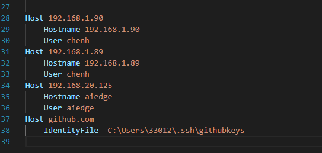

## 1.git和ssh的密钥使用：
（1）ssh-keygen -t ed25519 -C "your_email@example.com" 此命令在.ssh目录下生成最终公钥和密钥，一般需要自己指定密钥的名字。
（2）eval "$(ssh-agent -s)" 启动ssh-agent 如果不支持此命令，很有可能是windows或者自带的ssh是不支持的，可以自己下载openssh，git会寻找系统环境变量默认的ssh。
（3）ssh-add ~/.ssh/id_ed25519 替换id_ed25519为指定目录的密钥。
（4）做完这些如果还是不能连接，仔细思考本机是不是有多个密钥文件，此时可以修改config文件，增加对应网站的本机密钥地址。例如:

其他：给i他 查看是否能连接上

**解决git clone时的 fatal: unable to access 'https://github.com/apache/tvm.git/': gnutls_handshake() failed: The TLS connection was non-properly terminated.问题：**

 **git config --global https.postBuffer 1048576000**

**git config --global http.sslVerify或者https.sslVerify false  此行命令跳过ssl验证**

设置代理 git config --global https.proxy http://127.0.0.1:1080

git config --global user.name "chenhao-stick-to"

## 杂乱的学习
### 开始创建git目录时:
git init -->git add . -->git commit -m "first commit" --> git branch -M main -->git remote add origin git@github.com:chenhao-stick-to/document_for_study.git -->git push -u origin main
以后拉取仓库合并时：
git pull -->git add . ->git commit -m "modify commit" -->git push origin main.
### 其他：
git rebase和git pull的区别，
git pull将会从远端拉该分支最新的提交，然后和本地的提交合并。
git rebase则是直接从目标分支上进行提交，而不是两者的合并。
git checkout <目标分支>
git rebase <源分支>
这会将源分支的部分提交到目标分支上。
git clone --branch v2.6.39 --depth=1 git@github.com:torvalds/linux.git clone指定tag的库到本地
git commit --amend  y应用于本地分支，将多次commmit的提交合并到一次commit上，需不需要跟 -m "一样的tag"？
git ls-remote git@github.com:chenhao-stick-to/document_for_study.git 测试远端能否直接连接。
git log 查看commit的历史
git status 查看当前git的状态，是个万能命令

git reset [--soft | --mixed | --hard] [HEAD]
这三者的具体差别，可以查看这个网站，讲的比较透彻。
https://www.jianshu.com/p/c2ec5f06cf1a
简单的总结：
首先将git在本地的working tree分为三个区：工作目录区（实际的代码区），index暂存区（实际的add之后的暂存区），repository区（实际的commit之后的区）。

git reset --hard <具体的commit编号/HEAD也可>，是将工作目录，暂存区以及repository区的所有内容都更改为和指定的Head一样。

git reset --soft <具体的commit编号/HEAD也可>，保留工作目录，将重置HEAD所带的差异放进暂存区，只有repository区和HEAD保持一致，工作目录保持不变，

git reset --mixed <具体的commit编号/HEAD也>,清空暂存区，将工作目录的修改以及暂存区的内容和reset导致的新的文件差异到更新到工作目录。
使用场景：
--hard:放弃本地的所有改变；抛弃目标节点之后的所有commit。
--soft:频繁的提交commit，此时可以使用该选项，将多次commit的值，都综合到暂存区中，这样就可以将多个commit的修改集中到一个commit，变得更加简略。
--mixed：这样可以将所有的修改都保存在工作目录区，然后使用add，再commit一样可以达到合并多个commit的效果；移除所有再index暂存区中想要commit的文件，在add的暂存区中有不想要的修改时可以做；commit提交了某些不想要的代码，不想重新开一个commit，就可以使用这个，回退到正确到commit点上，这样再再工作目录去删除这些代码，然后再add和commit，就可达到这样的效果。

