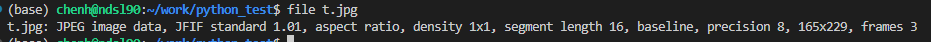

# 1.Liunx简单命令

## 切换到root权限，

使用sudo useradd -m +用户名创建新用户，会在/home下生产对应用户文件，这样可以进行远程登录。区别与创建的普通用户。

使用sudo passwd+用户名 设置密码

su命令切换用户

mkdir创建目录。rmkdir删除文件。/mkdir -p 创建多级目录

pwd 获取当前目录绝对路径

scp -r [原文件路径/用户名@ip地址：文件路径] 目标路径/用户名@ip地址：文件路径

echo 'main(){}'| /usr/bin/gcc -E -v - 获取当前gcc编译器的头文件和库文件搜索路径

pwd,

ldd查看可执行文件依赖库文件

df -a

uname
file foobar.o 可以查看文件的格式

touch 创建文件

**解决git clone时的 fatal: unable to access 'https://github.com/apache/tvm.git/': gnutls_handshake() failed: The TLS connection was non-properly terminated.问题：**

 **git config --global https.postBuffer 1048576000**

**git config --global http.sslVerify或者https.sslVerify false  此行命令跳过ssl验证**

设置代理 git config --global https.proxy http://127.0.0.1:1080

git config --global user.name "chenhao-stick-to"

# 命令行的快速操作
使用 ctrl +A可以实现快速的将光标切换到命令行首字符。
使用ctrl + <- 或者 -> 实现光标快速切换到左右的整个单词