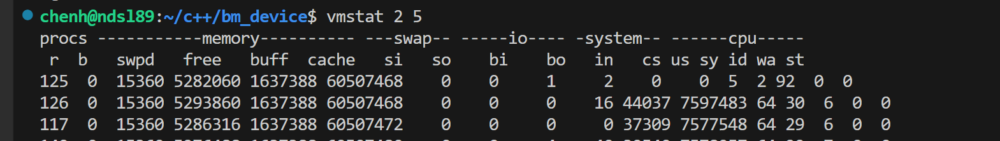
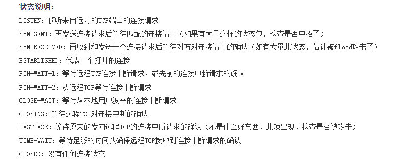

# 1.Liunx简单命令
## 切换到root权限，创建用户设置
使用sudo useradd -m +用户名创建新用户，会在/home下生产对应用户文件，这样可以进行远程登录。区别与创建的普通用户。
使用sudo passwd+用户名 **设置密码**
sudo chsh -s /bin/bash 用户名  //可设置用户的默认终端为bash
sudo visudo  //修改sudoer文件，添加用户权限为ALL=(ALL:ALL) ALL
su 命令切换用户

## 目录，文件创建，删除，查找等操作
mkdir创建目录。rmkdir删除文件。 mkdir -p 创建多级目录
file foobar.o 可以查看文件的格式

touch / cat >（创建需要写入，输入内容，按ctrl+D进行退出写入） 都可创建创建文件
pwd 获取当前目录绝对路径
chmod 777 文件/目录
**文件查找**
- cat命令。cat -n 显示各行行号；cat tmp.txt tmp1.txt 同时显示多个文件内容;cat -e 将换行符表示未$，多行压缩为一个；cat tmp.txt > tmp1.txt tmp.txt内容覆盖tmp1.txt内容；cat tmp.txt >> tmp1.txt tmp.txt内容追加到tmp1.txt内容;cat tmp1.txt tmp.txt > tmp.txt将前两个文件的内容重定向到tmp.txt中；cat rumenz rumenz1 rumenz2 rumenz3 | sort > rumenz4 将前面四个文件的结果合并后，作为管道 | 的输入，然后管道输出为sort的输入，按字母顺序排序后输出到 rumenz4中。
- more 命令，一次性不会显示完，空格跳页，回车跳行。
- grep命令， grep "待寻找字符串" 文件名。-i忽略大小写；-v显示不包含匹配文本的所有行。^a	行首，搜寻以 a 开头的行;ke$ 行尾，搜寻以 ke 结束的行。

ls命令：以.开始的为隐藏文件，需要使用ls -a 才能显示。-l 按表格显示，-h显示文件大小为K。一般使用为ls -lh配合显示。-lha都可以配合使用无限制
cd 命令: cd - 可以在最近的两次目录之间来回切换。
rm命令：-r表示递归删除（文件夹需加上），-f表示强制删除。
tree命令：不加则显示当前目录所有文件，目录的文件树；-d只看文件，-h可看文件大小。
nl命令：-b非空行也显示行号，不加则不显示非空行行号。

## 系统本地和跨系统传输
scp -r [原文件路径/用户名@ip地址：文件路径] 目标路径/用户名@ip地址：文件路径。scp -P 4588 remote@www.runoob.com:/usr/local/sin.sh /home/administrator 远程防火墙为scp设置指定端口，则使用-P参数指定端口。
cp命令：-i在覆盖文件时给出提示。
mv命令：用于重命名及移动等，-i给出覆盖提示。

## 编译，连接等编译器相关
echo 'main(){}'| /usr/bin/gcc -E -v - 获取当前gcc编译器的头文件和库文件搜索路径
ldd  查看可执行文件依赖库文件

## 磁盘管理
du 查看指定目录或文件的占用磁盘空间：du -ah 显示所有文件目录的大小；不加-h则只显示目录。du -a | sort -nr |more 将所有文件按照磁盘占用由大到小进行排列。
df 检查linux服务器的文件系统的磁盘空间的占用情况。df -a 显示全部文件系统列表，df -h 方便阅读显示。
df -i 显示inode索引结点的结果。df -T 显示对应的盘的文件系统。df -l 只显示本地，杜绝使用nfs的远程服务器的磁盘。以上一般可以混合使用。
uname 查看当前操作系统
## 进程管理
- pstree 显示系统进程树，-p 显示pid，-u显示进程对应用户。

- ps命令，-a显示所有进程，-u显示以用户为主的进程，-x和au配合显示完整信息，所以一般aux连着用。
  
  如上，VSZ：进程的虚拟内存占用；RSS：进程占用的固定内存；STAT：程序目前状态，S正在睡眠，T正在侦测或停止，Z：程序终止，父进程无法终止它，僵尸状态，R程序正在允许/准备运行。Command：程序的实际指令。

- pgrep 查看进程信息，是否消亡，pgrep使用。-l 同时显示进程名和PID；-o 匹配多个，显示进程号小的;-n显示进程号大的。

- kill 终止进程的运行。-l 显示对应的信号参数。kill不带信号号码，则默认发出15的终止信号，该信号可被进程捕获，使进程退出前可清理释放资源。信号使进程强制终止由一些副作用，数据丢失/终端无法恢复到正常状态等。-9强制终止信号万不得已不会使用。
如下是对应的信号编码和对应的信号名称。

下面是常用的几种信号：

- killall 用于杀死指定名字的进程。-e 匹配进程的名称;-l 忽略小写；-g 杀死进程组而不是进程。-i 交互模式，杀死进程前先询问用户。killall nginx，killall -9 bash杀死所有同名进程。

- pkill 是ps和kill命令的结合，按进程名来杀死指定进程。

- htop，查看系统进程消息，全面，可调整系统nice值等。

- vmstat，常见的监测工具，展现给定时间间隔的服务器的状态值。htop是进程级的，vmstat则是站在整个os角度。两个数字，第一个标识多少秒采样一次，第二个表示采样多少次。。

如上，
**r** 表示运行队列(就是说多少个进程真的分配到CPU)，我测试的服务器目前CPU比较空闲，没什么程序在跑，当这个值超过了CPU数目，就会出现CPU瓶颈了。这个也和top的负载有关系，一般负载超过了3就比较高，超过了5就高，超过了10就不正常了，服务器的状态很危险。top的负载类似每秒的运行队列。如果运行队列过大，表示你的CPU很繁忙，一般会造成CPU使用率很高。
**b** 表示阻塞的进程,这个不多说，进程阻塞，大家懂的。
**swpd** 虚拟内存已使用的大小，如果大于0，表示你的机器物理内存不足了，如果不是程序内存泄露的原因，那么你该升级内存了或者把耗内存的任务迁移到其他机器。
**free**  空闲的物理内存的大小，我的机器内存总共8G，剩余3415M。
**buff**  Linux/Unix系统是用来存储，目录里面有什么内容，权限等的缓存，我本机大概占用300多M
**cache** cache直接用来记忆我们打开的文件,给文件做缓冲，我本机大概占用300多M(这里是Linux/Unix的聪明之处，把空闲的物理内存的一部  分拿来做文件和目录的缓存，是为了提高 程序执行的性能，当程序使用内存时，buffer/cached会很快地被使用。)
**si**  每秒从磁盘读入虚拟内存的大小，如果这个值大于0，表示物理内存不够用或者内存泄露了，要查找耗内存进程解决掉。我的机器内存充裕，一切正常。
**so**  每秒虚拟内存写入磁盘的大小，如果这个值大于0，同上。
**bi**  块设备每秒接收的块数量，这里的块设备是指系统上所有的磁盘和其他块设备，默认块大小是1024byte，我本机上没什么IO操作，所以一直是0，但是我曾在处理拷贝大量数据(2-3T)的机器上看过可以达到140000/s，磁盘写入速度差不多140M每秒
**bo** 块设备每秒发送的块数量，例如我们读取文件，bo就要大于0。bi和bo一般都要接近0，不然就是IO过于频繁，需要调整。
**in** 每秒CPU的中断次数，包括时间中断
**cs** 每秒上下文切换次数，例如我们调用系统函数，就要进行上下文切换，线程的切换，也要进程上下文切换，这个值要越小越好，太大了，要考虑调低线程或者进程的数目,例如在apache和nginx这种web服务器中，我们一般做性能测试时会进行几千并发甚至几万并发的测试，选择web服务器的进程可以由进程或者线程的峰值一直下调，压测，直到cs到一个比较小的值，这个进程和线程数就是比较合适的值了。系统调用也是，每次调用系统函数，我们的代码就会进入内核空间，导致上下文切换，这个是很耗资源，也要尽量避免频繁调用系统函数。上下文切换次数过多表示你的CPU大部分浪费在上下文切换，导致CPU干正经事的时间少了，CPU没有充分利用，是不可取的。
**us** 用户CPU时间，我曾经在一个做加密解密很频繁的服务器上，可以看到us接近100,r运行队列达到80(机器在做压力测试，性能表现不佳)。
**sy** 系统CPU时间，如果太高，表示系统调用时间长，例如是IO操作频繁。
**id**  空闲 CPU时间，一般来说，id + us + sy = 100,一般我认为id是空闲CPU使用率，us是用户CPU使用率，sy是系统CPU使用率。
wt 等待IO CPU时间。
- lsof 显示系统打开文件,FD标识文件描述符。DEVICE 指定磁盘名称，SIZE表示文件大小.
lsof abc.txt 显示开启文件abc.txt的进程
lsof -c abc 显示出以字母 abc 开头进程现在打开的文件
lsof -p 1234 列出进程号为1234的进程所打开的文件
lsof -g gname/gid 显示归属gname或gid的进程情况
lsof -u uname/uid 显示归属uname或uid的进程情况
lsof +d /usr/local/ 显示目录下被进程开启的文件
lsof +D /usr/local/ 同上，但是会搜索目录下的目录，时间较长,递归搜索
lsof -d 4 显示使用fd为4的进程
lsof -i 用以显示符合条件的进程情况
lsof -i[46] [protocol][@hostname|hostaddr][:service|port]
- 作业控制，前台运行/后台运行。jobs可以查看后台作业情况（终端相关）。fg %jobs编号，将对应作业恢复到前台；bg %jobs编号，将对应作业恢复到后台运行.ctrl+z 将前台程序挂到后台。kill %jobs编号，需要先将对应的jobs停止
## 网络管理
- telnet 用于远程登入主机

- netconfig 网络配置工具，设置和管理网络接口的配置信息。配置网络接口的IP地址，子网掩码，网关，DNS等网络参数。
  netconfig eth0 ip 192.168.1.100 netmask 255.255.255.0 设置eth0为静态地址，以及对应的子网掩码。
  netconfig eth0 dhcp 设置eth0为动态IP地址。
  netconfig eth0 gateway 192.168.1.1 设置该eth0的默认网关是该地址，即网卡发送给出去的数据都需要经过该地址对应的路由器或者交换机。
  netconfig eth0 dns 8.8.8.8 8.8.4.4 设置该以太网接口eth0的公共dns服务器，首先在这个服务器解析域名，否则由ISP提供商提供的本地服务器来解析域名
  netconfig -f /etc/network/interfaces eth0 ip 192.168.1.100 netmask 255.255.255.0 将eth0的ip，netmask更新到文件中。
  netconfig show eth0 展示eth0的网络配置信息
  netconfig restart eth0 重新启动eth0接口

- route命令，显示和操作本机的IP路由表。route -n显示本机路由表。
  route add -net 224.0.0.0  netmask 240.0.0.0 dev eth0 添加一条路由规则
  route add -net 224.0.0.0 netmask 240.0.0.0 reject 屏蔽这一条路由，目的地址为224****的都被拒绝。
  route del -net 224.0.0.0 netmask 240.0.0.0 reject 删除一条路由

- nc
  端口扫描：nc -v -z -w2 192.168.0.3 1-100 扫描指定ip的1-100的tcp端口； nc -u -z -w2 192.168.0.3 1-1000 扫描指定ip的1-1000的udp端口;nc -nvv 192.168.0.1 80 扫描指定端口。
  文件传输：接收方 nc -lp 8888 > node.tar.gz（设置端口8888，文件名）；发送方 nc -nv 192.168.75.121 8888  -i 1 < node_exporter-1.3.1.linux-amd64.tar.gz （设置接收方ip和对应的端口，-i 1 发送完成自动退出）

- ifconfig
  ifconfig  eth0 up/down 启动/关闭网卡
  ifconfig eth0 add 33ffe:3240:800:1005::2/64 设置网卡的ipv6地址
  ifconfig eth0 del 33ffe:3240:800:1005::2/64 删除网卡的ipv6地址
  ifconfig eth0 hw ether 00:AA:BB:CC:DD:EE 修改网卡eth0的mac地址
  ifconfig eth0 192.168.120.56 netmask 255.255.255.0 broadcast 192.168.120.255 设置eth0的ip，掩码，以及广播地址。
  ifconfig eth0 arp /-arp 启用和关闭arp协议
  ifconfig eth0 mtu 1500 设置最大传输单元为1500
  请记住命令修改的不具有永久性。要保持永久性请求该对应的配置文件。

- netstat 一般用于显示IP，TCP，ICMP，UDP等协议相关的统计数据；检验本机端口的网路连接情况。内核中访问网络即相关信息的程序，提供tcp，udp监听和进程内存管理相关报告。
状态说明：

netstat -a 列出所有端口
netstat -nu 显示当前udp的连接情况
netstat -apu 显示udp端口号的使用情况
netstat -i 显示网卡列表
netstat -g 显示组播的关系
netstat -s 显示网络统计信息
netstat -l 显示监听的套接口
netstat -n 显示所有已建立的有效连接
netstat -e 显示关于以太网的统计数据
netstat -r 显示关于路由表的信息
netstat -at 列出所有tcp端口
netstat -ap | grep ssh **找出程序运行的端口**
netstat -anpt | grep ':16064' **找出运行在指定端口的进程**
- ping
ping -t 192.168.1.89 需要管理员来中断再统计，而不是直接ping固定次数
ping -a www.baidu.com 可以解析网址的ip或者ip的主机名
ping -n 10 192.168.1.89 发送指定数目的网络包，方便进行网络测试
ping -l 65500 -t 192.168.1.89 发送指定大小数据包，最大是65500
ping -n 1 -r 9 192.168.1.89 发送一个数据包到该ip，并且记录返回途径路由。
- traceroute/tracert（windows） 追踪网络数据包的路由途径；最多有30跳，有*号是防火墙封掉了ICMP的信息。
traceroute www.baidu.com 直接跟踪
traceroute -m 10 ww.baidu.com 设置跳数
traceroute -n www.baidu.com 只显示ip不显示主机名
traceroute -p 6888 www.baidu.com 设置探测包端口6888
traceroute -q 4 www.baidu.com 一般三个探测包，-q设置为4个
traceroute -w 3 www.baidu.com 设置探测包等待时间为3s
- tcpdump 对网络上的数据包进行包分析，支持对网络层，协议，主机，网络，端口过滤。
tcpdump -i eth1 默认只监视第一个网络接口，这里指令网络接口
tcpdump host 192.168.1.90 截获该ip主机收到和发送的数据包
tcpdump ip host 192.168.1.90 and ! 210.27.48.2 截取主机192.168.1.90 除了210.27.48.2之外所有主机通信的包。
tcpdump -i eth0 src host hostname 截获主机hostname所有发送的数据，eth0端口
tcpdump -i eth0 dst host hostname 截获所有发送到主机hostname的数据
tcpdump tcp -i eth1 -t -s 0 -c 100 and dst port ! 22 and src net 192.168.1.0/24 -w ./target.cap  保存为cap文件，再用windows的包分析工具wireshark来进行分析。

## 内存管理
- free,-h表格形式，-s 2表示2秒统计显示一次，显示系统内存信息
## 命令行命令的快速操作
使用 ctrl +A可以实现快速的将光标切换到命令行首字符。
使用ctrl + <- 或者 -> 实现光标快速切换到左右的整个单词
ctrl + w 删除当前光标单词，ctrl + u删除当前命令。

clear 清屏
ctrl + shift + + 放大整个终端窗口
ctrl + - 缩小整个终端窗口

## ssh命令详解
ssh -p 777 user@hostname 连接到主机的777端口，因为可能该主机不是使用ssh的默认22端口号。
ssh pi@10.42.0.47 ls -l 在ssh服务端上执行一条命令并且返回。
ssh -X feiyu@222.24.51.147 开启x11的转发功能,显示连接主机的图形界面。