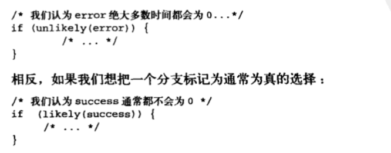

# Linux内核简介
为什么UNIX系统如此强大，稳定，健壮？
- Unix很简洁，有非常明确的设计目的
- unix抽象了所有东西为文件，对数据和设备的操作接口统一。
- Unix内核和相关系统工具软件基于c语言编写，移植能力强。
- Unix的进程创建非常迅速。
- Unix提供一套非常简单且稳定的进程间通信元语。
**Linux内核和unix内核比较**：
Unix内核是一个不可分割的静态可执行库，必须以巨大，单独的可执行块的形式在一个单独的地址空间中运行。Linux和Unix基本都需要MMU的支持，现在基本所有硬件系统都具备内存管理单元。
**单内核与微内核比较**：
单内核即整个内核运行在单独一个地址空间，内核间的通信是微不足道的，可以直接调用内核所有函数，具有简单和性能高的优点，大多数unix系统为单内核模式。
微内核：不做为一个单独的大过程，微内核划分为多个独立过程，每个过程叫做服务器（CS架构）。不能直接调用函数，需要使用消息传递机制来处理内核通信：采用进程间通信机制来让各个服务器互通消息，互换“服务”。但是如果微内核的服务有些没有运行在内核，那么就需要额外的IPC开销，设计用户态和内核态的上下文切换，所以实际运用的微内核系统基本是让全部或大部分服务器位于内核。
==Linux也是单内核,但器规避了微内核设计的性能损失缺陷，所有的内核函数运行在内核态而无需消息传递。==
**Linux和Unix设计上的显著差异：**
- Linux支持动态加载内核模块。可在需要时动态的卸除/加载部分内核代码。
- Linux支持对称多处理SMP机制，传统UNIX基本不支持。
- Linux内核可以抢占，允许在内核运行的任务有优先执行的能力。
- Linux对线程的支持，（将进程和其他线程等同）
- Linux提供对设备类的面向对象的设备模型，热插拔事件，用户空间的设备文件系统。
- Linux忽略了unix的设计的很拙劣的特性
# 从内核出发
## **内核开发特点**：
- 不能使用c/c库/必须使用GNU c
- 内核编程缺乏用户空间那样的内存保护机制，难以执行浮点计算。
- 每个进程只有很小的定长堆栈。
- 内核支持异步中断，SMP，抢占。注意同步和并发。
- 考虑可移植性的重要性。
### **GNU** **C**：
内核开发者需要用到gcc提供的语言拓展部分。gcc是多种GNU编译器的集合。
- 内联函数：
消除函数调用和返回带来的开销，一般使用static关键字限制（其他编译单元不可见）。内联函数在头文件中直接定义。
- 内联汇编
即asm指令嵌入c中。
- 分支声明
gcc内建了一条指令likely和unlikely用于优化，当条件语句中，该条件很少出现，则使用unlikely标识，否则使用likely标识。

### 无内存保护机制和不要轻易使用浮点数
内核发生内存错误会导致oops，主要是没有错误反馈，不知道哪里发生错误。
用户空间浮点操作，内核完成从整数操作到浮点数操作模式的转换。==执行浮点指令时，体系结构不同，内核选择不同==但在内核空间，其不能完美支持浮点操作，在内核使用浮点数，需要人工保存和恢复浮点寄存器，还需要一些额外琐碎的事。
### 容积小且固定的栈
每个处理器的内核栈是固定的
### 同步和并发/可移植性
内核很容易产生竞争条件，要求能并发的返回共享数据。常见解决方法是自旋锁和信号量，内核也需要注意移植问题，大部分c代码应该和体系结构无关。
## 小结
请克服对内核陌生的恐惧，冲冲冲！！！！
# 第三章 进程管理
## 3.1 进程
进程：处于执行期的程序。
线程：在进程中的活动对象。
进程提供两种虚拟机制：虚拟处理器和虚拟内存。线程间可以共享虚拟内存，但每个都拥有各自的虚拟处理器。
fork()调用有两个返回，一个返回到父进程，父进程继续执行（pid=0）;另一个返回到子进程（pid>0）。现代Linux内核中，fork()由clone()系统调用来实现。程序通过exit()退出，父进程通过wait4()系统调用查看子进程是否终结。进程退出后设置为僵死状态， 直到父进程调用wait()/waitpid()为止。
## 3.2 进程描述符及任务结构
内核的进程列表存放于：任务队列（双向循环链表）。链表表项是task_struct,即进程描述符（包含一个进程所需所有信息）。任务队列形式：

### 分配进程描述符
每一个任务的thread_info结构存放在内核栈的尾端，其中的task域存放了指向改任的实际的task_struct指针。

### 进程描述符的存放
内核通过唯一进程标识值/PID来标识每个进程。PID默认值是32768;可根据实际需要修改/proc/sys/kernel/pid_max来提高上限。
内核里，对任务的处理通常需要获取task_struct的指针。所以如何快速获取进程描述符的位置非常重要。有些可直接用专门寄存器来存放这个task_struct的指针（速度快）。对于x86来说，其是在thread_info结构里，内核栈尾端。
### 进程状态
进程描述符的state字段描述当前进程状态，系统中进程必然处于以下5种状态的一种。
- 运行，即进程可执行：正在执行或者在执行队列等待执行。
- 可中断，进程正在睡眠：进程正在睡眠（阻塞），等待指定条件发生。
- 不可中断，进程接收到信号也不会被唤醒或者准备投入运行，其他与可中断态相同。通常在进程必须等待时不受干扰/等待事件快要出现。（所以ps查看进程，表标记为D状态的进程无法被杀死，其不响应任何信号）
- 被其他进程跟踪的程序，例如ptrace跟踪调试程序。
- 停止，即进程停止运行，通常在接收到SIGSTOP，SIGTSTP,SIGTTIN,SIGTTOU等信号时。

### 设置当前进程状态
内核设置某个进程状态：
```c
set_task_state(task,state);/*必要时设置内存屏障来强制其他处理器作重新排序(数据同步)*/
set_current_state(state)等价于set_task_state(task,state)
```
### 进程上下文
注意进程在用户空间和内核空间的上下文切换。 
### 进程家族树
所有进程都为PID为1的init进程的后代，系统中除init进程外都有父进程。task_struct的parent字段指向父进程的地址。还有children字段，指向子进程的链表。
init进程的进程描述符是作为init_task(进程家族树的根节点)静态分配的：
```c
struct task_struct* task;
for(task = current;task!=init_task;task=task->parent){  
}//访问到根节点即init进程描述符。
//任务列表的双向循环链表的结构可以通过简单方式遍历系统中的所有进程描述符。
```
## 进程创建
unix采用了进程创建拆解为：fork()和exec()函数的方式。fork()拷贝当前进程创建一个子进程。父/子进程的区别是:PID,PPID(这里子进程的PPID是父进程的PID)以及一些资源和统计量（挂起的信号等）。exec()函数读取可执行文件载入地址空间运行。
### 写时拷贝（COW）
linux的fork()采用写时拷贝页来实现。内核并不复制整个进程地址空间，父子进程共享同一个拷贝。只有在需要写入的时候，数据才会被复制，这样各个进程都有自己的拷贝。在之前都是以只读方式共享，这种技术使地址空间上的页的拷贝被推迟到实际发生写入的时候进行。所以这里fork()调用开销其实只有复制父进程的页表和给子进程创建唯一的进程描述符。
### fork()
fork()/vfork()/__clone()库函数需要根据各自的参数标志去调用clone()->do_fork()->copy_process()函数。
- 调用dump_task_struct()函数创建一个内核栈，thread_info结构，task_struct。和父进程完全相同。
- 检查新创建这个子进程后，系统进程数目没有超出限制。
- 子进程进程描述符内许多成员需要被清0或设为初始值。一些资源或者统计量为子进程自己的描述符成员。task_struct大多数数据依然未被修改。
- 子进程状态设置为TASK_UNINTERRUPTIBLE(不可中断的状态)，保证其不会运行。
- copy_process()调用copy_flag()更新task_struct的flags成员。PF_SUPERPRIV标志（超级用户权限）清零;PF_FORKNOEXEC标志被设置。
- 调用alloc_pid()为新进程分配一个有效的PID。
- 根据传递给clone()的参数标志，copy_process()拷贝或共享打开的文件，文件系统信息，信号处理函数，进程地址空间，命名空间等。一般情况下这些资源共享，其他资源如对每个进程不同则需要自己拷贝副本。
- copy_process()函数扫尾并返回一个指向子进程的指针。
回到do_fork()函数，新创建的子进程被唤醒并让其投入运行。内核倾向于让子进程先运行，以避免父进程先运行的写时拷贝的额外开销。
### vfork()函数
不拷贝父进程页表项，其他和fork()一样。子进程作为父进程的一个==单独的线程==在它的地址空间里运行，父进程被阻塞，直到子进程退出或执行exec()。vfork()函数流程：
- 调用copy_process()函数时，task_struct的vfork_done成员被设置为NULL。
- 执行do_fork()函数时，给定特别标志，则vfork_done指向一个特殊地址。
- 子进程开始执行后，父进程不是马上恢复执行，等待直到子进程通过vfork_done指针发送信号。
- 调用mm_release()函数时，该函数用于进程退出内存地址空间，并且检查vfork_done是否为空，不为空像父进程发送信号。回到do_fork()，父进程唤醒并返回。
### 线程在Linux的实现
Linux实现线程的机制特殊，没有准备额外的调度算法或者数据结构来标识线程。线程视作一个和其他进程共享某些资源的进程。每个线程都有自己的task_stuct(和其他子进程不同的是，线程和父进程共享某些资源，如地址空间)。
假设有一个包含四个线程的进程，对于专门的线程支持的系统，通常会有一个包含指向四个不同线程的指针的进程描述符（描述地址空间，打开文件等资源）。
Linux中则是创建4个进程并且分配4个普通的task_struct，建立这4个进程指定共享某些资源。
### 创建线程
调用clone()时传递一些参数标志指定需要共享的资源。其实和fork()差不多，但是父子两共享地址空间，文件系统资源，文件描述符和信号处理程序。
三种不同调用->调用clone()的参数变化：

如下图，fork(),vfork(),以及线程的创建，通过设置clone()函数的下面的不同的共享资源的标志或者不同的flag来完成不同形式的进程创建。


### 内核线程
内核进程（如flush,ksoftirqd）和普通线程一样可被调度或者抢占，只在内核空间运行。ps -ef查看Linux的内核线程。内核线程由其他内核线程创建，内核从kthreadd内核进程衍生所有内核线程。
kthread_create函数从内核线程创建一个新的内核线程；但是新创建的内核线程是不可运行状态；通过wake_up_process()函数来明确唤醒它。kthread_run函数等价于kthread_create函数+wake_up_process函数。内核线程启动后的退出：do_exit()函数/kthread_stop()函数（参数是kthread_create创建的task_struct），
## 进程终结
进程的终结大部分靠do_exit()来完成：
- task_struct标志成员设置为PF_EXITING，删除任一内核计数器，记账信息输出。
- exit_mm()函数释放进程占用mm_struct，如果该地址空间没被其他进程共享，彻底释放他们。
- 调用set__exit()函数。进程排队等候IPC信号，否则；离开队列。
- 调用exit_files()/exit_fs()函数，递减文件描述符/文件系统数据的引用计数。引用计数降为0，则资源可以彻底释放。
- 把task_struct函数的exit_code成员中的任务退出代码置为由exit()提供的退出代码/去完成其他内核机制规定的退出工作。
- 调用exit_notify()向父进程发送信号，给子进程重新找养父（为线程组其他线程或init进程），设置进程状态为EXIT_ZOMBIE.
- do_exit()函数调用schedule函数切换到新进程。do_exit函数不会返回。
进程相关联的资源被释放掉后，进程不可运行并处于EXIT_ZOMBIE退出状态；它只占用内核栈，thread_info结构以及task_struct结构。进程存在的唯一目的是向它的父进程提供信息。父进程收到信息/通知内核无关信息后，进程所持有的内存被释放，归还系统。
### 删除进程描述符
父进程获得已终结的子进程的信息后/通知内核它并不关注那些信息后，子进程的task_struct结构才被释放。wait()一族函数用来挂起调用它的进程，直到有一个子进程退出，此时函数会返回该子进程的PID。函数释放进程描述符时：
- 调用__exit_signal()函数，该函数调用_unhash_process(),后面又调用detach_pid()从pidhash上删除进程，以及任务列表删除进程。
- _exit_signal()函数释放目前僵死进程的所有剩余资源，进行最终统计和记录。
- 进程为线程组最后一个进程，领头进程已死掉。release_task()需要通知僵死的领头进程的父进程。
- release_task()需要调用put_task_struct()释放进程内核栈和thread_info结构所占页，释放task_struct占用的高速缓存。
### 孤儿进程造成的进退维谷
父进程在子进程退出前退出，需要保证子进程能找到一个新的父亲。前面提到在当前线程组重新寻找父亲/init进程作为父进程。
do_exit()->exit_notify()->forget_orignal_parent()->find_new_reaper():
首先遍历进程所在的线程组（即在同一个父进程下的进程组合），返回为其找到进程；如果线程组无其他进程则返回init进程作为养父进程。
ptrace_exit_finish()函数也有新的寻父过程，这次是给ptraced的子进程寻找父亲。
遍历两个链表：子进程链表和ptrace子进程链表。当一个进程被跟踪，其临时父亲为调试进程（==多线程调试，临时父亲都是同一个调试进程？==）。此时父进程退出了，系统会为它和它的所有兄弟重新找父进程。只需要在单独的被ptrace跟踪的子进程链表中搜索相关的兄弟进程，而无需遍历整个系统。系统进程找到或设置了新的父进程，就不会出现驻留僵死进程的危险了。
# 第4章 进程调度