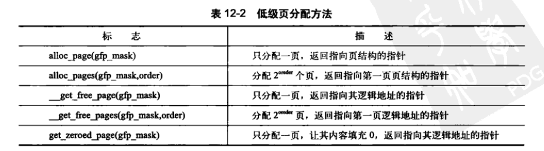
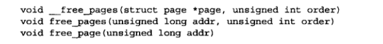
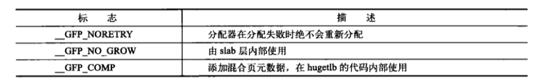

- S
- unix抽象了所有东西为文件，对数据和设备的操作接口统一。
- Unix内核和相关系统工具软件基于c语言编写，移植能力强。Unix的进程创建非常迅速。
- Unix提供一套非常简单且稳定的进程间通信元语。
**Linux内核和unix内核比较**：
Unix内核是一个不可分割的静态可执行库，必须以巨大，单独的可执行块的形式在一个单独的地址空间中运行。Linux和Unix基本都需要MMU的支持，现在基本所有硬件系统都具备内存管理单元。
**单内核与微内核比较**：
单内核即整个内核运行在单独一个地址空间，内核间的通信是微不足道的，可以直接调用内核所有函数，具有简单和性能高的优点，大多数unix系统为单内核模式。
微内核：不做为一个单独的大过程，微内核划分为多个独立过程，每个过程叫做服务器（CS架构）。不能直接调用函数，需要使用消息传递机制来处理内核通信：采用进程间通信机制来让各个服务器互通消息，互换“服务”。但是如果微内核的服务有些没有运行在内核，那么就需要额外的IPC开销，设计用户态和内核态的上下文切换，所以实际运用的微内核系统基本是让全部或大部分服务器位于内核。
==Linux也是单内核,但器规避了微内核设计的性能损失缺陷，所有的内核函数运行在内核态而无需消息传递。==
**Linux和Unix设计上的显著差异：**
- Linux支持动态加载内核模块。可在需要时动态的卸除/加载部分内核代码。
- Linux支持对称多处理SMP机制，传统UNIX基本不支持。
- Linux内核可以抢占，允许在内核运行的任务有优先执行的能力。
- Linux对线程的支持，（将进程和其他线程等同）
- Linux提供对设备类的面向对象的设备模型，热插拔事件，用户空间的设备文件系统。
- Linux忽略了unix的设计的很拙劣的特性
# 从内核出发
## **内核开发特点**：
- 不能使用c/c库/必须使用GNU c
- 内核编程缺乏用户空间那样的内存保护机制，难以执行浮点计算。
- 每个进程只有很小的定长堆栈。
- 内核支持异步中断，SMP，抢占。注意同步和并发。
- 考虑可移植性的重要性。
### **GNU** **C**：
内核开发者需要用到gcc提供的语言拓展部分。gcc是多种GNU编译器的集合。
- 内联函数：
消除函数调用和返回带来的开销，一般使用static关键字限制（其他编译单元不可见）。内联函数在头文件中直接定义。
- 内联汇编
即asm指令嵌入c中。
- 分支声明
gcc内建了一条指令likely和unlikely用于优化，当条件语句中，该条件很少出现，则使用unlikely标识，否则使用likely标识。

### 无内存保护机制和不要轻易使用浮点数
内核发生内存错误会导致oops，主要是没有错误反馈，不知道哪里发生错误。
用户空间浮点操作，内核完成从整数操作到浮点数操作模式的转换。==执行浮点指令时，体系结构不同，内核选择不同==但在内核空间，其不能完美支持浮点操作，在内核使用浮点数，需要人工保存和恢复浮点寄存器，还需要一些额外琐碎的事。
### 容积小且固定的栈
每个处理器的内核栈是固定的
### 同步和并发/可移植性
内核很容易产生竞争条件，要求能并发的返回共享数据。常见解决方法是自旋锁和信号量，内核也需要注意移植问题，大部分c代码应该和体系结构无关。
## 小结
请克服对内核陌生的恐惧，冲冲冲！！！！
# 第三章 进程管理
## 3.1 进程
进程：处于执行期的程序。
线程：在进程中的活动对象。
进程提供两种虚拟机制：虚拟处理器和虚拟内存。线程间可以共享虚拟内存，但每个都拥有各自的虚拟处理器。
fork()调用有两个返回，一个返回到父进程，父进程继续执行（pid=0）;另一个返回到子进程（pid>0）。现代Linux内核中，fork()由clone()系统调用来实现。程序通过exit()退出，父进程通过wait4()系统调用查看子进程是否终结。进程退出后设置为僵死状态， 直到父进程调用wait()/waitpid()为止。
## 3.2 进程描述符及任务结构
内核的进程列表存放于：任务队列（双向循环链表）。链表表项是task_struct,即进程描述符（包含一个进程所需所有信息）。任务队列形式：

### 分配进程描述符
每一个任务的thread_info结构存放在内核栈的尾端，其中的task域存放了指向改任的实际的task_struct指针。

### 进程描述符的存放
内核通过唯一进程标识值/PID来标识每个进程。PID默认值是32768;可根据实际需要修改/proc/sys/kernel/pid_max来提高上限。
内核里，对任务的处理通常需要获取task_struct的指针。所以如何快速获取进程描述符的位置非常重要。有些可直接用专门寄存器来存放这个task_struct的指针（速度快）。对于x86来说，其是在thread_info结构里，内核栈尾端。
### 进程状态
进程描述符的state字段描述当前进程状态，系统中进程必然处于以下5种状态的一种。
- 运行，即进程可执行：正在执行或者在执行队列等待执行。
- 可中断，进程正在睡眠：进程正在睡眠（阻塞），等待指定条件发生。
- 不可中断，进程接收到信号也不会被唤醒或者准备投入运行，其他与可中断态相同。通常在进程必须等待时不受干扰/等待事件快要出现。（所以ps查看进程，表标记为D状态的进程无法被杀死，其不响应任何信号）
- 被其他进程跟踪的程序，例如ptrace跟踪调试程序。
- 停止，即进程停止运行，通常在接收到SIGSTOP，SIGTSTP,SIGTTIN,SIGTTOU等信号时。

### 设置当前进程状态
内核设置某个进程状态：
```c
set_task_state(task,state);/*必要时设置内存屏障来强制其他处理器作重新排序(数据同步)*/
set_current_state(state)等价于set_task_state(task,state)
```
### 进程上下文
注意进程在用户空间和内核空间的上下文切换。 
### 进程家族树
所有进程都为PID为1的init进程的后代，系统中除init进程外都有父进程。task_struct的parent字段指向父进程的地址。还有children字段，指向子进程的链表。
init进程的进程描述符是作为init_task(进程家族树的根节点)静态分配的：
```c
struct task_struct* task;
for(task = current;task!=init_task;task=task->parent){  
}//访问到根节点即init进程描述符。
//任务列表的双向循环链表的结构可以通过简单方式遍历系统中的所有进程描述符。
```
## 进程创建
unix采用了进程创建拆解为：fork()和exec()函数的方式。fork()拷贝当前进程创建一个子进程。父/子进程的区别是:PID,PPID(这里子进程的PPID是父进程的PID)以及一些资源和统计量（挂起的信号等）。exec()函数读取可执行文件载入地址空间运行。
### 写时拷贝（COW）
linux的fork()采用写时拷贝页来实现。内核并不复制整个进程地址空间，父子进程共享同一个拷贝。只有在需要写入的时候，数据才会被复制，这样各个进程都有自己的拷贝。在之前都是以只读方式共享，这种技术使地址空间上的页的拷贝被推迟到实际发生写入的时候进行。所以这里fork()调用开销其实只有复制父进程的页表和给子进程创建唯一的进程描述符。
### fork()
fork()/vfork()/__clone()库函数需要根据各自的参数标志去调用clone()->do_fork()->copy_process()函数。
- 调用dump_task_struct()函数创建一个内核栈，thread_info结构，task_struct。和父进程完全相同。
- 检查新创建这个子进程后，系统进程数目没有超出限制。
- 子进程进程描述符内许多成员需要被清0或设为初始值。一些资源或者统计量为子进程自己的描述符成员。task_struct大多数数据依然未被修改。
- 子进程状态设置为TASK_UNINTERRUPTIBLE(不可中断的状态)，保证其不会运行。
- copy_process()调用copy_flag()更新task_struct的flags成员。PF_SUPERPRIV标志（超级用户权限）清零;PF_FORKNOEXEC标志被设置。
- 调用alloc_pid()为新进程分配一个有效的PID。
- 根据传递给clone()的参数标志，copy_process()拷贝或共享打开的文件，文件系统信息，信号处理函数，进程地址空间，命名空间等。一般情况下这些资源共享，其他资源如对每个进程不同则需要自己拷贝副本。
- copy_process()函数扫尾并返回一个指向子进程的指针。
回到do_fork()函数，新创建的子进程被唤醒并让其投入运行。内核倾向于让子进程先运行，以避免父进程先运行的写时拷贝的额外开销。
### vfork()函数
不拷贝父进程页表项，其他和fork()一样。子进程作为父进程的一个==单独的线程==在它的地址空间里运行，父进程被阻塞，直到子进程退出或执行exec()。vfork()函数流程：
- 调用copy_process()函数时，task_struct的vfork_done成员被设置为NULL。
- 执行do_fork()函数时，给定特别标志，则vfork_done指向一个特殊地址。
- 子进程开始执行后，父进程不是马上恢复执行，等待直到子进程通过vfork_done指针发送信号。
- 调用mm_release()函数时，该函数用于进程退出内存地址空间，并且检查vfork_done是否为空，不为空像父进程发送信号。回到do_fork()，父进程唤醒并返回。
### 线程在Linux的实现
Linux实现线程的机制特殊，没有准备额外的调度算法或者数据结构来标识线程。线程视作一个和其他进程共享某些资源的进程。每个线程都有自己的task_stuct(和其他子进程不同的是，线程和父进程共享某些资源，如地址空间)。
假设有一个包含四个线程的进程，对于专门的线程支持的系统，通常会有一个包含指向四个不同线程的指针的进程描述符（描述地址空间，打开文件等资源）。
Linux中则是创建4个进程并且分配4个普通的task_struct，建立这4个进程指定共享某些资源。
### 创建线程
调用clone()时传递一些参数标志指定需要共享的资源。其实和fork()差不多，但是父子两共享地址空间，文件系统资源，文件描述符和信号处理程序。
三种不同调用->调用clone()的参数变化：

如下图，fork(),vfork(),以及线程的创建，通过设置clone()函数的下面的不同的共享资源的标志或者不同的flag来完成不同形式的进程创建。


### 内核线程
内核进程（如flush,ksoftirqd）和普通线程一样可被调度或者抢占，只在内核空间运行。ps -ef查看Linux的内核线程。内核线程由其他内核线程创建，内核从kthreadd内核进程衍生所有内核线程。
kthread_create函数从内核线程创建一个新的内核线程；但是新创建的内核线程是不可运行状态；通过wake_up_process()函数来明确唤醒它。kthread_run函数等价于kthread_create函数+wake_up_process函数。内核线程启动后的退出：do_exit()函数/kthread_stop()函数（参数是kthread_create创建的task_struct），
## 进程终结
进程的终结大部分靠do_exit()来完成：
- task_struct标志成员设置为PF_EXITING，删除任一内核计数器，记账信息输出。
- exit_mm()函数释放进程占用mm_struct，如果该地址空间没被其他进程共享，彻底释放他们。
- 调用set__exit()函数。进程排队等候IPC信号，否则；离开队列。
- 调用exit_files()/exit_fs()函数，递减文件描述符/文件系统数据的引用计数。引用计数降为0，则资源可以彻底释放。
- 把task_struct函数的exit_code成员中的任务退出代码置为由exit()提供的退出代码/去完成其他内核机制规定的退出工作。
- 调用exit_notify()向父进程发送信号，给子进程重新找养父（为线程组其他线程或init进程），设置进程状态为EXIT_ZOMBIE.
- do_exit()函数调用schedule函数切换到新进程。do_exit函数不会返回。
进程相关联的资源被释放掉后，进程不可运行并处于EXIT_ZOMBIE退出状态；它只占用内核栈，thread_info结构以及task_struct结构。进程存在的唯一目的是向它的父进程提供信息。父进程收到信息/通知内核无关信息后，进程所持有的内存被释放，归还系统。
### 删除进程描述符
父进程获得已终结的子进程的信息后/通知内核它并不关注那些信息后，子进程的task_struct结构才被释放。wait()一族函数用来挂起调用它的进程，直到有一个子进程退出，此时函数会返回该子进程的PID。函数释放进程描述符时：
- 调用__exit_signal()函数，该函数调用_unhash_process(),后面又调用detach_pid()从pidhash上删除进程，以及任务列表删除进程。
- _exit_signal()函数释放目前僵死进程的所有剩余资源，进行最终统计和记录。
- 进程为线程组最后一个进程，领头进程已死掉。release_task()需要通知僵死的领头进程的父进程。
- release_task()需要调用put_task_struct()释放进程内核栈和thread_info结构所占页，释放task_struct占用的高速缓存。
### 孤儿进程造成的进退维谷
父进程在子进程退出前退出，需要保证子进程能找到一个新的父亲。前面提到在当前线程组重新寻找父亲/init进程作为父进程。
do_exit()->exit_notify()->forget_orignal_parent()->find_new_reaper():
首先遍历进程所在的线程组（即在同一个父进程下的进程组合），返回为其找到进程；如果线程组无其他进程则返回init进程作为养父进程。
ptrace_exit_finish()函数也有新的寻父过程，这次是给ptraced的子进程寻找父亲。
遍历两个链表：子进程链表和ptrace子进程链表。当一个进程被跟踪，其临时父亲为调试进程（==多线程调试，临时父亲都是同一个调试进程？==）。此时父进程退出了，系统会为它和它的所有兄弟重新找父进程。只需要在单独的被ptrace跟踪的子进程链表中搜索相关的兄弟进程，而无需遍历整个系统。系统进程找到或设置了新的父进程，就不会出现驻留僵死进程的危险了。
# 第4章 进程调度
调度程序负责决定将哪个进程投入运行，何时运行以及运行多长时间。
## 多任务
划分为非抢占式多任务和抢占式多任务。
抢占式：时间片。优先级等都属于此种类型。
非抢占式多任务环境，除了进程自己主动停止运行，否则一直运行。
现代os基本采用抢占式的方式。
## Linux进程调度
以前的为O(1)调度算法，也称作大O调度算法（对于服务器等工作负载很理想，但对需要交互的程序表现不佳）；然而在后面的内核版本中改为了完全公平调度算法，即CFS。
## 策略
策略决定调度程序染让什么进程运行以及负责优化使用处理器时间。
### cpu和IO消耗型的进程
大多数的GUI程序属于IO密集型程序；对于cpu密集型则是大量占用cpu的工作时间。针对这两种情况的调度策略也不一样。对于cpu密集型，调度策略应该是减少调度频率，增加每次调度的执行时间。对于IO密集型应该增加其响应速度，增加调度频率。==并不绝对，存在程序同时是IO也是CPU密集型，例如字处理器，需要疯狂IO以及处理这个字。==Linux和Unix对IO密集型程序做了很多优化，即缩短响应时间。
### 进程优先级
Linux采用两种不同的优先级范围：
- nice值（-20到+19，默认为0;现在扩大范围了），nice越高，优先级越低。nice值在Unix上代表分配给进程的时间片绝对值，在Linux上，nice值代表时间片的比例。ps -el 命令的NI列
- 实时优先级，可配置（默认0-99）。值越高优先级越高。==任何实时进程的优先级都高于普通的进程（实时可调度程序通常高于，实时不可调度程序（如中断等）不直接参与调度，优先级或更低）==
### 时间片
任何长时间片将导致系统交互性能差，故默认时间片很短。对于Linxu的CFS调度算法，其不直接分配时间片给进程，而是将处理器的使用比划分给进程（故和系统的负载密切相关）；此外进一步，nice值还将作为权重进一步再调整这个处理器的使用比。
对一个进程进入可运行态，Linux的CFS调度器，其抢占先机决定于消耗了多少处理器使用比；**如消耗的使用比比当前运行进程小**，则可以立即抢占运行。

### 调度策略的活动
对于系统中的文字编辑程序和视频编码程序。我们希望调度器能更倾向于文字编辑程序。所以文字编辑程序应该有更多的处理器时间，以及在文字编辑程序唤醒时抢占视频编码程序。目标达成通过分配文字编辑程序更高优先级设置以及更多的时间片。对于Linux程序，当系统中只有两个程序且nice值也一样；那么处理器使用比都为50%。
关键是：文本编辑程序被唤醒时，CFS注意到它的处理器使用比为50%，但其程序运行时间比视频编辑小得多，（相同的处理器使用比，运行时间很小也会抢占当前进程或者某些os能识别出其是实时应用程序也会立即替换掉它）所以CFS就立即抢占视频编码程序。因为文字编辑程序没有消耗完给它的处理器使用比（即分配给他的时间片），下次还是会立即调用该文字编辑程序。

## Linux调度算法
### 调度器类
linux调度器以模块方式提供，允许不同类型进程针对性的选择调度算法。每个调度器只能调度自己范畴的进程且拥有一个优先级。os会按照调度器优先级遍历调度器类，选择最高优先级的调度器类来选择执行程序。
CFS是针对普通进程的；而后面有针对实时进程的调度类。
### Unix中的进程调度
现代进程调度系统有两个通用概念：进程优先级和时间片。通常高优先级进程也会被分配更多的时间片且运行频繁。**引出问题，矛盾点：**
- nice值映射到时间片，这个设计有问题的，即将每一个值映射到绝对的时间片。针对同一优先级的的两个进程，具有相同的时间片如10ms，那么这里的进程上下文切换为10ms一次。但是对同一高优先级的进程，时间片都为100ms,这里的进程上下文切换却是100ms一次。另外高优先级进程通常是交互进程，特点是快速响应，低处理器时间。但这个和nice值和时间片挂钩相矛盾。
- 设计相对nice值。unix的nice值的改变基于初始值，如0对应100ms;1对应95ms;也可能18对应10ms,19对应5ms。这个nice值的改变前后成倍数差距。
- nice值到绝对时间片的映射；绝对时间片需要定时器节拍。定时器节拍的相邻节拍时间差距决定了nice值对应的相邻时间片的差距。
- 即便某些高优先级的进程的时间片用尽了，但是我们还想要唤醒相关进程。所以需要一些特殊规则，获得更多的处理器时间，这需要额外的规则，损害了其他进程利益。
总结：问题二可以修改将nice值的几何增加解决，问题三可以采用新度量机制将nice值和时间片分离。CFS采用摒弃时间片改用使用处理器使用比方式来保证公平性。
### 公平调度
CFS出发点：进程调度效果如同系统具备一个理想中的完美多任务处理器。CFS设置了一个调度周期的目标，称作==目标延迟==。当可运行任务趋于无限，每个任务获得的处理器使用比接近0（切换开销太大了）.所以会设置一个最小粒度，unix中基本设置为1ms。此外nice值越大，对应的处理使用时间比权重越小。任何进程获得的处理器时间是他自己和其他所有可运行进程nice值的相对插值决定的，相对的处理器使用时间的权重比。
## Linux调度实现
主要关注CFS调度算法的四部分：
时间记账，进程选择，调度器入口，睡眠以及唤醒。
### 时间记账
即记录进程的运行时间做个记账。
- 调度器作为一个实体结构保存在进程描述符task_struct中。
- vruntime变量存放进程虚拟运行时间。包括程序已运行时间和剩下所需时间。其值是经过可运行进程的总数进行了加权的运行时间。
### 进程选择
CFS选择下一个运行进程时，选择一个最小的vruntime值的进程（即最小的处理器使用时间比）。CFS使用红黑树来组织可运行进程队列，可快速找到最小的vruntime的进程。
- 可运行进程都用红黑树存储（基于二叉搜索树），键值为vruntime,那么只需找到最左边的叶子节点即为最小值（一般最左边叶子节点已缓存到rb_leftmost，方便快速返回对应的调用进程）。==系统无可运行任务，调用idle task(空闲任务，保证cpu不空闲)==
- 向树中加入新进程时，除了其在树的最左边叶子节点（需要将rb_leftmost重新指向新加节点），其他就是正常插入，并更新平衡。
- 向树中删除进程时，主要是删除节点后的重新平衡以及删除最左边节点时，重新寻找最左边节点更新rb_leftmost.
### 调度器入口
进程调度入口是函数schedule()。
首先找到最高优先级调度类->获取该调度类的可运行队列->决定谁是该运行的进程。
==加速小技巧，当所有可运行进程数量等于CFS类的可运行进程数（全部是普通进程），省略掉选调度器这一步==
### 睡眠和唤醒
进程休眠则移出可执行进程的红黑树，放入等待队列；唤醒则是从等待队列到可执行队列。等待队列上有可中断任务和不可中断任务（忽略信号）处于休眠态。
- 等待队列

如上图，1）首先调用宏创建一个等待队列的项，2）后面自己加入该队列（等待条件满足，执行唤醒操作）。3）prepare_to_wait变更进程状态（有必要则将进程加回到等待队列），4）状态为可中断，收到信号唤醒进程时，检查处理信号，再次确认为真退出while，否则继续schedule()并一直重复这一步操作等待信号。5）条件满足退出循环，最后移出等待队列。
- 唤醒
唤醒指定等待条件的等待队列的所有进程.
```c
static ssize_t inotify_read(struct file *file, char __user *buf,
			    size_t count, loff_t *pos)
{
	struct fsnotify_group *group;
	struct fsnotify_event *kevent;
	char __user *start;
	int ret;
	DEFINE_WAIT(wait);

	start = buf;
	group = file->private_data;

	while (1) {
		prepare_to_wait(&group->notification_waitq, &wait, TASK_INTERRUPTIBLE);

		mutex_lock(&group->notification_mutex);
		kevent = get_one_event(group, count);
		mutex_unlock(&group->notification_mutex);

		pr_debug("%s: group=%p kevent=%p\n", __func__, group, kevent);

		if (kevent) {
			ret = PTR_ERR(kevent);
			if (IS_ERR(kevent))
				break;
			ret = copy_event_to_user(group, kevent, buf);
			fsnotify_put_event(kevent);
			if (ret < 0)
				break;
			buf += ret;
			count -= ret;
			continue;
		}

		ret = -EAGAIN;
		if (file->f_flags & O_NONBLOCK)
			break;
		ret = -EINTR;
		if (signal_pending(current))
			break;

		if (start != buf)
			break;

		schedule();
	}

	finish_wait(&group->notification_waitq, &wait);
	if (start != buf && ret != -EFAULT)
		ret = buf - start;
	return ret;
}
```
## 抢占和上下文切换
由context_switch()函数来处理，有新进程选出来运行时，调用该函数：
- 虚拟内存从上一个进程映射切换到新进程
- 将上一个进程的处理器状态切换到新进程处理器状态（保存/恢复栈信息/寄存器信息）.其他与任何体系结构相关的状态信息，以每个进程为对象来管理保存。

除了以代码形式来提醒调用schedule()，内核设置了need_resched标志是否需要重新执行一次调度。可用于高优先级进程进入可执行态（即当前进程应该被抢占时），都设置该标志。
==在返回用户空间以及从中断返回的时候，内核也会检查need_resched标志，决定是否重新调度==。通常进程描述符里存储有need_resched，目的是快速获取该值。
### 用户抢占
内核返回用户空间时，即在系统调用/中断程序返回后，需要检查need_resched标志。
用户抢占发生时机：
- 从系统调用返回用户空间
- 从中断处理程序返回用户空间
### 内核抢占
支持在内核中运行的进程被抢占，为此引出了可抢占内核任务和不可抢占的任务。引入变量preempt_count.任务引入锁，计数加一；相反，计数减一。当该值为0，则是可抢占的，因为不占用锁；不为0，则当前任务不可抢占。preempt_count=0时，进程释放锁的代码检查need_resched是否设置，是则内核将被调度程序抢占。
内核进程阻塞或者显示调用schedule()函数，内核抢占显式的发生。
内核抢占发生时机：
- 中断处理程序正在执行，返回内核空间前。（==这意味着中断可以被中断，即中断嵌套==）
- 内核代码具有可抢占性，preempt_count=0
- 内核任务显式调用schedule()
- 内核任务阻塞
## 实时调度策略
Linux提供:SCHED_FIFO，SCHED_RR两种实时调度策略。SCHED_FIFO实现了一种简单，先入先出的调度算法。其比任何处于SCHED_NORMAL的进程优先级高。处于SCHED_FIFO的进程没有基于时间片，其只能自己阻塞。显式释放处理器或有更高的SCHED_FIFO或者SCHED_RR优先级进程；其才会让出CPU。SCHED_RR处理是基于时间片的外，其他和SCHED_FIFO差不多。
Linxu的实时性是软实时，只是尽量保证在时间内完成该任务，不保证一定完成。
实时优先级范围为[0,MAX_RT_PRIO(默认值为100)),SCHED_NORMAL默认进程的nice值共享这个取值空间。-20到+19对应100到139实时优先级范围
## 与调度相关的系统调用(编写为c库，可直接调用)

### 与调度策略和优先级相关的系统调用
nice()函数在给定进程的静态优先级增加一个给定量。超级用户才能在调用它时使用负值来提高进程的优先级。
### 与处理器绑定有关的系统调用
linux调度提供强制的处理器绑定机制，通过task_struct的cpus_allowed这个位掩码标志，掩码每一位对应一个系统的可用处理器。
实现强制处理器绑定的方法，处理进行第一次创建时，继承父进程的相关掩码。故父子进程都运行在相应cpu上；处理器绑定关系改变，内核将任务推到合法处理器上，加载平衡器则把任务拉到允许的处理器上。
### 放弃处理器时间
linux通过sched_yield()系统调用，可让进程显式的将处理器时间让给其他等待执行进程的机制。普通进程时将进程从活动队列放到过期队列(暂时不会被调度);并将其放在优先级队列最后面。对于实时进程，其只会放在优先级队列的末尾。
# 第五章 系统调用
## 与内核通信
系统调用在用户空间进程和设备间的一个中间层。负责用户进程和内核间的通信。
## API，POSIX和c库
应用程序通过调用c库来使用系统调用一般。而c库中的API一般是基于POSIX标准。
==底层的设计可以参考unix的接口设计名言->**提供机制而不是策略**==
## 系统调用
对于getpid()系统调用，内核实现：

```c
asmlinkage long sys_getpid(void)
//上述系统调用到内核实现后，其展开是上面这个函数
//samlinkage是限定词，即仅从栈中提取函数参数，所有系统调用展开后都需要该限定词。
```
### 系统调用号
系统调用号一经分配就不会变更。当一个系统调用被删除时，其所占用的系统调用号也不能删除。这里linux有另一个系统调用sys_ni_syscall()，除了返回-ENOSYS外其他不做操作。其针对删除的系统调用，填补其空缺。内核具有一个系统调用表。存储系统调用号和系统调用的对应关系。
### 系统调用性能
linux上下文切换时间断是linux执行效率高的重要原因。
## 系统调用处理程序
通过软终端int $0x80陷入内核。系统调用号通过eax寄存器传递给内核。sys_call()函数检查系统调用号有效性，是否大于等于NR_syscalls。
系统调用函数参数传递，ebx,ecx,edx,esi,edi来顺序存储五个参数。返回值存放在eax寄存器中。
## 系统调用实现
确定用途->尽量单一用途->参数尽量少,即简洁高效->考虑通用性，不对函数作不必要限制->考虑系统调用的可移植性和健壮性。
### 参数验证
系统调用需要检查所有参数看是否合法。最重要的是检查用户提供指针的有效性。即保证：
- 指针指向内存属于用户空间。
- 指针指向地址在进程地址空间，进程绝不能让内核读其他进程数据。
- 读/写/可执行，内存需对指针标记这些访问限制。
如下图所示：

copy_to_user()和copy_from_user();为内核向用户空间地址写入数据以及从用户空间数据拷贝到内核这两个系统调用。第一个参数为拷贝目标地址，第二个参数为源地址，第三个为拷贝数据量。
对每个系统调用函数，在允许该系统调用前，需要检查进程是否有使用该系统调用的权力。
如capable(CAP_SYS_NICE)/capable(CAP_SYS_REBOOT)用于检查该进程是否有修改其他进程nice值和reboot的权限。
## 系统调用上下文
current指针指向当前进程的上下文，由于进程是可以被抢占的，为了防止新进程调用上个进程的相同的系统调用不出错，必须保证系统调用是可重入的。
### 绑定一个系统调用的最后步骤
- 系统调用表最后加入表项，下表为其系统调用号。
- 各种体系结构，系统调用号定义于<asm/unistd.h>中
- 系统调用不能是模块，只能编译进内核
将该系统调用加入到<asm/unistd.h>中，有新的系统调用编号。然后将实现的源文件放到kernel目录下，保证其被编译进内核。这样用户空间就可以调用该系统调用。

### 用户空间访问系统调用

如上图所示，宏定义扩展成内嵌汇编的函数，不用库来支持。后面的_syscall0(long,foo)，主要是压入参数到栈中，方便系统调用允许。用户程序可直接使用系统调用函数名来达到自己的功能。
### 为什么不通过系统调用方式实现
尽量不新建系统系统调用实现功能，而应该想其他解决方法。
新建系统调用好处：
- 系统调用创建容易且使用方便。
- linux系统调用性能高。
坏处：
- 需要一个开放的系统调用号，系统调用加入就固化了，避免app崩溃，接口不允许改动。
- 系统调用分别注册到需要的支持的体系结构中去，脚本不容易调用系统调用，也不能文件系统直接使用
- 需要系统调用号，在内核树外很难维护。
**原则是linux系统尽量避免添加新的系统调用，而是复用已有系统调用**
# 第6章 内核数据结构
内核通用数据结构:
## 链表
链表是linux内核中最简单的数据结结构。
双向链表
### 环形链表
环形双向链表是最灵活的，所以linux内核的标准链表是环形双向链表（）。
一般首元素为头指针，方便寻找链表起始端。
### linux内核中的实现
- 链表数据结构
```c
struct list_head{
	struct list_head *prev;
	struct liast_head *next;
};
struct fox{
	unsigned long tail_length;
	unsigned long weight;
	bool is_fantastic;
	struct list_head list;
}
//可以用list.prev/list.next访问前后元素。提供list_entry()内置函数来增删改查。
```
- 定义一个链表
运行时创建和静态创建：

- 链表头
```c
static LIST_HEAD(fox_list);//定义并初始化一个链表例程。
```
### 操作链表
- 向链表增加一个节点
list_add(struct list_head *new,struct list_head *head);
将new节点数据添加到head后。head为最后一个元素，则可实现栈。head为第一个元素，则实现为队列。
- 删除节点
list_del(struct list_head *entry);
删除该节点并改变其前后节点。
另外：从链表中删除节点数据并且保留：
list_del_init();
list_del_init(struct list_head *entry);
把节点从一个链表移到另一个链表
- 移动和合并链表节点
list_move(struct list_head *list,struct list_head *head) 
从一个链表中移除list，将其加入到另一链表的head节点后面
list_move_tail(struct list_head *list,struct list_head *head)
将list项插入到head前。
list_splice(struct list_head *list,struct list_head *head);
将list指向的链表插入到指定链表的head元素后面。
list_splice_init(struct list_head *list,struct list_head *head)
list指向的链表重新初始化，其他和list_splice一样。
节约两次提领：
已经得到了节点的前后指针。只需要调用内核相应的加双下划线的同名函数即可。
这里就是节约了获取两个变量的时间，即节约两次提领。
### 遍历链表
```c
//遍历链表用法
struct list_head *p;
struct fox *f;
list_for_each(p,&fox_list){
	f=list_entry(p,struct fox,list);
}
//其他封装的函数
list_for_each_entry(f,&fox_list,list){//从f开始沿next开始遍历
}
//反向遍历
list_for_each_entry_reverse(f,&fox_list,list){//从f开始沿prev遍历
}
//遍历且删除
list_for_each_entry_safe(pos,next，head，member){
}
list_for_each_entry_safe_reverse(pos,next，head，member){
}
```
## 队列
### kfifo
kfifo对象维护了：入口偏移和出口偏移两个变量。入队从入口偏移处入队；出队从出口偏移处出队。==出口偏移总小于等于入口偏移，入口偏移最大为队列长度，此时队列满==
### 创建队列
即对kfifo对象进行定义和初始化。
数据入队：
unsigned int kfifo_ in(struct kfifo *fifo, const void *from，unsigned int len) ;
数据出队：
unsigned int kfifo_ _out (struct kfifo *ifo, void *to， unsigned int len);
希望数据出队而出口偏移不增加：
unsigned int kfifo_out_peek(struct kfifo *fifo， void *to，unsigned int len,unsigned offset);
其他还可获取kfifo队列长度，重置队列（数据清空）以及撤销队列（kfifio_free()操作释放kfifo_alloc()分配的队列）
## 映射
关联数组，键值组成，每个键关联一个特定值。
c++中的std::map便是采用自平衡二叉搜索树（红黑树，AVL树等）
linux内核的映射目标：映射一个唯一的标识数（UID）到一个指针。这个映射叫做idr。
- 首先分配一个唯一的uid，保证uid不被重用，而且将指针和这个uid关联起来。
- 查找uid即idr_find();删除uid，撤销idr（只释放idr未使用内存，不释放分配给uid的任何内存）
## 二叉树
### BST二叉搜索树
### 自平衡二叉搜索树
即所有叶子节点深度差不超过1.
#### 红黑树
linux主要的平衡二叉树数据结构是红黑树。
- 节点或红或黑；叶子节点为黑色且没有数据
- 所有非叶子节点有两个子节点，一个节点红色，子节点必为黑色，一个节点到叶子节点的路径中，包含同样数目的黑色节点，该路径相对其他路径最短（即所谓的黑高度相同）。
==红黑树如何保证最深的叶子节点的深度不会大于两倍的最浅叶子节点的深度，红黑树的插入和删除操作==
证明：路径最短是全是黑色节点的路径高度，即最浅叶子节点深度为h。而由于最深是红黑交替（不能为红连续），所以最多为2h得证。
#### rbtree
即linux实现的红黑树，保证了平衡性，插入效率和节点数目呈对数关系。
一般来说搜索和插入由用户来实现。
## 数据结构的选择
链表：遍历操作，存储较少数据，性能不优先，和内核其他链表交互。数据量不定选链表。
队列：生产者/消费者模式，定长缓冲选队列。
映射：处理发给用户空间的描述符，需要映射一个uid到一个对象。
红黑树：存储大量数据，检索迅速。
**请优先考虑内核以及实现的数据结构，实在没退路再自主设计**
## 算法复杂度
**时刻注意算法的负载和典型的输入集合大小关系**，**不要为了不需要支持的伸缩度需求而盲目优化算法**。
# 第7章 中断和中断处理
## 中断
涉及中断信号->中断控制器（和处理器相连接管线与处理器通信）->中断请求线（IRQ）对应着不同的中断值。
中断可以是动态分配的，**重点是特定中断和特定设备联系**。
异常：缺页异常，除0异常等。
## 中断处理程序
保证中断处理程序的快速执行，尽可能快恢复中断代码执行；同时还需要完成该完成的工作（例如网络收报，字符响应等）。
于是中断分为上下两个半部。
禁中断的情况下，处理中断上半部（中断应答，硬件复位）.（例如网络上半部需要将数据从网卡发给内存）
开中断情况下，在合适的机会，下半部会执行。（网络下半部则是处理这个数据）
## 注册中断处理程序

irq：分配的中断号。传统PC设备，这个值固定，大多数设备靠探测或编程动态确定。（中断控制器收到中断信号，根据传统或动态的方式确定中断号，将中断信号通过和处理器相连接的引脚发送，处理器解析信号得到对应中断号->中断向量表，往后走）
handler：指针，指向实际的中断处理程序。
flags：中断处理程序标志
- IRQF_DISABLED，内核在处理中断处理程序期间，禁止所有的其他中断。
- IRQF_SAMPLE_RANDOM,将其作为内核熵池一员，确保设备工作时间不确定或不受攻击。
- IRQF_TIMER,系统定时器中断准备。
- IRQF_SHARED,多个中断处理程序之间共享中断线，同一irq线注册的每个处理程序需要指定这个标志。
name:与中断相关的设备的ASCALL码的文本表示，PC机上键盘中断就对应"keyboard"。
dev:用于共享中断线，这个参数用于辅助内核直到给定中断线上应该删除哪个处理程序。实践中往往传递驱动程序的设备结构（唯一）。
注意request_irq()会引起阻塞，不能放在不被允许阻塞的代码中。本质上是因为在注册过程中，内核需在/proc/irq文件中创建对应项，最终需要通过kmalloc()来请求分配内存。kmalloc()是可以睡眠的。
以下是一个中断注册的实例：

**释放中断处理程序：**
在卸载驱动程序时，也要删除对应的中断处理程序。
void free_irq(unsigned int irq,void *dev)
指定中断线不共享，删除处理程序同时禁用这条中断线。共享的则是仅删除dev对应的处理程序。
## 编写中断处理程序

如上中断处理程序必须与request_irq()中handler所要求参数类型相匹配。dev参数对应着唯一的设备，可区分来自同一中断处理程序的多个设备。大多数中断处理程序需要知道产生中断的设备
重入和中断处理程序，**linux中的中断处理程序是不需要重入的**。因为当中断处理程序执行时，相应的中断线会被屏蔽掉，所以不会再响应该中断线的中断，所以无需涉及中断处理程序是可重入的。
### 共享的中断处理程序
共享和非共享的中断处理程序的差异性：
- request_irq()参数flags必须设置IRQF_SHARED标志。
- 共享中断处理程序的dev不能传递NULL值，通常选择设备结构传递。
- 共享中断处理程序需要能区分他的设备是否发生中断，需要硬件支持和处理程序相关逻辑实现。
所有共享中断处理程序应该遵循上面三条。
内核收到一个中断，依次调用该irq上注册的每个处理程序。中断处理程序需要通过硬件设备提供的状态寄存器（其他机制）检测是否该为此次中断负责。
## 中断上下文
中断上下文是不允许被睡眠（中断上下文里不能放入阻塞代码），顶多只是中断嵌套，当前中断上下文处于运行队列排队，而不是被阻塞掉。正是中断处理程序打断了代码执行的特点，它必须是迅速的，简洁的。需要将大量具体工作从中断处理程序中分离出来，放到下半部去执行。下半部会找一个更合适的时间执行。
中断处理程序可以拥有自己的栈，虽然比较小，但是是自己拥有的，而不是以前的去和被中断进程的内核栈来共享。
## 中断处理机制实现
对每条中断线，处理器跳到对应的唯一的位置（irq和dev确定）。计算出中断号后，进行中断应答后，就会禁用这条线的中断。该条中断线上的每一个潜在的中断处理程序都要运行，不共享则只执行一次，否则循环依次执行潜在处理程序，找到和dev对应的中断处理程序执行。找到对应的中断处理程序执行完成后，再执行ret_from_intr()返回。如返回用户空间，检测need_resched标志。是否需要被重新schedule()。如返回内核空间，只在preempt_count为0（没有锁）时，再调用schedule()。
## /proc/interrupts
procfs是一个虚拟文件系统，只存在于内核内存。我们常cat /proc/...下的文件，来查看内核内存的现状，从而分析。
## 中断控制
控制中断系统的原因是需要提供同步，通过禁止中断，可确保某个中断处理程序不会抢占当前的代码。而锁机制通常是为了防止SMP机制导致的其他处理器的并发访问。获取锁的同时伴随着禁止本地中断。（**这里我的看法是为了让该进程获取锁后不被中断，防止其他等待锁的进程过多等待**）
### 禁止和激活中断
禁止当前处理器的本地中断，即：
```c
local_irq_disable();
local_irq_enable();
```
问题：在调用local_irq_disable()之前已经禁止了中断，该例程带来危险性。同理对local_irq_enable()也一样。于是我们可以采用保存中断状态的办法。
```c
unsigned long flags;
local_irq_save(flags);
...
local_irq_restore(flags);
//flags包含中断系统状态，包括栈帧信息，flags不能传递给另一个函数，所以只能在同一函数中使用这两个函数。
```
### 禁止指定中断线

如上图四个函数用于禁止指定的中断线。
disable_irq()需要所有的中断处理程序全部退出后才能返回。disable_irq_nosunc()则必须要等待。enable_irq()和前面两个函数对应，用于激活中断线。synchronize_irq()等待一个特定的中断处理程序的退出，只在该函数退出后才返回。
### 中断系统的状态
获取内核中断系统的状态，是否处于中断？

# 第8章 下半部和推后执行的工作
整个中断流程分为两半：第一部分是中断处理程序（需要快速，异步，简单的·机制负责对硬件做出迅速响应）。第二部分是下半部。
## 下半部
上下半部如何划分工作：
- 任务对时间敏感->放在中断处理程序执行。
- 任务和硬件相关->放在中断处理程序执行。
- 任务保证不被其他中断（特别是相同中断）打断，放在中断处理程序。
- 其他任务则是放在下半部。
### 为什么下半部？
一些中断处理程序可能有IRQF_DIASABLE标志，禁用所有中断，最差也会禁用同级中断。这样需要中断处理程序快速完成->将一些工作分离出来到以后去做，即下半部的工作。==运行下半部时，允许响应所有的中断==
内核提供三种下半部实现机制：**软中断，tasklet，工作队列**。此外还有内核定时器机制（保证操作推迟到某确定时间段执行）
## 软中断
### 软中断实现
软中断在编译时静态分配，有一个软中断的数组，包含32项，每个软中断需要注册到该数组中。即static struct softirq action softirq _vec[NR_ SOFTIRQS];网络的软中断注册就用到了。
一个软中断不会抢占另一个软中断。只有中断处理程序可以抢占软中断。
执行软中断：注册的软中断只有在被标记后才能执行即触发软中断。
- 从硬件中断代码处返回时，如网卡硬中断。
- 在ksoftirq内核线程中，显式检查/执行待处理的软中断代码中。
软中断处理核心：

- pending是32位位图，对应对应的softirq_vec。待处理的软中断位图被保存，实际的软中断位图清0（这里需要屏蔽中断，避免在清0间隙，新的软中断导致该软中断被清0）
- pending依次右移，逐步处理对应位为1的softirq_vec中的对应的软中断处理函数。
### 使用软中断
只有两个子系统网络和SCSI直接使用软中断，因为对时间要求严格以及下半部重要性。内核定时器和tasklet建立在软中断基础上。
- 分配索引，在下面的枚举类型中加入新的项

- 注册处理程序，open_softirq()注册软中断处理程序。软中断护理程序执行时，当前处理器的软中断被禁止，其他处理器可执行别的软中断（相同的也可）。以为这软中断处理程序的共享数据需要严格的锁保护，**所以大部分的软中断处理程序都采取单处理器数据（即不是多处理器共享数据，无需加锁）来提升性能**。
如果不需要多处理器扩展性，请使用tasklet，它同个处理程序的多个实例不能在多个处理器同时允许。
- 触发软中断，raise_softirq(NET_TX_SOFTIRQ),可在下次调用do_softirq()函数时投入运行。
## tasklet
通常使用tasklet而不是软中断。
### tasklet的实现
两类软中断代表：HI_SOFTIRQ>TASKLET_SOFTIRQ.
- tasklet结构体

如上图，state在0，run，sched三者间取值，表示tasklet是被调度还是运行。count为计数器，不为0则tasklet禁止否则tasklet被激活，等待被挂起执行。func是tasklet的处理程序，data为其唯一参数。
- 调度tasklet
已调度的taasklet存放在两个单处理器数据结构：tasklet_vec(普通的tasklet)/tasklet_hi_vec（高优先级的tasklet）.两个数据结构都是由tasklet_struct结构体构成的链表。
由tasklet_schedule()和tasklet_hi_schedule()（高优先级，即HI_SOFTIRQ）进行调度.
tasklet_schedule()的执行步骤：
- 检查tasklet的state，为sched则立即返回，因为已经调度过了。
- 调用_tasklet_schedule(),保存中断状态，禁止本地中断。
- 把需调度的tasklet放到链表（tasklet_vec,tasklet_hi_vec）中去.
- 唤醒HI_SOFTIRQ/TASKLET_SOFTIRQ软终端，下次调用do_softirq()则执行该tasklet。

tasklet_action()和tasklet_hi_action()做了什么？
- 禁止中断，检索两个链表
- 把当前处理器的该链表置为NULL，来清空。
- 允许响应中断，循环遍历链表上每一个待处理的tasklet
- 多处理器系统，检查tasklet_state_run标志来判断这个tasklet是否在其他处理器运行，是的话现在不能执行，找下一个tasklet。
- 检查count是否为0，不为0，则禁止跳到下一个。否则开始执行，设置state为run，tasklet运行完，清除state的run标志。
- 重复执行tasklet，知道没有剩余的。
### 使用tasklet
- 可静态/动态的创建一个tasklet

上面两个宏用于静态创建一个tasklet_struct结构。区别在于引用计数初始值不同，第一个为0，已激活的tasklet，第二个为1，为禁止的tasklet。
下面是动态创建：

- 编写自己的tasklet的处理程序
tasklet的处理程序靠软中断实现，不允许睡眠（本身就是要处理程序尽快处理完成，如果允许等待事件而阻塞，这将大大延长其处理时间，和初衷相违背）。
- 调度自己的tasklet
调用tasklet_schedule()函数传递相应的tasklet_struct指针。**在tasklet被调度但未运行，又被调度，只运行一次。否则，已经运行则是会被再次调度运行。**如下图：

可以禁止某个tasklet，也可以激活某个tasklet。
- ksoftirqd
每个处理器会有一个协助处理软中断的内核线程。对于重新触发的软中断，是立即处理还是先完成此次处理（用户任务可能得不到执行），下一次软中断执行再一起处理（软中断得不到即时处理）。折中方案：==不立即处理重新触发的软中断；大量软中断出现时，内核唤醒一组内核线程来进行处理（最低优先级运行）==。每个处理器一个ksoftirqd内核线程，只要有待处理的软中断，ksoftirq调用do_softirq()进行处理。
## 工作队列
推后执行的任务需要睡眠，选择工作队列，否则选择tasklet/软中断。
### 工作队列的实现
工作队列子系统创建内核线程，创建的线程可用于执行内核其他部分排到队列的任务。工作队列子系统提供缺省的工作者线程（events/n，n为处理器编号）来处理需要推后的工作。对于cpu密集型或者性能要求高的推后任务，可以自己创建工作者线程来进行处理。
- 工作者线程表示：
  
  每个工作者线程类型分配了一个cpu_workqueue_struct，即每个处理器都有一个这样的工作者类型的线程。

- 表示工作的数据结构
  
  每个处理器每种类型的这个工作的数据结构连成一个链表，对应的工作者类型的线程被唤醒时，处理各个处理器上的对应类型的工作链表，处理完一个work_struct后就将其移除链表。
  工作者线程要执行的work_thread()函数：
  
  run_workqueue()函数会将循环遍历链表上每个待处理的工作，调用work_struct的func函数。

- 工作队列实现机制总结

如上图，一类工作类型workqueue_struct，包含了一个cpu_workqueue_struct;即每个处理器都有自己的工作者线程。在底层是不同工作类型组成的多个work_struct链表，对应的工作线程遍历该处理器对应的work_struct来完成对应的延迟工作。
### 使用工作队列
- 创建推后工作，即work_struct


静态/动态创建延迟的工作
- 工作队列处理函数
处理函数会由工作者线程执行，运行在进程的上下文中
- 对工作进行调度，schedule_work(&work)会立即调度work，当所在处理器上的工作者线程被唤醒，就会执行work的func。
- 刷新操作，有时在继续下一步工作前，需保证一些操作已经执行完毕。使用void flush_scheduled_work(void),函数等待直到工作队列的所有对象执行返回。
- 创建新的工作队列，

如上创建一个新的工作队列和与之对应的处理器线程。（各个处理器的同类型的工作者线程去全局该类型的工作队列获取对应的任务）
## 下半部机制的选择
需要反应迅速，执行频率高的应用选择软中断。
需要同类型中断多处理器只能运行一个tasklet，选择tasklet。
延迟的任务需要阻塞或者处于进程上下文中，那么选择工作队列。
易用性而言：工作队列>tasklet>软中断

## 在下半部之间加锁
由于tasklet的保证同类型的tasklet不允许在不同处理器或同处理器同时执行，故无需加锁。
进程上下文和一个下半部共享数据，访问数据前需要禁止下半部的处理并获得锁的使用权，为了本地和SMP的保护，防止死锁出现。
中断上下文和一个下半部共享数据，访问数据前需要禁止中断的处理并获得锁的使用权，为了本地和SMP的保护，防止死锁出现。
如上是否因为下半部的处理是可以分离开来的，所以存在同时进行的状况，导致对共享数据的互斥访问。
## 禁止下半部（即进程上下文和下半部对共享数据的处理，需要禁止下半部）

可以嵌套使用，只有最后调用的local_bh_enable会重新激活下半部。local_bh_enable需要检查是否有挂起的下半部需要执行。disable和enable可以通过preempt_count计数器来为每个进程计数，只有当preempt_count为0时才会被处理。


# 第9章 内核同步介绍
在smp时代，内核的对共享资源的并发和同步问题很多。在单处理器时代，只需要在中断或者进程需要重新调度时，才可能触发竞争共享资源的情况。
## 临界区和竞争条件
临界区即访问和操作共享数据的代码段。==将临界区看出一个原子操作==。避免并发和防止竞争条件称为同步
### 为什么我们需要保护/单个变量
保证代码操作的完整性，即原子性。
对单个变量的原子操作可保证单个变量的结果正确性。
## 加锁
锁的使用是编程者自愿的，锁的实现是原子操作实现的，类似上面的单个变量，不存在竞争条件。其主要使用compare，exchange的类似指令实现。
造成并发执行的原因：
- 中断，中断几乎可以在任何时刻异步发生，就可能随时打断当前正在执行的代码。
- 软中断和tasklet，这也能打断当前执行代码，引起竞争条件。
- 内核抢占，内核抢占性，可被其他任务抢占。
- 睡眠和用户空间同步，内核执行进程睡眠，唤醒调度程序。
- smp，多处理器同时执行代码。
==难点不是在加锁，而是发现真正需要共享的数据和相应的临界区，这才是有挑战的地方==
**记住给数据而不是代码进行加锁，大多数的内核数据结构都需要加锁**
linux可进行裁剪，根据需要编译，如config_smp和config_preempt一个配置支持smp，一个支持内核抢占，这两个配置不同，所需要编译的锁也不同。
在编译内核代码，**需要问自己下面的问题**：
- 数据是否全局，当前线程外，其他能否访问。
- 数据会在进程上下文/中断上下文；两个中断处理程序共享？
- 进程访问数据可被抢占？调度新程序会访问同一数据？
- 进程会阻塞在某些资源上？使共享数据处于何种状态，防止数据失控？
- 函数被另一个处理器调度会发生什么，确保代码远离并发威胁？
## 死锁
避免死锁的有效方法：
- 按顺序加锁，使用嵌套锁时，每个进程以相同顺序获取锁
- 防止发生饥饿，最好不要一直等待
- 不能重复请求同一个锁
- 加锁设计力求简单
尽管释放锁和死锁顺序无关，但最好还是按照加锁的相反顺序来释放锁。
## 争用和扩展性
锁的争用即锁在被占用时，有其他线程试图获得该锁。即有多个进程在等待获取该锁（被高度争用，即频繁持有或者长时间持有就会很糟糕）。
扩展性：即锁的精细程度，在smp多处理器上，精细的锁可以提升性能，但是一味的精细加锁，有时并不能提升性能，甚至可能成为性能的瓶颈。
在锁争用很明显时，锁如果设置的很粗粒度，则很容易造成性能下降。在锁争用不明显时，锁设置的很细，则会增加系统开销。
==初期加锁应该力求简单，仅当需要时再进一步细化加锁方案==

# 第10章 内核同步方法
## 原子操作
内核提供两组原子操作接口，一组针对整数进行操作，另一组针对单独的位进行操作。在linux支持的所有体系结构上都实现了这两组接口。
### 原子整数操作
针对整数的原子操作只对atomic_t类型的数据进行处理。确保原子函数只接受atomic_t类型的数据。
typedef struct{
	volatile int counter;
}atomic_t;

如上图全是对一个atomic_t变量的操作，需包含头文件<asm/atomic.h>最后返回的是一个int的变量。另外atomic_t类型变量可以确保编译器不对这些变量进行优化，例如调换位置优化，以及别名优化等。
原子操作函数通常是内联函数，通过内嵌指令来实现。
原子性和顺序性比较：
原子性只是保证在读或者写的时候不被打断，而不保证读后写/写后读这种顺序性。原子操作可以保证原子性，但是并不保证顺序性。顺序性主要通过屏障指令（barrier）来实施。在编写代码时，尽量先使用原子操作而不是复杂的加锁机制。
**64位的原子操作：**
```c
typedef struct{
	volatile long counter;//使用长整型，long，8字节64位
} atomic64_t;
```

上图是所示的64位原子整型的操作。
**原子位操作：**（可用于内存对齐，标志位和状态对齐，数据压缩等）
内核提供对==位==这一级操作的函数，定义在文件<asm/bitops.h>中
位操作函数是对普通的内存地址进行操作的。原子位操作是对普通指针进行操作，所以不像原子整型对应atomic_t，没有特殊的数据类型。

以上是对指针的原子位操作的函数。提供非原子操作函数。在原子位操作函数前面加入下划线__，就可以变为非原子位操作函数。
==如果代码已经设置了锁或者其他同步方法，避免了竞争，可以使用非原子位操作函数，如果没有避免竞争操作，则可以使用原子位操作函数来保证同步==
## 自旋锁
原子操作只能保证对变量的操作是原子的，即某一操作不会被中断，但是不保证读写等顺序，而很多时候需要保证读写顺序，故需要锁来提供同步机制。
==自旋锁最多只能被一个可执行线程持有。由于其循环等待的特点，自旋锁不应该被长时间持有，持有自旋锁的时间最好小于完成两次上下文切换的时间==。区别于信号量，线程得不到信号量，是直接会睡眠，而不是自旋锁的循环等待。
### 自旋锁方法
```c
//自旋锁的使用
DEFINE_SPINLOCK(mr_lock);
spin_lock(&mr_lock);
/*
临界区
*/
spin_unlock(&mr_lock);
//在单处理器上，编译时不会加入自旋锁。如果禁止内核抢占，编译时自旋锁会被完全剔除内核。
```
==linux内核的自旋锁是不可递归的，即一个线程不能两次或多次连续获取该锁，而应该获取，释放，获取，释放这样的流程==
自旋锁可用在中断处理程序中，因为其不会导致睡眠，但是在获得锁之前，需禁止本地中断，防止新的中断处理程序可能会争用这个自旋锁导致死锁。
```c
//内核提供在获取锁的同时，保存当前中断状态，禁止中断，以及在释放锁的同时，恢复中断到加锁前的状态
DEFINE_SPINLOCK(mr_lock);
unsigned long flags;
spin_lock_irqsave(&mr_lock,flags);
/*
临界区
*/
spin_unlock_irqrestore(&mr_lock,flags);

//如果已确定在加锁前，中断状态为激活状态，则不需要解锁恢复中断以前的状态
DEFINE_SPINLOCK(mr_lock);
spin_lock_irq(&mr_lock);
/*
临界区
*/
spin_unlock_irq(&mr_lock);
//不推荐使用
```
锁是对数据加锁，而不是对代码进行加锁。
**自选锁的调试**：
配置选项CONFIG_DEBUG_SPINLOCK,内核检查是否使用未初始化的锁，是否在没加锁前就执行开锁操作。需要全程调试锁，加上CONFIG_DEBUG_LOCK_ALLOC选项。
### 其他针对自选锁的操作

如上图，展示了对自旋锁的操作。
### 自选锁和下半部
==这里有一个比较重要的点是，如中断处理程序和下半部，下半部可能会被中断程序抢占，所以下半部应该要禁止中断（特指访问共享数据的时候），同理进程上下文可被下半部抢占，于是需要在进程上下文访问共享数据时禁止下半部。这里的禁止中断，禁止下半部指的是访问同一处理器==
- 同类的tasklet不能同时运行，同类tasklet就不需要进行共享数据保护。不同类的tasklet访问共享数据时，依然需要加锁来实现（同一处理器上的tasklet（tasklet基于软中断实现）不会被抢占，所以不存在共享数据冲突，也就不需要禁止下半部）。
- 对于软中断，无论是否是同类型，数据被软中断共享就要加锁，但是对于同处理器上的一个软中断绝不会抢占另一个软中断，所以可不禁止下半部。
## 读写自旋锁
即可以多读，但不能多写，以及读写的互斥操作，这样就细分了锁。
==当某种数据结构可被划分为读写或者消费者生产者模型，则读/写锁机制就很有用==。内核里有读-写自旋锁。读锁可以被多个线程并发持有，写锁只能被一个写任务持有，不能有并发读操作。
```c
//读/写自旋锁的使用
DEFINE_RWLOCK(mr_rwlock);
read_lock(&mr_rwlock);
/*读临界区*/
read_unlock(&mr_rwlock);

write_lock(&mr_rwlock);
/*读/写临界区*/
write_unlock(&mr_rwlock);
```
有了读写操作是可以混用"中断禁止锁"，例如可以使用read_lock()而不是read_lock_irqsave()，因为读操作现在以及可以递归了，所以即使被中断了，中断也可以继续读（前提是中断处理程序只有读操作）。

如上是读写锁的方法列表。==linux的读写锁机制更偏向于读机制，读锁被持有，写操作只能等待，甚至写操作等待时，还可以继续的申请读锁，可能会造成写锁的饥饿态，所以在使用时，请自己评估是否适合使用==
**在加锁时间不长且代码不会睡眠，锁持有时间端时，自旋锁是好的选择，但是代码会睡眠或者加锁时间长时（比如写锁），锁持有时间长，使用信号量是最好的。**
## 信号量
- 适用于锁被长时间持有。锁是短时间持有，信号量不适合，因为睡眠，维护等待队列以及唤醒所花费（上下文切换）的开销大于锁占用时间开销。
- 在中断程序中不能使用信号量，使用信号量->睡眠->重新调度，而中断上下文不能进行重新调度。故只能在进程上下文中去使用信号量。
- 在持有信号量时可以去睡眠，占用信号量时不能占用自旋锁，==原因是在线程持有自旋锁时是不允许被睡眠的，防止其他等待自旋锁的进程过多等待==
持有信号量的代码可被抢占，而不是像锁那样在一些情况下需要禁止中断，禁止下半部处理等。
### 计数信号量和二值信号量
二元信号量/互斥信号量在内核中用的比较多，当信号量的使用者数量count大于1且非0时，就需要使用计数信号量。其允许多个执行线程同时访问临界区。

```c
static DECLARE_MUTEX(mr_sem);
if(down_interruptible(&mr_sem)){//不适用down的原因是，信号量被争用则进入不可被中断的睡眠状态，其不响应信号了。所以一般使用down_interruptible，而不是down
	/*信号被接收，信号量未获取*/
}
/*临界区*/
up(&mr_sem);//释放信号量
```
## 读/写信号量
静态创建:static DECLARE_RWSEM(name);动态创建：init_rwsem(struct rw_semaphore *sem);
读写信号量是互斥信号量，其引用计数为1.只对写者互斥而不是读者。

如上图所示，描述了使用读写锁的过程。因为所有的读写锁的睡眠都不会被信号打断，即可认为其down操作只有一个，所有只有一个版本的down_read()操作。
读写信号量相比读写自旋锁多一种特有的操作，downgrade_write()函数，可以动态的将写锁转换为读锁。
## 互斥体
"互斥体"指任何可以睡眠的强制互斥锁，也用于实现互斥的特定睡眠锁。

如上图为mutex的方法，mutex使用场景严格（基于互斥信号量提出的可睡眠的互斥锁）且定向。
- 只有一个任务可持有mutex，mutex计数为1.
- 必须在同一上下文中上锁和解锁，信号量则不是，可在不同上下文中使用。
- 递归上锁和解锁是不允许的，上锁不能连续，解锁也不能连续。
- 持有一个mutex，进程不可退出。mutex不能再中断和下半部使用（显然，因为不能递归，防止死锁）
- mutex只能通过官方API管理，不可拷贝，手动或重复初始化
mutex的最有用的特色，通过打开内核配置项CONFIG_DEBUG_MUTEXES可以查看使用mutex的方法是否是恪守其约束法则。
**信号量和互斥体**
除非mutex的某个约束，如同一上下文使用，中断，下半部限制等，否则能用mutex就用，不能用再信号量
**自旋锁和互斥体**
需要睡眠的任务采用互斥体，而需要在中断上下文的话则需要使用自旋锁（使用禁止中断的那两个）。

如上图，针对不同需求的加锁方法。

## 完成变量
完成变量类似于信号量，其思想是一样的。在linux中，vfork()系统调用使用完成变量唤醒父进程。

如上是所有的完成变量方法。
### BKL:大内核锁
BKL是一个全局自旋锁，方便实现从linux的smp过度到细粒度加锁机制。现在以及基本不使用了。
## 顺序锁
提供一种简单机制，用于读写共享数据。
区别于前面的读写自旋锁，是更偏向于读者。顺序锁是偏向于写者。原因是读临界区数据不需要加锁，顺序锁只是维护了一个序列计数器（写获取锁时计数值加1，释放锁时也加1，初始为0，所以读时，读前和读后的计数器值一样，表示没有发生写操作，读取值可用，否则，需要重新读取。另外读取值为奇数表明正在写）。

如上为顺序锁使用方法。seq锁在以下需求中是最理想的选择：
- 数据有很多读者，数据的写者很少。
- 写者少，但希望写由于读，不让写者饥饿
- 数据简单，简单结构或者整型
顺序锁使用实例：

## 禁止抢占
内核是抢占性的，但是内核抢占代码如果使用自旋锁作为非抢占区域的标记，即如果自旋锁被持有内核便不能被抢占。针对单处理器的数据，不需要加锁来进行同步。但是单处理器还是存在伪并发的情况，即内核抢占后的进程访问被抢占进程的数据，所以还是需要加上自旋锁来同步这个变量，一是可以防止多处理器的并行冲突，二是即使是单处理器数据，也可以防止内核抢占造成的伪并发。在不加自旋锁时，对单处理器变量也可通过preempt_disable()或者preempt_enable()来禁止内核抢占。
小结就是，多处理器的变量同步，可加自旋锁。对单处理器变量甚至只有单处理器，由于内核抢占，有伪并发也可造成数据的不一致性。这里禁止内核抢占可以:
- 禁用内核抢占可使用自旋锁
- 可使用前面的preempt_diasable()或者preempt_enable()
## 顺序和屏障
很多时候需要在代码中以指定顺序读写内存，进场需要确保一个读/写操作在其他读/写操作之前。==在多处理器上也希望按照写数据的顺序读取数据，编译器/处理器为提高效率，可能对读写进行了重排序，但幸运的是提供了机器指令来确保顺序要求，即barries，屏障==
rmb()(确保读之前在之前，这之后的在之后),wmb(对写的，和读一样),mb()(针对读写)read_barrier_depends()是rmb()变种，只针对后续特定有依赖关系的读操作构造屏障。

上图为一个简单使用内存屏障的例子。mb()需要保证先写后读a的顺序。而read_barrier_depend()则需要保证pp的读操作在pp被赋值为p之前（有依赖关系情况下，速度可能比rmb()快）。
barrier()方法可以防止编译器跨屏障对载入或者存储操作进行优化，防止编译器重新组织存储或载入操作。下面是内核所有体系结构提供的完整的内存和编译器屏障方法：

针对不同体系结构，屏障差别很大。对x86，不执行打乱存储，所以wmb()什么也不做。
**针对编译器屏障，是在编译器级别插入指令，控制编译器优化行为。
针对内存屏障，是在指令级别插入指令，用于处理处理器和内存之间的顺序及可见性。**
# 第11章 定时器和时间管理
系统定时器是一种可编程硬件芯片，以固定频率产生中断。
## 内核中的时间概念
计算两次时钟中断的的间隔时间，这个间隔时间是预编的节拍率，是可知的。
墙上时间:实际时间
系统运行时间：系统启动后的所开始的时间
why需要时间？
- 大量内核函数的生命周期离不开对流逝时间的控制。
- 更新系统运行时间/墙上时间
- smp系统，均衡调度程序各处理器上的运行队列
- 检查当前进程的时间片是否用尽
- 运行超时的动态定时器，更新资源消耗和处理器时间的统计值
上面有些工作随着在每次的时间中断程序中都会处理，其他有些则是周期性的执行（即累计一定的时钟节拍数）
## 节拍率:HZ
==体系结构不同，HZ值不同，但是大多数体系结构的HZ是可以调的==
什么是理想的HZ值？
改变HZ即改变两次时钟中断的间隔值，这无疑会对内核产生巨大的影响。
**高HZ的优势：**
- 内核定时器能够以更高的频度和更高的准确度运行
- 依赖定时值执行的系统调用，如poll，select能更高精度（本质是因为定时器超时也只能等时钟中断来进行处理，但这时如果高HZ，时钟频率高，可能1ms就进行响应，比10ms就更高精度）
- 提高进程抢占的准确度，对资源消耗和系统运行时间等的测量有更精细的解析度
调度程序需要抢占一个进程，尽管该进程只有2ms时间片，最坏情况下甚至需要等待10ms才能进行调度，但是高HZ，最坏却只需要1ms就可以调度。
**高HZ的劣势：**
节拍率高造成中断频率高，系统花在时间中断处理程序的时间更多了。时钟频率从100HZ提高到1000HZ使时钟中断的负载增加10倍，但其实整体对系统负载影响不大，针对现代os。
无节拍的OS？即os的节拍不是固定的，是按需动态调度或重新设置。即如下个时钟频率是3ms，则就3ms触发中断，如果内核50ms无事做，就以50ms调整时钟中断。
这样做是可以省电，即再内核空闲时，时钟中断不必继续运行。
## jiffies
全局变量jiffies记录自系统启动以来的节拍总数。每一秒jiffies变量就会自增HZ。

如上图是jiffies变量的各种将来时间的计算。

上图是jiffies变量在32位机器和64位机器上的划分但在64位机器上将取整个64位jiffies_64变量代替jiffies，在32位系统上，可以用jiffies_64的低32位变量赋值给jiffies。
### jiffies的回绕
主要是jiffies变量为ul类型，只有32位，当节拍值大于最大值时，会回绕到0.这种回绕现象可能造成编写代码造成意料之外的效果。内核提供四个宏来正确的处理节拍计数回绕的情况。

调用宏之前比较：

之后：

### 用户空间和HZ
在以前的内核中，用户空间和内核空间的HZ值可能由于内核修改HZ值而不一样。为了避免HZ值产生的时间误差，内核在修改HZ后，需要修改所有导出的jiffies值。
## 硬时钟和定时器
体系结构提供两种设备计时，系统定时器和实时时钟
rtc实时时钟可在断电后依然工作（工作数年或更久），主要作用是在计算机启动时初始化xtime变量，即来初始化墙上时间。
系统定时器有些以电子晶振实现，在x86体系结构中，是采用可编程中断时钟PIT进行实现（对PIT进行编程初始化，以HZ/秒的频率产生时钟中断），也有本地APIC时钟和时间戳计数等来实现。
## 时钟中断处理程序
时钟中断程序分为两个部分：体系结构相关部分，体系结构无关部分。
体系结构相关例程作为系统定时器的中断处理程序注册到内核中。
处理程序最低限度工作：
- 获得xtmie_lock锁，可访问jiffies_64和墙上时间xtime进行保护
- 可重新设置系统时钟
- 周期性使用墙上时间更新实时时间
- 调用体系结构无关的时钟例程：tick_periodic()
tick_periodic（）主要是改变jiffies变量，更新资源消耗的统计值，如当前进程的消耗的系统时间和用户时间,==执行到期的动态定时器==,更新墙上时间，时间存放在xtime变量中，计算平均负载值，执行scheduler_tick()函数（在减少当前运行进程的时间片的计数值，需要时设置need_resched()标志）。 
该函数返回与体系结构相关的中断处理程序，继续执行后面的工作，释放xtime_lock锁。
以上时间中断程序每1/HZ秒就会发生一次。
## 实际时间
timespec的数据结构是:
```c
struct timespec{
	_kernel_time_t tv_spec;//s
	long tv_spec;//ns 纳秒
}
```
==访问xtime变量需要xtime_lock锁，这一个锁是顺序锁，具有写者优先的特点==。
使用gettimeofday()获取墙上时间。对应系统调用为sys_gettimeofday()。系统调用settimeofday()用来设置当前时间。
在文件系统中存放时间戳需使用xtime。
## 定时器
定时器（动态定时器或者内核定时器）即管理内核流逝时间的基础。
所需工具是，使工作在指定时间点上执行，这时使用定时器。
定时器的使用是，初始化，设置超时时间，以及超时执行的函数，激活定时器。
定时器不能用在硬实时任务，因为其只在时钟中断发生时才会触发进行处理，有一定延迟。
```c
struct timer_list my_timer;//定义
init_timer(&my_timer)//初始化
my_timer.expires=jiffies+delay;//设置超时时间
my_timer.data=0;
my_timer.function=my_function;//设置处理函数
add_timer(&my_timer);//激活定时器
mod_timer(&my_timer,jiffies+new_delay);//修改指定定时器的超时时间
del_timer(&my_timer);//删除定时器
del_timer_sync(&my_timer);//del_timer()保证其不会在以后激活，但多处理器时有该定时器的中断可能在其他处理器上已经处理了，所以删除需要等待其他处理器上运行的该定时器处理程序退出，就需要使用这个同步删除定时器。其不可在中断上下文使用，因为需要睡眠等待。。
```
### 定时器竞争条件
定时器和当前执行代码异步，有潜在的竞争条件，即定时器处理程序和代码访问共享资源的竞争。

如上图，存在执行代码和其他处理器异步执行定时器处理程序的访问共享资源的冲突。
### 实现定时器
时钟中断处理程序调用run_timer_softirq()函数处理TIMER_SOFTIRQ，在当前处理器上运行所有的超时定时器.
内核将定时器依据超时时间分为5组，这样减少内核搜索超时定时器带来的负担。
## 延迟执行
除定时器外，还有其他方法推迟执行任务。
### 忙等待
简单但是通常最不理想的办法:
```c
unsigned long timeout =jiffies+10;
while(time_before(jiffies,timeout))
	cond_resched();//更好的方法是调度其他程序，而不是什么都不做。
//针对jiffies变量，怎样保证每次读取时都重新载入，而不是通过寄存器别名。即由于jiffies变量加了volatile关键字，就可实现每次访问变量是从主内存中获取。
```
### 短延迟
要求延迟短（小于时钟节拍）而且精确。
```c
void udelay(unsigned long usecs)
void ndelay(unsigned long nsecs)
void mdelay(unsigned long msecs)
```
这些延迟时间是基于循环次数实现，如处理器在1s内执行多少次循环是已知的（即BogoMIPS在系统启动时这个值被计算出来保存）。udelay适合小延迟，mdelay适合长时间延迟。除需要外，不要使用这些函数。因为要避免持锁忙等，禁止中断粗鲁的做法。
### schedule_timeout()
最理想的延迟执行方法schedule_timeout()函数，即让延迟执行的任务睡眠到指定延迟时间耗尽。指定时间到期后，内核唤醒被延迟的任务放回运行队列。
```c
//使用
set_current_state(TASK_INTERRUPTIBLE);
schedule_timeout(s*HZ);
//任务必须处于可中断睡眠或不可中断睡眠两种状态中的一种，再调用schedule_timeout()才会睡眠
```
schedule_timeout()设置定时器，然后调用schedule()进行调用。
==有时候某个任务既需要等待一个事件到来（需设置任务为TASK_INTERRUPTIBLE），又可能等待一个特定时间到期，这时可以使用schedule_timeout()来代替schedule()==
# 第12章 内存管理
内核和用户空间不同，不支持简单便捷的内存分配方式，内核一般不能睡眠，处理内存分配错误也比较难。
## 页
处理器最小可寻址单位通常是字/字节。内存管理单元MMU把虚拟内存转换为物理地址的硬件，以页为单位进行处理。
```c
struct page {
	unsigned long flags;//存放页的状态，如页是否脏，是否锁页。每一位表示一种状态，至多就是32种。
	atomic_t _count;//页的引用计数，分配页时可使用
	atomic_t _mapcount;//
	unsigned long private;//
	struct address_space *mapping;//页可由页缓存使用，mapping可指向和这个页关联的address_sapce对象。或作为私有数据由private。
	pgoff_t index;
	struct list_head lru;
	void *virtual;//页的虚拟地址，可能是动态的映射这些页。
}
```
内核用page数据结构描述==当前时刻在相关物理页中存放的东西==。
## 区
硬件限制，内核需要区分各种页，有些页在特定物理地址上如（DMA，DMA32）。所以内核把页划分为不同区（zone）。
硬件缺陷导致的内存寻址问题：
- 一些硬件只能用特定的内存地址来执行DMA（直接内存访问，只能访问低地址的内存）
- 一些体系结构的内存的物理寻址范围大于虚拟寻址。
为此linux主要使用四种zone:
ZONE_DMA:能执行DMA操作，这个zone的页
ZONE_DMA32:除只能被32位设备访问外，其他和ZONE_DMA相同。
ZONE_NORMAL:包含正常映射的页。
ZONE_HIGHEM:包含”高端内存“（无法在内核虚拟地址空间直接访问的物理内存），页不能永久的映射到内核地址空间。

如上如为x86/32位系统的区以及对应的物理内存区域。
尽管用于DMA的内存必须从ZONE_ DMA中进行分配，但是一般用途的内存却既能从ZONE_DMA分配，也能从ZONE_ NORMAL分配，不过不可能同时从两个区分配，因为分配是不能跨区界限的。
```c
struct zone {
	/* Fields commonly accessed by the page allocator */

	/* zone watermarks, access with *_wmark_pages(zone) macros */
	unsigned long watermark[NR_WMARK];//持有这个zone的最小值，最低和最高水位值。内核使用水位线标识内存消耗基础，从而使用不同的内存分配策略。
	unsigned long percpu_drift_mark;
	unsigned long		lowmem_reserve[MAX_NR_ZONES];

#ifdef CONFIG_NUMA
	int node;
	/*
	 * zone reclaim becomes active if more unmapped pages exist.
	 */
	unsigned long		min_unmapped_pages;
	unsigned long		min_slab_pages;
#endif
	struct per_cpu_pageset __percpu *pageset;
	/*
	 * free areas of different sizes
	 */
	spinlock_t		lock;//这个域时一个自旋锁，防止该结构的并发访问。只是针对这个结构，而不是这个区里的页的访问。
	int                     all_unreclaimable; /* All pages pinned */
#ifdef CONFIG_MEMORY_HOTPLUG
	/* see spanned/present_pages for more description */
	seqlock_t		span_seqlock;
#endif
	struct free_area	free_area[MAX_ORDER];

#ifndef CONFIG_SPARSEMEM
	/*
	 * Flags for a pageblock_nr_pages block. See pageblock-flags.h.
	 * In SPARSEMEM, this map is stored in struct mem_section
	 */
	unsigned long		*pageblock_flags;
#endif /* CONFIG_SPARSEMEM */

#ifdef CONFIG_COMPACTION
	/*
	 * On compaction failure, 1<<compact_defer_shift compactions
	 * are skipped before trying again. The number attempted since
	 * last failure is tracked with compact_considered.
	 */
	unsigned int		compact_considered;
	unsigned int		compact_defer_shift;
#endif

	ZONE_PADDING(_pad1_)

	/* Fields commonly accessed by the page reclaim scanner */
	spinlock_t		lru_lock;	
	struct zone_lru {
		struct list_head list;
	} lru[NR_LRU_LISTS];

	struct zone_reclaim_stat reclaim_stat;

	unsigned long		pages_scanned;	   /* since last reclaim */
	unsigned long		flags;		   /* zone flags, see below */

	/* Zone statistics */

	unsigned int inactive_ratio;


	ZONE_PADDING(_pad2_)
	wait_queue_head_t	* wait_table;
	unsigned long		wait_table_hash_nr_entries;
	unsigned long		wait_table_bits;

	/*
	 * Discontig memory support fields.
	 */
	struct pglist_data	*zone_pgdat;
	/* zone_start_pfn == zone_start_paddr >> PAGE_SHIFT */
	unsigned long		zone_start_pfn;

	 */
	unsigned long		spanned_pages;	/* total size, including holes */
	unsigned long		present_pages;	/* amount of memory (excluding holes) */

	/*
	 * rarely used fields:
	 */
	const char		*name;//以NULL结束的字符串，内核启动初始化这个值。
} ____cacheline_internodealigned_in_smp;
```
## 获得页

上面是页的各种分配方法。
释放页的方法：

如上是有三个方法来释放它们。
```c
//一个简易的例子：
unsigned long page;
page = __get_free_pages(GFP_KERNEL,3);//这里返回的是用户空间的逻辑地址，（分配了8个页，返回第一个物理页的page里的逻辑地址）
if(!page){//一般来说程序分配一个东西尽量放在前面，防止程序分配失败，导致做无用功。
	/*处理这种错误*/
}
......
free_page(page,3);//这里释放page的逻辑地址对应的物理页关联的8个页。请注意这里的order需要和分配对应起来，内核没有报错机制，出错后只是将进程挂起。
/*页已经释放，不能再访问page的地址*/
```
## kmalloc()
以字节单位分配。对于大多数内核分配，kmalloc()用的更多。
```c
void *kmalloc(size_t size,gfp_t flags);//返回一个指向指定size的连续物理内存块的指针，分配不成功返回NULL。
```
- gfp_mask标志
页分配，kmalloc都需要这个标志。可分为：行为修饰符（如分配器能否睡眠，各种权限），区修饰符（用于指明在哪个区分配），类型（组合行为修饰符和区修饰符。）


以上是行为修饰符的。
可同时指定上面所述标志。
```c
ptr = kmalloc(size,__GFP_WAIT| __GFP_IO| __GFP_FS);//在分配时，可睡眠，执行IO，执行文件系统操作。
```

以上是区修饰符的标志。
==不能给__get_free_pages()或者kalloc()指定ZONE_HIGHMEM,前面返回的是逻辑地址，可能这两个函数分配的内存当前还没映射到内核的虚拟地址空间（高内存空间需要一个虚存和物理内存的实际映射过程）。所以分配HIGHMEN应该使用alloc_pages()直接返回页的结构==

以上是类型标志描述

以上是类型描述符后面的行为/区修饰符
GFP_ATOMIC，不允许调用者睡眠（在内存紧缺时，其他进程不能释放内存，调用失败率更高）；GFP_KERNEL，允许调用者睡眠。
GFP_NOIO,绝不使用磁盘IO；GFP_NOFS绝不启动文件系统IO。

以上描述了何时用哪种标志。
- kfree()
```c
void kfree(const void *ptr);
//kfree释放kmalloc分配的内存块，内存的分配和回收需要配对使用，kfree(NULL)安全的
```
## vmalloc()
kmalloc()确保地址在虚拟和物理内存都是连续的，但是vmalloc()确保分配内存在虚拟地址连续，但在物理地址不连续。显然这个方式符合malloc()函数。
vmalloc()需要为每一个物理页建立和虚拟内存的映射页表项，且需要一个一个的映射，导致了比直接内存映射大得多的TLB抖动。vmalloc()适用于分配大块内存的时候。
```c
//常用的分配/释放内存的函数，分配返回的也是逻辑地址.
void *vmalloc(unsigned long size);//可睡眠故不可以在中断下进行适用，
void vfree(const void *addr);
```
## slab层
空闲链表是常用结构，可供使用的，已经分配好的数据结构块。但是其不能全局控制，可用内存紧缺时，内核无法通知每个空闲链表去收缩链表来释放内存。于是slab层被提了出来。
slab层的设计充分考虑的基本原则：
- 频繁使用的数据结构也会频繁分配和释放，因此应当缓存它们。
- 频繁分配和回收必然会导致内存碎片(难以找到大块连续的可用内存)。为了避免这种现象，空闲链表的缓存会连续地存放。因为已释放的数据结构又会放回空闲链表，因此不会导致碎片。
- 回收的对象可以立即投入下一次分配，因此，对于频繁的分配和释放，空闲链表能够提高
其性能。
- 如果分配器知道对象大小、页大小和总的高速缓存的大小这样的概念，它会做出更明智的决策。
- 如果让部分缓存专属于单个处理器(对系统上的每个处理器独立而唯一)，那么，分配和释放就可以在不加SMP锁的情况下进行。
- 如果分配器是与NUMA相关的，它就可以从相同的内存节点为请求者进行分配。
- 对存放的对象进行着色(color)， 以防止多个对象映射到相同的高速缓存行( cache line )。缓存一致性导致同一缓存行的其他对象的访问也会被锁住。
### slab层的设计
内核某一部分需要一个新对象时，先从部分满的slab中进行分配，如果没有部分满的slab再从空的slab中分配。
```c
//slab的数据结构
struct slab {
	struct list_head list;//部分，满，空链表
	unsigned long colouroff;//slab着色偏移量
	void *s_mem;//slab中的第一个对象
	unsigned int inuse;//slab中已分配的对象数
	kmem_bufctl_t free;//第一个空闲对象
}
```
可以使用kmem_getpages()和kmem_freepages()来分配创建slab和释放内存。kmem_getpages底层是通过get_free_pages来分配slab的页，而且kmem_getpages返回的也是get_free_pages的逻辑地址。
### slab分配器的接口
kmem_cache_create(const char *name,size_t size,size_t align,unsigned long flags,void (*ctor)(void *))//第一个参数是高速缓存名；第二个参数是高速缓存每个元素大小，第三个参数是slab内第一个对象的偏移（确保页内对齐）。flags参数可选项：
SLAB_HWCACHE_ALIGN:用于将slab层的所有对象按高速缓存行进行对齐，提升性能，应为同一高速缓存行需要保证缓存一致性。

kmem_cache_destroy(struct kmem_cache *cachep);
在撤销给定高速缓存时，需确保以下两个条件：
- 高速缓存中所有的slab必须为空。
- 调用这个撤销函数，不再访问这个高速缓存，调用者需确保这种同步。
可调用kmem_cache_alloc和kmem_cache_free函数来从给定的高速缓存区来分配对象以及释放归还对象。
## 在栈上的静态分配
内核栈不像用户栈那样大而且可动态增长。内核栈通常只有两页大小。
### 单页内核栈
单页内核栈可减少进程内存消耗，随着程序运行，连续页分配越来越困难。中断处理程序和被中断进程不再使用同一个栈，中断处理程序在中断栈中运行。
### 在栈上工作
在内核上进行大量的静态分配（分配大型数组或大型结构体）是危险的，很可能会造成栈溢出，从而造成机器宕机或者悄无声息的影响栈外面的数据。
## 高端内存的映射
x86体系结构下，高端内存并不会永久或自动的映射到内核地址空间。需要额外的映射页。
### 永久映射
映射一个给定的page结构到内核地址空间。
void *kmap(struct page *page)
函数可在高端/低端内存中使用；page是低端内存的页，则会返回该页的虚拟地址；如果页在高端内存，会建立一个永久映射，返回地址。函数可睡眠，不可用在中断上下文。
==不需要高端内存时，需要解除映射，使用void kunmap(struct page *page)==
### 临时映射
需要创建一个映射，且不能睡眠，提供临时映射。内核可以原子的把高端内存中的一个页映射到某个保留的映射中。所以临时映射可以用在不能睡眠的地方。
void *kmap_atomic(struct page *page,enum km_type type);它也禁止内核抢占。防止下一个临时映射覆盖掉。
void *kunmap_atomic(void *kvaddr,enum km_type type);
一般来说，内核不激活抢占的话，kmap_atomic()根本无事可做。因为下一个进程的临时映射会自然的覆盖前一个映射。但激活了内核抢占的话，就需要仔细保护这个临时映射了。
## 每个CPU的分配
一般来说，每个CPU的数据存放在一个数组中，数组中的每一项对应着一个存在的处理器。
```c
unsigned long my_percpup[NR_CPUS];
int cpu;
cpu=get_cpu();//使用当前处理器，禁止内核抢占
my_percpup[cpu]++;//因为不可能其他cpu访问这个cpu上的这个变量，对于并发只需要考虑内核抢占带来的竞争性问题。于是禁止内核抢占可以使这个数据的访问没有并发竞争性
put_cpu();//激活内核抢占
```
## 新的每个CPU的接口
方便创建和操作每个CPU的数据，引进了新的操作接口,即percpu。
```c
DEFINE_PER_CPU(type,name);//定义类型和变量名称。
get_cpu_var(name)++;//禁止抢占，获得值加1
put_cpu_var(name);//恢复抢占
per_cpu(name,cpu)++;//获得指定cpu上name变量。注意同步上锁。
```
### 运行时的每个CPU数据


如上图所示展示了内核为每个CPU数据的动态分配方法返回一个指针，用来间接引用动态创建的每个CPU的数据。可用这个指针访问每个CPU的数据。
## 使用每个CPU数据的原因
首先减少了锁的使用，只用考虑同一个处理器的内核抢占问题。使用单处理器数据，减小数据失效问题，原因是多个处理器访问同一共享数据时由于缓存一致性的原因，会导致缓存行失效概率大，但是用单处理器，则可安排在不同cache行，减少这种冲突。
综上，percpu数据最小化上锁需求，只需禁止内核抢占（API集成进去了）。每个CPU的数据在中断上下文或进程上下文使用安全，只是在访问percpu数据不能睡眠，防止醒来后在其他处理器，不能访问这个变量等。
## 分配函数的选择
- 连续物理页，kmalloc()或者低级页分配器。
- 高端内存，alloc_pages,返回指向page结构的指针，未获得逻辑空间可用的指针，可调用kmap/kamp_atomic进行page到逻辑地址的映射。
- 仅需要虚拟地址连续的页，使用vmalloc()函数进行分配。
- slab高速缓存，需要频繁的分配回收内存，且分配对象较小时，建立slab高速缓存，由三个空闲链表组成，每个结点是一个slab结点，有许多对象构成。
# 第13章 虚拟文件系统
VFS即虚拟文件系统作为内核子系统为用户应用程序提供文件和文件系统相关的接口。
虚拟文件系统将底层不同文件格式的硬盘抽象出来统一用vfs来操作，即可用统一命令操作不同文件系统，不同物理介质上的数据。
## 通用文件系统接口
vfs为不同的物理介质（块IO实现统一），不同文件系统提供统一的访问接口（这正式os的职能之一）。块IO层支持各种各样的存储设备，。vfs与块IO结合，提供抽象，接口，使用用户程序可调用统一的系统调用访问各种文件。
## 文件系统抽象层

首先用户空间调用write(),再调用系统通用调用sys_write()（VFS实现的），再到文件系统（具体的文件系统，如FAT，EXT3等），最后再到具体的物理介质（块IO模块）。】
## Unix文件系统
Unix四种和文件系统相关的抽象概念：文件，目录项，索引结点，安装点（mount point）。
linux统一文件命名空间，都在根目录下，构成了一个文件树。而Windows/DOS则是划分为C，D等这种分区，但是这样硬件细节就暴露给了文件系统抽象层。
unix将文件描述信息和文件数据加以区分，文件信息存储在单独的数据结构中，称为索引节点。
在磁盘上，文件信息按照索引节点形式存储在单独的块中，控制信息集中存储在磁盘的超级块中。尽管VFS可以封装各种文件系统，如NTFS，FAT这样的非UNIX系统，但是呢,不同文件系统需要一种适应于VFS的各种形式（文件格式，将目录转化成文件等）的转换。
## VFS对象及其数据结构
超级块对象（具体已安装文件系统），索引节点对象（一个具体文件），目录项对象（路径一个组成部分），文件对象（进程打开文件）。对于四种主要对象类型，vfs分别提供一个操作对象（即各种创建，写，删除等对应操作的集合），其实是一个C语言的有效简洁实现OOP的例子。
## 超级块对象
超级块对象用来存储特定文件系统的信息，一般在==磁盘特定扇区的文件系统的超级块或文件系统控制块==。
```c
struct super_block {
	struct list_head	s_list;		/* Keep this first */
	dev_t			s_dev;		/* search index; _not_ kdev_t */
	unsigned char		s_dirt;
	unsigned char		s_blocksize_bits;
	unsigned long		s_blocksize;
	loff_t			s_maxbytes;	/* Max file size */
	struct file_system_type	*s_type;
	const struct super_operations	*s_op;
	const struct dquot_operations	*dq_op;
	const struct quotactl_ops	*s_qcop;
	const struct export_operations *s_export_op;
	unsigned long		s_flags;
	unsigned long		s_magic;
	struct dentry		*s_root;
	struct rw_semaphore	s_umount;
	struct mutex		s_lock;
	int			s_count;
	atomic_t		s_active;
#ifdef CONFIG_SECURITY
	void                    *s_security;
#endif
	const struct xattr_handler **s_xattr;

	struct list_head	s_inodes;	/* all inodes */
	struct hlist_bl_head	s_anon;		/* anonymous dentries for (nfs) exporting */
#ifdef CONFIG_SMP
	struct list_head __percpu *s_files;
#else
	struct list_head	s_files;
#endif
	/* s_dentry_lru, s_nr_dentry_unused protected by dcache.c lru locks */
	struct list_head	s_dentry_lru;	/* unused dentry lru */
	int			s_nr_dentry_unused;	/* # of dentry on lru */

	struct block_device	*s_bdev;
	struct backing_dev_info *s_bdi;
	struct mtd_info		*s_mtd;
	struct list_head	s_instances;
	struct quota_info	s_dquot;	/* Diskquota specific options */

	int			s_frozen;
	wait_queue_head_t	s_wait_unfrozen;

	char s_id[32];				/* Informational name */
	u8 s_uuid[16];				/* UUID */

	void 			*s_fs_info;	/* Filesystem private info */
	fmode_t			s_mode;

	/* Granularity of c/m/atime in ns.
	   Cannot be worse than a second */
	u32		   s_time_gran;

	/*
	 * The next field is for VFS *only*. No filesystems have any business
	 * even looking at it. You had been warned.
	 */
	struct mutex s_vfs_rename_mutex;	/* Kludge */

	/*
	 * Filesystem subtype.  If non-empty the filesystem type field
	 * in /proc/mounts will be "type.subtype"
	 */
	char *s_subtype;

	/*
	 * Saved mount options for lazy filesystems using
	 * generic_show_options()
	 */
	char __rcu *s_options;
	const struct dentry_operations *s_d_op; /* default d_op for dentries */
};
//超级块对象可通过alloc_super（）函数进行创建和初始化。文件系统安装调用该函数从磁盘读取该文件系统的超级块填入内存的超级块对象来进行文件系统的使用。
```
## 超级块操作
超级块对象中最重要的是s_op,指向超级块的操作函数表，是由super_operations结构体表示，即前面所述的超级块对象对应的操作对象。
```c
struct super_operations {
   	struct inode *(*alloc_inode)(struct super_block *sb);
	void (*destroy_inode)(struct inode *);

   	void (*dirty_inode) (struct inode *);
	int (*write_inode) (struct inode *, struct writeback_control *wbc);
	int (*drop_inode) (struct inode *);
	void (*evict_inode) (struct inode *);
	void (*put_super) (struct super_block *);
	void (*write_super) (struct super_block *);
	int (*sync_fs)(struct super_block *sb, int wait);
	int (*freeze_fs) (struct super_block *);
	int (*unfreeze_fs) (struct super_block *);
	int (*statfs) (struct dentry *, struct kstatfs *);
	int (*remount_fs) (struct super_block *, int *, char *);
	void (*umount_begin) (struct super_block *);

	int (*show_options)(struct seq_file *, struct vfsmount *);
	int (*show_devname)(struct seq_file *, struct vfsmount *);
	int (*show_path)(struct seq_file *, struct vfsmount *);
	int (*show_stats)(struct seq_file *, struct vfsmount *);
#ifdef CONFIG_QUOTA
	ssize_t (*quota_read)(struct super_block *, int, char *, size_t, loff_t);
	ssize_t (*quota_write)(struct super_block *, int, const char *, size_t, loff_t);
#endif
	int (*bdev_try_to_free_page)(struct super_block*, struct page*, gfp_t);
};
//在VFS的超级块的操作对象中，文件系统可以将不需要的函数指针设置成NULL，VFS发现该指针为NULL，会调用相应的通用函数或者什么也不做。
```
## 索引节点对象
索引节点对象包含内核在操作文件或目录时的所需的全部信息.
一个索引节点代表文件系统中的一个文件，可以是设备或管道这样的特殊文件。由于linux万物皆文件的特点，索引节点项有页数文件项，有名管道/块设备结构体。字符设备结构体，一个索引节点一次只能表示三者之一。
索引节点对象是在vfs中的，可能对于某些具体的文件系统，不会使用到VFS提供的一些数据结构，这时怎样处理这些数据结构或者初始化，赋值，或者文件系统实现者来进行处理。
## 索引节点操作
==和面向对象不同的是，c语言编写的结构体，即时是调用自己对象下的函数，也需要传入该对象。==
即对应的索引节点对象对应的操作对象inode_operations下的函数。
## 目录项对象
在一个路径/bin/vi中，每一个项（路径组成部分）都属于一个特殊的文件，可统一由索引节点表示，但是vfs经常有执行目录相关的操作，为了方便路径查找工作引出了目录项概念，在一个路径里，所有的组成部分都是目录项对象，vfs在需要时（执行目录操作）会现场创建目录项对象。
- 目录项对象有三种有效状态：被使用，未使用，负状态。
被使用：有一个或多个使用者，不能被丢弃。
未使用：vfs当前还未使用，但指向有效对象，所以保留在缓存中等待需要时使用。
负状态，即目录项没有对应的有效的索引节点，路径不正确或者索引节点失效。但目录项还是保留来快速解析后续的路径查询。但必要可以撤销。
- 目录项缓存
如果路径中各目录有非常多的子目录或者文件，找到最底层的文件将会非常耗时。
目录项缓存包括三个主要部分：
被使用的目录项链表，一个索引节点可能多个路径，所以可能有多个目录项，用一个链表表示。
最近没被使用的双向链表，含未被使用的和负状态的目录项对象。使用链表，在头部插入目录项，需要回收内存时，总是删除尾部的最旧的节点。
散列表和散列函数，将给定对象快速解析为相关的目录项对象。
**在查找路径下文件时，现在目录项缓存中查找有没有对应的路径名，找到最快速，否则就是vfs逐渐遍历文件系统的路径分量解析，最后将目录项加入dcache目录项缓存中**。
一般来说目录项缓存也提供对索引节点的缓存，一般目录项在缓存中，则对应的索引节点也在内存中缓存着没有被释放。
## 目录项操作
目录项的操作对象，dentry_operations。大概有判断目录对象有效性，生成散列表，目录项对象释放等。
## 文件对象
表示进程已打开的文件（是在应用程序的层面进行管理的，通常由内核提供的文件描述符或者文件句柄进行表示）。
索引节点对象时vfs中的，表示文件/目录的元数据信息，（是在os的文件系统层面进行管理的）。
一个文件对应的文件对象不是唯一的（open打开的FILE对象），但是文件对应的索引节点和目录项对象是唯一的。
```c
struct file {
	/*
	 * fu_list becomes invalid after file_free is called and queued via
	 * fu_rcuhead for RCU freeing
	 */
	union {
		struct list_head	fu_list;
		struct rcu_head 	fu_rcuhead;
	} f_u;
	struct path		f_path;//目录项链表
#define f_dentry	f_path.dentry
#define f_vfsmnt	f_path.mnt
	const struct file_operations	*f_op;
	spinlock_t		f_lock;  /* f_ep_links, f_flags, no IRQ */
#ifdef CONFIG_SMP
	int			f_sb_list_cpu;
#endif
	atomic_long_t		f_count;
	unsigned int 		f_flags;
	fmode_t			f_mode;
	loff_t			f_pos;
	struct fown_struct	f_owner;
	const struct cred	*f_cred;
	struct file_ra_state	f_ra;

	u64			f_version;
#ifdef CONFIG_SECURITY
	void			*f_security;
#endif
	/* needed for tty driver, and maybe others */
	void			*private_data;

#ifdef CONFIG_EPOLL
	/* Used by fs/eventpoll.c to link all the hooks to this file */
	struct list_head	f_ep_links;
#endif /* #ifdef CONFIG_EPOLL */
	struct address_space	*f_mapping;
#ifdef CONFIG_DEBUG_WRITECOUNT
	unsigned long f_mnt_write_state;
#endif
};
//文件对象和目录项对象接没有对应的磁盘数据。文件对象f_dentry指向对应目录项，目录项对象指向相关索引节点，标识文件是否为脏。
```
## 文件操作
```c
struct file_operations {
	struct module *owner;
	loff_t (*llseek) (struct file *, loff_t, int);
	ssize_t (*read) (struct file *, char __user *, size_t, loff_t *);
	ssize_t (*write) (struct file *, const char __user *, size_t, loff_t *);
	ssize_t (*aio_read) (struct kiocb *, const struct iovec *, unsigned long, loff_t);
	ssize_t (*aio_write) (struct kiocb *, const struct iovec *, unsigned long, loff_t);
	int (*readdir) (struct file *, void *, filldir_t);
	unsigned int (*poll) (struct file *, struct poll_table_struct *);
	long (*unlocked_ioctl) (struct file *, unsigned int, unsigned long);
	long (*compat_ioctl) (struct file *, unsigned int, unsigned long);
	int (*mmap) (struct file *, struct vm_area_struct *);
	int (*open) (struct inode *, struct file *);
	int (*flush) (struct file *, fl_owner_t id);
	int (*release) (struct inode *, struct file *);
	int (*fsync) (struct file *, int datasync);
	int (*aio_fsync) (struct kiocb *, int datasync);
	int (*fasync) (int, struct file *, int);
	int (*lock) (struct file *, int, struct file_lock *);
	ssize_t (*sendpage) (struct file *, struct page *, int, size_t, loff_t *, int);
	unsigned long (*get_unmapped_area)(struct file *, unsigned long, unsigned long, unsigned long, unsigned long);
	int (*check_flags)(int);
	int (*flock) (struct file *, int, struct file_lock *);
	ssize_t (*splice_write)(struct pipe_inode_info *, struct file *, loff_t *, size_t, unsigned int);
	ssize_t (*splice_read)(struct file *, loff_t *, struct pipe_inode_info *, size_t, unsigned int);
	int (*setlease)(struct file *, long, struct file_lock **);
	long (*fallocate)(struct file *file, int mode, loff_t offset,
			  loff_t len);
};
//如上即为文件对象的操作对象的函数集合
```
## 和文件系统相关的数据结构
除了以上四种VFS的基础对象，还有一些标准数据结构管理其他数据。
file_system_type:描述特定的文件系统类型（每种文件系统不管在内核的实例有多少个，都只有一个file_system_type结构），vfsmount负责代表一个文件系统的实例（vfsmount结构体在安装点被创建）。在安装时，指定标志信息。

## 和进程相关的数据结构
系统进程每一个有对应的一组打开文件。有三个数据结构将vfs层和系统进程紧密联系在一起。file_struct,fs_struct,和namespace结构体。
- file_struct，由进程描述符中的files目录项指向，所有与单个进程相关的信息（打开文件/文件描述符）都在其中。
- fs_struct,由进程描述符的fs域指向，包含文件系统和进程相关的信息。（包含当前进程的工作目录，根目录）
- namesapce结构体，由进程描述符的mmt_namespace域指向，可使每个进程在系统看到唯一的安装文件系统。
file_struct和fs_struct来说，多数进程有唯一的，克隆标志进程（子进程创建时等）会共享这两个结构体。
对于namespace结构体，所有进程共享同样的命名空间（从相同的挂载表看到同一个文件系统），只有clone时会给进程一个唯一的命名空间结构体的拷贝（所以子进程一般继承使用父进程的命名空间结构体）。
# 第14章 块I/O层
块设备：可以随机访问数据。内核管理块设备比字符设备细致，有额外的子系统进行管理。
字符设备：单字符访问，按流形式进行访问。
## 剖析一个块设备
块设备最小的可寻址单元为扇区。
块大小通常是2的整数倍扇区，小于等于页面大小。（512B，1KB，4KB）
==设备最小寻址单元是扇区，文件系统最小寻址单元是块。==
## 缓冲区和缓冲区头
块调入内存（读入或者写出），存储在缓冲区。一个块和一个缓冲区对应。一个缓冲区用buffer_head结构体的描述符对应。
```c
struct buffer_head {
	unsigned long b_state;		/* buffer state bitmap (see ,描述缓冲区状态标志above) */
	struct buffer_head *b_this_page;/* circular list of page's buffers */
	struct page *b_page;//存储缓冲区页面		/* the page this bh is mapped to */

	sector_t b_blocknr;		/* start block number */
	size_t b_size;			/* size of mapping */
	char *b_data;			/* pointer to data within the page */

	struct block_device *b_bdev;
	bh_end_io_t *b_end_io;		/* I/O completion */
 	void *b_private;		/* reserved for b_end_io */
	struct list_head b_assoc_buffers; /* associated with another mapping */
	struct address_space *b_assoc_map;	/* mapping this buffer is
						   associated with */
	atomic_t b_count;//缓冲区使用计数，使用缓冲区头前，增加引用计数，使用之后，减少引用计数		/* users using this buffer_head */
};

//其中b_state标志是：
enum bh_state_bits {
	BH_Uptodate,	/* Contains valid data */
	BH_Dirty,	/* Is dirty */
	BH_Lock,	/* Is locked *///正被IO操作使用，被锁以防止被并发访问
	BH_Req,		/* Has been submitted for I/O */
	BH_Uptodate_Lock,/* Used by the first bh in a page, to serialise
			  * IO completion of other buffers in the page
			  */

	BH_Mapped,	/* Has a disk mapping */
	BH_New,		/* Disk mapping was newly created by get_block */
	BH_Async_Read,	/* Is under end_buffer_async_read I/O */
	BH_Async_Write,	/* Is under end_buffer_async_write I/O */
	BH_Delay,	/* Buffer is not yet allocated on disk */
	BH_Boundary,	/* Block is followed by a discontiguity */
	BH_Write_EIO,	/* I/O error on write */
	BH_Unwritten,	/* Buffer is allocated on disk but not written */
	BH_Quiet,	/* Buffer Error Prinks to be quiet */

	BH_PrivateStart,/* not a state bit, but the first bit available
			 * for private allocation by other entities
			 */
};
//缓冲区头的目的是描述磁盘块和内存缓冲区（特定页面的字节序列)的映射关系。
//缓冲区头的两大弊端，缓冲区头是很大且不容易控制的数据结构体，后面IO操作都是通过内核直接对页面/地址空间进行操作。
//仅能描述单个缓冲区，内核对大块数据的IO操作分解为对多个buffer_head结构体进行操作，复杂耗时。引出bio结构体
```
## bio结构体
目前内核中的块IO操作的基本容器用bio结构体表示。现场的活动以片段链表方式来组织块IO操作，用片段来描述缓冲区。

以上是bio结构体的变量和页结构的关系。
- bio_io_vec结构体数组描述了一个缓冲区的所有片段，一个片段用一个bio_vec表示，总的有bi_vcnt个片段。一个片段用<page,offset,len>表示。**bi_idx则是不断更新**，指向当前的片段。bi_cnt记录bio结构体的使用计数，计数为0，需要撤销该结构体，释放内存。
- 缓冲区头和新bio结构体的显著差别。bio结构体代表的是IO操作，可以是内存的一个或多个页面；而缓冲区头关联的是一个块，单独页的单独磁盘块。bio结构轻量，描述的块可以不用连续存储区。
bio结构体代替buffer_head.bio处理高端内存容易，便于执行分散集中的块IO操作，轻量级的结构体，只需要包含块IO操作的所需信息就行。
缓冲区头的作用是做磁盘块到页面的映射，bio结构体不包含任何和缓冲区相关的状态信息。
## 请求队列
块设备将他们挂起的块IO请求保存在请求队列中，该队列由reques_queue结构体表示。队列中的请求使用request表示，每个请求可能要操作多个连续的磁盘块，每个请求可由多个bio结构体构成。
## IO调度程序
磁盘寻址非常慢，所以内核不会简单的直接提交IO请求。==而是在提交前执行IO合并与排序的预操作==。内核中负责提交IO请求的子系统称为IO调度程序。
IO调度程序合并并排序请求队列中挂起的请求。
### IO调度程序的工作
IO调度程序工作是管理块设备的请求队列，决定对立中的请求排列顺序以及在什么时候发请求到块设备。
合并即：合并多个相邻磁盘块的访问为一次IO请求，减少寻址次数。
排序即。将请求·队列的IO请求按扇区增长的方向进行排列，保证磁盘头直线运动。
### Linus电梯
合并IO请求，例如对文件的访问，在当前访问前合并还是访问的地方后合并，即向前合并和向后合并。合并尝试失败，找可能的插入点，找到就插入，负责插入队列尾。总之，如下图

### 最终期限IO调度程序
写操作可以异步完成，但是对应用程序来说读操作却只能同步完成。所以如果IO请求发生饥饿，很可能陷入写请求-饥饿-读请求的耗时循环中。所以最终期限IO调度程序引入来减少请求饥饿现象。
通常减少请求饥饿需要用降低全局吞吐量为代价（特殊策略处理饥饿请求，和已有调度策略可能冲突）。所以平衡两者的是较困难的。

如上设置了读请求/写请求/排序队列三个队列。通常读请求（500ms)，写请求是（5s）。即比linus电梯调度多了两个读请求队列和写请求队列。这两个FIFO队列的请求到计时计数还未被提交，就提交到派发队列中，提交该IO请求。
### 预测IO调度程序
降低全局吞吐量，对读请求的响应时间降低系统吞吐量。如，执行写操作时，读请求来了，则先执行读操作的寻址，后面再继续寻址写操作的地址继续操作，有两次寻址，耗时。所以预测IO调度程序诞生了。
预测IO调度程序只是加上了预测启发的能力。
即在提交IO请求后，有意的等待几ms。这几ms可等待提交读请求（任何相邻位置的请求都会立即得到处理），等待时间结束，再返回到原来的位置，继续执行以前剩下的请求。
没有IO请求再等待期到来，可能会给系统性能带来轻微的损失。
预测IO调度程序跟踪记录，统计每个应用程序块IO操作的习惯行为。如果预测准确率高，那么在等待期间有足量的IO请求到来，可以大大减少服务读请求所需要的寻址开销。既减小读响应的时间，又提高了吞吐量。
### 完全公正的排队IO调度程序（CFQ）
CFQ的IO调度程序是为每一个进程创建一个自己的请求队列。按时间片轮转方式轮转调度队列，达到进程级的公平。
### 空操作的IO调度程序
空操作IO调度程序只进行请求合并，不进行排序，维护请求队列以接近FIFO的形式排列。其专门为没有“寻道负担”，的随机访问设备如闪存设计。
## 小结
前面所述的四种调度程序，都可以使用内核命令行选项来指定的选定启用哪个IO调度程序来覆盖完全公平调度程序。
# 第15章 进程地址空间（《程序员的自我修养》类似，简单看看）
- mm_struct是内存描述结构体表示进程的地址空间。
mmap和mm_rb描述的对象是相同的：该地址空间的全部内存区域。但是前者是以来链表形式（简单，高效遍历）存放后者是红黑树（快速查找）。
所有mm_struct通过mm_list链表连接。访问该链表需要使用mmlist_lock锁。
- 进程描述符的mm域存放内存描述符，即current->mm.在创建子进程时，有clone标志，就直接使用父进程的进程描述符；否则调用allocate_mm()函数进行内存描述符分配。
- 内存描述符mm_struct撤销后归还到mm_cachep slab缓存中。
- 内核线程没有进程地址空间，即虚拟内存（但是会用到一些必要信息吗，如页表（映射虚拟内存地址页到物理页框）等）；所以内核线程会使用上一个用户进程的内存描述符的信息，将其地址空间更新到内核进程描述符的activate_mm域。
- vm_area_struct用来标识一个VMA，记录虚拟内存区间，访问控制权限，mm_struct等信息.
vma标志vm_flags域内，反应内核处理页面所需要遵守的行为准则（包含内存区域每个页面信息）。
设置vm_flags可以实现页面的不同权限控制。vm_read,vm_write,vm_exec等
vma_area_struct（==虚拟内存不同的端对应不同的vma_area_struct==）的vm_ops执行操作函数表，操作函数表对指定的内存区域进行操作或者对页面标志进行修改等。
链表用在遍历全部节点的时候（mmap），红黑树用在地址空间中定位特定的内存区域的时候（mm_rb）。
- ==实际使用时的内存区域==，共享且不可写的vm_area_struct存在，是共享库在物理内存只有一份拷贝的实现基本（这也是共享库大量节约内存的关键）。对于共享但可写区域，则每个进程需要保留自己的一份映射。
- 操作内存区域，
find_vma()找到一个给定的内存地址在地址空间的哪个area（内存区域area，我这里理解为段，这个搜索是，先找缓存的vma区域有没有，再搜索前面说的mm_rb的红黑树结构）。
find_vma_prev(),返回第一个小于addr的vma。
find_vma_intersection()，返回一个和指定地址区间相交的vma。
- 创建地址区间（分配超过128KB的内存），do_mmap()创建新的线性地址空间，如果和已有vma相邻进行合并。mmap()函数的file有参数则建立文件映射，否则就是匿名映射，创建了匿名空间，用作堆的内存分配。注意加入红黑树和内存区域链表中。
- mummap()和do_mummap()：删除地址空间。
即删除进程地址空间（mm_struct）的指定区域，从指定位置开始删除指定的长度。
- 页表，即将应用程序访问的虚拟地址转化为物理地址，这个转换依靠页表。将虚拟地址分段，每段作为索引指向页表，最终指向最终的物理地址。
linux使用三级页表的机制。==大多数体结构使用页表的工作由硬件完成。操作或检索页表需要使用page_table_lock锁==

如上是虚拟到物理地址的查询。页表的性能对程序性能影响较大，因为经常使用。所以有一个缓冲器，即TLB，缓存虚拟到物理的直接映射。命中可直接使用，否则，在基址加偏移量计算物理地址。（以段基址映射到的物理基址作为基准计算）。页表管理优化（写时拷贝等，子进程/父进程只有在修改特定页表项，内核才会拷贝一份新的）。
# 第16章 页高速缓存和页回写（**简单看一下**）
页高速缓存是linux内核实现的磁盘缓存。即把磁盘的数据缓存到物理内存中。**把对磁盘的访问转化为物理内存**。
磁盘高速缓存为什么重要？一是访问磁盘的速度要远低于访问内存的速度。二是数据的临时局部原理。所以内存中的的磁盘高速缓存的数据很可能被再次访问。
- 页高速缓存存储是由物理页面组成的，可存储某个文件全部内容或文件的一页或几页。
linux采用的写缓存操作是，数据更新后，将数据更新到页高速缓存，同时将该页标记为“脏”,加入到“脏”链表，回写进程周期性的写回到磁盘。
缓存回收页高速缓存，首先回收干净页，不够再强制写回。重点是回收页的选择。linux实现的修改过的LRU。==用的双链表实现，一个活跃一个非活跃链表（使用LRU构建链表），总是从非活跃链表回收缓存，当活跃链表的数目过多超过非活跃就需要从活跃的头部节点移除加入到非活跃链表。常用的是LRU/n，n个链表==

- linux页高速缓存，address_space对象对应一个文件，即一个被缓存的文件只和一个address_space结构体相关联，可以有多个vm_area_struct，和一个文件相关联。（回应前面的一个mmap()创建一个文件映射区域，构成新的vma。从而有一个vma_area_struct）.address_space结构往往和某些内核对象关联。通常是一个索引节点inode相关联。
- address_sapce_operation描述了自己如何和页高速缓存进行交互，如读页到缓存，更新缓存数据等。
在页高速缓存中查找指定页是否存在也需要进行优化。address_space对象还对应一个唯一基树，加文件偏移量迅速检索到希望的页（一般查找的是指定文件的某个地址对应的页面是否在页高速缓存中，加锁粒度适中）。

- flusher线程回写脏页（周期性的唤醒），当空闲内存低于一个阈值，脏页在内存中驻留时间超过一定阈值，调用sync()，fsync()时，执行写回操作。

如上图为页回写时的一些标志设置。
- 膝上计算机模式特殊页回写策略，加大了超时的时间，确保一次可以写回磁盘许多脏页，而不需要多次启动，消耗电源。一般是设备断电启动该模式，系统不断电，恢复为页回写模式。
- 以前内核只能使用单个页回写进程，很容易阻塞在单个磁盘上，造成页回写很慢；2.6以上采用多个flusher线程，可避免拥塞；当前的flusher线程模型和具体的块设备关联，更不需要复杂的拥塞避免策略。
# 第17章 设备与模块 
设备类型：在所有的Unix系统，统一普通设备的操作所用的分类。
模块：linux内核用于按需加载和卸载目标码的机制。
内核对象：内核数据结构中支持面向对象的简单操作。
sysfs：系统中设备树的一个文件系统。
## 设备类型
块设备：以块为单位，随机寻址。如硬盘，flash这样的存储设备。通常挂载为文件系统。
字符设备：cdev，不可寻址，流式的单字符访问。如键盘，鼠标，打印机。
网络设备：不是通过设备节点来访问，二是通过套接字API这样的接口来访问。
==并不是所有设备驱动都表示物理设备==，如/dev/random,/dev/urandom,/dev/null./dev/zero,/dev/full,/dev/mem.大部分设备驱动表示物理设备。
## 模块
保证基本内核镜像小，可选功能和驱动程序可使用模块形式提供。需要再加载/删除到内核代码。
### 模块test


如上图所示，可用于动态加载一个模块。**类似于动态库加载，可以执行动态库的初始化函数，这里的实现是（module_init（hello_init）调用函数对应系统调用来执行函数进行模块的初始化），在模块卸载时同理调用对应退出函数清理）**
- 加载内核模块的时机：启动时加载（核心功能，驱动程序），手动加载（insmod命令），自动加载（设备热插拔等，如u盘，自动加载对应的模块），动态加载（运行时动态加载，用户空间程序或其他内核模块触发，如使用dlopen等加载插件形式？）
### 构建模块
在哪里管理模块源码。
- 放在内核源代码树中，需要记住源码放的位置

如上所示的是，加上条件编译的选项，有了再将对应的.o文件编译到对应的fishing.ko文件中。
- 放在内核代码外，区别在于构建过程，需要告诉make如何找到自己编写代码的基础Makefile文件。
make -C /kernel/source/location SUBDIRS=$PWD modules 使用当前目录的模块代码编译，将模块源代码编译成可加载的内核模块文件。
### 模块后续
- 模块安装，编译后的模块安装到合适目录，make modules_install。
- 模块依赖性，为编译的模块生成模块依赖信息，多数linux是自动生成依赖关系信息。可用depmod -A为新模块生成依赖信息。
- 载入模块，insmod fishing.ko;rmmod fishing来载入/卸载模块。现在使用modprobe,解决模块依赖性问题，错误智能检查等。modprobe module [modele parameters]/modprobe -r modules来进行模块的加载与卸载。
- 模块参数，linux允许驱动程序声明参数，可在系统启动或者模块装载时再确定参数值。
- 导出符号表，内核库中的函数只有被显示导出（可以理解为导出为符号表，动态库可以看见这些导出的函数符号）。需要确保代码编译为模块时，它所使用的全部接口都已经导出了，即在符号表里可以定位。
## 设备模型
设备模型提供一个独立的机制专门表示设备，描述其在系统中的拓扑结构。
代码重复最小化，引用计数，设备状态查看，全部设备结构以设备树形式展现，设备驱动的对应。
内核对象，kobject，ktype,kset三者之间的关系。
kobject结构引入了引用计数，父子关系，对象名称等。
ktype由kobj_type表示，kobj中ktype指向该对象，有析构行为，sysfs行为（sysfs的操作表）。
kset提供两个功能，嵌入kobject作为kset的基类，kset将相关的kobject集合在一起。

如上可见，kset将相关的kobject都集合在一起了。
- 大部分情况调用kobject_create()函数来创建kobject，而不是直接进行操作。
- 引用计数的实现，只有为0才可以撤销该对象。内部使用kerf结构体实现，及其对应的操作函数来操作引用计数的增减。
## sysfs
即内存中的虚拟文件系统，为我们提供了kobject对象层次结构的视图。sysfs设备树的实现诀窍时通过kobject对象中的dentry字段实现，将其和目录项联系起来，将kobject映射到该目录。
在linux的sys系统目录下。有block，bus，devices等多个目录，其中devices目录中，就是将设备模型导出到了用户空间对应显示。（即前面说的一个kobject可以和一个目录项对应）。这种开放直观的系统设备视图实在叹为观止。
### 从sysfs中添加/删除kobject
kobject在sysfs的位置取决于kobject在对象层次结构中的位置。例如，kobject父指针被设置，sysfs的kobject将映射到对应父目录下的子目录。parent没设置，映射到kset->kobj的子目录。如parent/kset都没被设置，就会映射到sysfs的根目录下（往往不需要）。
kobject_del，删除一个kobject对应的文件目录。
### 向sysfs添加文件
kobj_type字段中的attribute结构体数组。包含属性名称name，属于的模块owner，权限mode。name就是sysfs下的文件名称。owner在有所属模块情况下指向该模块，否则为NULL。mode表示sysfs中该文件权限。只读/所有者可读/可写。
- sysfs_ops字段描述如何使用attribute的属性。show()方法，拷贝kobject的属性attr到buffer中；store()方法，从buffer读取数据放入属性attr中。
- 创建新的属性，即attribute的属性不太足够。sysfs_create_file;删除新属性，sysfs_remove_file来完成。
- sysfs的约定，为保持sysfs的干净直观。sysfs属性保证每个文件只导出一个值，避免结构混乱。sysfs中以一个清晰的层次组织数据，父子关系的正确，以及属性正确。sysfs提供内核到用户空间的服务。
### 内核事件层
实现内核到用户的消息通知系统。基于kobject和sysfs来进行实现。内核事件由内核空间传递到用户空间需要经过netlink。用户空间（启动用户后台服务）通过netlink获取内核事件。
内核代码向用户空间发送信号使用函数kobject_uevent(kobj,action)。第一个是发送该信号的kobject对象，第二个是对应的信号类型，如"mount","umount","remove"等。
# 第18章 调试（大致了解）
内核级开发区别于用户级开发，在调试上，内核调试要困难许多。因为一个错误可能立即让系统崩溃，风险等级高。
## 通过打印调试
printk()的健壮性，基本所有情况下都能使用。在内核启动时可能不能使用，但是early_printk()可以实现打印到终端输出需要硬件支持，可移植性不太好）。
- 记录缓冲区，内核消息都保存在这个环形队列中。达到最大值时，新消息将覆盖掉以前消息；即可能丢失消息但是简单，健壮性强。用户空间守护进程klogd将记录缓冲区的内核消息，通过syslogd守护进程保存它们到系统日志文件中。oops是内核出现错误时，内核告知用户的常用方式。                             
- 内核调试配置选项，配置选项，如slab layer debugging（slab层调试选项）,spin-lock debugging（自旋锁调试选项）等。
## 内核调试器的传奇
编译内核使用-g参数，gdb可提供更多信息。（反汇编函数也有disassemble）
## git二分搜索
git二分搜索自动检测正常内核版本和有bug版本之间哪个版本有隐患。
# 第19章，20章；可移植性/社区。（看看）
数据类型和字长影响可移植性。
可以使用长度明确的类型，如u8，u16避免上面的长度不明影响的可移植情况。
- 对于char来说，对于不同的机器类型，其默认可以是无符号（0~255）或者有符号（-128~127）。所以你如果希望用char保存负数，应该需要使用signed char。
## 数据对齐
变量内存地址是长度的整数倍，而是自然对齐的。 
### **是否对齐引发的问题**，编程注意的点
```c
char wolf []="Like a wolf";
char *p = &wolf [1];
unsigned long l = * (unsigned long *)p;
//如上，将一个char类型的指针，指针对应的地址可能只能被8整除（自然对齐），但是将其强制转换为ul类型，其可能不能被32/64整除，导致其不是对齐的，发生错误。
//==解决办法就是，使用memcpy而不是使用强制转换==
char buffer[8]; // 假设缓冲区大小为 8 字节
unsigned long value;
memcpy(buffer, "12345678", 8);
memcpy(&value, buffer, sizeof(unsigned long));
//值得注意的是，很多地方使用对象指针强制转换为char*，再转回原对象的问题。你需要确保转换过程中你对地址的转换了如执掌（内存对齐等），否则很可能会发生未定义行为，甚至错误，出现崩溃。
```
### 非标准类型的对齐
对于基本数据类型，按照地址是长度整数倍对齐。
对于非标准类型？
- 数组，数组首地址按其元素长度进行地址对齐。
- 联合体union，包含长度最大的数据类型进行对齐（和结构体不一样的是，所有成员的内存地址是一样的，所以一般选择最大进行对齐，需满足两点，对齐长度大于等于最大的成员，且是基本数据类型最大的整数倍）。
- 结构体struct，结构体中每个元素正确进行对齐，以及最后对齐长度是其中最大成员的整数倍（则一个结构体类型可能需要进行地址的填补）。
结构体填补一般编译器自动做了。 

上面是原结构体的占的字节

上面进行填补，填补了3字节，对后面所有数据都是对齐的。最后填充1字节保证为最大成员4字节的整数倍。

上面是调整变顺序，很多情况下可以调节顺序，避免结构体的自动填充。==所以编写结构体时，成员顺序还是很重要的==
## 字节顺序
即对应的大小端对齐，小端对齐就是数据低位时对应地址低位，大端对齐相反。
x86体系一般是低位优先字节顺序。
可以是用内置的函数来进行大小端字节顺序的变量的转换。
## 其他
事件的表示，尽量使用HZ的相对时间表示具体时间；不同体系结构的页长度的不同，处理器排序的不同（即指令重排的不同）。
==编写可以移植代码需要考虑，字长，数据类型，填充，对齐，字节顺序，符号，页大小，处理器加载/存储排序==。
## ==linux内核编码风格== 
- 使用tab缩进，8个字符长度；最好不要多层缩进。必要时重构。
- switch的case和switch进行对齐。
- if，while，foe，switch和后面的括号间加一个空格；对于函数，宏，等和函数相像的关键字（sizeof，typeof，define）。对于二元，三元操作符间加上空格。一元操作符可不加。
- 花括号同行书写，各种条件语句；但是函数就隔行。不需要使用括号就不写。如下

- 尽可能保证每行代码长度不超过80字符，er。。标准不太严格。
- 函数代码长度不超过两屏幕，局部变量不超过10个。
- 注释，描述为什么做，要做什么。不描述实现。
- typedef尽量少使用，掩盖了真实数据类型，而不是为了偷懒。
- 多用现成的操作函数等。
- **源码减少使用ifdef**,如下：

- 代码事后修正，indent，事后用他来进行代码格式化。