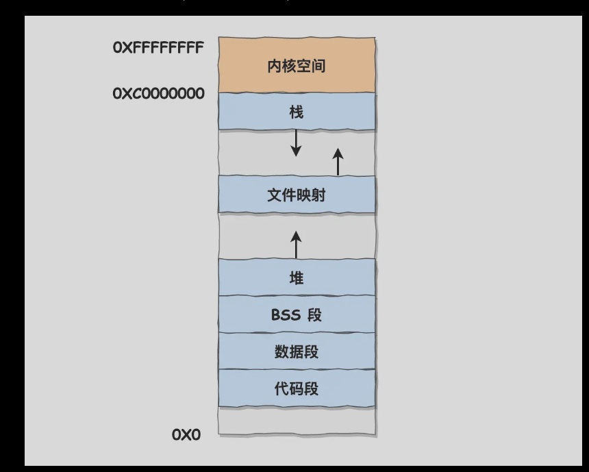

# 为什么要有虚拟内存？

操作系统是多进程的，如果每个进程直接操作绝对的物理地址，肯定是会出错的。所以这里引入了虚拟内存，进程操作虚拟内存，至于每个进程的虚拟内存如何映射到具体的物理地址则是由os来实现。
如下图，os通过mmu来实现虚拟地址到物理地址的映射。

## 内存分段
程序有若干的逻辑分段，如代码分段，数据分段，栈段，堆段。
分段机制下的虚拟地址由两部分组成，段选择因子和段内偏移量。

进程的虚拟地址中，每个段有自己的段号，通过段号查找段表对应的表项，最后获取段基址，段界限，段的权限。
缺点：内存碎片；内存交换的效率低。
- 内存碎片，分段机制显然只存在外部内存碎片。可用内存交换来解决。linux中的swap区是从硬盘中划分出来的和内存进行数据交换的区。
- 内存交换效率低，多进程很容易产生外部内存碎片，产生外部内存碎片，需要重新swap内存区域，从而产生性能瓶颈。
## 内存分页
为解决内存碎片和内存交换效率低问题。减少内存占用大小和交换的大小，故产生分页机制。
页表存储在内存里，MMU将进程虚拟内存转换为物理内存。
进程访问的虚拟地址在页表中查不到，系统产生一个缺页异常，系统内核空间分配物理内存（从硬盘加载到内存中），更新进程页表，再返回用户空间，恢复进程运行。
分页无外部内存碎片，但有内部内存碎片。即时需要进行内存交换，一次性也只有一个或着几个页，所以内存交换效率较高。
==不需要像段一样，一次性将所有段加载到内存中，可以在程序运行中，需要用到对应虚拟内存页里面的指令和数据再加载到物理内存中。程序局部性更好。==
在分页机制下，虚拟地址有页号和页内偏移。通过内存的页表加上虚拟页号得到物理页号，再加上页内偏移得到最终的物理地址。
对于32位系统。进程虚拟地址空间为4GB，假设页大小为4KB，页表项4B，则需要4MB来存储页表。每个进程在内存中有自己的页表，如100个进程，则占用400MB，显然不合理。于是诞生了多级页表。
**多级页表**
如下是多级页表地址转换过程：

首先一级页表4KB，二级页表占用4MB，不是更大？其实是进程用不到那麽多的虚拟空间，二级页表只有在实际用到时才会创建，所以实际占用空间是要小得多的。
==页表需要覆盖全部的地址空间，而多级页表的一级页表就已经覆盖全部地址空间；但是非多级页表就需要记录所有的页号，所以不能使用程序局部原理，使用到再加载的特性来节约空间==。一般多级页表，级数越高，根据程序的局部性原理，占用空间就越少。
对64位系统的分页机制：

**TLB的出现**
根据程序的局部性原理，将最常访问的几个页表项存储到访问速度更快的硬件。cpu中嵌入该硬件cache，即TLB，通常称为页表缓存，转址旁路缓存，快表。cpu在进行虚拟地址的查找是，先查找TLB，再查找普通页表。


## 段页式内存管理
- 先将程序划分为多个有逻辑意义的段。
- 将每个段划分为多个页，对分段出来的空间，划分为固定大小的页。
段页式的地址转换需要三次内存访问：
- 第一次访问段表，得到页表起始地址。
- 第二次访问页表，得到物理页号。
- 第三次根据物理页号和页内偏移获取物理地址。

## Linux的内存布局
段式内存管理和页式内存管理单元。

程序使用地址首先使用段式内存管理映射的地址，称为逻辑地址。
通过段式内存管理映射的地址，称为线性地址，也叫虚拟地址。
Linux内存主要采用也是页式内存管理，但也有段机制。
Linux的内核摒弃了逻辑地址概念，只有线性地址，即虚拟地址。
**各个进程有独立的虚拟内存，但是各个虚拟内存中的内核地址，其实关联的都是相同的物理内存**

以下是用户空间分布的情况：

代码段，包括二进制可执行代码；
数据段，包括已初始化的静态常量和全局变量；
BSS 段，包括未初始化的静态变量和全局变量；
堆段，包括动态分配的内存，从低地址开始向上增长；
文件映射段，包括动态库、共享内存等，从低地址开始向上增长（跟硬件和内核版本有关 (opens new window)）；
栈段，包括局部变量和函数调用的上下文等。栈的大小是固定的，一般是 8 MB。当然系统也提供了参数，以便我们自定义大小；
**虚拟内存的作用？**
- 虚拟内存可以让进程对运行内存超过物理内存大小。
- 页表是进程私有，解决多进程的地址冲突问题。
- 页表项还有页的读写权限，该页是否在等，在内存访问方面，提供更好的安全性。

# malloc是如何分配内存的？
## malloc是如何分配内存的？
malloc申请内存的时候，有两种方式向os申请堆内存。
- brk()系统调用，从堆分配内存。（拉高堆顶指针）。小于128KB。
- mmap()系统调用在文件映射区分配内存。私有匿名映射，在文件映射区"偷"一块内存。内存大于128KB（取决于具体的glibc的版本）。
## malloc分配的是物理内存吗
malloc()分配虚拟内存。分配的虚拟内存没有被访问，则不会映射到物理内存。
## malloc(1)会分配多大的虚拟内存？
malloc（）分配内存时，并不是老实的按照申请的字节数来分配内存空间大小，**而是会预分配更大的空间作为内存池**。具体多分配多少的内存是由glibc等版本决定的。
## free释放内存，会返还给操作系统吗？
free释放内存后，堆内存还在，加入到了malloc的内存池中，进程再次申请可以直接复用。
free内存后堆内存在，针对brk()系统调用。如果malloc采用mmap形式申请内存，free释放内存则归还给操作系统。
## 为什么不全部使用mmap来分配内存？
如果每次申请内存都是用mmap的话，首先执行系统调用要进入内核态，然后执行完成又回到用户态，比较耗时。
再者mmap每次分配的内存释放都需要归坏给操作系统，故mmap每分配一次内存就会产生一次缺页中断。
**为解决这两个问题，malloc可通过brk()系统调用预分配更大的内存来作为内存池；内存池中的内存和物理内存的映射关系存在，而且下次需要内存可以直接使用brk（）系统调用，所以可减少缺页中断次数以及系统调用的次数**。

## 既然brk那么牛逼，为什么不全部使用brk来分配？

如上图，如果使用brk()分配的内存不返还给os，而是继续留在内存池中。由于每次系统需要的内存都不一样，所以前后两次申请的内存不会完美匹配，久而久之就会产生越来越多的碎片，**而这个碎片导致内存泄漏且不会被valgrind检测出来。**
所以，在malloc实现中，充分考虑brk和mmap的行为差异和特点。默认128KB以上使用mmap。
## free() 函数只传入一个内存地址，为什么能知道要释放多大的内存？
在前面我们使用malloc(1)分配内存，malloc返回给用户态的起始地址比进程的堆空间起始地址多了16字节。
这个多出来的16字节保存了内存块的描述信息，如内存块的大小。

故执行free函数，将释放的地址向左偏移16B，再分析出当前的内存块的大小，就知道要释放多大内存。

# 内存满了，会发生什么？
主要的提纲：

## 内存分配的过程是怎么样的？
应用程序通过malloc函数分配内存时，如分配的虚拟内存没有映射到物理内存，产生缺页中断。然后建立页表映射关系。如果物理内存不足够，则需要进行内存回收。
- 后台内存回收，kswapd内核线程回收内存，为异步回收，不阻塞进程运行。
- 直接内存回收，后台异步回收速度过慢，则直接开始回收，同步回收过程，会阻塞进程的执行。
直接内存回收，空闲物理内存无法满足此次物理内存申请，触发OOM机制。
==OOM Killer机制会根据算法选择一个占用物理内存较高的进程，再将其杀死，如果不够，则继续类似杀死相关进程==
## 哪些内存可以被回收？
主要两类内存：
- 文件页，内核缓存的磁盘/文件数据叫做文件页。回收干净页直接释放内存，脏页则是先写回磁盘再释放内存。
- 匿名页，比如堆栈数据等；不能直接释放内存，而需要通过linux的swap机制进行回收。
**文件页和匿名页的回收基于LRU算法，优先回收不常访问内存**。LRU算法维护两个双向链表
- active_list 活跃内存页链表，最近访问的。
- inactive_list 非活跃内存页链表，很少被访问的内存页。
越在链尾，表示内存页越不常访问。
cat /proc/meminfo | grep -i active | sort 查看系统对应的文件页/匿名页；活跃链表/非活跃链表的占有大小。
## 回收内存带来的性能影响
后台内存回收，即kswapd，异步回收，不影响。
直接内存回收，同步回收，会阻塞进程，cpu利用率升高，引起系统负荷增大。
文件页的回收，干净页时直接释放内存，但是脏页写回磁盘，影响性能。
匿名页回收，swap机制换入换出影响系统性能。
常见解决方式：
### 调整文件页和匿名页的回收倾向
一般文件页回收的写回磁盘次数比匿名页要少，所以可以调整回收内存，倾向于回收文件页。
cat /proc/sys/vm/swappiness 在0-100之间，默认60.越大则系统倾向于使用swap机制，即回收匿名页。显然一般设置为0，并不代表不回收匿名页，只是很少。
### 尽早触发 kswapd 内核线程异步回收内存
sar -B 1查看后台内存回收和直接内存回收的指标。
pgscank/s : kswapd(后台回收线程) 每秒扫描的 page 个数。
pgscand/s: 应用程序在内存申请过程中每秒直接扫描的 page 个数。
pgsteal/s: 扫描的 page 中每秒被回收的个数（pgscank+pgscand）。
系统时不时发生抖动，并且在抖动的时间段里如果通过 sar -B 观察到 pgscand 数值很大，那大概率是因为「直接内存回收」导致的，意味着有大量的页换出，即大量内存一次性被换出。
**什么样的条件下触发kswapd内核线程回收内存？**
内核定义了三个内存阈值，又称为水位线，watermark。衡量当前的剩余内存是否充裕或者紧张。
- 页最小阈值 （pages_min）
- 页低阈值 （pages_low）
- 页高阈值 （pages_high）

kswapd定期扫描内存使用，根据剩余内存多少来进行内存回收的工作。
- 图中绿色部分：如果剩余内存（pages_free）大于页高阈值（pages_high），说明剩余内存是充足的；
- 图中蓝色部分：如果剩余内存（pages_free）在页高阈值（pages_high）和页低阈值（pages_low）之间，说明内存有一定压力，但还可以满足应用程序申请内存的请求；
- 图中橙色部分：如果剩余内存（pages_free）在页低阈值（pages_low）和页最小阈值（pages_min）之间，说明内存压力比较大，剩余内存不多了。**这时 kswapd0 会执行内存回收，直到剩余内存大于高阈值（pages_high）为止（这里触发异步回收，是保证回收到pages_high以上）**。虽然会触发内存回收，但是不会阻塞应用程序，因为两者关系是异步的。
- 图中红色部分：如果剩余内存（pages_free）小于页最小阈值（pages_min），说明用户可用内存都耗尽了，此时就会触发直接内存回收，这时应用程序就会被阻塞，因为两者关系是同步的。
/proc/sys/vm/min_free_kbytes 可以查看/设置系统的保留的内存的最低限。
```c
pages_min = min_free_kbytes
pages_low = pages_min*5/4
pages_high = pages_min*3/2
//只用设置pages_min;其他则是根据pages_min进行倍数计算得到。
```
sar -B 1观察到pgscand的数值很大，大概率是因为直接内存回收导致的，增大min_free_kbytes可以提前调用kswapd进程回收内存！再观察pgscand的值。
但是过大的min_free_kbytes值来说，极端等于实际物理内存。应用程序一启动，预留内存就低于pages_low，就触发OOM，进入直接内存回收模式。
==关注内存使用量，则降低min_free_bytes；关注延迟(kswapd尽早工作不太影响性能)则需要增大min_free_bytes==
### NUMA架构下的内存回收策略
SMP指的是一种多个CPU处理器共享资源的电源硬件架构。每个CPU访问内存用的时间是相同的，这称为一致存储访问结构（UMA）。
如下图，表明了一致性存储结构（共用一个bus，导致每个cpu的平均带宽降低）和非一致性存储结构NUMA结构的特点。

numa结构分为多个numa结点，一个numa结点有一个或多个CPU，包含自己的内存/IO。numa节点间通过qpi（互联模块总线）进行通信。numa结点访问本地内存使用时间要小于远端numa结点的内存。
#### numa架构跟回收内存有什么关系？
numa架构，node内存不足，可从其他的node寻找空闲内存。
cat /proc/sys/vm/zone_reclaim_mode 查看系统选择的node内存不足时的模式：
- 0 （默认值）：在回收本地内存之前，在其他 Node 寻找空闲内存；
- 1：只回收本地内存；
- 2：只回收本地内存，在本地回收内存时，可以将文件页中的脏页写回硬盘，以回收内存。
- 4：只回收本地内存，在本地回收内存时，可以用 swap 方式回收内存。
在使用numa架构服务器时，系统只有一半内存，频繁触发直接内存回收，多半是zone_reclaim_mode；因为本numa结点只能使用本结点内存，而不去使用其他numa结点的内存。一般建议设置为0。
### 如何保护一个进程不被OOM杀掉
当直接回收机制都无法申请满足所需的内存。linux选择进程来杀掉？如何选择？？？
linux内核通过oom_badness()函数，把系统中可被杀掉进程扫面，再进行打分。
- 进程已使用的物理内存页面数。
- 进程的OOM校准值 oom_score_adj。可通过 /proc/[pid]/oom_score_adj设置。在[-1000,1000]之内任意数值；调整被OOM kill的机率。
==最终的得分计算 points = process_pages + oom_score_adj*totalpages/1000；totalpages系统总可用的页面数；值越大越容易被kill==
**一些重要的系统服务可以设置oom_score_adj = -1000保证其不会被oom killer杀掉。不建议将业务程序设置为-1000，防止其内存泄漏oom时，oom killer无法杀掉它，而去杀死其他进程**

# 在4GB物理内存的机器上，申请8GB内存会怎样？
前置条件：
操作系统是32位的，还是64位的？
申请完8G内存后会被使用吗？
os有无swap机制。
**32位系统的场景**
32位系统。4GB物理内存机器上，申请8GB内存，会失败。进程最多只有3GB的用户空间，所以在申请虚拟内存阶段就会失败。
**64位系统的场景**
64位系统。4GB物理内存机器上，申请8GB内存，会成功。进程可以有最多128T的用户虚拟内存。
也可能会失败，原因是和linux的overcommit_memory参数有关。cat /proc/sys/vm/overcommit_memory可查看该参数。
- 如果值为 0（默认值），代表：Heuristic overcommit handling，它允许overcommit，但过于明目张胆的overcommit会被拒绝，比如malloc一次性申请的内存大小就超过了系统总内存。Heuristic的意思是“试探式的”，内核利用某种算法猜测你的内存申请是否合理，大概可以理解为单次申请不能超过free memory + free swap + pagecache的大小 + SLAB中可回收的部分 ，超过了就会拒绝overcommit。
- 如果值为 1，代表：Always overcommit. 允许overcommit，对内存申请来者不拒。
- 如果值为 2，代表：Don’t overcommit. 禁止overcommit。
那么将这个 overcommit_memory 设置为 1 之后，64 位的主机就可以申请接近 128T 虚拟内存了吗？ 不一定，看服务器的物理内存大小！
即使 malloc 申请的是虚拟内存，只要不去访问就不会映射到物理内存，但是申请虚拟内存的过程中，还是使用到了物理内存（比如内核保存虚拟内存的数据结构，也是占用物理内存的），如果你的主机是只有 2GB 的物理内存的话，大概率会触发 OOM。
那么无法实现了吗？可以开启1GB的swap空间。因为允许进行内存交换，所以可以实现申请。
**swap机制的作用**：
申请的实际物理内存大于空闲物理内存大小，如果开启了swap机制，则可以正常允许；没有则是会直接OOM。
## 什么是swap机制？
被释放的空间会临时保存到磁盘，等到那些程序要运行时，再从磁盘中恢复保存的数据到内存。即swap机制。频繁的换入换出swap机制会显著降低os运行速率。
linux下的swap机制的触发。
- 内存不足，直接内存回收，将内核中不常使用的内存页交换到磁盘。
- 内存闲置，异步内存回收，异步回收，不进行阻塞，将那些只使用一次等的闲置内存通过kswapd的守护进程来进行内存的交换。
linux提供两种不同方法来启用swap。
- swap分区即硬盘的独立区域，该区域只会用于交换分区。其他文件不能存储到该区域。swapon -s可查看交换分区。
- swap文件是文件系统的特殊文件，和文件系统的其他文件没啥太多的区别。
**swap换入换出的内存类型？**
- 内核缓存的文件数据，即文件页，直接写回到对应的文件即可（脏需写回，干净则直接回收）。
- 匿名页。如进程的堆，栈数据；无实际载体，被称为匿名页。需要swap分区来暂存。
当申请的物理内存超过物理内存？
- 实验1 没有开启swap机制，最终被OOM killer杀掉。
- 实验2 有开启 Swap 机制，开启swap机制，可以申请超过实际物理内存的内存，此时磁盘的换入换出会高速工作，进行内存的回收。但是也不是意味着有swap机制就可以申请无上限的内存。因为在系统尝试多次的回收内存还是无法满足时，进程会被kill掉。

# 如何避免预读失效和缓存污染问题？
即如何改进LRU算法（这个算法是回收文件页和匿名页的时候维护的活跃/非活跃链表的使用）。LRU算法存在两个问题：
- os读磁盘会额外多读到内存，数据没用到，有什么改善方法。**即预读失效，导致缓存命中率下降**
- 批量读数据，将热点数据挤出来。即**缓存污染**问题。
**Redis** 的缓存淘汰算法则是通过实现 LFU 算法来避免「缓存污染」而导致缓存命中率下降的问题（==Redis 没有预读机制==）。
**MySQL 和 Linux** 操作系统是通过改进 LRU 算法来避免「预读失效和缓存污染」而导致缓存命中率下降的问题。
==TLB和page cache的区别==
TLB是快表，用于程序的虚拟地址和物理地址的加速转换。存储了页的映射关系。命中则不用再进行虚拟页到物理页的转换，不那么费时。
而pagecache主要是用于加速文件系统的访问。文件的预读取机制。
本节提纲：

## Linux 和 MySQL 的缓存
### linux的缓存
应用程序读取文件数据，linux操作系统对读取的文件数据进行缓存，缓存在文件系统的page cache中（属于内存空间，访问速度快，加快数据访问速度）

### mysql的缓存
mysql数据存储在磁盘。Innodb的存储引擎设计了一个缓冲池（buffer pool），属于内存空间的数据。
如下是mysql的缓存结构示意：

缓冲池的存在：
- 当读取数据时，如果数据存在于 Buffer Pool 中，客户端就会直接读取 Buffer Pool 中的数据，否则再去磁盘中读取。
- 当修改数据时，首先是修改 Buffer Pool 中数据所在的页，然后将其页设置为脏页，最后由后台线程将脏页写入到磁盘。
## 传统LRU如何管理内存数据？
page cache和buffer pool大小有限，需要即时保留频繁访问的数据在内存中，而很少访问的数据则淘汰。使用LRU算法。
传统的LRU算法是，访问一个页，在LRU链表中，将其移动到头部；否则，将访问页移动到头部，淘汰旧页。但是存在上面的两个问题。
### 预读失效，怎样解决？
预读机制：应用程序读取文件A的0-3KB数据，一个block的读，所以会读取相关的一整个block(4KB);而根据程序局部性原理，可能又会将后面连续几个块一次性读入内存的pagecache中。显然这种readahead机制可减少磁盘的IO次数。同理，mysql的Innodb存储引擎的buffer pool也有预读机制。
预读失效带来的问题？
由于预读多个页到pagecache中，由于新读取到内存的页会更新带LRU链表的前排，当这些页不会被访问时，其却占据了LRU链表的头部，而可能将那些热点数据页挤出链表，从而导致缓存命中率大大下降。
**如何避免这个问题**？
如何避免？最好就是让预读页停留在内存里的时间尽可能的短，让真正被访问的页才移动到LRU链表的头部，、
改进方法：
- Linux 操作系统实现两个了 LRU 链表：活跃 LRU 链表（active_list）和非活跃 LRU 链表（inactive_list）；
- MySQL 的 Innodb 存储引擎是在一个 LRU 链表上划分来 2 个区域：young 区域 和 old 区域。
这两个方法都是为了区分热数据和冷数据！
linux是如何避免预读失效带来的影响？
有活跃/非活跃链表；将预读页加入到非活跃链表的头部，知道该页被访问才加入到活跃链表的头部，这样如果该预读页不被访问，就不会挤掉活跃表中的热点数据。
预读页20，加载到非活跃链表头部，淘汰10号页；20号页被访问，则加载到活跃链表头部，而原来的活跃链表尾部的5号页，则加入到非活跃链表的头部。

mysql是如何避免预读失效带来的影响？
mysql是Innodb引擎在一个LRU链表划分young，old区域
如下，young和old区域的占比一般是63：37（默认）。

预读页加入过程。


## 缓存污染咋办？
linux和mysql改进LRU避免了预读失效的影响，但是有个问题是，如果数据被访问一次就加入到活跃/young链表的头部，则存在缓存污染问题。
缓存污染：即批量读取数据，数据访问一次，但还是会挤占到活跃的LRU链表以及young区域里的热点数据，如果大量的数据在很长一段时间不被访问，那么整个活跃的LRU链表/young区域都被污染。
缓存污染带来的问题？
热数据再次被访问，缓存未命中，发生大量的磁盘IO，性能急剧下降。
当SQL语句扫描了大量的数据，buffer pool空间有限，将所有页替换，则大量热数据被淘汰。热数据再访问，产生大量的磁盘IO。
如SQL语句里的select * from t_user where name like "%xiaolin%";其会进行全表扫描，如果访问这些页一次后就不再进行访问。那么就存在缓存污染问题。
怎样避免缓存污染造成的影响？
根本是提升替换掉LRU链表前面页/young部分页的一个门槛。
- Linux 操作系统：在内存页被访问第二次的时候，才将页从 inactive list 升级到 active list 里。
- MySQL Innodb：在内存页被访问第二次的时候，并不会马上将该页从 old 区域升级到 young 区域，因为还要进行停留在 old 区域的时间判断：
如果第二次的访问时间与第一次访问的时间在 1 秒内（默认值），那么该页就不会被从 old 区域升级到 young 区域；
如果第二次的访问时间与第一次访问的时间超过 1 秒，那么该页就会从 old 区域升级到 young 区域；
提高进入活跃链表/young区域的门槛，能很好避免缓存污染。

# 深入理解linux的虚拟内存管理
提纲

## 到底什么是虚拟内存地址？
对64位虚拟地址格式：全局页目录项（9位）+ 上层页目录项（9位）+ 中间页目录项（9位）+ 页表项（9位）+ 页内偏移（12位）。共 48 位组成的虚拟内存地址。
32 位虚拟地址的格式为：页目录项（10位）+ 页表项（10位） + 页内偏移（12位）。共 32 位组成的虚拟内存地址。
## 为什么使用虚拟地址访问内存？
现代os的多进程，直接使用物理内存地址冲突，不好管理，比较复杂。
为了解决多进程的冲突性，提出虚拟内存，则每个进程认为自己独占内存！
## 进程虚拟内存空间
先只讨论进程用户态的进程空间，内核态的进程虚拟空间先不讨论。

用户态的进程虚拟空间：
- 用于存放进程程序二进制文件中的机器指令的代码段
- 用于存放程序二进制文件中定义的全局变量和静态变量的数据段和 BSS 段。
- 用于在程序运行过程中动态申请内存的堆。
- 用于存放动态链接库以及内存映射区域的文件映射与匿名映射区。
- 用于存放函数调用过程中的局部变量和函数参数的栈

## linux的进程虚拟内存空间
### 32位机器上进程虚拟内存空间分布

如上图存在保留区，堆则是向上增长（start_brk,brk之间）。注意文件映射和匿名映射区增长方向是堆的方向。对于栈区，在内核中使用 start_stack 标识栈的起始位置，RSP 寄存器中保存栈顶指针 stack pointer，RBP 寄存器中保存的是栈基地址。
### 64位机器上进程虚拟内存空间分布
pmap 进程pid 可查看进程的实际虚拟内存布局
64位内存空间其实只使用了48位来描述虚拟内存空间。表达的虚拟内存空间为256TB。
低128T为用户态的虚拟内存空间，高128T为内核态虚拟内存空间。
对地址来说，64位的有效地址高16位只能全0（用户虚拟空间）或者全1（内核虚拟空间地址）。两者之间的区域称为空洞区。

如下如是64位的进程虚拟内存布局：

- 前边提到的由高 16 位空闲地址造成的 canonical address 空洞。在这段范围内的虚拟内存地址是不合法的，因为它的高 16 位既不全为 0 也不全为 1，不是一个 canonical address，所以称之为 canonical address 空洞。
- 在代码段跟数据段的中间还有一段不可以读写的保护段，它的作用是防止程序在读写数据段的时候越界访问到代码段，这个保护段可以让越界访问行为直接崩溃，防止它继续往下运行。
- 用户态虚拟内存空间与内核态虚拟内存空间分别占用 128T，其中低128T 分配给用户态虚拟内存空间，高 128T 分配给内核态虚拟内存空间。

## 进程虚拟内存空间管理
内核如何管理这些虚拟内存区域，离不开描述符task_struct结构。里面有专门描述进程虚拟地址空间的内存描述符mm_struct结构。
通过 fork() 函数创建出的子进程，它的虚拟内存空间以及相关页表相当于父进程虚拟内存空间的一份拷贝，直接从父进程中拷贝到子进程中。
vfork()/clone()系统调用创建子进程，则是父子进程共享同一个进程空间。
是否共享地址空间几乎是进程和线程的本质区别。
内核线程没有相关的内存描述符，故内核线程切换不涉及地址空间切换。而用户态线程则存在。
内核线程调度时，其会访问内核内存，内核直接将上一个用户态进程的mm_struct赋值给内核进程，避免重新分配mm_struct，相关页表的开销，也避免内核线程调度间地址切换的开销。
mm_struct可区分父子进程；进程/线程；以及内核进程/用户进程。
### 内核如何划分用户态和内核态虚拟内存空间
```c
struct mm_struct {
    unsigned long task_size;	/* size of task vm space */
    //32位系统该值是0xC000 000，即两者分界区的地址。
    //64位系统该值是0x0000800000000000- 4K = 0x00007FFFFFFFF000；即进程用户虚拟地址和空洞区的分界点
}
```
### 内核如何布局进程虚拟内存空间
```c
struct mm_struct {
    unsigned long task_size;    /* size of task vm space */
    unsigned long start_code, end_code, start_data, end_data;
    unsigned long start_brk, brk, start_stack;
    unsigned long arg_start, arg_end, env_start, env_end;//位于栈中的最高地址处
    unsigned long mmap_base;  /* base of mmap area */
    unsigned long total_vm;    /* Total pages mapped  进程虚拟内存空间中总共与物理内存映射的页的总数 ，映射只是将虚拟内存和物理内存建立关联关系，还未分配*/
    unsigned long locked_vm;  /* Pages that have PG_mlocked set  locked_vm 就是被锁定不能换出的内存页总数，可以移动*/
    unsigned long pinned_vm;  /* Refcount permanently increased  pinned_vm 表示既不能换出，也不能移动的内存页总数*/
    unsigned long data_vm;    /* VM_WRITE & ~VM_SHARED & ~VM_STACK  data_vm 表示数据段中映射的内存页数目*/
    unsigned long exec_vm;    /* VM_EXEC & ~VM_WRITE & ~VM_STACK exec_vm 是代码段中存放可执行文件的内存页数目*/
    unsigned long stack_vm;    /* VM_STACK 栈中所映射的内存页数目*/
    ......
}
```
如下图虚拟内存区域和对应的变量对应：

### 内核如何管理虚拟内存区域
```c
struct vm_area_struct {//用来表示进程虚拟空间的每一个段

	unsigned long vm_start;		/* Our start address within vm_mm. *///，该地址在vma中
	unsigned long vm_end;		/* The first byte after our end address，该地址不在vma中
					   within vm_mm. */
	/*
	 * Access permissions of this VMA.
	 */
	pgprot_t vm_page_prot;//偏向定义页这一级别的访问控制权限。用于底层页表
	unsigned long vm_flags;	//偏向定义整个虚拟内存区域的访问权限以及行为规范，可赋值vm_page_prot

	struct anon_vma *anon_vma;	/* Serialized by page_table_lock 匿名映射，mmap将虚拟内存区域映射到物理内存*/
    struct file * vm_file;		/* File we map to (can be NULL). 文件映射，mmap将虚拟内存区域映射到文件中*/
	unsigned long vm_pgoff;		/* Offset (within vm_file) in PAGE_SIZE 文件映射的偏移量，表示映射到虚拟内存中的文件内容，在文件中的偏移。
					   units */	
	void * vm_private_data;		/* was vm_pte (shared mem) 用于存储 VMA 中的私有数据*/
	/* Function pointers to deal with this struct. */
	const struct vm_operations_struct *vm_ops;
}
```

### 定义虚拟内存区域的访问权限和行为规范
vm_flags常用的标志：

- VM_SHARD 用于指定这块虚拟内存区域映射的物理内存是否可以在多进程之间共享，以便完成进程间通讯。设置这个值即为 mmap 的共享映射，不设置的话则为私有映射。这个等后面我们讲到 mmap 的相关实现时还会再次提起。
- VM_IO 的设置表示这块虚拟内存区域可以映射至设备 IO 空间中。通常在设备驱动程序执行 mmap 进行 IO 空间映射时才会被设置。
- VM_RESERVED 的设置表示在内存紧张的时候，这块虚拟内存区域非常重要，不能被换出到磁盘中。
- VM_SEQ_READ 的设置用来暗示内核，应用程序对这块虚拟内存区域的读取是会采用顺序读的方式进行，内核会根据实际情况决定预读后续的内存页数，**以便加快下次顺序访问速度**。 
- VM_RAND_READ 的设置会暗示内核，应用程序会对这块虚拟内存区域进行随机读取，**内核则会根据实际情况减少预读的内存页数甚至停止预读**。
加入读写，执行权限后的各段：

### 关联内存映射中的映射关系
### 针对虚拟内存区域的相关操作
```c
struct vm_operations_struct {//vma_area_struct中，vm_ops指向针对VMA的相关操作的函数指针。
	void (*open)(struct vm_area_struct * area);
	void (*close)(struct vm_area_struct * area);
    vm_fault_t (*fault)(struct vm_fault *vmf);
    vm_fault_t (*page_mkwrite)(struct vm_fault *vmf);
    ......
    /*当指定的虚拟内存区域被加入到进程虚拟内存空间中时，open 函数会被调用

      当虚拟内存区域 VMA 从进程虚拟内存空间中被删除时，close 函数会被调用

      当进程访问虚拟内存时，访问的页面不在物理内存中，可能是未分配物理内存也可能是被置换到磁盘中，这时就会产生缺页异常，fault 函数就会被调用。

      当一个只读的页面将要变为可写时，page_mkwrite 函数会被调用。
    */
}
```
==在linux中有许多在内核中每个特定领域的描述符都会定义相关的操作==
### 虚拟内存区域在内核中是如何被组织的
```c
struct vm_area_struct {

	struct vm_area_struct *vm_next, *vm_prev;
	struct rb_node vm_rb;
    struct list_head anon_vma_chain; 
	struct mm_struct *vm_mm;	/* The address space we belong to. 虚拟内存区域具有的mm_struct*/
	
    unsigned long vm_start;     /* Our start address within vm_mm. */
    unsigned long vm_end;       /* The first byte after our end address
                       within vm_mm. */
    /*
     * Access permissions of this VMA.
     */
    pgprot_t vm_page_prot;
    unsigned long vm_flags; 

    struct anon_vma *anon_vma;  /* Serialized by page_table_lock */
    struct file * vm_file;      /* File we map to (can be NULL). */
    unsigned long vm_pgoff;     /* Offset (within vm_file) in PAGE_SIZE
                       units */ 
    void * vm_private_data;     /* was vm_pte (shared mem) */
    /* Function pointers to deal with this struct. */
    const struct vm_operations_struct *vm_ops;
}
//进程的虚拟内存区域由一系列的vma_area_struct构成；有链表和红黑树两种组织
struct mm_struct {
    struct vm_area_struct *mmap;		/* list of VMAs */
    struct rb_root mm_rb;
}
```
如下图：

有根据虚拟内存地址查找对应的虚拟内存区域VMA的需求。
故在内核的内存区域中，vm_area_struct会有两种组织形式。双向链表用于高效遍历，红黑树用于高效查找。
红黑树组织和链表组织

### 程序编译后的二进制文件如何映射到虚拟内存空间
即编译后的elf可执行文件（磁盘文件）如何映射到虚拟内存空间。
elf文件格式即磁盘文件中的段叫做section(.data,.rodata,.text等);内存中的段位segment，即内存区域。磁盘文件中的 .text，.rodata 等一些只读的 Section，会被映射到内存的一个只读可执行的 Segment 里（代码段）。
而 .data，.bss 等一些可读写的 Section，则会被映射到内存的一个具有读写权限的 Segment 里（数据段，BSS 段）。
load_elf_binary()，可加载内核，/启动第一个用户态init进程；/fork完调用exec运行一个二进制程序也是它。
```c
static int load_elf_binary(struct linux_binprm *bprm)
{
      ...... 省略 ........
  // 设置虚拟内存空间中的内存映射区域起始地址 mmap_base
  setup_new_exec(bprm);

     ...... 省略 ........
  // 创建并初始化栈对应的 vm_area_struct 结构。
  // 设置 mm->start_stack 就是栈的起始地址也就是栈底，并将 mm->arg_start 是指向栈底的。
  retval = setup_arg_pages(bprm, randomize_stack_top(STACK_TOP),
         executable_stack);

     ...... 省略 ........
  // 将二进制文件中的代码部分映射到虚拟内存空间中
  error = elf_map(bprm->file, load_bias + vaddr, elf_ppnt,
        elf_prot, elf_flags, total_size);

     ...... 省略 ........
 // 创建并初始化堆对应的的 vm_area_struct 结构
 // 设置 current->mm->start_brk = current->mm->brk，设置堆的起始地址 start_brk，结束地址 brk。 起初两者相等表示堆是空的
  retval = set_brk(elf_bss, elf_brk, bss_prot);

     ...... 省略 ........
  // 将进程依赖的动态链接库 .so 文件映射到虚拟内存空间中的内存映射区域
  elf_entry = load_elf_interp(&loc->interp_elf_ex,
              interpreter,
              &interp_map_addr,
              load_bias, interp_elf_phdata);

     ...... 省略 ........
  // 初始化内存描述符 mm_struct
  current->mm->end_code = end_code;
  current->mm->start_code = start_code;
  current->mm->start_data = start_data;
  current->mm->end_data = end_data;
  current->mm->start_stack = bprm->p;

     ...... 省略 ........
}
```
### 内核虚拟内存空间
**内核态虚拟内存空间是所有进程共享的，不同进程进入内核态之后看到的虚拟内存空间全部是一样的**。
==由于内核会涉及到物理内存的管理，所以很多人会想当然地认为只要进入了内核态就开始使用物理地址了，这就大错特错了，千万不要这样理解，进程进入内核态之后使用的仍然是虚拟内存地址，只不过在内核中使用的虚拟内存地址被限制在了内核态虚拟内存空间范围中。==意思是虚拟内存空间每个进程都有一份，意味着任何进程看到一样的内核态虚拟空间有进程那么多份？不会冗余吗？
#### 32 位体系内核虚拟内存空间布局
- 直接映射区（线性映射区）：1G大小的内核虚拟空间，最前面的896M大小的区域，称为直接映射区。
如下图，可直接通过减去0xC000 0000 得到。

前1M系统启动占用，1M后面则是存放内核代码段，数据段，BSS段等
cat /proc/iomem 可查看具体物理内存布局的情况。
使用fork创建进程，内核创建一系列进程相关的描述符。这些进程相关的数据结构会存放在物理内存前896M内存中，也会直接映射到内核态虚拟内存空间。
**进程创建好，分配内核栈，内核为每个进程分配一个固定大小的内核栈（两个页），每个进程的整个调用链必须放在自己的内核栈中，内核栈也是分配在直接映射区**内核栈不允许溢出。
理论上任何种类的页都可以放在任何页框中，没什么限制。**实际的计算机体系结构受到硬件方面的限制制约**
x86体系，ISA总线的DMA控制器只对内存的前16M进行寻址，导致ISA设备不能在整个32位地址空间执行DMA，只能使用物理内存的前16M进行DMA操作。 这块16M大小的内存区域称之为ZONE_DMA。16M-896M称之为ZONE_NORMAL区域。
- ZONE_HIGHMEM 高端内存
896M以上区域被内核划分为ZONE_HIGHMEM区域。如下图：

内存的物理区域还剩下4GB-896M = 3200M的高端内存，这个高端内存如何映射到内核虚拟内存空间的剩下的128MB，采用动态映射的方式，有8MB的空洞区。
- vmalloc动态映射区
VMALLOC_START 到 VMALLOC_END 之间的这块区域成为动态映射区。
动态映射区内核使用vmalloc来进行内存分配。vmalloc分配的内存在虚拟内存上是连续的，但物理内存不连续。需要建立页表的映射关系。
**由于 vmalloc 获得的物理内存页是不连续的，因此它只能将这些物理内存页一个一个地进行映射，在性能开销上会比直接映射大得多。**
-  永久映射区
在PKMAP_BASE 到 FIXADDR_START之间的这段空间称为永久映射区。内核中这段虚拟地址空间允许建立和ZONE_HIGHMEM的长期映射。内核通过alloc_pages()函数在物理内存的高端内存申请到的页可以通过调用 kmap 映射到永久映射区。
```c
#define PKMAP_BASE		\
	((LDT_BASE_ADDR - PAGE_SIZE) & PMD_MASK)
#define LAST_PKMAP 1024 //表示永久映射区可以映射的页数的限制
```
- 固定映射区
固定映射区中虚拟地址是固定的，而被映射的物理地址是可以改变的。
==采用固定虚拟地址的好处是它相当于一个指针常量（常量的值在编译时确定），指向物理地址，如果虚拟地址不固定，则相当于一个指针变量。==
- 临时映射区
存在一个将用户空间缓冲区buffer的待写入数据拷贝到page cache中。
内核不能直接拷贝，因为内核无法直接操作cache物理地址。需要使用kmap_atomic()将缓存页临时映射到内核空间的一段虚拟地址临时映射区上，再将缓冲区buffer的数据通过该虚拟地址的临时映射区拷贝到物理内存的相应的pagecache中。临时映射故在拷贝完成后，调用kunmap_atomic接触这段映射。
#### 32位体系结构下 Linux 虚拟内存空间整体布局


#### 64 位体系内核虚拟内存空间布局

内核的虚拟内存空间，先8TB的空洞，然后一个PAGE_OFFSET的值，64TB的直接映射区地址减去该PAGE_OFFSET得到内核对应的物理地址。
__START_KERNEL_map 开始是大小为 512M 的区域用于存放内核代码段、全局变量、BSS 等。这里对应到物理内存开始的位置.

#### 64位体系结构下 Linux 虚拟内存空间整体布局

### 到底什么是物理内存地址
物理内存即随机访问内存储器RAM，一般分为两类：
- 一类是静态RAM，即SRAM。访问速度1-30个时钟周期。各种L1.等高速缓存。
- 一类是动态RAM，即DRAM。访问速度50-200个时钟周期，但是容量大。
如下图，多个存储器模块组成了主存，然后一个存储器模块由多个DRAM芯片组成，一个芯片由二维数组构成，每个点是一个supercell（8bit），8个DRAM构成主存一次能传输的字节数（一般8B）。通过CAS（列缓冲地址）和RAS（行缓冲地址）确定supercell获取对应的supercell传输到数据线。

总线上传输的信号包括：地址信号，数据信号，控制信号。控制总线标识正在执行的事务信息：
当前这个事务是到内存的？还是到磁盘的？或者是到其他 IO 设备的？
这个事务是读还是写？
总线上传输的地址信号（物理内存地址），还是数据信号（数据）？
**总线上传输的是物理地址，前面的总线嗅探嗅探的是物理内存地址**
IO bridge连接系统总线（CPU和IO bridege）和存储总线（IO bridge 和主存。IO bridge会将系统总线和存储总线连接到IO总线上。IO bridge可转换不同总线上的电子信号。
### CPU从内存读取数据的过程
**CPU只会访问虚拟内存**，操作总线之前，把虚拟内存地址转换为物理内存。
如下是CPU的读捏村数据到寄存器过程：

### 如何根据物理内存地址从主存中读取数据
存储控制器将物理内存地址转化为对应的（RAS，CAS），再将其发送到对应的存储器模块，存储器模块广播到0-7个全部的DRAM芯片。每个DRAM有一个supercell构成8bit，总的构成64bit共8B的数据返回给存储控制器，再放到存储总线上。
**CPU 每次会向内存读写一个 cache line 大小的数据（ 64 个字节），但是内存一次只能吞吐 8 个字节。**
本质上来说，其实在程序员眼里连续的物理地址其实是不连续的。8字节数据分别存储在8个DRAM芯片上。
### CPU 向内存写入数据过程
CPU 要将寄存器中的数据 X 写到物理内存地址 A 中。大致过程是，cpu将物理内存地址A转换到存储总线后，存储控制器读取。将X传输到存储总线，存储控制器读数据。存储控制器根据地址A，定位到对应存储模块各DRAM芯片的对应的行列开始写入。

# 深入理解linux物理内存管理
​      提纲

### 从CPU角度看物理内存模型
内核以页为单位管理物理内存。一个页使用struct page结构体管理。内核定义索引编号PFN一一对应struct page，方便快速索引。age_to_pfn 与 pfn_to_page进行两者转换。==内核中如何组织管理这些物理内存页 struct page 的方式我们称之为做物理内存模型。==
#### FLATMEM 平坦内存模型

内核中使用了一个 mem_map 的全局数组用来组织所有划分出来的物理内存页。mem_map 全局数组的下标就是相应物理页对应的 PFN 。
page_to_pfn 与 pfn_to_page则只需要一个偏移操作即可。
#### DISCONTIGMEM 非连续内存模型
针对平坦内存模型，由于使用mem_map数组进行管理，需要连续的物理内存空间，而一个page结构体占大约40B空间，显然这会浪费大量连续的内存空间。
于是引入非连续内存模型。消除非连续内存对mem_map的浪费。
如下图：

每个node结点还是使用了平坦模型，只是避开了空洞地址。内核中使用 struct pglist_data 表示用于管理连续物理内存的 node 节点。
非连续内存模型下 page_to_pfn 与 pfn_to_page 的计算逻辑就比 FLATMEM 内存模型下的计算逻辑多了一步定位 page 所在 node 的操作。后面和平坦模型一样。
- 通过 arch_pfn_to_nid 可以根据物理页的 PFN 定位到物理页所在 node。
- 通过 page_to_nid 可以根据物理页结构 struct page 定义到 page 所在 node。
#### SPARSEMEM 稀疏内存模型
内存技术发展，内核可支持物理内存的热插拔。故物理内存不连续称为常态。所以非连续内存模型的node里的物理内存可能不连续。

SPARSEMEM 稀疏内存模型的核心思想就是对粒度更小的连续内存块进行精细的管理，用于管理连续内存块的单元被称作 section 。
SPARSEMEM 内存模型中的这些所有的 mem_section 会被存放在一个全局的数组中，并且每个 mem_section 都可以在系统运行时改变 offline / online （下线 / 上线）状态，以便支持内存的热插拔（hotplug）功能。
page_to_pfn 与 pfn_to_page逻辑变化
- 在 page_to_pfn 的转换中，首先需要通过 page_to_section 根据 struct page 结构定位到 mem_section 数组中具体的 section 结构（通过page结构体的flags属性存储了page再mem_section的索引）。然后在通过 section_mem_map 定位到具体的 PFN。
- 在 pfn_to_page 的转换中，首先需要通过 __pfn_to_section 根据 PFN 定位到 mem_section 数组中具体的 section 结构。然后在通过 PFN 在 section_mem_map 数组中定位到具体的物理页 Page 。（PFN高位存section的索引，低位存物理页page的索引）。
#### 物理内存热插拔
内存热插拔两阶段：
- 物理热插拔阶段：这个阶段主要是从物理上将内存硬件插入（hot-add），拔出（hot-remove）主板的过程，其中涉及到硬件和内核的支持。
- 逻辑热插拔阶段：这一阶段主要是由内核中的内存管理子系统来负责，涉及到的主要工作为：如何动态的上线启用（online）刚刚 hot-add 的内存，如何动态下线（offline）刚刚 hot-remove 的内存。
对于内存插入好解决。对于内存拔出，需要将对应的mem_section进行offline调整，将已分配的内存页转到其他的mem_section内存上。
内核可重新修改页表来保证虚拟内存和物理内存的映射关系，保证虚拟内存地址不变。对于虚拟内存空间的直接映射区的内容，虚拟内存的虚拟地址随物理内存地址而变动，怎样解决这个问题？
==既然是这些不可迁移的物理页导致内存无法拔出，那么我们可以把内存分一下类，将内存按照物理页是否可迁移，**划分为不可迁移页，可回收页，可迁移页**。==
所以可以将内存分为可迁移和不可迁移，针对直接映射区物理内存来说，可以将其设为不可迁移页，则其不可热插拔。而其他全为可迁移页的内存可以热插拔。
###  从 CPU 角度看物理内存架构
UMA架构导致总线带宽成为瓶颈，引出NUMA架构。
在 NUMA 架构下，只有 DISCONTIGMEM 非连续内存模型和 SPARSEMEM 稀疏内存模型是可用的。而 UMA 架构下，前面介绍的三种内存模型都可以配置使用。

#### NUMA 的内存分配策略

```c
#include <numaif.h>
long set_mempolicy(int mode, const unsigned long *nodemask,
                          unsigned long maxnode);//可设置进程的内存分配策略
// mode : 指定 NUMA 内存分配策略。
// nodemask：指定 NUMA 节点 Id。
// maxnode：指定最大 NUMA 节点 Id，用于遍历远程节点，实现跨 NUMA 节点分配内存。
```
#### NUMA 的使用简介
numactl 文档：https://man7.org/linux/man-pages/man8/numactl.8.html 查看系统numa结点信息
numactl -H 进行系统统计。每个numa结点cpu核心，内存大小。各numa节点距离，越远延迟越高。
numactl -s  来查看 NUMA 的内存分配策略设置。
numastat 查看各个 NUMA 节点的内存访问命中率。
numactl可以指定应用程序运行在哪些cpu核心上，指定应用程序在那些节点上进行分配内存。将应用程序与具体的CPU核心和NUMA节点绑定。从而提升程序性能。
### 内核如何管理numa节点
内核2.4之后，NODE_DATA(nid) 宏可以通过 NUMA 节点的 nodeId，找到对应的 struct pglist_data 结构，内核使用类型为 struct pglist_data 的**全局数组 **node_data[] 来管理所有的 NUMA 节点。
如下图：

当使用UMA架构时，MAX_NUMNODES = 1 << NODES_SHIFT；NODES_SHIFT = 0；故MAX_NUMNODE为1，所以只有一个NUMA节点。
#### NUMA 节点描述符 pglist_data 结构
```c
typedef struct pglist_data {//注意和前面的物理内存模型的区别，这里是管理numa节点内所有内存，不管内存是否空洞。但是也会用pfn来标识分空洞的页。
    // NUMA 节点id
    int node_id;
    // 指向 NUMA 节点内管理所有物理页 page 的数组
    struct page *node_mem_map;//指向numa节点管理所有物理页page数组。
    // NUMA 节点内第一个物理页的 pfn，numa节点上每个物理页的pgn是全局唯一，而不是numa节点内唯一。
    unsigned long node_start_pfn;
    // NUMA 节点内所有可用的物理页个数（不包含内存空洞）
    unsigned long node_present_pages;
    // NUMA 节点内所有的物理页个数（包含内存空洞）
    unsigned long node_spanned_pages; 
    // 保证多进程可以并发安全的访问 NUMA 节点
    spinlock_t node_size_lock;
        .............
}
```
如下图：

#### numa节点物理内存区域的划分
如下是物理内存的主要划分：
- ZONE_DMA：用于那些无法对全部物理内存进行寻址的硬件设备，进行 DMA 时的内存分配。例如前边介绍的 ISA 设备只能对物理内存的前 16M 进行寻址。该区域的长度依赖于具体的处理器类型。
- ZONE_DMA32：与 ZONE_DMA 区域类似，该区域内的物理页面可用于执行 DMA 操作，不同之处在于该区域是提供给 32 位设备（只能寻址 4G 物理内存）执行 DMA 操作时使用的。该区域只在 64 位系统中起作用，因为只有在 64 位系统中才会专门为 32 位设备提供专门的 DMA 区域。
- ZONE_NORMAL：这个区域的物理页都可以直接映射到内核中的虚拟内存，由于是线性映射，内核可以直接进行访问。
- ZONE_HIGHMEM：这个区域包含的物理页就是我们说的高端内存，内核不能直接访问这些物理页，这些物理页需要动态映射进内核虚拟内存空间中（非线性映射）。该区域只在 32 位系统中才会存在，因为 64 位系统中的内核虚拟内存空间太大了（128T），都可以进行直接映射。
- ZONE_DEVICE 是为支持热插拔设备而分配的非易失性内存（ Non Volatile Memory ），也可用于内核崩溃时保存相关的调试信息。
- ZONE_MOVABLE 是内核定义的一个虚拟内存区域，该区域中的物理页可以来自于上边介绍的几种真实的物理区域（意思是从上面几个区进行分配）。该区域中的页全部都是可以迁移的，主要是为了防止内存碎片和支持内存的热插拔。
为什么需要ZONE_MOVABLE区域，从本质上来说，由于分配物理内存时是不连续的，这样随机插入连续内存进行分配，将物理内存划分为了一个个区域，而程序分配物理内存如果需要连续的物理内存，且分配只能是2的整数次幂的页数。这样可能导致程序分配内存的失败。但是如果将这些物理页所处ZONE标记为ZONE_MOVABLE就可以将他们迁移，从而移到一起，避免不连续物理内存。如下图：

```c
typedef struct pglist_data {//numa节点如何组织这些内存区域
  // NUMA 节点中的物理内存区域个数
	int nr_zones; 
  // NUMA 节点中的物理内存区域
	struct zone node_zones[MAX_NR_ZONES];
  // NUMA 节点的备用列表，即本numa节点的备用节点们以及对应的物理内存区域。按备用节点距离远近来进行访问。
	struct zonelist node_zonelists[MAX_ZONELISTS];
} pg_data_t;
```
对于分配的物理区域，一般来说只有第一个numa节点可包含所有物理内存区域。因为ZONE_DMA很可能划分给这个numa节点了。而ZONE_MOVABLE,ZONE_NORMAL,ZONE_HIGHMEM则各个numa节点都可能有。如下图：

#### NUMA 节点中的内存规整与回收
内核将那些不经常使用的内存页面回收起来(前面提到的异步回收，直接内存回收，甚至OOM KILLER)，或者将那些可以迁移的页面进行内存规整（ZONE_MOVABLE），从而可以腾出连续的物理内存页面供内核分配。
==内核会为每个 NUMA 节点分配一个 kswapd 进程用于回收不经常使用的页面，还会为每个 NUMA 节点分配一个 kcompactd 进程用于内存的规整避免内存碎片。==
```c
typedef struct pglist_data {
        .........
    // 页面回收进程
    struct task_struct *kswapd;//指向内核为该numa节点分配的kswapd进程
    wait_queue_head_t kswapd_wait;
    // 内存规整进程
    struct task_struct *kcompactd;//指向内核为该numa节点分配的kcompactd进程
    wait_queue_head_t kcompactd_wait;
    ......
    /*
    kswapd_wait,kcompactd_wait为等待队列，用于装载kswapd,kcompactd进程；当内存达到一定条件（一个周期，内存告急，内存碎片过多时），唤醒队列内进程。
    */
} pg_data_t;
```
#### NUMA 节点的状态 node_states
numa节点数大于1，维护一个位图node_states,维护各numa节点状态。
如下标识节点的状态的掩码：
```c
enum node_states {
	N_POSSIBLE,		/* The node could become online at some point */
	N_ONLINE,		/* The node is online */
	N_NORMAL_MEMORY,	/* The node has regular memory */
#ifdef CONFIG_HIGHMEM
	N_HIGH_MEMORY,		/* The node has regular or high memory */
#else
	N_HIGH_MEMORY = N_NORMAL_MEMORY,
#endif
#ifdef CONFIG_MOVABLE_NODE
	N_MEMORY,		/* The node has memory(regular, high, movable) */
#else
	N_MEMORY = N_HIGH_MEMORY,
#endif
	N_CPU,		/* The node has one or more cpus */
	NR_NODE_STATES
    /*
    N_POSSIBLE 表示 NUMA 节点在某个时刻可以变为 online 状态，N_ONLINE 表示 NUMA 节点当前的状态为 online 状态。
    N_NORMAL_MEMORY 表示节点没有高端内存，只有 ZONE_NORMAL 内存区域。
    N_HIGH_MEMORY 表示节点有 ZONE_NORMAL 内存区域或者有 ZONE_HIGHMEM 内存区域。
    N_MEMORY 表示节点有 ZONE_NORMAL，ZONE_HIGHMEM，ZONE_MOVABLE 内存区域。
    N_CPU 表示节点包含一个或多个 CPU。
    */
};

//设置或者清除指定节点的特定状态
static inline void node_set_state(int node, enum node_states state)
static inline void node_clear_state(int node, enum node_states state)

//迭代处于特定状态的所有 NUMA 节点，下面是找出所有状态为ONLINE的node
#define for_each_online_node(node) for_each_node_state(node, N_ONLINE)
```
### 内核如何管理NUMA节点的物理内存区域
cat /proc/zoneinfo | grep Node 可查看numa节点内存区域的分布情况。**64位系统不包含ZONE_HIGHMEM区域**

内核用于描述和管理 NUMA 节点中的物理内存区域的结构体是 struct zone。==struct zone 结构体在内核中是一个访问非常频繁的结构体，在多处理器系统中，会有不同的 CPU 同时大量频繁的访问 struct zone 结构体中的不同字段==
```c
struct zone {//设计比较考究

    .............省略..............

    ZONE_PADDING(_pad1_)

    .............省略..............

    ZONE_PADDING(_pad2_)

    .............省略..............

    ZONE_PADDING(_pad3_)

    .............省略..............

} ____cacheline_internodealigned_in_smp;//编译器关键字来实现最优的高速缓存行对齐（cacheline对齐，数据访问效率加快等）方式。
//将频繁访问的字段信息分为4部分，每部分使用ZONE_PADING进行填充，确保每个部分划分到不同的cache line，避免并发访问冲突提升性能
```
```c
struct zone {
    // 防止并发访问该内存区域
    spinlock_t      lock;//自旋锁，防止并发访问该numa节点的该zone
    // 内存区域名称：Normal ，DMA，HighMem
    const char      *name;
    // 指向该内存区域所属的 NUMA 节点，即前面的pglist_data,该zone区域也需要指向这个numa节点数据结构palist_data。
    struct pglist_data  *zone_pgdat;
    // 属于该内存区域中的第一个物理页 PFN，同 pglist_data内node_start_pfn指向numa的第一个物理页面。
    unsigned long       zone_start_pfn;
    // 该内存区域中所有的物理页个数（包含内存空洞）
    unsigned long       spanned_pages;
    // 该内存区域所有可用的物理页个数（不包含内存空洞）
    unsigned long       present_pages;
    // 被伙伴系统所管理的物理页数，内核为每个numa节点的每个内存区域分配一个伙伴系统管理该内存区域下物理内存的分配和释放。
    atomic_long_t       managed_pages;
    // 伙伴系统的核心数据结构
    struct free_area    free_area[MAX_ORDER];
    // 该内存区域内存使用的统计信息，cat /proc/zoneinfo来源
    atomic_long_t       vm_stat[NR_VM_ZONE_STAT_ITEMS];
} ____cacheline_internodealigned_in_smp;
```
### 物理内存区域中的预留内存
每个物理内存区域 struct zone 还为操作系统预留了一部分内存，用于内核核心操作，操作无论如何是不允许内存分配失败的。
常见两种内存分配场景
- 当进程请求内核分配内存时，如果此时内存比较充裕，那么进程的请求会被立刻满足，如果此时内存已经比较紧张，内核就需要将一部分不经常使用的内存进行回收，从而腾出一部分内存满足进程的内存分配的请求，在这个回收内存的过程中，进程会一直阻塞等待。
- 另一种内存分配场景，进程是不允许阻塞的，内存分配的请求必须马上得到满足，比如执行中断处理程序或者执行持有自旋锁等临界区内的代码时，进程就不允许睡眠，因为中断程序无法被重新调度。这时就需要内核提前为这些核心操作预留一部分内存，当内存紧张时，可以使用这部分预留的内存给这些操作分配。
```c
struct zone {
             ...........

    unsigned long nr_reserved_highatomic;//表示预留内存大小，范围为128-65536KB之间
    long lowmem_reserve[MAX_NR_ZONES];//规定每个内存区域必须为自己保留的物理页数量，防止更高位的内存区域对自己的内存空间进行过多的侵占挤压 。         
             ...........
}
```
根据物理内存地址的高低，低位内存区域到高位内存区域的顺序依次是：ZONE_DMA，ZONE_DMA32，ZONE_NORMAL，ZONE_HIGHMEM。
**高位内存区域为什么会对低位内存区域进行挤压呢** ？
一些用于特定功能的物理内存只能从特定的zone进行分配，如DMA控制器必须从ZONE_DMA/ZONE_DMA32进行分配。
但一些常规用途物理内存可以从多个内存进行分配，当高位内存不够用时，可以分配低位内存，从而侵占了低位内存。而低位内存区域的内存是宝贵的；所以需要使用lowmem_reserve来为自己预留一部分内存。cat /proc/sys/vm/lowmem_reserve_ratio查看预留的系统内存。
如下图为根据lowmem_reserve_ratio而计算的各内存区域防止高位内存侵占而保留的物理页数的计算：

sysctl对内核参数lowmem_reserve_ratio 可进行动态调整，重新计算各内存区域保留内存的大小。
### 物理内存区域中的水位线
内存区域紧张，三种系统应对方法：
- 产生 OOM，内核直接将系统中占用大量内存的进程，将 OOM 优先级最高的进程干掉，释放出这个进程占用的内存供其他更需要的进程分配使用。
- 内存回收，将不经常使用到的内存回收，腾挪出来的内存供更需要的进程分配使用。分为异步回收（kswapd）和直接内存回收
- 内存规整，将可迁移的物理页面进行迁移规整，消除内存碎片。从而获得更大的一片连续物理内存空间供进程分配（kcompactd进程使用）。
物理内存区域中的内存回收分为文件页回收（通过 pflush 内核线程）和匿名页回收（通过 kswapd 内核进程）。Swap 机制主要针对的是匿名页回收。
一般来说系统倾向于回收文件页。cat /proc/sys/vm/swappiness（0-100）；swappiness越高则越偏向于swap交换，即回收匿名页；越低则偏向于回收文件页。为0只是swap不积极，内存紧张还是需要swap机制。
下面提到的物理内存区域的剩余内存是需要刨去上小节介绍的 lowmem_reserve 预留内存大小（防止高位侵占的区域保留的内存大小）。如下图：

位于_watermark[WMARK_MIN] 以下的内存容量是预留给内核在紧急情况下使用的（区别于保留的页的大小），这部分内存就是我们在介绍的预留内存 nr_reserved_highatomic。
cat /proc/zoneinfo 查看各numa节点的信息。
min_free_kbytes计算逻辑

如上，计算出的new_min_free_kbytes(这个值是numa节点拥有的)。
最后的min_free_kbytes = max{用户设置/proc/sys/vm/min_free_kbytes，new_min_free_kbytes}.
min_free_kbytes在128-65536KB之间，和前面的zone区域的保留内存对应上。而zone保留的页则不加入此次保留区域计算，只是防止高位对低位内存的过度侵占。
###  setup_per_zone_wmarks 计算水位线
NUMA 节点中有两个 zone ：ZONE_DMA 和 ZONE_NORMAL，内存容量大小分别是：100 M 和 800 M。那么 ZONE_DMA 与 ZONE_NORMAL 之间的比例就是 1 ：8。则ZONE_DMA区域的水位线WMARK_MIN= 1/8*min_free_kbytes。ZONE_NORMAL = 7/8*min_free_kbytes.
### watermark_scale_factor 调整水位线的间距
