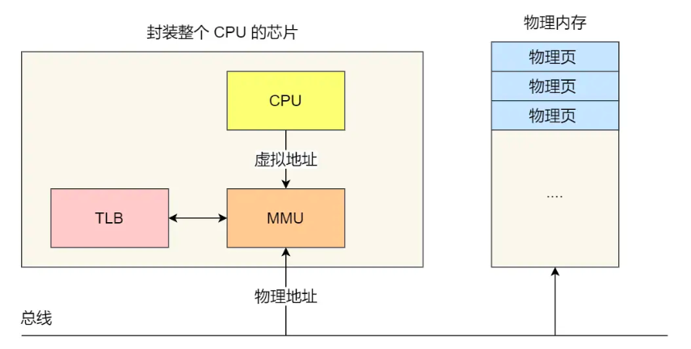

# 为什么要有虚拟内存？

操作系统是多进程的，如果每个进程直接操作绝对的物理地址，肯定是会出错的。所以这里引入了虚拟内存，进程操作虚拟内存，至于每个进程的虚拟内存如何映射到具体的物理地址则是由os来实现。
如下图，os通过mmu来实现虚拟地址到物理地址的映射。

## 内存分段
程序有若干的逻辑分段，如代码分段，数据分段，栈段，堆段。
分段机制下的虚拟地址由两部分组成，段选择因子和段内偏移量。

进程的虚拟地址中，每个段有自己的段号，通过段号查找段表对应的表项，最后获取段基址，段界限，段的权限。
缺点：内存碎片；内存交换的效率低。
- 内存碎片，分段机制显然只存在外部内存碎片。可用内存交换来解决。linux中的swap区是从硬盘中划分出来的和内存进行数据交换的区。
- 内存交换效率低，多进程很容易产生外部内存碎片，产生外部内存碎片，需要重新swap内存区域，从而产生性能瓶颈。
## 内存分页
为解决内存碎片和内存交换效率低问题。减少内存占用大小和交换的大小，故产生分页机制。
页表存储在内存里，MMU将进程虚拟内存转换为物理内存。
进程访问的虚拟地址在页表中查不到，系统产生一个缺页异常，系统内核空间分配物理内存（从硬盘加载到内存中），更新进程页表，再返回用户空间，恢复进程运行。
分页无外部内存碎片，但有内部内存碎片。即时需要进行内存交换，一次性也只有一个或着几个页，所以内存交换效率较高。
==不需要像段一样，一次性将所有段加载到内存中，可以在程序运行中，需要用到对应虚拟内存页里面的指令和数据再加载到物理内存中。程序局部性更好。==
在分页机制下，虚拟地址有页号和页内偏移。通过内存的页表加上虚拟页号得到物理页号，再加上页内偏移得到最终的物理地址。
对于32位系统。进程虚拟地址空间为4GB，假设页大小为4KB，页表项4B，则需要4MB来存储页表。每个进程在内存中有自己的页表，如100个进程，则占用400MB，显然不合理。于是诞生了多级页表。
**多级页表**
如下是多级页表地址转换过程：

首先一级页表4KB，二级页表占用4MB，不是更大？其实是进程用不到那麽多的虚拟空间，二级页表只有在实际用到时才会创建，所以实际占用空间是要小得多的。
==页表需要覆盖全部的地址空间，而多级页表的一级页表就已经覆盖全部地址空间；但是非多级页表就需要记录所有的页号，所以不能使用程序局部原理，使用到再加载的特性来节约空间==。一般多级页表，级数越高，根据程序的局部性原理，占用空间就越少。
对64位系统的分页机制：

**TLB的出现**
根据程序的局部性原理，将最常访问的几个页表项存储到访问速度更快的硬件。cpu中嵌入该硬件cache，即TLB，通常称为页表缓存，转址旁路缓存，快表。cpu在进行虚拟地址的查找是，先查找TLB，再查找普通页表。

## 段页式内存管理
- 先将程序划分为多个有逻辑意义的段。
- 将每个段划分为多个页，对分段出来的空间，划分为固定大小的页。
段页式的地址转换需要三次内存访问：
- 第一次访问段表，得到页表起始地址。
- 第二次访问页表，得到物理页号。
- 第三次根据物理页号和页内偏移获取物理地址。

## Linux的内存布局
段式内存管理和页式内存管理单元。

程序使用地址首先使用段式内存管理映射的地址，称为逻辑地址。
通过段式内存管理映射的地址，称为线性地址，也叫虚拟地址。
Linux内存主要采用也是页式内存管理，但也有段机制。
Linux的内核摒弃了逻辑地址概念，只有线性地址，即虚拟地址。
**各个进程有独立的虚拟内存，但是各个虚拟内存中的内核地址，其实关联的都是相同的物理内存**

以下是用户空间分布的情况：

代码段，包括二进制可执行代码；
数据段，包括已初始化的静态常量和全局变量；
BSS 段，包括未初始化的静态变量和全局变量；
堆段，包括动态分配的内存，从低地址开始向上增长；
文件映射段，包括动态库、共享内存等，从低地址开始向上增长（跟硬件和内核版本有关 (opens new window)）；
栈段，包括局部变量和函数调用的上下文等。栈的大小是固定的，一般是 8 MB。当然系统也提供了参数，以便我们自定义大小；
**虚拟内存的作用？**
- 虚拟内存可以让进程对运行内存超过物理内存大小。
- 页表是进程私有，解决多进程的地址冲突问题。
- 页表项还有页的读写权限，该页是否在等，在内存访问方面，提供更好的安全性。