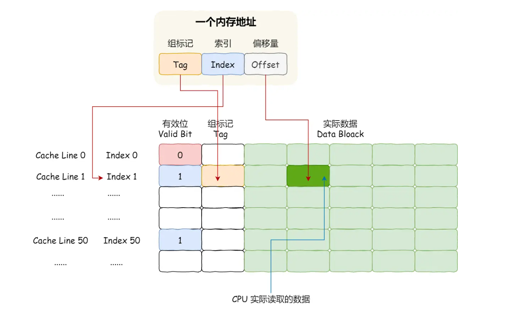
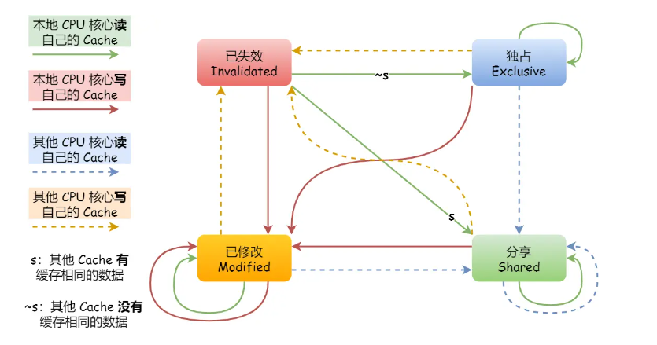
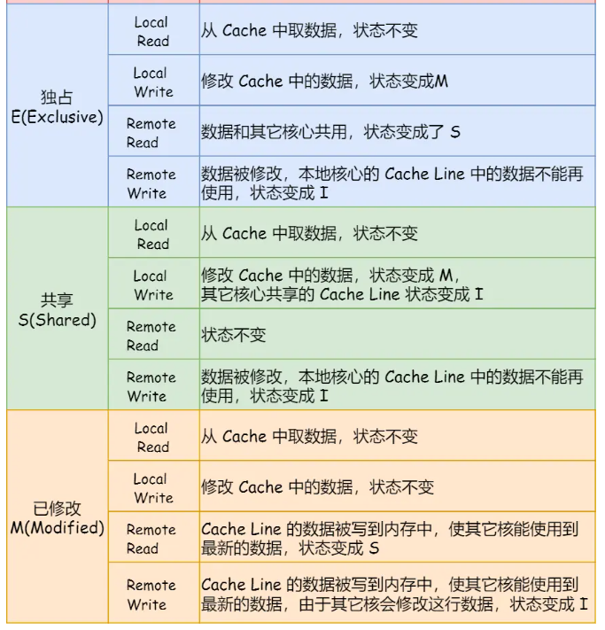

# CPU是如何执行程序的？
图灵机，纸带为存储，读写头包含控制部分，运算部分，存储部分。
- 冯 诺伊曼架构仿照图灵机设计了：输入输出设备（外设），存储单元（存储结构），逻辑运算单元，控制单元（CPU内部）五部分。
- CPU
分为32位和64位CPU，主要区别在于一次能计算多少个字节。
32位为4字节，64位为8字节。大的位宽可以一次进行更加大的数据的运算。
寄存器在cpu和内存之间。方便快速获取数据。
寄存器种类：
-- 通用寄存器，存放运算数据。结果和待运算数据。
-- 程序计数器PC，存放下一跳指令内存地址，（不是跳转指令就默认自增当前指令所长字节来寻找下一跳指令的地址）
-- 指令寄存器，存放当前指令
- 总线
-- 地址总线：和内存相连，指定CPU的操作的内存地址。
-- 数据总线： 读写内存的数据。
-- 控制总线：发送和接收信号，中断，设备复位等。。
三者关系，cpu读写内存数据，地址总线找到对应的内存地址，数据总线传输读写数据，控制总线这里可控制读/写操作。
- 输入/输出设备
数据输入（键盘，需要中断，需要控制总线）。输出设备负责数据输出。
- 线路位宽与CPU位宽
线路通过高低电平传输数据，表示1/0；为了避免数据传输是串行传输的低效率方式，需要增加线路进行并行传输。
线宽和cpu位宽不一样，线宽表示可以一次并行传输的数据位数。==一般来说cpu的位宽不要小于线路位宽，最好相等匹配==。
**64位cpu可以一次性算出两个64位数字的结果，而32位cpu则需要多次计算。正常情况下64位和32位没有什么区别，只有计算超过32位数字，64位又是才体现出来。同样64位cpu带来的还有地址总线的扩大，可访问内存范围增大**
## 程序执行的基本过程
程序是一个指令的顺序集合。
cpu读取当前PC指向的内存地址，并将该地址数据通过数据总线回传到指令寄存器。PC自增当前指令的长度/跳转指令则指向对应的指令内存地址。cpu分析指令类型为计算指令还是存储指令进行对应的操作。
对于add = 1 + 2来说，其对应的数据和代码细节：

## 指令
针对MIPS指令集指令分为I R J三种指令，有很多种类。
下面是IRJ三种指令对应的位数：

- R指令：操作码/功能码扩展标识指令类型，一般为算数逻辑指令，包含逻辑运算。位移量是数据的偏移计算使用。
- I指令：数据传输，条件分支常用。无位移量和功能码，无第三个寄存器。**合并成一个地址值或者立即数**。
- J指令：用于指令跳转，高6位外的26位都是一个跳转的地址。
**流水线方式**：
分为四个过程，即指令周期：
- 取指操作，通过程序计数器PC获取对应内存地址的指令。由控制器进行操作。
- cpu进行指令的解码。控制器进行
- cpu执行指令。运算器进行处理。地址跳转等J型指令只需要控制器不需要运算器。
- cpu将结果写回寄存器或者是将寄存器值写回内存。

## 指令类型
数据传输：store，load 寄存器与内存数据传输的指令，mov将一个内存地址的数据移动到另一个内存地址。
运算类型指令：加减乘除，位运算，比较大小等，他们最多只能处理两个寄存器中的数据。
跳转类型的指令：修改程序计数器的值达到跳转目的。if-else;switch-case;函数调用等。
信号类型的指令：trap，发生中断。
闲置类型的指令：nop，cpu空转一周期。
## 指令执行速度
CPU硬件参数，频率相关的。1GHZ表示一秒产生1G个时钟周期，cpu在一个时钟中期只完成一个动作。所以一般频率越高，时钟周期越短，执行速度越快。
程序的cpu执行时间 = cpu时钟周期数 x 时钟周期时间 = 指令数 x cpi(每条指令的平均时钟周期数) x 时钟周期时间。
如何优化程序执行速度?三方面:
- 指令数，由编译器进行优化。
- cpi，流水线技术，使指令平均时钟周期尽可能少。
- 时钟周期时间，计算机主频确定，由计算机硬件确定。超频即额外的提高cpu的时钟频率来减少时钟周期，加快程序运行。热量产生需要额外散热。

# 磁盘比内存满几万倍？
机械硬盘，固态硬盘，内存三个存储器，和寄存器，cpu L1/L2/L3三级cache速度之差。
下面是各类存储器的一个提纲

## 存储器的层次结构
速度：寄存器> cpu L1（指令缓存/数据缓存）>cpu L2/L3 cache >内存 >固态硬盘 >机械硬盘
- 寄存器，cpu大约有几十到几百个寄存器。32位cpu中大多数寄存器可存储4字节；64位cpu中大多数寄存器可存储8字节。寄存器访问速度快（半个时钟周期内）。
- cpu cache，采用静态随机存储器，SRAM（一个bit采用6个晶体管，存储密度低，但访问速度快）。断电丢失信息。

==L1 cache==:只需要2-4个时钟周期，几十KB-几百KB。**cpu核心独有**，分为指令缓存和数据缓存。

==l2 cache==:**每个cpu核心独有**，几百KB-几MB；速度在10-20个时钟周期。
下图是查看l2,l3的缓存大小结果

==l3 cache==:**多个cpu的核心共用**，几MB-几十MB，速度在20-60个时钟周期
- 内存，动态随机存取存储器DRAM，对比SRAM，DRAM存储密度高(只需要一个晶体管和一个电容来存储一个bit，电容漏电需不断刷新，此为动态之由来)，功耗低，容量大，造价更便宜。速度在200-300个时钟周期。
- ssd（固态）/hdd（机械）硬盘
ssd：断电数据不丢失，内存读写速度比ssd快10-1000倍。
hdd：断电数据不丢失，物理读写方式访问数据，内存速度比hdd快10W倍左右。
ssd现在价格接近hdd，hdd快被取代。
## 存储器的层次关系
每一种存储设备只会和相邻的存储器设备打交道。
下图是各存储设备的层次关系：

同理，cpu需要访问内存中某个数据的时候，依次按寄存器，cpu L1/L2/L3cache顺序，最后再是内存。有立刻返回。
## 存储器之间的实际价格和性能差距
如下表：


# 如何写出让cpu跑的更快的代码？
主旨是使程序尽可能使用到cpu cache的数据而不是内存从而提升速度。
本节提纲：

## cpu cache有多快？
cpu cache为何诞生？内存访问速度和寄存器速度之间相差200-300倍的速度，弥补之间的差距，加一层（==无论硬件还是软件层面，加一层总是可解决很多问题==）
程序执行时，内存数据先加载到L3,再加载到L2，最后再加入到L1，再被CPU读取。
## CPU Cache 的数据结构和读取过程是什么样的？
cpu cache由很多个的cache line组成，cache line是cpu从内存读取数据的基本单位。
下图是cache line的结构，可以存储多个数据

cpu读取数据，先读取缓存，没有再转内存，获取数据将数据读入cache，再从cache读取数据。
应用程序访问数据和cpu访问数据的相似性。redis缓存和cache的作用一致性。

如何判断cpu要访问的数据是在cache里？有又如何找到呢？从**直接映射**说起。
cpu访问数据是以数据块形式来进行读取的，**块大小取决于coherency_line_size** 的值，一般 64 字节（内存块）。直接映射cache采用的其实是将一个内存块对cache的cache line的总数进行取模后来进行映射。出现多个内存块映射到一个cache line上的问题？添加一个组标记tag，以区分不同的内存块。
cache line除了组标记tag，还有有效位（0则无效，需要访存获取；1则有效）；数据data（存放内存加载的实际数据）。
==一个内存的访问地址由组标记，cache line索引，偏移量三部分组成。cpu通过内存地址索引信息找到对应的cache line号，有效位是否有效（无效则直接访问内存，重新加载数据到缓存），对比内存地址的组标记tag和cache line的组标记tag（后续操作同有效位），再根据偏移量找到具体的data，读取对应的字。==
此外还有全相联和组相联的映射方式。（
全相联：内存的内存块可以映射到cache中的任一一块；cache比较电路设计困难，**适用于小容量cache，存储tag，对应主存块的index**
组相联：将主存块进行分区，每一个主存块的映射规律是，对cache的组数进行取模得到所属组数（直接相联类似），而该主存块到cache组内映射则是采用（全相联形式)。所以采用组相联，则地址构成是：区号+组号+组内块号+块内偏移
下图是组相联映射示意图：


## 如何写出让CPU跑的更快的代码？->如何写出cpu的缓存命中率高的代码?
分别看数据缓存/指令缓存命中率？
### 如何提高数据缓存的命中率？
针对array[i][j]/array[j][i]的问题;首先array[i][j]是一个按内存顺序进行存储的，所以在cpu找不到array的一个数据时，会一次性的加载一个内存块到cache中，顺便把后面的array数据也加载到了cache中，提高了cache的一个命中率。而array[j][i]由于主存是按行顺序存放的，所以即时加载了一个元素的后几个元素到cache line中也无法提高缓存的命中率，从而array[i][j]的访问速度要由于array[j][i].
## 如何提高指令缓存的命中率?
针对一个问题，先对数组排序，再进行遍历if大小条件判断；还是先进行遍历if大小条件判断，再对数组排序。**这里设计到了cpu的分支预测问题，对第一种，由于数组有序，cpu的分支预测能很好的工作，从而大大提升执行速度；对第二种，数组的元素乱序的，if的分支预测则不能很好工作，执行·速度变慢。**。当你对if的条件有大概率的确定时，可是使用likely和unlikely宏；但是cpu的分支预测已经做的很好了，基本可以不使用。
## 如何提升多核cpu的缓存命中率？
如存储器的层次结构可知，cpu的L1，L2cache其实是核心独有，只有L3是核心共享的。
对于计算密集性的线程，我们为了防止线程在不同的核心上切换（会导致L1，L2的缓存命中率下降），可以将该线程绑定到固定的cpu核心上。linux提供如下方法进行绑定：


# cpu缓存一致性
提纲：

cpu将数据写入到cache中时，cache的数据和内存数据就不一致，需要一个写入时机。即写直达和写回策略。
- 写直达策略：
数据同时写入内存和cache中，即写直达。如下图：

cpu写入数据是，该数据在缓存，则需要先更新到cache中，再写入到内存中。不在缓存则是只需要写回内存即可。都要写回内存比较耗时。
- 写回策略

1）cpu写回的时候，如果数据在cache里面，则需要写入到该cache line并且标记为脏。
2）数据不在cache里面，定位数据所在的cache line，判断该cache line是否为脏。
2.1 脏就将cache line写回内存，再从内存加载该数据到该cache line，cpu再写入当前数据到cache，再标记cache line为脏。
2.2 不脏就从内存加载该数据到该cache line（为什么要把该数据写入到cache，原因是为了保持高速缓存的一致性，确保缓存中有该数据，所有核心都必须保持该数据的一致性），cpu再写入当前数据到cache，再标记cache line为脏。
**由此可见，如果我们能够保证缓存命中率高的情况下，大部分情况是不用写回内存的，只有不命中，且数据对应的cache line为脏的时候才需要写回内存**
如下是cpu对cache的读写（写回策略）的时候的不同处理状况。

## 缓存一致性问题
即针对cpu的不同核心有自己的L1/L2缓存，对于AB核心，在A核心更新了i值并采用写回策略时，不会写入内存，那么B核心的i值和A就出现了不一致的情况。这就是所谓的缓存一致性问题。
需要机制来同步两个核心里面的缓存数据，写传播和事务串行化。
- 写传播，一个cpu核心的cache数据更新时，传播到其他核心的cache，即写传播。
- 事务的串行化，某个 CPU 核心里对数据的操作顺序，必须在其他核心看起来顺序是一样的。
如下图，A，B同时更新i数据，但是C和D看到的是不同顺序的更新

所以必须保证C号核心和D核心看到相同顺序的数据变化，这样才是事务的串行化。
实现事务的串行化，需要做到2点：即cpu核心对cache中数据操作，同步给其他核心，需要引入锁的概念，如果两个cpu核心有相同数据的cache，对这个cache数据的更新只有拿到了锁才能进行数据更新。
**写传播的实现是==总线嗅探==**,即前面A号核心修改L1的cache中的i变量的值时，通过总线把时间广播给其他所有核心，其他核心检查是否相同数据在L1的cache里面，有的话则需要更新该核心的L1的cache的i值。总线嗅探技术只保证，cpu核心cache更新数据被其他cpu核心知道，不保证事务的串行化。MESI协议基于总线嗅探机制实现事务串行化，来实现缓存一致性。
==MESI协议==，modified(修改)，exclusive（独占）,shared（共享）,invalidated（已失效）。四个单词的缩写.用来标记cache line的四个状态。
已修改状态即前面提到的脏标志，已失效状态则表明该cache line的数据已失效，不可读取该状态的数据。
独占和共享状态表明这个时候cache line里的数据和内存里的数据是一致的。
独占状态下的数据，cpu可自由写入该数据，而不用通知其他cpu核心；但是有其他核心读取相同的数据进入到各自cache，变独占为共享。
共享状态下更新数据，需要总线广播一个请求，将其他核心的cache line设置为无效状态，再更新当前cache line的数据。 
真个MESI的状态就是下面集中的转换：

下面是每个状态转换的原因：



# cpu是如何执行任务的？
提纲

## cpu如何读写数据
什么叫做cache的伪共享？如何避免？

如上图，展示了内存的A，B数据由于顺序存储，一次性加载到了同一个cache line中。从MESI协议简单分析一下：首先A线程加载该数据到cache line中，状态为E独占；B接着加载进去，两个cache line全变为共享，接着A线程修改数据A，变为M；B线程对应的cache line变为 I失效。B线程需要写B时，则先将A线程对应的cache line写入内存。再从内存写入到B线程的cache line，然后更新数据B，将cache line修改为M，则这时需要将A线程对应的cache line修改为I失效。这样交替变换，cache缓存没有起到作用。这种现象就是伪共享。
## 如何避免产生伪共享？
对多个线程共享的热点数据，即经常修改的数据，应该避免这些数据在同一个cache line中！
针对同一个cacheline中的共享数据，多核间竞争严重，防止伪共享现象发生，可以采用上面的宏定义使变量在cacheline中对齐。
```c
struct test { //这种方式，如果不同线程分别访问该结构体的a，b变量，那么会产生伪共享
    int a;
    int b;
}

struct test { //这种方式，a,b会在不同的cache line；其实是空间换时间解决伪共享问题。
    int a;
    int b  __cacheline_aligned_in_smp;
}
```
Java 并发框架 Disruptor 使用「字节填充 + 继承」来解决伪共享的问题。使用的是字节填充，来将变量对应到不同的cache line。
## cpu如何选择线程？
线程和进程在linux中不作区分（线程只是共享进程的内存地址空间，代码段，文件描述符等），所以cpu都是调度task_struct来选择线程。
### 调度类
以下是DEADLINE和Realtime实时任务调度器对应的三种调度策略
- SCHED_DEADLINE：是按照 deadline 进行调度的，距离当前时间点最近的 deadline 的任务会被优先调度；
- SCHED_FIFO：对于相同优先级的任务，按先来先服务的原则，但是优先级更高的任务，可以抢占低优先级的任务，也就是优先级高的可以「插队」；
- SCHED_RR：对于相同优先级的任务，轮流着运行，每个任务都有一定的时间片，当用完时间片的任务会被放到队列尾部，以保证相同优先级任务的公平性，但是高优先级的任务依然可以抢占低优先级的任务。
以下是CFS调度器对应的普通任务的调度策略
- SCHED_NORMAL：普通任务使用的调度策略；
- SCHED_BATCH：后台任务的调度策略，不和终端进行交互，因此在不影响其他需要交互的任务，可以适当降低它的优先级。
### 完全公平调度
即分配给每个任务的CPU的时间是一样的，为每个任务分配一个虚拟运行时间vruntime。任务运行越久，vruntime越大。CFS调度器类选择vruntime少的任务来保证任务的公平性。
虚拟运行时间vruntime += 实际运行时间 delta_exec * NICE_0_LOAD/权重，权重和nice值反相关。 NICE_0_LOAD为常量。
### cpu运行队列
每个CPU有自己的运行队列，每个调度器类对应在每个CPU上都有自己的运行队列。cfs_rq采用红黑树进行描述，采用vruntime大小进行排序。
以下是每个cpu上调度器类的各运行队列。左边优先于右边。

### 调整优先级
启动任务不指定优先级默认是普通任务。可以通过调整nice值控制任务的优先级。优先级priority（new）= priority(old) + nice。
nice -n /usr/sbin/mysqld 对任务进行nice值分配
renice -10 -p <进程pid> 重新设定任务的nice值
chrt -f 1 -p 1996 修改调度策略为SCHED_FIFO,优先级为1；不指定调度策略，任务始终是普通任务。

# 什么是软中断？

中断：系统响应硬件设备的请求的一种机制，中断处理程序需要短且快且不能被阻塞。减少对正常进程的运行影响。
## 什么是软中断？
linux为解决中断处理程序过长问题，将中断分为上下半部。
上半部：快速处理中断，中断屏蔽，负责硬件紧密相关或者时间敏感的事。直接处理硬件请求，也就是硬中断。硬中断会挂起正在执行任务。
下半部：用来延迟处理上半部未完成的工作，以内核线程的方式进行运行。由内核触发，也就是软中断，延迟执行。软终端以内核线程任务执行，和普通任务差不多。
## 系统里的软中断
cat /proc/softirqs 查看系统的软中断。
每个CPU有自己不同类型的软中断累计运行次数。
- 注意第一列的内容，代表软中断的类型。基本10个左右。
- 同种类型的软中断在不同CPU的分布情况，正常的话同种中断在不同CPU上累计次数差不多。
- 可以通过watch -d cat /proc/softirqs查看中断次数的变化速率，这个可以关注。
## 如何定位软中断 CPU 使用率过高的问题？
使用htop/top查看cpu的si部分，为系统软终端占比。
watch -d cat /proc/softirqs 查看变化速率，确定是什么软中断在使用。假设是net_rx;net_tx占比较大。
sar -n DEV 0 查看网卡网络，确定是哪个网卡的包
tcpdump进行该接口的抓包分析，分析包来源等，是否加防火墙等。
# 为什么0.1+0.2不等于0.3
## 为什么负数使用补码表示？
补码即将正数的二进制全部取反加1得到。一般最高位是符号位，1为负数，0为正数。
为啥用补码，在进行包含负数的加减法时，非补码表示，需要多一个判定负数再将加法修改为减法的操作。对补码表示，则和正常的加法一样进行操作即可。由于加减法非常频繁，所以简化的流程是有好处的。
## 十进制小数与二进制的转换

如上是十进制整数和小数转换为二进制的计算方法。**然而对于小数，不是每个小数都能通过乘2变为1，而恰好没有余数**
对不能用二进制精确表示的小数，计算机由于资源限制只能使用近似值来表示。即在有效位数（精度）的情况下，最大化接近0.1的二进制数，出现精度损失状况。
二进制到十进制的转换：

## 计算机如何存小数？
二进制的科学计数法，1000.101规格化表示就是1.000101 x 2^3;最高位为1.
iEEE浮点数的标准形式：
符号位+指数位+尾数。
如下是float的二进制浮点数转换为十进制。（指数位主要是通过指数+偏移量（保证指数位>0）得到;尾数位二进制科学计数的小数点后的部分有23位）

## 0.1 + 0.2 == 0.3
由于0.1和0.2都无法用精确的二进制来进行表示，所以对于近似表达的两者相加，得到的结果也只是0.3的近似值，所以浮点运算一般不用==，而是用大于1e-n或者0等来进行判断。

# Linux内核 vs windows内核
**linux内核设计理念主要几点**：
- multitask，多任务；单核并发，宏观并行。
- smp，对称多处理；每个cpu的地位相等。
- elf，可执行文件链接格式，linux下可执行文件的存储格式，涉及程序的编译链接。
- monolithic kernel，宏内核，linux内核是一个完整的可执行程序；内核所有模块运行在内核态。也有动态加载内核模块，例如设备驱动模块。微内核则保留内核基本能力在内核中，而驱动程序，文件系统等可能放在用户空间。服务间隔离，单个服务出现故障，不会导致整个os挂掉。华为的鸿蒙操作系统就是微内核架构（驱动和硬件设备交互需要频繁切换到内核态）。混合类型架构，内核里会有一个最小版本的内核，其他模块在此基础上进行搭建。宏内核包裹着一个微内核。

**windows设计**：

windows支持multitask和smp。不同的是windows的内核设计是混合型内核。windows的可执行文件格式是PE。
