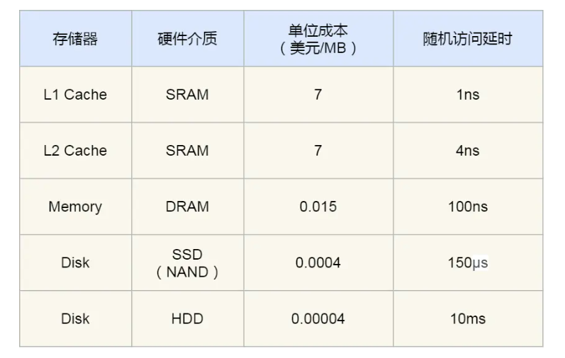

# CPU是如何执行程序的？
图灵机，纸带为存储，读写头包含控制部分，运算部分，存储部分。
- 冯 诺伊曼架构仿照图灵机设计了：输入输出设备（外设），存储单元（存储结构），逻辑运算单元，控制单元（CPU内部）五部分。
- CPU
分为32位和64位CPU，主要区别在于一次能计算多少个字节。
32位为4字节，64位为8字节。大的位宽可以一次进行更加大的数据的运算。
寄存器在cpu和内存之间。方便快速获取数据。
寄存器种类：
-- 通用寄存器，存放运算数据。结果和待运算数据。
-- 程序计数器PC，存放下一跳指令内存地址，（不是跳转指令就默认自增当前指令所长字节来寻找下一跳指令的地址）
-- 指令寄存器，存放当前指令
- 总线
-- 地址总线：和内存相连，指定CPU的操作的内存地址。
-- 数据总线： 读写内存的数据。
-- 控制总线：发送和接收信号，中断，设备复位等。。
三者关系，cpu读写内存数据，地址总线找到对应的内存地址，数据总线传输读写数据，控制总线这里可控制读/写操作。
- 输入/输出设备
数据输入（键盘，需要中断，需要控制总线）。输出设备负责数据输出。
- 线路位宽与CPU位宽
线路通过高低电平传输数据，表示1/0；为了避免数据传输是串行传输的低效率方式，需要增加线路进行并行传输。
线宽和cpu位宽不一样，线宽表示可以一次并行传输的数据位数。==一般来说cpu的位宽不要小于线路位宽，最好相等匹配==。
**64位cpu可以一次性算出两个64位数字的结果，而32位cpu则需要多次计算。正常情况下64位和32位没有什么区别，只有计算超过32位数字，64位又是才体现出来。同样64位cpu带来的还有地址总线的扩大，可访问内存范围增大**
## 程序执行的基本过程
程序是一个指令的顺序集合。
cpu读取当前PC指向的内存地址，并将该地址数据通过数据总线回传到指令寄存器。PC自增当前指令的长度/跳转指令则指向对应的指令内存地址。cpu分析指令类型为计算指令还是存储指令进行对应的操作。
对于add = 1 + 2来说，其对应的数据和代码细节：

## 指令
针对MIPS指令集指令分为I R J三种指令，有很多种类。
下面是IRJ三种指令对应的位数：

- R指令：操作码/功能码扩展标识指令类型，一般为算数逻辑指令，包含逻辑运算。位移量是数据的偏移计算使用。
- I指令：数据传输，条件分支常用。无位移量和功能码，无第三个寄存器。合并成一个地址值或者立即数。
- J指令：用于指令跳转，高6位外的26位都是一个跳转的地址。
**流水线方式**：
分为四个过程，即指令周期：
- 取指操作，通过程序计数器PC获取对应内存地址的指令。由控制器进行操作。
- cpu进行指令的解码。控制器进行
- cpu执行指令。运算器进行处理。地址跳转等J型指令只需要控制器不需要运算器。
- cpu将结果写回寄存器或者是将寄存器值写回内存。

## 指令类型
数据传输：store，load 寄存器与内存数据传输的指令，mov将一个内存地址的数据移动到另一个内存地址。
运算类型指令：加减乘除，位运算，比较大小等，他们最多只能处理两个寄存器中的数据。
跳转类型的指令：修改程序计数器的值达到跳转目的。if-else;switch-case;函数调用等。
信号类型的指令：trap，发生中断。
闲置类型的指令：nop，cpu空转一周期。
## 指令执行速度
CPU硬件参数，频率相关的。1GHZ表示一秒产生1G个时钟周期，cpu在一个时钟中期只完成一个动作。所以一般频率越高，时钟周期越短，执行速度越快。
程序的cpu执行时间 = cpu时钟周期数 x 时钟周期时间 = 指令数 x cpi(每条指令的平均时钟周期数) x 时钟周期时间。
如何优化程序执行速度?三方面:
- 指令数，由编译器进行优化。
- cpi，流水线技术，使指令平均时钟周期尽可能少。
- 时钟周期时间，计算机主频确定，由计算机硬件确定。超频即额外的提高cpu的时钟频率来减少时钟周期，加快程序运行。热量产生需要额外散热。

# 磁盘比内存满几万倍？
机械硬盘，固态硬盘，内存三个存储器，和寄存器，cpu L1/L2/L3三级cache速度之差。
下面是各类存储器的一个提纲

## 存储器的层次结构
速度：寄存器> cpu L1（指令缓存/数据缓存）>cpu L2/L3 cache >内存 >固态硬盘 >机械硬盘
- 寄存器，cpu大约有几十到几百个寄存器。32位cpu中大多数寄存器可存储4字节；64位cpu中大多数寄存器可存储8字节。寄存器访问速度快（半个时钟周期内）。
- cpu cache，采用静态随机存储器，SRAM（一个bit采用6个晶体管，存储密度低，但访问速度快）。断电丢失信息。

==L1 cache==:只需要2-4个时钟周期，几十KB-几百KB。**cpu核心独有**，分为指令缓存和数据缓存。

==l2 cache==:**每个cpu核心独有**，几百KB-几MB；速度在10-20个时钟周期。
下图是查看l2,l3的缓存大小结果

==l3 cache==:**多个cpu的核心共用**，几MB-几十MB，速度在20-60个时钟周期
- 内存，动态随机存取存储器DRAM，对比SRAM，DRAM存储密度高(只需要一个晶体管和一个电容来存储一个bit，电容漏电需不断刷新，此为动态之由来)，功耗低，容量大，造价更便宜。速度在200-300个时钟周期。
- ssd（固态）/hdd（机械）硬盘
ssd：断电数据不丢失，内存读写速度比ssd快10-1000倍。
hdd：断电数据不丢失，物理读写方式访问数据，内存速度比hdd快10W倍左右。
ssd现在价格接近hdd，hdd快被取代。
## 存储器的层次关系
每一种存储设备只会和相邻的存储器设备打交道。
下图是各存储设备的层次关系：

同理，cpu需要访问内存中某个数据的时候，依次按寄存器，cpu L1/L2/L3cache顺序，最后再是内存。有立刻返回。
## 存储器之间的实际价格和性能差距
如下表：

# 如何写出让cpu跑的更快的代码？
主旨是使程序尽可能使用到cpu cache的数据而不是内存从而提升速度。
本节提纲：

## cpu cache有多快？
cpu cache为何诞生？内存访问速度和寄存器速度之间相差200-300倍的速度，弥补之间的差距，加一层（==无论硬件还是软件层面，加一层总是可解决很多问题==）
程序执行时，内存数据先加载到L3,再加载到L2，最后再加入到L1，再被CPU读取。
## CPU Cache 的数据结构和读取过程是什么样的？
cpu cache由很多个的cache line组成，cache line是cpu从内存读取数据的基本单位。
下图是cache line的结构，可以存储多个数据

cpu读取数据，先读取缓存，没有再转内存，获取数据将数据读入cache，再从cache读取数据。
应用程序访问数据和cpu访问数据的相似性。redis缓存和cache的作用一致性。

