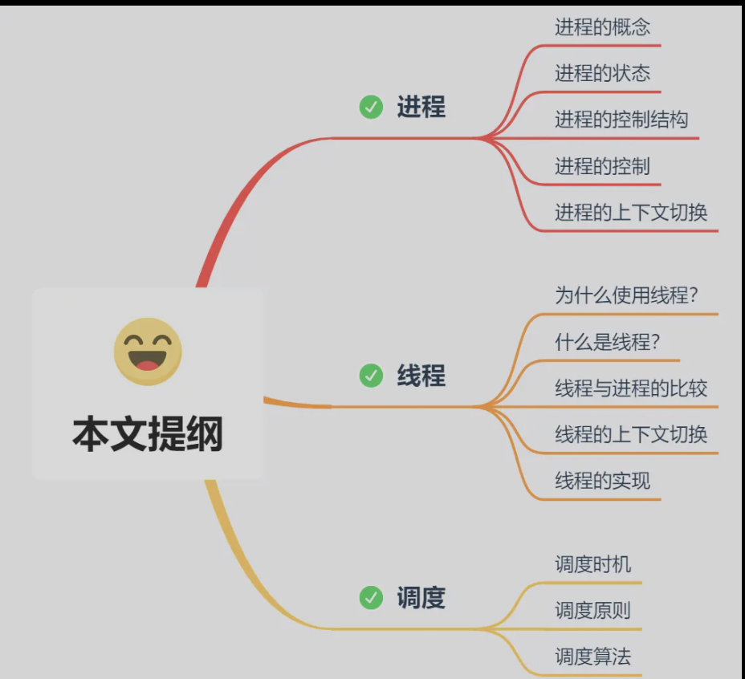
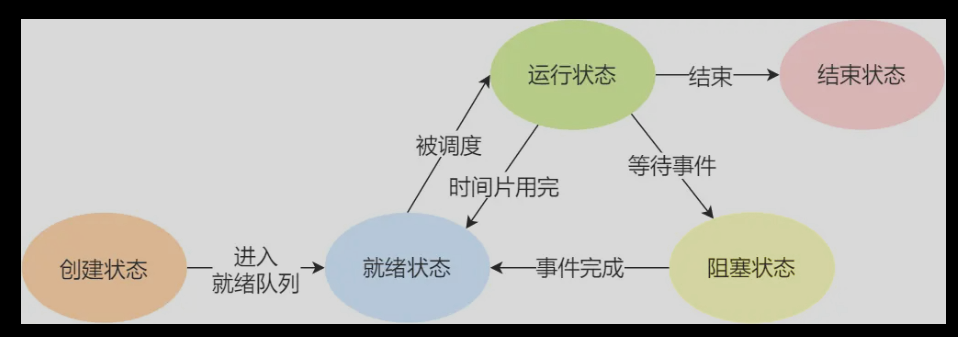
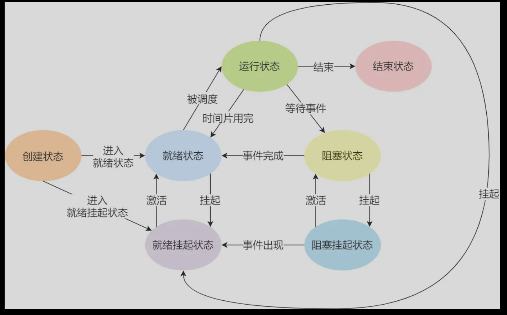

# 进程、线程基础知识
提纲

## 进程
### 进程状态

如上图，说明了进程的几个状态转换。
- NULL -> 创建状态：一个新进程被创建时的第一个状态；
- 创建状态 -> 就绪状态：当进程被创建完成并初始化后，一切就绪准备运行时，变为就绪状态，这个过程是很快的；
- 就绪态 -> 运行状态：处于就绪状态的进程被操作系统的进程调度器选中后，就分配给 CPU 正式运行该进程；
- 运行状态 -> 结束状态：当进程已经运行完成或出错时，会被操作系统作结束状态处理；
- 运行状态 -> 就绪状态：处于运行状态的进程在运行过程中，由于分配给它的运行时间片用完，操作系统会把该进程变为就绪态，接着从就绪态选中另外一个进程运行；
- 运行状态 -> 阻塞状态：当进程请求某个事件且必须等待时，例如请求 I/O 事件；
- 阻塞状态 -> 就绪状态：当进程要等待的事件完成时，它从阻塞状态变到就绪状态；
**在内存紧张时，即swap匿名页时，优先会选择那些阻塞态的进程进行换出，以避免处在就绪态或者运行态的进程的页换出导致缺页中断。**
而被换出到磁盘的进程，即进程没有占用实际的物理内存的情况，这个状态为挂起状态，分为就绪挂起和阻塞挂起。
- 阻塞挂起状态：进程在外存（硬盘）并等待某个事件的出现；
- 就绪挂起状态：进程在外存（硬盘），但只要进入内存，即刻立刻运行

处于挂起状态的原因不仅是进程的内存空间不在物理内存，还可能用户希望挂起（ctrl+Z）以及sleep让进程间歇性挂起（定时器原理）
### 进程控制结构
PCB（进程控制块，task_struct即linux中进程PCB的实现）
通过链表的方式组织进程，组成各种队列。也可以索引表索引（索引项指向具体的PCB）。
- 所有处于就绪状态的进程链在一起，成为就绪队列。
- 所有等待某事件而处于等待状态的进程链链接在一起，成为阻塞队列。
- 而运行队列在单核CPU只需要一个指针，多核会为每个核心维护就绪队列。

