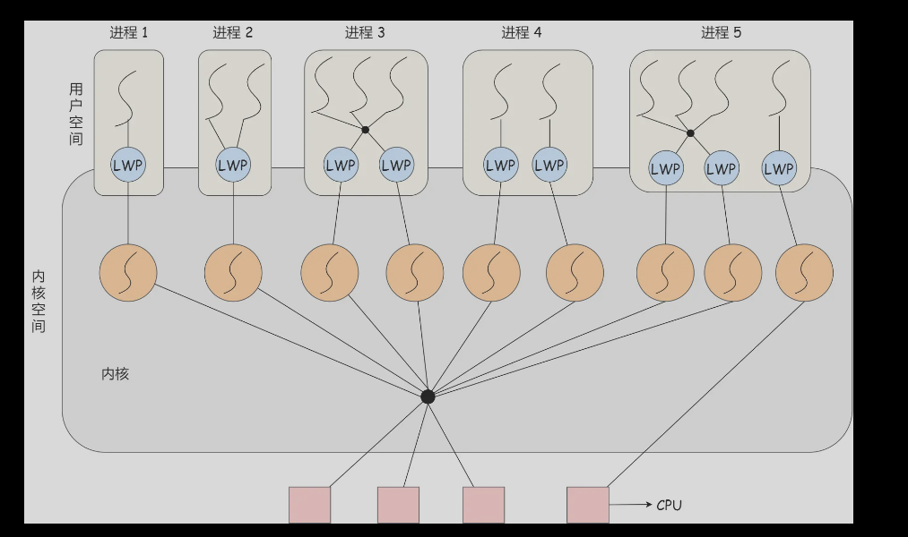
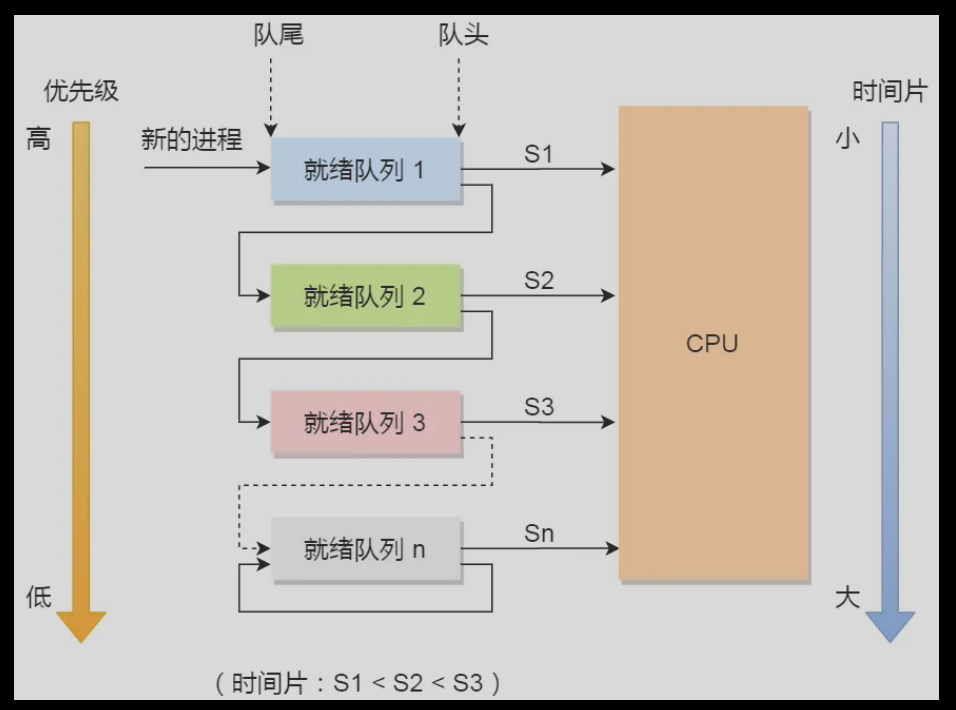

# 进程、线程基础知识
提纲


## 进程
### 进程状态

如上图，说明了进程的几个状态转换。
- NULL -> 创建状态：一个新进程被创建时的第一个状态；
- 创建状态 -> 就绪状态：当进程被创建完成并初始化后，一切就绪准备运行时，变为就绪状态，这个过程是很快的；
- 就绪态 -> 运行状态：处于就绪状态的进程被操作系统的进程调度器选中后，就分配给 CPU 正式运行该进程；
- 运行状态 -> 结束状态：当进程已经运行完成或出错时，会被操作系统作结束状态处理；
- 运行状态 -> 就绪状态：处于运行状态的进程在运行过程中，由于分配给它的运行时间片用完，操作系统会把该进程变为就绪态，接着从就绪态选中另外一个进程运行；
- 运行状态 -> 阻塞状态：当进程请求某个事件且必须等待时，例如请求 I/O 事件；
- 阻塞状态 -> 就绪状态：当进程要等待的事件完成时，它从阻塞状态变到就绪状态；
**在内存紧张时，即swap匿名页时，优先会选择那些阻塞态的进程进行换出，以避免处在就绪态或者运行态的进程的页换出导致缺页中断。**
而被换出到磁盘的进程，即进程没有占用实际的物理内存的情况，这个状态为挂起状态，分为就绪挂起和阻塞挂起。
- 阻塞挂起状态：进程在外存（硬盘）并等待某个事件的出现；
- 就绪挂起状态：进程在外存（硬盘），但只要进入内存，即刻立刻运行

处于挂起状态的原因不仅是进程的内存空间不在物理内存，还可能用户希望挂起（ctrl+Z）以及sleep让进程间歇性挂起（定时器原理）
### 进程控制结构
PCB（进程控制块，task_struct即linux中进程PCB的实现）
通过链表的方式组织进程，组成各种队列。也可以索引表索引（索引项指向具体的PCB）。
- 所有处于就绪状态的进程链在一起，成为就绪队列。
- 所有等待某事件而处于等待状态的进程链链接在一起，成为阻塞队列。
- 而运行队列在单核CPU只需要一个指针，多核会为每个核心维护就绪队列。
### 进程的控制
- 创建进程，空白PCB申请，分配资源（资源不足，挂载到等待队列），插入就绪队列，等待调度。
- 终止进程，正常/异常/外界干预（kill）。过程：查找进程PCB;执行则终止，重新分配CPU;有子进程，交给1号进程/init进程接管；归还资源；从PCB队列中删除。
- 阻塞进程。过程：找到PCB，运行态则保护现场，转为阻塞态；PCB放到阻塞队列。
- 唤醒进程，过程：该事件阻塞队列找到PCB；移除阻塞队列，置为就绪状态；PCB插入就绪态，等待调度
### 进程的上下文切换
**进程的上下文切换不仅包含了虚拟内存、栈、全局变量等用户空间的资源，还包括了内核堆栈、寄存器等内核空间的资源。**
进程的现场信息会保存在PCB的数据结构中，保证下次调用该进程继续运行，恢复现场。
**常见进程上下文切换场景**：
进程被动：
- 为了保证所有进程可以得到公平调度，CPU 时间被划分为一段段的时间片，这些时间片再被轮流分配给各个进程。这样，当某个进程的时间片耗尽了，进程就从运行状态变为就绪状态，系统从就绪队列选择另外一个进程运行；
- 进程在系统资源不足（比如内存不足）时，要等到资源满足后才可以运行，这个时候进程也会被挂起，并由系统调度其他进程运行；
- 当有优先级更高的进程运行时，为了保证高优先级进程的运行，当前进程会被挂起，由高优先级进程来运行；
- 发生硬件中断时，CPU 上的进程会被中断挂起，转而执行内核中的中断服务程序；
进程主动：
- 当进程通过睡眠函数 sleep 这样的方法将自己主动挂起时，自然也会重新调度。
## 线程
独立运行最小单位。
需要实体并发运行，维护系统开销小，需要共享地址空间进行数据处理。
共享代码段，数据段，打开文件等资源；线程有独立寄存器和栈。
线程优缺点：优点：多并发，共享资源，一个进程可多个线程。缺点：进程中的一个线程崩溃，导致同一进程下所有线程崩溃。
### 线程进程的比较
**线程能减少并发执行的时间和空间开销**：
- 线程创建时间比进程块，不需要资源管理信息（内存，文件等），直接共享。
- 线程终止时间比进程块，释放资源少。
- 线程切换比进程切换块，有同一块页表，在切换时不需要切换页表。
- 同一进程的各线程间共享内存和文件资源，线程传递数据，不经过内核。数据交互效率高。
### 线程上下文切换
- 线程属于不同进程，和不同进程切换一样
- 两个线程在同一进程，只切换线程的私有数据，寄存器，栈等不共享数据
### 线程的实现
- 用户线程，在用户空间实现的线程，用户态线程库进行管理
- 内核线程，内核实现，内核管理
- 轻量级进程，内核中支持用户线程
用户线程和内核线程：一对一，多对一，多对多。
**用户线程**：基于用户态的线程管理库实现（如C++的ucontext库创建），TCB也在库里实现，OS看不到这个TCB,只能看见主进程的PCB.用户线程的管理，调度；由用户级线程库函数来完成线程的管理。
用户线程的模型，**即多对一**
**用户现场优点**：
- 每个进程都需要有它私有的线程控制块（TCB）列表，用来跟踪记录它各个线程状态信息（PC、栈指针、寄存器），TCB 由用户级线程库函数来维护，可用于不支持线程技术的操作系统；
- 用户线程的切换也是由线程库函数来完成的，无需用户态与内核态的切换，所以速度特别快；
**用户线程的缺点**：
- 由于操作系统不参与线程的调度，如果一个线程发起了系统调用而阻塞，那进程所包含的用户线程都不能执行了。
- 当一个线程开始运行后，除非它主动地交出 CPU 的使用权，否则它所在的进程当中的其他线程无法运行，因为用户态的线程没法打断当前运行中的线程，它没有这个特权，只有操作系统才有，但是用户线程不是由操作系统管理的。
- 由于时间片分配给进程，故与其他进程比，在多线程执行时，每个线程得到的时间片较少，执行会比较慢。
**内核级线程**：由OS进行管理，线程创建，终止，管理由OS负责。
内核级线程的模型，**即一对一**
**内核线程的优点**：
- 在一个进程当中，如果某个内核线程发起系统调用而被阻塞，并不会影响其他内核线程的运行；
- 分配给线程，多线程的进程获得更多的 CPU 运行时间；
**内核线程的缺点**：
- 在支持内核线程的操作系统中，由内核来维护进程和线程的上下文信息，如 PCB 和 TCB；
- 线程的创建、终止和切换都是通过系统调用的方式来进行，因此对于系统来说，系统开销比较大。
轻量级进程，内核支持的用户线程，一个进程可有一个/多个LWP;一个LWP和内核线程一一对应，LWP由内核管理。如下三种线程的关系：

一对一和N对一模式优缺点和上面一样。
M:N模式，首先pthread创建N个LWP线程，每个LWP线程跑一样的M个用户级线程，然后构成了M:N模式。同时结合两种优点。
**组合模式**：如上面进程5.同时存在M:N和一对一模式。
## 协程
协程是编译器级的，进程和线程是操作系统级的。**协程是一种程序组件，是由子例程（过程、函数、例程、方法、子程序）的概念泛化而来的，子例程只有一个入口点且只返回一次，而协程允许多个入口点，可以在指定位置挂起和恢复执行。**
### 协程的目的
无协程的时候，应对IO有三种模型：
- 同步编程: 应用程序等待IO结果，阻塞当前线程。
- 异步多线程/进程：IO操作频繁的逻辑，单纯的IO操作独立到一个或多个线程 中，业务线程和IO线程通信或全局变量来共享数据。
- 异步消息加回调函数：消息循环处理器，接收外部消息，收到消息调用注册的回调函数。
协程即用同步的语义解决异步问题，不阻塞当前线程。协程用来解决异步逻辑的编程复杂问题。
协程优缺点：
**优点**：
- 协程更加轻量，创建成本更小，降低了内存消耗
- 协程有自己的调度器，减少了 CPU 上下文切换的开销，提高了 CPU 缓存命中率
- 减少同步加锁，整体上提高了性能
- 可以按照同步思维写异步代码，即用同步的逻辑，写由协程调度的回调
**缺点**：
- 在协程执行中不能有阻塞操作，否则整个线程被阻塞
- 协程可以处理 IO 密集型程序的效率问题，但不适合处理 CPU 密集型问题
**适用场景**：
- 高性能计算，牺牲公平性换取吞吐。
- 在 IO 密集型的任务
- Generator 式的流式计算
**实现原理**：
==**协程是一种轻量的用户级线程**==，实现非抢占式调度。协程可以调用主动让出CPU的API来切换协程。也可以自己执行不下去，**执行到协程池里的协程调度器的代码，调度器根据适合的调度算法是找到当前最需要CPU的协程**。基于GNU C/C++的ucontext库可以实现。
### 调度
非抢占式调度算法，让该进程运行直到被阻塞，直到该进程退出。
抢占式调度算法，运行某段时间，结束则挂起，然后从就绪队列再挑选另一个进程，抢占式的调度处理，在时间间隔末端发生时钟中断。
**调度原则**：
- CPU 利用率：调度程序应确保 CPU 是始终匆忙的状态，这可提高 CPU 的利用率；
- 系统吞吐量：吞吐量表示的是单位时间内 CPU 完成进程的数量，长作业的进程会占用较长的 CPU 资源，因此会降低吞吐量，相反，短作业的进程会提升系统吞吐量；
- 周转时间：周转时间是进程运行+阻塞时间+等待时间的总和，一个进程的周转时间越小越好；
- 等待时间：这个等待时间不是阻塞状态的时间，而是进程处于就绪队列的时间，等待的时间越长，用户越不满意；
- 响应时间：用户提交请求到系统第一次产生响应所花费的时间，在交互式系统中，响应时间是衡量调度算法好坏的主要标准。
#### 调度算法
先来先服务；最短作业优先调度；高响应比优先算法（理想算法，进程的运行时间未知）；时间片轮转调度；
**最高优先级调度**
非抢占式/抢占式进程：非抢占式是当前进程运行完毕后，再调用。抢占式：当就绪队列中出现优先级高的进程，进程挂起，调度优先级高的进程运行。
**多级反馈队列调度算法**：
时间片轮转和最高优先级算法的综合。多优先级，优先级越高，时间片越短。

同时兼顾短作业和长作业；有较好的响应时间。

# 进程间的通信方式
管道，消息队列通信，共享内存，信号量，信号，socket
## 管道
管道读取数据是先入先出的，不能适用文件定位lseek的操作。
### 匿名管道
如linux命令的 | ,即是一个匿名管道，用完就销毁。
此外 int pipe(int fd[2])也是一个匿名管道。
这个可以用于父子进程间的管道通信。如下：
```c++
#include <cstdio>//父子进程中一个关掉管道的读端，一个关掉管道的写端。
#include <iostream>
#include <unistd.h>
#include <sys/wait.h>
using namespace std;

int main(int argc, char *argv[]) {
    int fd[2];  // fd[0] for reading, fd[1] for writing
    pipe(fd);
    int pid = fork();
  
    if(pid > 0) { //Parent process (writer)
        close(fd[0]);
        char message[] = "Hello from parent!";
        write(fd[1], message, sizeof(message) + 1);
        close(fd[1]);
        
        wait(NULL);
    } else if(pid == 0) { //Child process (reader)
        close(fd[1]);
        char buff[1024];
        read(fd[0], buff, sizeof(buff));
        cout << "Received: " << buff << endl;
        close(fd[0]);
    } else {
        perror("fork");
        exit(1);
    }
    return 0;
}
```
如果需要父子进程的双向通信，则应该是创建两个管道，而不是用一个管道，进程对同一个管道不能既读又写。
shell脚本里面的[|]，shell进程创建多个子进程，来进行通信。尽量避免[|]。
### 命名管道
它可以在不相关的进程间也能相互通信。
```c++
//写进程
#include <fcntl.h>
#include <sys/stat.h>
#include <iostream>
#include <unistd.h>

int main() {
    const char* pipeName = "/tmp/myfifo";
    mkfifo(pipeName, 0666);
 
    int pipe = open(pipeName, O_WRONLY);
 
    std::string message = "Hello Linux!";
    write(pipe, message.c_str(), message.length()+1);
    close(pipe);
 
    return 0;
}

//读进程
#include <fcntl.h>
#include <sys/stat.h>
#include <iostream>
#include <unistd.h>

int main() {
    const char* pipeName = "/tmp/myfifo";
 
    int pipe = open(pipeName, O_RDONLY);
 
    char buffer[128];
    read(pipe, buffer, sizeof(buffer));
    std::cout << "Received: " << buffer << std::endl;
    
    close(pipe);
    unlink(pipeName);//将该文件的链接数减一，为0则删除释放资源

    return 0;
}
```
## 消息队列
管道的通信效率低，不适合进程间频繁交换数据。
消息队列是保存在内核中的消息链表，在发送数据时，会分成一个一个独立的数据单元，也就是消息体（数据块），消息体是用户自定义的数据类型，消息的发送方和接收方要约定好消息体的数据类型，所以每个消息体都是固定大小的存储块，不像管道是无格式的字节流数据。如果进程从消息队列中读取了消息体，内核就会把这个消息体删除。**类似于邮件发送的方式**。
**缺点**：存在通信不及时以及消息大小有限制（单个消息有大小限制，整体的队列也有大小的限制 MSGMAX,MSGMNB以字节为单位，定义了消息和队列的的最大长度）。消息队列通信过程中，存在用户态与内核态之间的数据拷贝开销。
```c++
//发送端
#include <fcntl.h>
#include <mqueue.h>
#include <iostream>

int main() {
    const char* queueName = "/myqueue";
    
    struct mq_attr attr;
    attr.mq_maxmsg = 10;
    attr.mq_msgsize = 1024;

    mqd_t mqd = mq_open(queueName, O_CREAT | O_WRONLY, 0666, &attr);

    if(mqd == (mqd_t) -1) {
        perror("mq_open");
        exit(1);
    }

    std::string message = "Hello Linux!";
    if(mq_send(mqd, message.c_str(), message.length()+1, 0) == -1) {//发送char数据
        perror("mq_send");
        exit(1);
    }

    mq_close(mqd);
    
    return 0;
}

//写端
#include <fcntl.h>
#include <mqueue.h>
#include <iostream>

int main() {
    const char* queueName = "/myqueue";

    mqd_t mqd = mq_open(queueName, O_RDONLY);

    if(mqd == (mqd_t) -1) {
        perror("mq_open");
        exit(1);
    }

    char buffer[1024];
    if(mq_receive(mqd, buffer, sizeof(buffer), NULL) == -1) {//读取char型数据
        perror("mq_receive");
        exit(1);
    }
    
    std::cout << "Received: " << buffer << std::endl;

    mq_close(mqd);
    mq_unlink(queueName);

    return 0;
}
```
## 共享内存
消息队列的消息大小限制，以及内核态和用户态的切换费时。
共享内存的机制，解决消息拷贝内核和用户态的切换费时。即进程A，B拿出一部分的虚拟空间映射到相同的物理内存。不需要拷贝。但是这样又增加了数据竞态的问题，引出信号量机制。
## 信号量
使用信号量的PV机制，在访问共享内存前P操作，在退出共享内存后V操作。