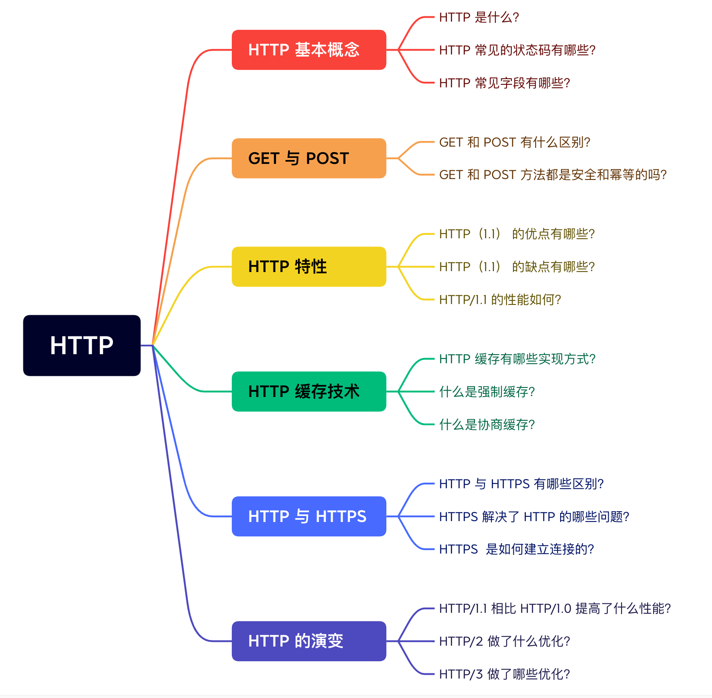
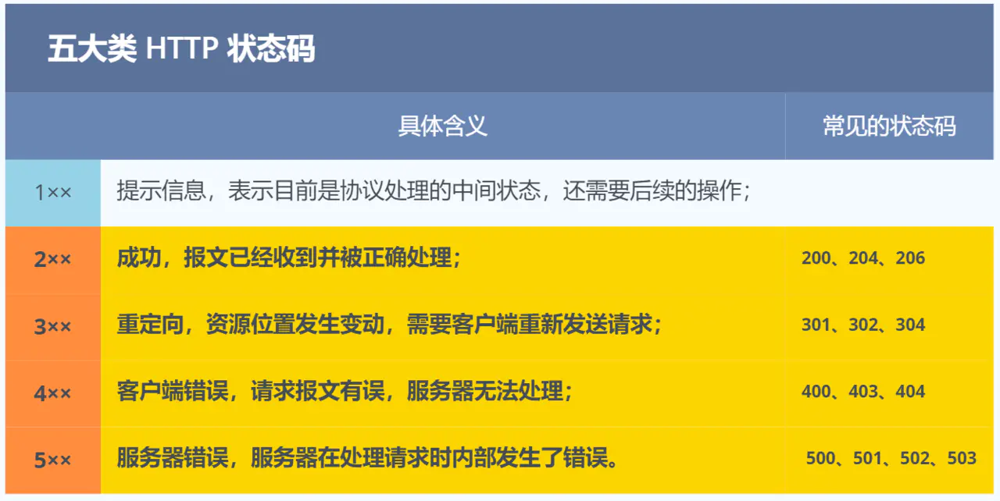
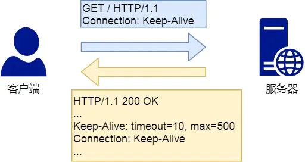
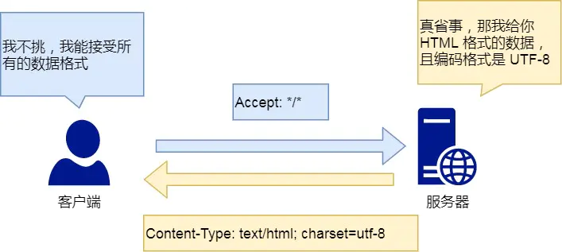
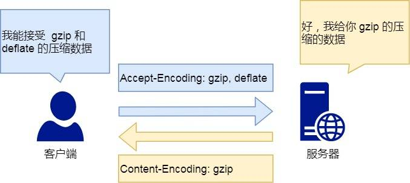

# http常见的面试题
总结提纲：

## http基本概念
http:超文本传输协议
**超文本**：是超越了普通文本的文本，它是文字、图片、视频等的混合体，最关键有超链接，能从一个超文本跳转到另外一个超文本。如html网页。
**http常见的响应状态码**:

3xx 类状态码表示客户端请求的资源发生了变动，需要客户端用新的 URL 重新发送请求获取资源，也就是重定向。
4xx 类状态码表示**客户端发送的报文有误，服务器无法处理**，也就是错误码的含义。
5xx 类状态码表示客户端请求报文正确，但是**服务器处理时内部发生了错误，属于服务器端的错误码。**
**http常见的字段**：
**host字段**：指定服务器的域名。
**Content-Length 字段**：指定本次回应的数据长度。http协议在头部各消息体之间设置回车符，换行符作为边界。通过content-length字段作为http body的边界，是为了解决粘包问题。TCP协议存在粘包问题，是面向字节流的。可以使用自定义消息体，在头部加上报文长度（最常用）。或者固定报文长度等来解决。
**Connection 字段**：最常用于客户端要求服务器使用「HTTP 长连接」机制（任意一段没明确提出断开连接，则保持该连接状态），如下：

tcp-keepalive和HTTp的保活机制区别：
- TCP的保活机制是指，当对方长时间（通常是两个小时）没有回应时，TCP会自动发送保活探测数据包，以确认对方是否还在线。如果连续发送多次（通常是9次）探测包后，对方仍未回应，那么TCP就会判断对方已经下线，并自动关闭这个连接。
- HTTP的保活机制（HTTP Keep-Alive）是为了解决每次请求都要重新建立TCP连接的问题。当启用HTTP Keep-Alive时，客户端和服务器之间的连接在完成一次HTTP请求后不会立刻关闭，而是会保持一段时间（由Keep-Alive超时时间决定），在这段时间内，如果客户端有新的请求，可以复用这个TCP连接，而不需要重新建立。这样可以降低服务器的负载，提高处理效率，并减少网络传输的延迟。
**Content-Type 字段**：用于服务器回应时，告诉客户端，本次数据格式。

**Content-Encoding 字段：**说明数据的压缩方法。表示服务器返回的数据使用了什么压缩格式。

## GET/POST
- 根据 RFC 规范，GET 的语义是从服务器获取指定的资源，这个资源可以是静态的文本、页面、图片视频等。GET 请求的参数位置一般是写在 URL 中，URL 规定只能支持 ASCII，所以 GET 请求的参数只允许 ASCII 字符 ，而且浏览器会对 URL 的长度有限制（**HTTP协议本身对 URL长度并没有做任何规定**）。
- POST 的语义是根据请求负荷（报文body）对指定的资源做出处理，具体的处理方式视资源类型而不同。POST 请求携带数据的位置一般是写在报文 body 中，body 中的数据可以是任意格式的数据，**只要客户端与服务端协商好即可，而且浏览器不会对 body 大小做限制。**
### GET/POST方法是安全和幂等的吗
RFC定义：
- GET 方法就是安全且幂等的，因为它是「只读」操作，无论操作多少次，服务器上的数据都是安全的，且每次的结果都是相同的。所以，可以对 GET 请求的数据做缓存，这个缓存可以做到浏览器本身上（彻底避免浏览器发请求），也可以做到代理上（如nginx），而且在浏览器中 GET 请求可以保存为书签。
- **POST 因为是「新增或提交数据」的操作，会修改服务器上的资源，所以是不安全的，且多次提交数据就会创建多个资源，所以不是幂等的。所以，浏览器一般不会缓存 POST 请求，也不能把 POST 请求保存为书签。**
总的来说起始取决于实现，RFC文档虽这样规定。但是也可实现GET增加，修改资源；也可以POST查询数据。
**不是说GET比POST安全，只是参数在GET暴露在URL中，POST是在body中，但是抓个包也能获取！**，理论上来说，要想安全就需要实现https的加密传输。
## http缓存技术
对于一些具有重复性的 HTTP 请求，比如每次请求得到的数据都一样的，我们可以把这对「请求-响应」的数据都缓存在本地，那么下次就直接读取本地的数据.http1.1性能提升。分为 **强制缓存和协商缓存**
### 什么是强制缓存？
强缓存指的是只要浏览器判断缓存没有过期，则直接使用浏览器的本地缓存，决定是否使用缓存的主动性在于浏览器这边。
cache-control/expires字段均表示过期时间。
当浏览器第一次请求访问服务器资源时，服务器会在返回这个资源的同时，在 Response 头部加上 Cache-Control，Cache-Control 中设置了过期时间大小。
浏览器再次请求访问服务器中的该资源时，会先通过请求资源的时间与 Cache-Control 中设置的过期时间大小，来计算出该资源是否过期，如果没有，则使用该缓存，否则重新请求服务器。 
服务器再次收到请求后，会再次更新 Response 头部的 Cache-Control。
### 什么是协商缓存？
