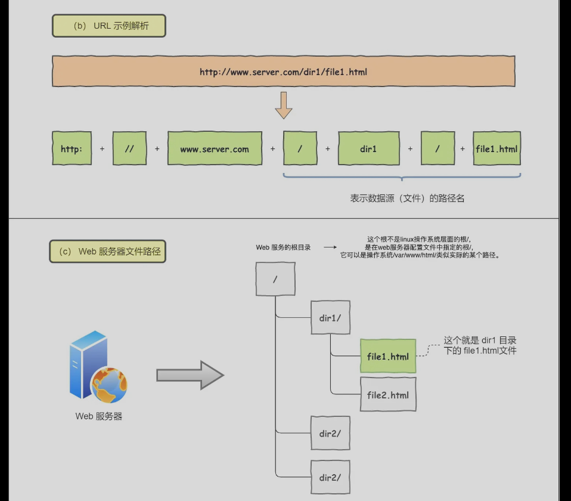

# TCP/IP网络有几层？
## 应用层
应用层只需要专注于为用户提供应用功能，比如 HTTP、FTP、Telnet、DNS、SMTP。
- HTTP (超文本传输协议): 这是一种无状态的协议，主要用于传输网页文件和其他基于网页的数据。当你在浏览器中输入一个网址并按下回车键时，会发起一个HTTP请求到服务器。服务器接收并处理这个请求，然后返回一个HTTP响应，其中包含请求的网页内容（包括HTML、图片、脚本等）。
- FTP (文件传输协议): 这是一个用于在客户端和服务器之间传输文件的协议。它使用两个端口来处理通信：一个用于命令（通常是端口21），一个用于数据（通常是端口20）。FTP支持大文件的上传和下载，以及对远程文件系统的基本操作（例如删除、重命名文件）。
- Telnet: 该协议用于在因特网或本地计算机网络上提供双向、交互式文本传输功能。达到远程控制主机或管理设备的目的。Telnet客户端提供了一种命令行界面来和远程服务器通信。
- DNS (域名系统): 当用户在浏览器地址栏中键入网址（例如：www.google.com）时，浏览器通过向DNS服务器查询，将网址转换为该网站的实际IP地址。一旦获取到IP地址，浏览器就可以通过网络连接到该服务器并请求网站内容。
- SMTP (简单邮件传输协议): 这是一种推送协议，主要用于将电子邮件从客户端发送到服务器，或者在邮件服务器之间传输电子邮件。在这个过程中，邮件服务器将作为邮件的中继站，直到邮件被送到最终的目的地。- 
**应用层工作在用户态，下面的层都是内核态**
## 传输层
TCP优点：流量控制，超时重传，拥塞控制，可靠传输
UDP:实现简单，实时性高，传输效率高。UDP可实现可靠传输，只不过可在应用层保证有序，超时重传，检验和等。
应用层数据包大，，超过MSS(TCP最大报文长度)，到传输层需要分块。每一个块叫TCP段。
传输层报文携带端口。接收方可识别报文的目的服务。（每个服务对应自己的端口）
## 网络层
网络层负责实际传输，在传输层头部再加上IP头组成IP报文；IP报文大小超过MTU（1500字节）,会再次进行分片，得到一个即将发送的网络的IP报文。

IP协议一是寻址，10.100.122.0/24；24表示掩码，可计算出网络号和主机号。一般是先找到网络号对应的子网；再从子网找对应的主机。
二是路由，网关（可硬件集成到家庭路由器中（WAN，LAN协议的转换），也可以作为一种软件服务进行数据协议转换等。）、路由器、交换机构成很多路径。选择路径到达。
寻址是告诉下一个目的地往哪里走，路由则是实际如何选择哪条路径（可能多个方向）。
## 网络接口层
IP头部加上MAC帧，封装成数据帧。IP地址可以直到目的地址是哪里，但是以太网还需要额外的处理
以太网：**电脑上的以太网接口，Wi-Fi接口，以太网交换机、路由器上的千兆，万兆以太网口，还有网线，它们都是以太网的组成部分。以太网就是一种在「局域网」内，把附近的设备连接起来，使它们之间可以进行通讯的技术。**
IP地址和MAC地址都需要有，作用不同。当目的IP在同一个子网下，则直接查询ARP缓存得到对应的MAC地址；如果不在，则先发送到本地的网关/路由器上，MAC地址同时更换为本地的路由器的MAC地址，然后不断的进行路由寻址，这个过程中，MAC地址不断更换。

# 键入网址到网页显示，期间发生了什么？
## http的url格式解析，和http报文格式
下面是URL的解析，没有路径名则访问根目录下的实现设置的默认文件。

如下图为http的请求报文和响应报文。请求报文有GET（信息在网址里面）/POST(信息在消息头里面);响应报文有对应的状态码和数据返回。

## 地址查询DNS
在将http报文发送给web服务器前，需要直到目的IP地址，则DNS域名服务器。
如下图：域名的层级结构

域名解析的流程：
- 客户端首先会发出一个 DNS 请求，问 www.server.com 的 IP 是啥，并发给本地 DNS 服务器（也就是客户端的 TCP/IP 设置中填写的 DNS 服务器地址）。
- 本地域名服务器收到客户端的请求后，如果缓存里的表格能找到 www.server.com，则它直接返回 IP 地址。如果没有，本地 DNS 会去问它的根域名服务器：“老大， 能告诉我 www.server.com 的 IP 地址吗？” 根域名服务器是最高层次的，它不直接用于域名解析，但能指明一条道路。
根 DNS 收到来自本地 DNS 的请求后，发现后置是 .com，说：“www.server.com 这个域名归 .com 区域管理”，我给你 .com 顶级域名服务器地址给你，你去问问它吧。”
- 本地 DNS 收到顶级域名服务器的地址后，发起请求问“老二， 你能告诉我 www.server.com 的 IP 地址吗？”
- 顶级域名服务器说：“我给你负责 www.server.com 区域的权威 DNS 服务器的地址，你去问它应该能问到”。
- 本地 DNS 于是转向问权威 DNS 服务器：“老三，www.server.com对应的IP是啥呀？” server.com 的权威 DNS 服务器，它是域名解析结果的原出处。为啥叫权威呢？就是我的域名我做主。
- 权威 DNS 服务器查询后将对应的 IP 地址 X.X.X.X 告诉本地 DNS。
- 本地 DNS 再将 IP 地址返回客户端，客户端和目标建立连接
**下面是流程**：

缓存的应用，不用每次这样获取：浏览器会先看自身有没有对这个域名的缓存，如果有，就直接返回，如果没有，就去问操作系统，操作系统也会去看自己的缓存，如果有，就直接返回，如果没有，再去 hosts 文件看，也没有，才会去问「本地 DNS 服务器」。
## 协议栈
传输层的 TCP/UDP
网络层的 IP/ICMP 协议
IP 下面的网卡驱动程序负责控制网卡硬件，而最下面的网卡则负责完成实际的收发操作，也就是对网线中的信号执行发送和接收操作。
## 可靠传输-TCP
如下是TCP的报文格式

源端口号/目的端口号；用来确定是哪一个服务。区分目的/源主机服务。包序号用于将包有序重排，解决包乱序。（TCP的重拍功能）。
确认号，确认发出去后，对方有收到。（超时重传机制）。状态位，如SYN(发起连接)，ACK(回复)，RST(重新连接)，FIN(结束连接)。
窗口大小，标识当前的处理能力（流量控制）。还有拥塞控制。
如下是进行三次握手的具体情况

MTU：一个网络包的最大长度，以太网中一般为 1500 字节。超过切片。
MSS：除去 IP 和 TCP 头部之后，一个网络包所能容纳的 TCP 数据的最大长度。超过分段。
如下是加上TCP报文头的数据段，http头部和数据在tcp报文的数据部分。

## 远程定位IP
如下是IP报文格式

源地址IP，即是客户端输出的 IP 地址/目标地址，即通过 DNS 域名解析得到的 Web 服务器 IP。
协议号：06标识TCP协议。
IP源地址，当本地有多个网卡时，可以选择一个（在没有显式设定的情况下），选择什么，就在哪个网卡上发送该包。怎样选择网卡？

如上图，目的IP和本地OS的路由表进行掩码比较计算，有网络号匹配的则由对应的网关（网卡发送）；如果没有，最终指向默认网关（路由器）,将把所有包发到对应的路由器IP地址。将IP的TCP字段指向上面的TCP报文头部；TCP报文放在IP报文的数据部分。
## MAC

发送方和接收方的目标MAC地址，用于两点传输。
MAC头协议：IP/ARP协议
查路由表，寻找到对应的一项。发送到对应的gateway，ARP协议获取对应的gateway的ip的对应的MAC地址。最终封装如下：

## 网卡

网卡驱动获取网络包之后，会将其复制到网卡内的缓存区中，接着会在其开头加上报头和起始帧分界符，在末尾加上用于检测错误的帧校验序列。

用于进行起始帧的标记和末尾的FCS校验。
## 交换机
工作在MAC层。**计算机的网卡本身具有 MAC 地址，并通过核对收到的包的接收方 MAC 地址判断是不是发给自己的，如果不是发给自己的则丢弃；相对地，交换机的端口不核对接收方 MAC 地址，而是直接接收所有的包并存放到缓冲区中。因此，和网卡不同，交换机的端口不具有 MAC 地址。**

如上，获取MAC地址，直到对应到哪个端口上，然后再发送。交换机无对应的项？
无对应项，发送到除源端口外的所有端口进行试探！如果目标MAC是广播地址：FF:FF:FF:FF:FF:FF。也这样处理。
## 路由器
路由器和交换机的区别：
==因为路由器是基于 IP 设计的，俗称三层网络设备，路由器的各个端口都具有 MAC 地址和 IP 地址==
而交换机是基于以太网设计的，俗称二层网络设备，交换机的端口不具有 MAC 地址。
==服务器完成包接收操作之后，路由器就会去掉包开头的 MAC 头部。MAC 头部的作用就是将包送达路由器，其中的接收方 MAC 地址就是路由器端口的 MAC 地址。因此，当包到达路由器之后，MAC 头部的任务就完成了，于是 MAC 头部就会被丢弃。接下来，路由器会根据 MAC 头部后方的 IP 头部中的内容进行包的转发操作。==

如上图所示：
- 如果网关是一个 IP 地址，则这个IP 地址就是我们要转发到的目标地址，还未抵达终点，还需继续需要路由器转发。
- 如果网关为空，则 IP 头部中的接收方 IP 地址就是要转发到的目标地址，也是就终于找到 IP 包头里的目标地址了，说明已抵达终点。
==源 IP 和目标 IP 始终是不会变的，一直变化的是 MAC 地址，因为需要 MAC 地址在以太网内进行两个设备之间的包传输==
**解析大致流程：客户端浏览器键入网址，DNS域名解析获取IP，建立TCP连接，http头，tcp头，ip头，mac头层层封装；然后寻址路由，到达目的服务器，层层剥离头部；然后http请求报文进行，服务器处理后构成响应报文，层层封装后，又返回给客户端。客户端浏览器获取对应的html资源后，生成DOM树，渲染生成网页！最后客户端离开，则四次挥手**

# Linux系统是如何收发网络包的？
网络模型各个层的作用：
七层网络模型：
应用层，负责给应用程序提供统一的接口；
表示层，负责把数据转换成兼容另一个系统能识别的格式；
会话层，负责建立、管理和终止表示层实体之间的通信会话；
传输层，负责端到端的数据传输；
网络层，负责数据的路由、转发、分片；
数据链路层，负责数据的封帧和差错检测，以及 MAC 寻址；
物理层，负责在物理网络中传输数据帧；
四层网络模型：
应用层，负责向用户提供一组应用程序，比如 HTTP、DNS、FTP 等;
传输层，负责端到端的通信，比如 TCP、UDP 等；
网络层，负责网络包的封装、分片、路由、转发，比如 IP、ICMP 等；
网络接口层，负责网络包在物理网络中的传输，比如网络包的封帧、 MAC 寻址、差错检测，以及通过网卡传输网络帧等；
网络协议栈：

## linux接收网络包流程
首先网卡接收数据，DMA到内存中；接收数据后，发送中断信号给CPU；采用NAPI机制；（禁用设备的中断，然后设置设备为poll模式，下次数据到来不用中断CPU告知数据到达）；再发起软中断，延后处理数据包
**内核中的 ksoftirqd 线程专门负责软中断的处理，当 ksoftirqd 内核线程收到软中断后，就会来轮询处理数据。ksoftirqd 线程会从 Ring Buffer 中获取一个数据帧，用 sk_buff 表示，从而可以作为一个网络包交给网络协议栈进行逐层处理。**
**网络协议栈处理**：
- 会先进入到网络接口层，在这一层会检查报文的合法性，如果不合法则丢弃，合法则会找出该网络包的上层协议的类型，比如是 IPv4，还是 IPv6，接着再去掉帧头和帧尾，然后交给网络层。
- 到了网络层，则取出 IP 包，判断网络包下一步的走向，比如是交给上层处理还是转发出去。当确认这个网络包要发送给本机后，就会从 IP 头里看看上一层协议的类型是 TCP 还是 UDP，接着去掉 IP 头，然后交给传输层。
- 传输层取出 TCP 头或 UDP 头，根据四元组「源 IP、源端口、目的 IP、目的端口」 作为标识，找出对应的 Socket，并把数据放到 Socket 的接收缓冲区。
## linux发送网络包的流程
- 应用程序会调用 Socket 发送数据包的接口，由于这个是系统调用，所以会从用户态陷入到内核态中的 Socket 层，内核会申请一个内核态的 sk_buff 内存，将用户待发送的数据拷贝到 sk_buff 内存，并将其加入到发送缓冲区。（第一次数据拷贝）
- 接下来，网络协议栈从 Socket 发送缓冲区中取出 sk_buff，并按照 TCP/IP 协议栈从上到下逐层处理。如果使用的是 TCP 传输协议发送数据，那么先拷贝一个新的 sk_buff 副本（二次拷贝） ，这是因为 sk_buff 后续在调用网络层，最后到达网卡发送完成的时候，这个 sk_buff 会被释放掉。而 TCP 协议是支持丢失重传的，在收到对方的 ACK 之前，这个 sk_buff 不能被删除。所以内核的做法就是每次调用网卡发送的时候，实际上传递出去的是 sk_buff 的一个拷贝，等收到 ACK 再真正删除。
- 接着，对 sk_buff 填充 TCP 头。这里提一下，sk_buff 可以表示各个层的数据包，在应用层数据包叫 data，在 TCP 层我们称为 segment，在 IP 层我们叫 packet，在数据链路层称为 frame。
==为了减少拷贝，各层之间使用同一个sk_buff数据结构来描述网络包，移动sk_buff指针添加头部==

传输层完成，然后到网络层，填充IP头，netfilter过滤，数据切片。再网络接口层，帧头帧尾；将sk_buff放入到网卡发送队列。
==这一些工作准备好后，会触发「软中断」告诉网卡驱动程序，这里有新的网络包需要发送，驱动程序会从发送队列中读取 sk_buff，将这个 sk_buff 挂到 RingBuffer 中，接着将 sk_buff 数据映射到网卡可访问的内存 DMA 区域，最后触发真实的发送。==
**内存拷贝操作**？
- 第一次，调用发送数据的系统调用的时候，内核会申请一个内核态的 sk_buff 内存，将用户待发送的数据拷贝到 sk_buff 内存，并将其加入到发送缓冲区。
- 第二次，在使用 TCP 传输协议的情况下，从传输层进入网络层的时候，每一个 sk_buff 都会被克隆一个新的副本出来。副本 sk_buff 会被送往网络层，等它发送完的时候就会释放掉，然后原始的 sk_buff 还保留在传输层，目的是为了实现 TCP 的可靠传输，等收到这个数据包的 ACK 时，才会释放原始的 sk_buff。
- 第三次，当 IP 层发现 sk_buff 大于 MTU 时才需要进行。会再申请额外的 sk_buff，并将原来的 sk_buff 拷贝为多个小的 sk_buff。

