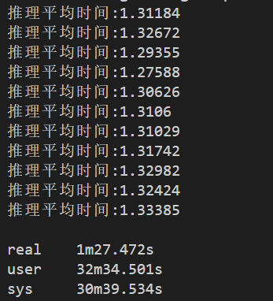

# 第一部分 CUDA基础知识

## 1.GPU体系结构和CUDA编程模型

### GPU结构简介


CPU是低延迟设计，（1）ALU强大，时钟频率高。（2）容量较大的cache，占据较大部分空间。（3）CPU有复杂控制

逻辑。


GPU为高吞吐设计，（1）GPU有大量的ALU.（2）cache很小，为theread服务。（3）无复杂的控制逻辑。

一个GPU全局架构的展示：


### CUDA编程模型

#### CUDA程序函数类型

`__device__` 限定词声明一个函数是：1. 在设备上执行的; 2. 仅可从设备（global或其他device）调用。
`__global__` 限定词声明一个函数作为一个存在的kernel。这样的一个函数是：1. 在设备上执行的; 2. 仅可从主机调用。
`__host__` 限定词声明的函数是：1. 在主机上执行的 2. 仅可从主机调用。

```c++
void some_func(void) {
    int i;
    for (i = 0; i < 128; i++) {
        a[i] = b[i] * c[i];
    } 
}
//在cpu上执行
```

```c++
__global__ void some_kernel_func(int* const a, const int* const b, const int* const c) {
    const unsigned int thread_idx = threadIdx.x; 
    a[thread_idx] = b[thread_idx] * c[thread_idx];
}
/*
每个线程都进行了两次读内存操作，一次乘法操作，一次存储操作
注意到，每个线程执行的代码是一样的，但是数据却不相同，这就是CUDA的核心--SPMD模型
*/
kernel_function<<<num_blocks,num_threads>>>(param1,param2,...)进行调用
```

#### 线程模型层次

CUDA的线程组织分为Grid，Block，Thread三个层次。每个Block中包含的线程数量是有限制的，因为目前每个块内的所有线程都在一个物理的处理器核SM中，并且共享这个核有限的内存资源。  

  

```c++
__global__ void some_kernel_func(int* const a, const int* const b, const int* const c) {
//const unsigned int thread_idx = (blockIdx.x * blockDim.x) + threadIdx.x; 
const unsigned int idx = (blockIdx.x * blockDim.x) + threadIdx.x;
const unsigned int idy = (blockIdx.y * blockDim.y) + threadIdx.y;
const unsigned int thread_idx = ((gridDim.x * blockDim.x) * idy) + idx;
a[thread_idx] = b[thread_idx] * c[thread_idx];
}
/*
gridDim.x : 线程网格X维度上线程块的数量
gridDim.y : 线程网格Y维度上线程块的数量
gridDim.z : 线程网格Z维度上线程块的数量
 
blockDim.x : 一个线程块X维度上的线程数量
blockDim.y : 一个线程块Y维度上的线程数量
blockDim.z : 一个线程块Z维度上的线程数量
 
threadIdx.x : 线程块X维度上的线程索引
threadIdx.y : 线程块Y维度上的线程索引
threadIdx.z : 线程块Z维度上的线程索引
*/
//加入线程块之后的线程索引计算

```

值得注意的一点是，grid和block的维度我们是显示指定的，但是怎样来进行任务分解，确定这个维度也是性能优化的一个关键点所在(可根据cuda的驱动程序文件获取GPU设备的信息来进行一定的参考，最大限制等).


```c++
// Kernel definition
__global__ void MatAdd(float A[N][N], float B[N][N],
float C[N][N])
{
    int i = blockIdx.x * blockDim.x + threadIdx.x;
    int j = blockIdx.y * blockDim.y + threadIdx.y;
    if (i < N && j < N)
        C[i][j] = A[i][j] + B[i][j];
}
int main()
{
...
    // Kernel invocation
    dim3 threadsPerBlock(16, 16);
    dim3 numBlocks(N / threadsPerBlock.x, N / threadsPerBlock.y);
    MatAdd<<<numBlocks, threadsPerBlock>>>(A, B, C);
    ...
}
//一个矩阵乘法和线程层次对应举例
```

如上所示的cuda编程示例，其将原始数据N'x'N的数据，划分为16*16的小块，块为一个二维block矩阵，线程块也为一个16‘x’16的的线程矩阵，这样可以将原始数据的每个元素分配到具体的线程中去计算，而且这个线程组织具有数组结构性，天然支持并发的矩阵分块运算。

#### GPU的线程模型层次和GPU结构的映射关系


如上两张图所示，左边展示了SM内部的结构，右边展示了GPU的内存层次和线程模型的对应关系。

**线程层次与gpu物理核结构对应点**

对一个kernel函数而言，其由一个grid进行组织，然后我们来设置grid和block的维度进行线程层次组织；然而一个线程具体实在GPU哪个

物理机上运行的呢？这就需要提供一个新的概念，叫做warp。warp是SM的最小调度单位，其大小为包含的线程数量，而且warpsize是nvidia产商已经设定好的，目前大部分硬件都为32，这是不可修改的。所以具体就是：一个kerne函数=一个grid-->设定的grid维度-->设定的block维度-->一个block划分为多个warp。

这样一个核函数计算任务可以分为多个block，这些block可以在不同的SM运行，但一个block的所有线程只能在一个SM中运行；对一个block而言，其根据warpsize将线程划分为多个warp；SM一次通常只调度一个warp来执行（内部SP核数量相关，足够多可同时并行多个warp），一个SM应该是有一个warp队列的，其乱序的对warp进行调度，当正在执行的warp进行读写等待操作时，就可以调度下一个warp进入SM中运行（SM对block可以实现并发执行，我的理解是它不是根据block来区分的，而是通过warp进行区分，即SM可见的只是warp），所以保证一个SM有足够多的warp是实现高性能计算的关键点之一，需要保证每个SM足够多的warp进行切换，使实际利用率提高。

其次每一个线程的实际运行是在SP上的，所以其实CUDA核心SP的数量才是真正的并行线程的数量。一个GPU核的真正的最大并行数等于SM数乘以每个SM具有的SP核数量。而warp其实只是软件层次的并行，下面为举例：


**特别注意：在确定bloc块的数量时，尽量为SM数量的整数倍。指定每个block块内部线程的数量时，也尽量为warpwsize的整数倍，以提升设备利用率。**

**线程层次和gpu内存结构对应点**


 GPU内存层次大致可以分为全局内存/纹理内存/常量内存，共享内存,本地内存和寄存器；每个线程都有自己的本地内存空间以及寄存器资源，这也是为什么GPU的线程上下文切换如此之快，因为其只需要加载对应的线程的寄存器号到寄存器文件中进行执行即可，避免了像CPU一样的上下文环境的拷贝。

其中cudamalloc开辟的是全局内存，核函数用__shared__修饰的变量为共享内存变量，核函数自定义变量一般为寄存器内存变量，本地内存主要存线程寄存器不足以保存的数据，例如数组等。

**Register**

​     寄存器，是GPU片上高速缓存， 执行单元可以以极低的延迟访问寄存器。

​     寄存器的基本单元是寄存器文件，每个寄存器文件大小为32bit。寄存器变量是每个线程私有的，一旦thread执行结束，寄存器变量就会失效。把寄存器分配给每个线程，而每个线程也只能访问分配给自己的寄存器；

​     如果寄存器被消耗完，数据将被存储在局部存储器（本地存储器）中。如果每个线程使用了过多的寄存器，或声明了大型结构体或数据，或者编译器无法确定数据的大小，线程的私有数据就有可能被分配到local memory中，一个线程的输入和中间变量将被保存在寄存器或者是局部存储器中。     

​     寄存器是GPU最快的memory，kernel中没有什么特殊声明的自动变量都是放在寄存器中，同样，这些变量都是线程私有的。当数组的索引是constant类型且在编译期能被确定的话，就是内置类型，数组也是放在寄存器中。

​     寄存器是稀有资源。在Fermi上，每个thread限制最多拥有63个register，Kepler则是255个。让自己的kernel使用较少的register就能够允许更多的block驻留在SM中，也就增加了Occupancy（因为每一个SM的寄存器资源是有限的），提升了性能。

**Shared Memory**

​     共享存储器，同寄存器一样，都是片上存储器；存储在片上存储器中的变量可以以高度并行的方式高速访问；把共享存储器分配给线程块，同一个块中的所有线程都可以访问共享存储器中的变量，因为这些变量的存储单元已经分配给这个块；

​     共享存储器是一种用于线程协作的高效方式，方法是共享其中的输入数据和其中的中间计算结果；一般情况下，常用共享存储器来保存全局存储器中在kernel函数的执行阶段中需要频繁使用的那部分数据；

**Local Memory**

​     本地存储器在局部存储器上；当线程使用的寄存器被占满时，数据将被存储在局部存储器中；而不是片上的寄存器或者缓存中，因此对local memory的访问速度很慢。

**Global Memory**

​     全局存储器，通过动态随机访问存储器（Dynamic Random Access Memory，DRAM）实现，这里的DRAM就是通常说的显存，是设备独立的存储空间；

内存访问速度：寄存器>共享>本地>=全局/纹理/常量

**特别注意点**：

**half-warp的概念**


warp线程执行指令时的分支情况执行，怎样进行（half_warp的一个使用）？

```c++
__global__ some_func(void) {
  if ((thread_idx % 32) < 16) {
    action_a();
  } else {
    action_b();
  }
```


## 2.多节点系统

### 多CPU系统存在问题

- 同步问题：单核cpu不存在高速缓存的一致性问题，多核cpu存在缓存一致性问题，当多核对参数进行重写时，核一写入参数时通知其他核x已发生改变，写到主存而不是高速缓存中。用更新请求替换掉x的无效请求。

- 负载均衡问题：进行工作任务的平衡分配，防止cpu过载或者过于空闲。

- 通信问题：cpu间进行共享数据以及协调任务时，高效通信协议。。

- 编程问题：并行编程技术，例如**OPENMP**，MPI等。

### 多GPU系统

cuda二进制文件会保留多个二进制镜像，对应每一代GPU。对某些功能，只支持特定计算水平设备，注意设备选择。可以调用cudagetdevicecount（）获取设备数量，调用cudagetdeviceproperties（）获取特定设备的属性，cudasetdevice（）可以自己选择device，也可以让cuda运行时自动选择。

多GPU算法注意问题：

- 数据分割：数据分块，尽量少关联性，减少数据传输的成本。

- 并行计算：并行计算算法，不同gpu上同时执行计算任务，考虑数据分割，以及最后的数据合并。

- 数据传输：GPU间传输，考虑传输带宽以及延迟，预取数据技术。数据预取技术即异步传输，考虑计算和内存GPU缓存间传输数据异步的进行，需要注意内存传输以及计算之间的依赖关系，cudastream可解决。

- 负载均衡：多GPU上执行计算任务时，保证每个GPU的计算负载尽可能的均衡。 动态调整任务分配。  

### 流

流是GPU上的虚拟工作队列，用于异步操作。流是一种执行并行计算任务的机制，流可以看作是一组任务的容器，流的任务可以是计算任务也可以是内存传输的任务。流的优点在于可高效的利用GPU的并行计算能力，gpu可同时执行多个流任务。gpu中每个流有唯一的标识符，可通过CUDA的API来创建，管理和销毁流。流的任务可以顺序提交或无序提交。顺序按顺序执行，无序需按照任务优先级。

流中任务通常有：计算任务，内存传输任务，核函数调用（特殊的计算任务）。

**使用流注意问题：**

- 流之间的任务不能相互依赖，流是并行执行的，如存在依赖关系，需要使用同步机制来确保任务的正确执行顺序。

- 流间任务要进行合理的调度：使用优先级和时间戳等机制来调度不同流间的任务。

- 流需要适当的内存管理：不同流间共享GPU内存和主机内存，需要适当的内存管理。使用CUDA的API来分配和释放内存，使用内存传输任务管理数据传输。

	### 多节点系统

理想CPU核与GPU的比率取决于应用程序和代码串行部分百分比。看CPU是否过载，过载需使用多CPU。注意使用通信机制将工作调度到给定的CPU/GPU集合上，而不用关心位于网络什么位置。


### zeroMQ

zeromq是一个高性能，轻量级，开源的消息传递库。

特点：轻量级，高性能（异步IO，多路复用），跨平台，灵活性（多种传输协议TCP，UDP，inproc），可靠性，易用性。

工作流程：

建立一个连接点，主从范型。主机器将工作包分发给客户端，客户端连接到网络某一个访问点（服务器提供），zeromq为每一个来连接的客户端建立内部队列。

确定一个消息传递的模式，如最简单的请求响应模式。cpu客户端维护一个工作队列，至少两项（GPU双缓冲），至少一个入队和出队的网络消息。cpu客户端连接到服务器并请求一批工作，服务器返回客户端处理范围的响应，客户端在cpu执行必要的工作来为工作包产生数据。

### MQ/MPI对比

MQ是一种基于消息通信的中间件，MQ通常用于异步通信，通过将消息写入对立队列中，来实现不同进程或者不同机器间的通信。适用于简单的分布式应用场景，如消息传递，任务分发。。

MPI是一种高性能的消息传递框架，适用于在并行计算机集群中进行通信和协作。MPI是一种同步通信，MPI需要使用专门的库和API进行编程，适用于hpc,科学计算等复杂分布式场景。

主要区别：

通信方式，应用场景，实现方式，性能层面（MPI通常比MQ有更高的性能）。

MQ应用场景：电商系统，社交网络，微服务架构间

MPI应用场景：HPC，科学计算复杂的分布式应用场景；气象学模型计算，物理学粒子模拟，深度学习使用MPI并行计算神经网络的训练和优化。

MQ实现方式： 基于中间件实现（Apache Kafka，RabbitMQ等），中间件提供基本功能：消息写入，读取，路由，过滤等。。Java开发，基于JMS规范实现MQ。

MPI实现方式：基于底层通信库实现如OpenMPI，MPICH等实现。开发人员需要编写MPI程序来实现消息的发送和接收。（cuda可以和open mpi集成，通过open mpi提供的函数以及工具，编写支持并行计算和通信的cuda mpi）。

MQ的性能：消息队列涉及序列化和反序列化，中间件的网路通信等，速度受限。异步通信使消息延迟和不确定性，高性能和实时性的场景中，MQ可能并不是最佳选择。

MPI的性能：MPI通常用于高性能计算和科学计算等复杂的分布式应用场景。MPI的同步通信高效，确定，还可以使用高效的通信协议，如RDMA。

多节点GPU系统面临的主要问题包括：通信延迟，负载均衡，数据传输和同步，可靠性和容错性（单点故障等）。

优化方案：RDMA优化通信，负载均衡（静态负载均衡和动态负载均衡等），数据传输与同步（异步数据传输，数据压缩，数据分片），可靠性和容错性（数据备份，冗余计算节点，GPU卡故障检测和自动切换）。

## 3.GPU的应用程序性能优化简介

### 策略1 并行/串行在GPU/CPU上的问题分解

**在GPU上的并行问题分解**：数据并行（数据分块）；线程并行（每个线程执行一部分任务，协同完成）。

**CPU上的串行问题分解**：任务级串行(任务间具有依赖关系)，迭代级串行。

循环融合的处理：


减少循环的处理，添加非依赖代码（指令）到依赖关系中。

但是也并不是循环融合数量越多越好，需要注意的是，这样一个循环中有较多的变量，会导致一个线程所需寄存器增加，从而导致一个SM并行的线程数量受到限制，而且如果用一个thred block进行处理，SM也会减少block的整体并行度，所以实际可能会对融合量进行限制。

**多轮遍历算法设计**：一般可拆分为单或少量目标数据点的内核程序，为将数据放入共享内存或者寄存器提供可能。

**规约操作的处理**：归约任务中，每轮迭代后，归约操作涉及的元素会下降为原来的一半，进行几轮迭代之后，一些SM就开始闲置了，再进行一段时间的迭代，可能每个SM中活跃的线程只有几个，这时候常用的优化策略是使用CPU去完成归约的最后阶段。

### 策略2 内存因素

**内存带宽与延迟**：当线程访问的内存位置不可用，硬件向内存提出一次读写请求。线程束内线程的请求可以合并（需满足内存开始区域对齐以及访问相邻位置）。

**使带宽接近峰值**：1.线程束完整加载。2.标量类型转换为使用向量类型进行读取，称作向量化技术（AVX指令相关）。

**限制内核的因素**：内存延迟，指令延迟。内存延迟（重新设计内存模式），指令延迟（进行算数运算的改进，使用位运算，乘法替换加法等）。

**内存组织**：全局内存和共享内存中，尽量使用内存对齐，cudaMallocPitch来进行GPU的内存开辟，保证数据以某种方式对齐。

### 策略3 传输

- **锁页内存的使用**：在内存分页机制中被锁定，使其无法被OS分页或者换出到磁盘上。一个场景是进行异步的数据传输，主机端在进行设备端进行计算操作时，可以继续做其他的时，而内存和设备端传输数据可以由DMA控制器来进行操作。cudaHostMalloc（分配锁页内存），cudaFreeHost（释放锁页内存）。

- **统一内存**：gpu和cpu共享统一内存空间（逻辑空间），底层系统（驱动程序和硬件）管理数据访问和位置（涉及主机和设备的数据迁移等）。声明方式：使用关键字managed声明，使用cudaMallocManaged()分配。

统一内存的的缺点以及优化

1.用 **cudaMemPrefetchAsync** 避免缺页中断
如果缺页中断次数多，CPU就会在用户态和内核态之间来回摇摆，而且内存页的传输不一定用到了DMA。使用cudaMemPrefetchAsync，调用DMA来异步传输，再通过cudaStream同步。

2.用**cudaMemAdvise**告知分配内存的特性
 cudaMemAdviseUnSetReadMostly是cudaMemAdvise的Flag，用来为某个device设定/解除内存空间ReadMostly的特性；
该函数仅仅是给出了对内存访问的建议，具体的优化措施是否被应用取决于CUDA运行时系统和底层硬件的实现。该函数的调用不会直接改变内存的权限或行为，而是提供了一种提示，以帮助运行时系统进行更好的优化决策。

3.用 **cudaMemAdvisePreferredLocation**来指定数据存储位置
数据可以存储在指定的device端，缺页中断时产生到指定device的内存映射，而不复制到本地。(当不能建立地址映射表，如CPU不能访问GPU内存，此时依然会数据迁移)

-   **零拷贝内存**：从全局内存分配一块独立内存，使用锁页内存技术实现零内存拷贝，通过cudaHostAlloc函数使用额外的标志cudaHostAllocMapped实现内存分配；使用cudaHostGetDevicePointer将常规的主机指针转换成指向设备内存空间的指针，GPU内核函数只会使用转换后的指针。使用cudaDeviceSynchronize进行同步，或者使用流同步。适用于：1.一大块内存只需用到少量数据。2.不会频繁对内存进行重复访问。3.需要比显存容量大的内存，可选项。

- **三种内存形式对比**

	| **传输类型** | **优点**                                                     | **缺点**                                                     |
	| ------------ | ------------------------------------------------------------ | ------------------------------------------------------------ |
	| 统一内存     | 简化编程模型                                                 | 由于CPU和GPU共享同一块内存，可能会导致内存访问竞争和性能瓶颈；产生的缺页中断会造成性能损耗 |
	| 锁页内存     | DMA控制器并行传输                                            | 手动管理锁页内存的分配和释放，需进行合理的设置               |
	| 零拷贝内存   | 设备不足时，可利用主机内存；可避免设备和主机间的显示传输；计算和PCIe传输可并行 | 当GPU和CPU之间存在较大的数据量时，数据传输可能会引入延迟     |

- **GPU的重叠传输**：前置条件：要重叠的内核执行和数据传输必须同时发生在不同的、非默认流中（一个cuda流是严格按照压入的任务/事件顺序执行，不能并发/并行）。数据传输所涉及的主机内存必须是锁页内存。

	

	

###  策略4 线程使用，计算，分支

​	**线程内存模式**：把应用程序分解为合适的网格，线程块和线程，是保证CUDA内核性能的关键环节之一。

线程布局如果过于糟糕会导致明显影响性能的内存模式。如缓存利用率的降低，访存次数的大幅度增加。合并访问的使用等。

​	**非活动线程的使用**:本质是需要保证SM中一个block有足够多的线程束，这样SM才有足够多的线程束调度从而来隐藏内存和指令延迟，对归约操作这些线程数逐渐减少的操作（指令级并行ILP），可以提前终止最后线程束等。。。

**编译器优化**：复杂运算简化，基于乘除法比加减法代价高的事实。循环不变式分析，将循环体内不变式移到循环外，**不要指责编译器不帮你做一些优化，编译器一般执行保守优化，因为你可能不了解编译优化步骤，从而指责编译器过分优化的错误**。循环展开，得益于GPU庞大的寄存器数量可以保存局部变量值，所以可以通过减少循环次数，增加每个循环的计算操作来优化。循环剥离，和循环展开配合使用，适用于循环次数不是循环展开数的整数倍时，可将多于循环次数单独迭代。窥孔优化：目标是用少量复杂指令去替代多个指令。公共子表达式和折叠，避免公共子表达式的重复计算。

- **分支**：遇到分支时，如果条件是线程的索引号的限制，那么在进行到该判断语句时，满足条件的将置执行位标记，而其他不满足条件的清除标记，继续执行。注意half-warp的使用。

### 策略5 算法

​	一个算法在cpu领域是最佳的，但是在gpu领域却未必，有些算法需要根据gpu的内存结构来重写。

使用线程内的规约，指令级的并行（ILP技术），减少线程的数量，以减少线程排队时间。基于块数目的规约，可以将块限制在一个合理的范围内（过多或过少都会影响最终的执行时间），来减少最终的计算时间。使用共享内存规约，将输入数据元素保存到共享内存中，然后再共享内存中进行数据的规约，最后将结果写回全局内存。

### 策略6 资源竞争

三种常见类型的瓶颈，按重要性排序：

1.PCI-E的传输瓶颈

2.内存带宽瓶颈

3.计算瓶颈

针对PCI-E瓶颈，可以使用压缩技术，增加pcie传输速率硬限制，思考需要传输数据时，该数据是否全部需要用到，还是只需要一部分；使用流使计算和数据传输重叠的技术，零复制内存技术等。

内存带宽瓶颈：合并内存访问，数据的分片，使片上存储器足以存储数据等。。

对计算瓶颈：尽量避免复杂的指令操作，例如少使用分支指令等。

**如何发掘GPU程序执行瓶颈？**

使用Profiler工具

NVIDIA Visual Profiler（NVP）

NVIDIA Nsight（Only Windows）

记录Kernel执行时间，分析内存访问模式，分析主机和设备间数据传输，计算资源利用率

### 策略7 自调优应用程序

自调优：在不同的硬件环境中通过调整参数获取最佳性能。

调优参数：线程块的数量，每个块的线程数，每个线程处理的数据量（过小造成线程数过多，过大计算资源搁置），指令并行ILP的级别。

## 4.函数库和SDK

为利用GPU进行加速任务，直接使用CUDA编程不太明智，三种常见的开发CUAD应用程序的方式：

使用函数库，基于指令的编程，直接编写CUAD的内核。

### 函数库


**函数库通用规范**：一般来说，NVIDIA提供的函数库，不对调用者进行内存管理，而是希望调用者提供指向设备中被分配的内存区域的指针。

**Thrust库**：由NVIDIA进行开发，目的是为CUDA C++提供一组高效的算法和数据结构。Thrust包括许多常见的算法，例如排序、归约和扫描，以及一些数据结构，例如向量、散列表和二叉搜索树。Thrust还提供了一些高级功能，例如异步执行、内存管理和自定义操作符。

特点 ：类STL风格 ，可扩展性，高效的算法与数据结构，和CUDA的无缝集成（直接使用核函数以及内存模型等），跨平台的支持，丰富的社区支持。

### **CUDA的运算SDK**

设备查询，带宽测试（CUDA SDK提供示例程序可测试 主机到设备，设备到主机，设备到设备的带宽），SimpleP2P（通过CUDA设备之间的直接内存访问DMA引擎，避免通过主机内存传输。这可以减少数据传输的延迟和开销，从而提高并行计算的效率；条件:CUDA设备均支持，位于同一PCIe根下边，cuda上下文中）。

### **OpenACC**

OpenACC 定义了一组编译器指令，允许代码区域从主机 CPU 卸载以在 GPU 上计算。
特点：高级 GPU 编程，与 OpenMP 指令非常相似，支持 C/C++ 和 Fortran 绑定，有关 OpenACC 标准的大量指南、教程、代码示例和文档可在www.openacc.org上找到，不需要学习更底层的知识，只需加上相应的指令，再用对应的编译器进行编译即可对源程序进行加速。

**openacc计算指令的使用**：用计算编译程序指令来通知编译器是如何让一个代码块并行执行的。有两个相关的计算指令：#pragma acc kernels 和 #pragma acc parallel。

#pragma acc kernels提供了更自动化且编译器可驱动的方法，自动分配gang，worker，vector的数量来并行执行进行调度。#pragma acc parallel可以进行更细粒度的控制，对每个代码段进行控制。

循环指令#pragma acc loop使用：直接对循环体进行指令标记；数据指令的使用#pragma acc data显示用于在主机应用程序和加速器之间传输数据。

## 5.CUDA的扩展知识

### **线程块簇**

[随着 NVIDIA计算能力 9.0](https://docs.nvidia.com/cuda/cuda-c-programming-guide/index.html#compute-capability-9-0)的推出，CUDA 编程模型引入了一个可选的层次结构级别，称为由线程块组成的线程块集群。线程块集群可以实现在分布式共享内存的通信以及数据传输，可以提高线程块之间的通信传输效率。可以使用编译器时内核属性`__cluster_dims__(X,Y,Z)`或使用 CUDA 内核启动 API在内核中启用线程块簇cudaLaunchKernelEx，来分配线程块簇。

```c++
__global__ void cluster_kernel(float *input, float* output)
{

}

int main()
{
    float *input, *output;
    dim3 threadsPerBlock(16, 16);
    dim3 numBlocks(N / threadsPerBlock.x, N / threadsPerBlock.y);

    // Kernel invocation with runtime cluster size
    {
        cudaLaunchConfig_t config = {0};
        // The grid dimension is not affected by cluster launch, and is still enumerated
        // using number of blocks.
        // The grid dimension should be a multiple of cluster size.
        config.gridDim = numBlocks;
        config.blockDim = threadsPerBlock;

        cudaLaunchAttribute attribute[1];
        attribute[0].id = cudaLaunchAttributeClusterDimension;
        attribute[0].val.clusterDim.x = 2; // Cluster size in X-dimension
        attribute[0].val.clusterDim.y = 1;
        attribute[0].val.clusterDim.z = 1;
        config.attrs = attribute;
        config.numAttrs = 1;

        cudaLaunchKernelEx(&config, cluster_kernel, input, output);//实现编译时
    }
}
//cluster.sync()可执行簇间的同步，集群中的线程块能够对分布式共享内存中的任何地址进行读取、写入和执行原子操作
```

### 编译流程

离线编译：离线编译适用于在多个GPU设备上的程序进行编译，以便提前进行代码检查和优化。nvcc需要区分出主机代码和设备代码，需要将设备代码编译为PTX或者二进制形式（cubin对象）；对主机代码需要对内核调用<<<…>>>进行代码的修改（必要的CUDA运行时函数进行替换）。修改后的主机代码可以作为c++代码，或者被其他工具编译或者在nvcc最后一个阶段调用主机的编译器来进行编译输出。应用程序或者链接到已编译的主机代码或者忽略修改代码且使用驱动程序api加载执行ptx代码或者cubin对象。

即时编译：应用程序在运行时加载的任何*PTX*代码都会由设备驱动程序进一步编译为二进制代码。设备驱动程序可以在编译某些应用程序的某些PTX代码时会自动缓存生成二进制代码的副本，避免后面的重复编译。NVRTC可以运行时动态编译CUDA C++的源码，可以将CUDA C++代码即时编译为PTX代码，动态加载到设备上。

### 兼容性

二进制兼容性：一般来说，生成的cudabin二进制文件只用于特定的指令集以及架构。二进制代码只能在计算能力的一个主要修订版中保证兼容性。

- 5.0 二进制代码，适用于计算能力 5.0 和 5.2 的设备。

- 6.0 二进制代码，适用于计算能力 6.0 和 6.1 的设备。

PTX兼容性：PTX指令可以跨计算能力主要版本进行最终二进制代码的生成，但是最终的生成二进制的代码可能会存在一些早期PTX的指令不支持现在设备的指令，从而导致最终的性能比使用最新版本的PTX性能差。

应用兼容性：要在具有特定计算能力的设备上执行代码，应用程序必须加载与此计算能力兼容的二进制或*PTX代码*。

```c++
nvcc x.cu
        -gencode arch=compute_50,code=sm_50
        -gencode arch=compute_60,code=sm_60
        -gencode arch=compute_70,code=\"compute_70,sm_70\"
    //以此形式来编译x.cu可以生成适用于计算能力5.0，6.0，7.0的二进制代码。
    //如果该计算能力为8.0的，也会生成对应计算能力的二进制代码；最终使用驱动程序的API的应用程序以编译代码分割文件，并在程序运行时显示加载和执行最适合的二进制文件。
```

### 异步并发执行

- 在主机上计算；
- 设备上的计算；
- 内存从主机传输到设备；
- 内存从设备传输到主机；
- 给定设备内存内的内存传输；
- 设备之间的内存传输

### 流的显式同步和隐式同步

显式同步：

`cudaDeviceSynchronize()`等待直到所有主机线程的所有流中的所有先前命令都完成。

`cudaStreamSynchronize()`将流作为参数并等待，直到给定流中的所有先前命令都完成。它可用于将主机与特定流同步，从而允许其他流继续在设备上执行。

`cudaStreamWaitEvent()`将流和事件作为参数并在调用后将所有命令添加到给定流，以延迟其执行，直到给定事件完成。

隐式同步：如果主机线程在来自不同流的两个命令之间发出任一以下操作，则它们不能同时运行。

- 页锁定主机内存分配，
- 设备内存分配，
- 设备内存集，
- 两个地址之间的内存复制到同一设备内存，
- 任何 CUDA 命令到 NULL 流，
- [计算能力 7.x](https://docs.nvidia.com/cuda/cuda-c-programming-guide/index.html#compute-capability-7-x)中描述的 L1/共享内存配置之间的切换。

### 流的重叠

```c++
for (int i = 0; i < 2; ++i)
    cudaMemcpyAsync(inputDevPtr + i * size, hostPtr + i * size,
                    size, cudaMemcpyHostToDevice, stream[i]);
for (int i = 0; i < 2; ++i)
    MyKernel<<<100, 512, 0, stream[i]>>>
          (outputDevPtr + i * size, inputDevPtr + i * size, size);
for (int i = 0; i < 2; ++i)
    cudaMemcpyAsync(hostPtr + i * size, outputDevPtr + i * size,
                    size, cudaMemcpyDeviceToHost, stream[i]);
//在支持并发数据传输的设备上，stream[0]从设备到主机内存的复制与stream[1]从主机到设备的内存复制不可能重叠，只能按顺序进行。但在支持并发数据传输的设备上，确实可以做到两个流的重叠。
```

### 主机函数回调

```c++
void CUDART_CB MyCallback(cudaStream_t stream, cudaError_t status, void *data){
    printf("Inside callback %d\n", (size_t)data);
}
...
for (size_t i = 0; i < 2; ++i) {
    cudaMemcpyAsync(devPtrIn[i], hostPtr[i], size, cudaMemcpyHostToDevice, stream[i]);
    MyKernel<<<100, 512, 0, stream[i]>>>(devPtrOut[i], devPtrIn[i], size);
    cudaMemcpyAsync(hostPtr[i], devPtrOut[i], size, cudaMemcpyDeviceToHost, stream[i]);
    cudaLaunchHostFunc(stream[i], MyCallback, (void*)i);
}
//主机函数回调的重点是在其之后发出的流中的命令在该函数完成前不会执行；
//故在流中排队的主机函数不得（直接或间接）调用 CUDA API，因为如果它进行这样的调用，最终可能会等待自己，从而导致死锁。
```

### 版本控制与兼容性

开发CUDA程序，开发人员需要关注两个地方：计算能力，CUDA驱动程序的版本。不同的计算能力需要有CUDA版本。CUDA驱动程序的版本对于设备驱动程序是向后兼容的，即有可能需要将设备驱动程序更新到最新的版本。

由于系统上一次只能安装一个版本的 CUDA 驱动程序，因此安装的驱动程序的版本必须与在其上运行的任何应用程序、插件或库所针对的最大驱动程序 API 版本相同或更高（插件，库等向后兼容）。

应用程序使用的所有插件和库必须使用相同版本的 CUDA 运行时，除非静态链接到cuda运行时。

应用程序使用的所有插件和库必须使用与CUDA运行时的任何库（例如 cuFFT、cuBLAS 等）相同版本的库，除非静态链接到这些库。

### 计算模式

默认计算模式：多个主机线程可同时使用该设备，cuda runtime使用cudasetdevice（）设置该设备或者使用驱动程序api时，将当前cuda上下文与设备关联。

独占进程计算模式：一个设备一个时刻只能运行一个进程或应用程序；进程内的多个线程可以同时分别创建该设备的上下文。

禁止计算模式：一个设备只能由一个进程创建cuda上下文，且进程的同一时刻只能由一条线程创建该设备上下文。

如果设备0处于禁止计算或者独占进程计算模式，那么使用运行时API而不显示调用的主机线程可能会与设备0以外的设备关联；可使用cudasetvaliddevice（）函数来设置可用的设备等。 

### 性能优化

最大化并行执行，实现最大利用率。

优化内存使用，实现最大内存吞吐量。

优化指令使用，实现最大指令吞吐量。

最小化内存震荡（抖动）。

哪种策略能带来最佳性能提升，取决于该部分的限制因素。所以应该使用CUDA profiler来测量和监控性能来指定最佳的优化策略。

#### 最大化利用率

在应用层的层面上，应用程序可以异步并发执行异步函数调用以及流，最大限度的提高主机，设备和连接主机，设备之间的pcie的总线间的并行执行能力。合理分配设备擅长的工作类型，串行工作分配给主机，并行工作分配给设备。这里特别是对某些线程间需要同步共享数据而导致并行性中断的地方。当两个线程在一个线程块时，需要通过

__syncthreads()来进行同步，在同一个内核调用通过共享内存中共享数据。在不同的线程块中时，只能通过全局内存来共享数据，要用两个单独的内核调用，一个用于写，一个用于读。尽量避免第二种情况，通过CUDA编程模型来指定。

尽量保持SM有足够多的warp来进行调用，以此可以隐藏warp执行下一条指令的时间（延迟），原理是例如一条指令通常四个周期，一个SM最多同时有4个warp调度器，如果warp数量为16个，那么就可以 保证每个周期可以读入指令，来隐藏延迟。

某些输入操作驻留在片外存储器中，则延迟会更高。warp可能需要在同步或内存栅栏函数处等待，则驻留多warp有助于减少SM的空闲。驻留在SM上的块以及warp数量取决于执行配置，多处理器的内存资源，内核资源需求（程序PC，寄存器等）。

占用率计算器 API（cudaOccupancyMaxActiveBlocksPerMultiprocessor）可以根据内核的块大小和共享内存使用情况预测占用率。该函数以每个多处理器的并发线程块数量为单位报告占用率。请注意，该值可以转换为其他指标。用每个区块的线程数乘以并发线程数，就得到每个多处理器的并发线程数；再用并发线程数除以每个多处理器的最大线程数，就得到占用率的百分比。

基于占用率的启动配置器应用程序接口（cudaOccupancyMaxPotentialBlockSize 和 cudaOccupancyMaxPotentialBlockSizeVariableSMem）会启发式地计算执行配置，以实现最大的多处理器级占用率。

占用率计算器 API cudaOccupancyMaxActiveClusters 可以根据内核的集群大小、块大小和共享内存使用情况提供占用率预测。该函数以系统中 GPU 上给定大小的最大活动集群数量来报告占用率。

#### 最大化内存吞吐量

最大化整体内存吞吐量的第一步是最小化带宽的数据传输，即最小化设备和主机内存之间的数据传输。第二步是根据设备内存访问中描述的最佳内存访问模式来尽可能组织内存访问。

**主机与设备之间的传输，将许多小传输批处理处理为单个大传输总是比单独进行每个小传输的性能更好**。在具有前端总线的系统上（cpu和ram之间的传输总线），使用页锁定主机内存可以实现主机设备之间的更高性能（减减少cpu和内存控制器以及内存和磁盘间的传输）。

对于设备内存的访问，当warp在对全局内存进行访问时，会将warp内线程的访问合并为一个或多个内存事务，因此为减少内存事务，最大化合并访问是及其重要的。

- 遵循各计算能力标准的最佳访问模式
- 使用满足”尺寸和对齐要求“中的数据类型
- 在某些情况下填充数据（二维数组为例

尺寸和对齐要求：全局内存指令支持读取或写入大小等于 1、2、4、8 或 16 字节的字。当且仅当数据类型的大小为 1、2、4、8 或 16 字节并且数据自然是对齐（即，其地址是该大小的倍数）。

```c++
struct __align__(8) {
    float x;
    float y;
};
//或者
struct __align__(16) {
    float x;
    float y;
    float z;
};
//对于结构体，可以使用这两个来进行强制的大小和尺寸对齐。
```

二维数组填充：为了完全合并线程的访问，线程块的宽度以及数组的宽度都必须是warp大小的倍数，可以使用cudamallocpitch（）或者cudamemallocpitch()函数来进行约束数组的分配，以便程序员来编写不依赖于硬件的代码。

本地内存：本地内存实际是驻留在设备内存中的，故访问本地内存和全局内存具有一样的高延迟以及低带宽。

编译器可能放置在本地内存中的自动变量是：（1）无法确定使得否使用常量索引的数组。（2）大型结构或数组会消耗太多寄存器空间.（3）如果内核使用寄存器溢出（寄存器资源不够），则任何变量会保存到本地内存中。

可通过检查ptx汇编代码查看其是否已在第一个编译阶段放置在本地内存中（即使没有，后续也可能会做出不同决定）。

共享内存：共享内存为片上存储器，更高带宽更低延迟。值得注意的是，如果两个内存请求的地址在一个内存模块中，会出现内存块冲突，这时需要将有存储体冲突的内存请求拆分为多个单独的无冲突请求。

#### 最大化指令吞吐量

- 尽量减少地吞吐量指令的使用，如以精度换速度，使用单精度而不是双精度等。。
- 最大限度减少由控制流指令引起的warp发散。
- 减少指令的数量，即尽可能优化同步点等。

#### 最小化内存抖动

过于频繁地分配和释放内存的应用程序可能会发现，随着时间的推移，分配调用的速度往往会变慢，直至达到极限。这通常是由于将内存释放回操作系统供自身使用的特性所造成的。为了在这方面获得最佳性能，我们建议采取以下措施：

尽量根据当前问题确定分配大小。不要尝试使用 cudaMalloc / cudaMallocHost / cuMemCreate 分配**所有可用内存**，因为这会强制内存立即驻留，并阻止其他应用程序使用这些内存。这可能会给操作系统调度程序带来更大压力，或者完全阻止使用同一 GPU 的其他应用程序运行。

尽量在应用程序的早期阶段分配适当大小的内存，只有当应用程序不需要使用内存时才进行分配。**减少应用程序中 cudaMalloc+cudaFree 调用的次数，尤其是在性能关键区域**。

如果应用程序无法分配足够的设备内存，可考虑使用其他内存类型，如 cudaMallocHost 或cudaMallocManaged，它们的性能可能不是很好，但能让应用程序成功进行。

# 第二部分 cuda mpi /如何提高GPU利用率

mpi实现消息传递机制通信，可以用在多节点系统中；open mp用在单节点的系统上进行通信。

cuda mps可以实现将GPU的资源进行逻辑划分，最多为48份，我们可以为不同的用户程序注册一个mps，从而达到在一个gpu上同时运行多个用户程序的目的，但是需要注意的是资源有限，需要注意同时运行的资源限制，这个需要花费时间去调试。

vGPU实现GPU的虚拟化，内存隔离，方便分配。

MIG实现物理化隔离，分配独立的显存，缓存器，SM等，可以和vGPU结合使用。


下面是GPU的各并发技术机制的简单介绍：

|                                         | **Streams**                                          | **MPS**                                                      | **Time-Slicing**                                             | **MIG**                                                      | **vGPU**                                                     |
| --------------------------------------- | ---------------------------------------------------- | ------------------------------------------------------------ | ------------------------------------------------------------ | ------------------------------------------------------------ | ------------------------------------------------------------ |
| Partition Type                          | Single process                                       | Logical                                                      | Temporal (Single process)                                    | Physical                                                     | Temporal & Physical – VMs                                    |
| Max Partitions                          | Unlimited                                            | 48                                                           | Unlimited                                                    | 7                                                            | Variable                                                     |
| SM Performance Isolation                | No                                                   | Yes (by percentage, not partitioning)                        | Yes                                                          | Yes                                                          | Yes                                                          |
| Memory Protection                       | No                                                   | Yes                                                          | Yes                                                          | Yes                                                          | Yes                                                          |
| Memory Bandwidth QoS                    | No                                                   | No                                                           | No                                                           | Yes                                                          | Yes                                                          |
| Error Isolation                         | No                                                   | No                                                           | Yes                                                          | Yes                                                          | Yes                                                          |
| Cross-Partition Interop                 | Always                                               | IPC                                                          | Limited IPC                                                  | Limited IPC                                                  | No                                                           |
| Reconfigure                             | Dynamic                                              | At process launch                                            | N/A                                                          | When idle                                                    | N/A                                                          |
| GPU Management (telemetry)              | N/A                                                  | Limited GPU metrics                                          | N/A                                                          | Yes – GPU metrics, support for containers                    | Yes – live migration and other industry virtualization tools |
| Target use cases (and when to use each) | Optimize for concurrency within a single application | Run multiple applications in parallel but can deal with limited resiliency | Run multiple applications that are not latency-sensitive or can tolerate jitter | Run multiple applications in parallel but need resiliency and QoS | Support multi-tenancy on the GPU through virtualization and need VM management benefits |

40个，每个10；mps服务


关闭mps服务


单个。


关闭mps，4个，全在一个gpu（闲时状态）。


开mps


关闭mps，11个全在一个gpu（极限状态下）。


开启mps，11个全在一个：


？？？为什么没有用，mps主要针对计算密集型任务有效，即GPU利用率高的任务，此类场景属于IO密集型任务，效果不太明显。数据并行？减少数据传输次数，提升计算任务占比，再做实验。。

去掉数据拷贝（设备<->主机内存）的时间计算:


11个开启mps：


11个关闭mps：



gpu的计算模式影响 gpu是否参与应用程序的计算分配，令cudasetsevice失效。


# 第三部分 tensort算子的实现和cuda的关系

**直接看官方小例子代码吧**

CUDA整体结构，扮演的角色


CUDA和OpenCL，对比。


GPGPU可以使用GPU做一些通用CPU之间需要做的事情，更高效率的进行优化.


cuda在nvidia体系中，扮演着非常重要的作用。如图：


其中cudnn深度学习训练加速算子库，tensorrt的推理加速核函数库，cudaBLAS等等多个基于CUDA的NVIDIA自家开发的各种加速核函数库更是构成一道技术壁垒。以tensort为例，这是一款nvidia推出的针对nvidia的GPU的深度学习推理框架，其上可以将神经网络模型转换为具体的计算图，在其内部对深度学习的各种算子进行了分解优化，将算子划分为多个CUDA核函数，并合理组织分配线程块，块数进行数据计算。但是其并不开源。。

#### CUDA和OpenCL的对比：


CUDA和OPenCL均可以进行硬件的并行计算，其对比如图：


对于TVM，CUDA和OPenCL等联系？


问题：

（1）CUDA的线程束组织，并行度和SM有关还是线程束等。**已解决**

（2）OPenCL底层怎样实现的兼容多个硬件厂商硬件，貌似是提供统一的OPenCL编程规范，不同硬件厂商开发自己的OPenCL编译器来将统一规范代码编译为该硬件平台可执行代码。**已解决**，opencl包含运行时库和底层驱动程序。运行时库接受opencl的内核函数，并根据具体的硬件平台实现对应的编译器将该代码编译成硬件平台上的可执行代码。OPencl集成了对应厂商的编译器以及驱动。。

（3）TVM上可以兼容多种模型格式，将多种模型格式转换为TVM输入格式，中可进行计算图优化，下是直接对接OPenCL，CUDA等并行计算框架，及转化为框架对应的代码，如CUDA的核函数；还是可以直接编译为可执行在硬件层面直接驱动硬件的代码？？？**已解决**。TVM前端进行深度学习模型的解析，中端进行计算图的优化，后端和已经和各硬件平台对接的并行计算框架对接。。

（4）TVM貌似只是进行模型的推理计算，那么分布式协同是否需要其他的分布式框架，进行数据的协同，同步处理。CUDA MPI，gRPC，MQ等等？？？？？

第四部分 Tensort和CUDA的联系/TVM和cuda的联系

