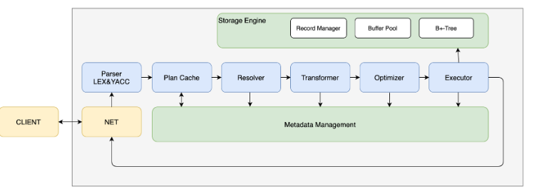

# miniob简介
miniob基本功能的数据库，有基本功能模块。任务是写==服务侧==
- 网络模块：和客户端交互，收发客户端请求并应答。
- sql解析/语义解析：用户输入的sql语句解析为语法树。语法树再到数据库内部数据结构（==部分实现==）
- 计划缓存模块：将sql第一次生成的执行计划缓存在内存，后续执行反复执行该计划，避免重复查询优化。==未实现==
- 查询缓存，执行的查询结果缓存在内存，下次查询，直接返回？==未实现==
- 查询优化，根据一定的规则/统计数据（频率，时间规律，优先级规则等），下次查询，直接返回。==未实现==
- 计划执行：根据语法树描述，执行并生成结果.
- 会话管理：即session模块，涉及的是网络通信，管理用户连接个数，链接参数等
- 元数据管理，即数据库，表，字段，索引表等信息。
- 客户端：主要用于测试


## 各模块的工作原理介绍
### seda异步事件框架
miniob使用的是seda（stage event driver architecture）,==事件驱动+多线程模式==，故易扩展，解耦合，高并发。
各个模块stage之间通过event来传递，event的处理给stage的线程池异步处理。miniob接收请求开始，到后面sql解析，查询优化，计划执行都使用event传递数据。用seda来配置线程池个数。
### 服务端启动
- 设置信号的处理函数句柄

- 参数的解析，设置参数解析函数，getopt函数处理命令行参数；用到了指针的引用，如下图：

- //! Global process config
```c
  ProcessParam *&the_process_param()

  {

   static ProcessParam *process_cfg = new ProcessParam();//局部静态初始哈，多次调用，不变

   return process_cfg;//返回一个指针的引用，减少拷贝

  }
//这段函数实现了一个懒汉式单例模式，其内部原理是局部静态变量只会初始化一次，后面再调用这个函数，都只会返回同一个局部静态变量
```
- 加载配置文件
- 初始化日志
- 初始化seda。
首先：注册了工厂模式，创建和管理不同子类的实例。
每个子类有标签来标识。可以将子类的工厂对象通过类注册到全局工厂列表中。
最后，seda初始化，线程池结构初始化，实例化子类工厂。
- 初始化网络服务
### 网络模块
网络模块
