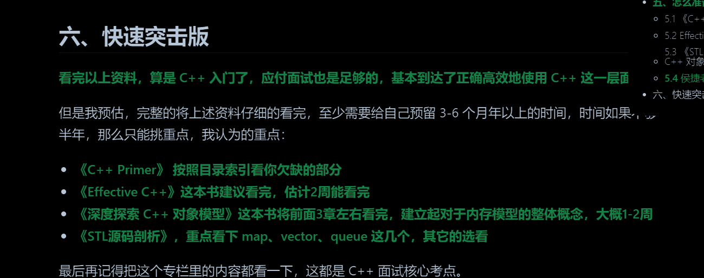
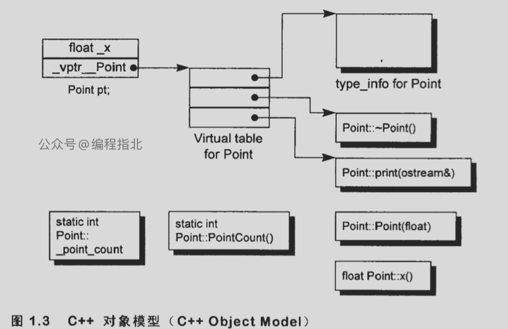
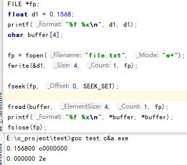
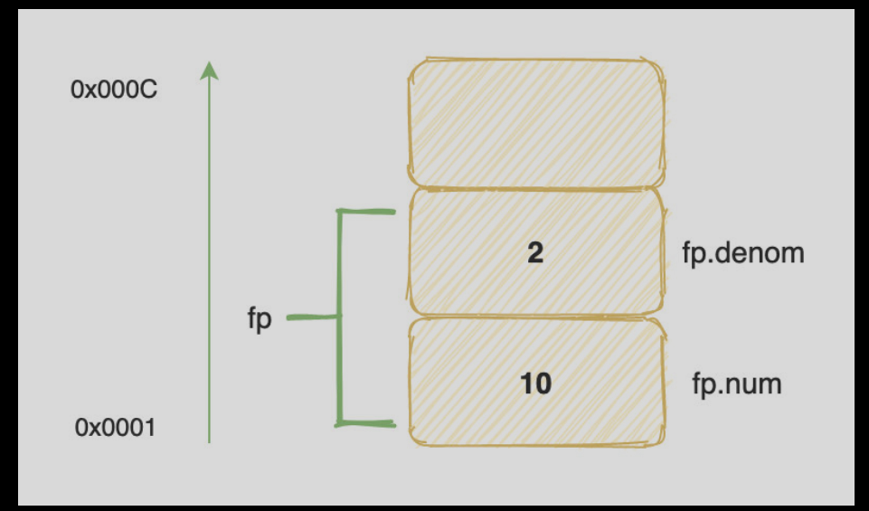
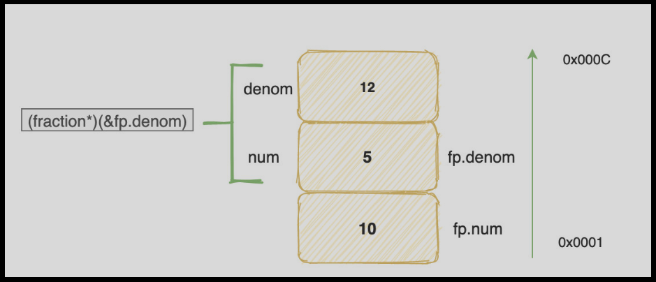

如上是快速突击C++的面试的准备。
# C++基础
## sizeof关键字
sizeof的计算，牢记下面4条规则：
- 指针的大小永远是固定的，取决于处理器位数，32位就是 4 字节，64位就是 8 字节
- 数组作为函数参数时会退化为指针，大小要按指针的计算。
- struct 结构体要考虑字节对齐，字节对齐的具体规则请看这篇文章: 字节对齐(opens new window)
- 字符串数组要算上末尾的 '\0
对数组退化为指针，只有函数参数是普通拷贝时发生，避免整个数组拷贝在栈上传递。而对于函数参数是数组引用传递，则不会退化为指针，因为其本来就不用拷贝。**为啥调用sizeof()直接计算这个数组的大小不会发生数组退化，因为sizeof是在编译期间计算得到的结果，可直接得到数组的大小**
**字节对齐：**
有助于提高内存访问速度，许多处理器都优化了对齐数据的访问，有一定的空间浪费。
编译器指令 #pragma pack更改默认的对齐规则，全局生效，减小数据结构的大小，降低访问性能。
C++11及更高版本，alignas(16) int x; 将确保 x 的地址是 16 的倍数。
```c
#pragma pack(push, 1) // 设置字节对齐为 1 字节，取消自动对齐
struct UnalignedStruct {//结果为7字节
    char a;
    int b;
    short c;
};
#pragma pack(pop) // 恢复默认的字节对齐设置
```
## sizeof 和 strlen
sizeof计算数据类型或对象占用字节数，包含空字符"\0"。
strlen则计算c风格字符串长度，不包含空字符"\0".
## const关键字
### 修饰变量
const关键字修饰变量不可直接修改，可以使用取指针，然后使用const_cast进行类型转换来修改值，不会报错。但是我在linux和windows上均尝试了，且尝试了一些禁用编译器(-fno-strict-aliasing)的常量传播/常量折叠的选项，还是无法通过指针来改变，最终结果是在同一个地址上，cout原来值和指针改变后的值却不同？
怀疑是编译器将const常量的值放入了.rodata段，其对应的地址不能修改值，即使指针可以绕一下，但是还是不管用。
### 修饰函数参数，表示函数不会修改参数
const引用常用
### 修饰函数返回值
这样做可以使函数返回的值更加安全，避免被误修改。
### 修饰指针或引用
指向只读变量的指针，底层const。指针可修改，指针指向变量不可修改。
只读指针，顶层const。指针本身是只读变量。
只读指针指向只读变量,无法修改指针和变量
常量引用，不能常量引用修改值
### 修饰成员函数
```c
class A {//如下修饰了成员函数，可以被常量对象调用，修饰的成员函数不可调用非const的成员函数
public:
    int func() const {
        // 编译错误，不能修改成员变量的值
        m_value = 10;
        return m_value;
    }
private:
    int m_value;
};
```
## C++中的static关键字
static修饰的全局变量，将变量的作用域限定在当前文件中，使得其他文件无法访问该变量。static修饰的变量在程序启动时进行初始化（main函数之前），生命周期和程序一样。
```c
// a.cpp 文件
static int a = 10;  // static 修饰全局变量
int main() {
    a++;  // 合法，可以在当前文件中访问 a
    return 0;
}

// b.cpp 文件
extern int a;  // 声明 a
void foo() {
    a++;  // 非法，会报链接错误，其他文件无法访问 a
}
//如上面就是将一个文件的static变量，在另一个文件用extern引用会出错。
```
原因看另一个：**extern的作用**
- 符号的声明和定义，如下：
```c++
//对变量
// 声明
extern int global_var;

// 定义
int global_var = 42;

//对函数
// 声明
int sum(int a, int b);

// 定义
int sum(int a, int b) {
  return a + b;
}
```
- C/c++中的链接属性，包含了外部链接（全局变量和函数；可在不同源文件间共享），内部链接（static修饰的全局变量和函数有内部链接，只在当前源文件使用），无链接（只在当前 代码块/函数 进行使用，const/constexpr修饰的常量具无链接属性），外部c链接(extern "C" 关键字，可在不同源文件之间共享，具C语言的名称和调用约定，可以和c语言编写的代码交互)。
- extern作用
1）声明但不定义变量
```c
//fileA.cpp
int i = 1;         //声明并定义全局变量i

//fileB.cpp
extern int i;    //声明i，链接全局变量

//fileC.cpp
extern int i = 2;        //错误，多重定义
int i;                    //错误，这是一个定义，导致多重定义
main()
{
    extern int i;        //正确
    int i = 5;            //正确，新的局部变量i;
}
```
2) 常量全局变量的外部链接
```c
//正确声明定义一个常量的多文件共享的变量
//fileA.cpp
extern const int i = 1;        //定义

//fileB.cpp                    //声明
extern const int i;

//错误声明定义
//fileA.cpp
const int i = 1;        //定义 (不用 extern 修饰)

//fileB.cpp             //声明
extern const int i;
```
3） 编译和链接过程
编译期，extern告诉编译器该变量定义在其他函数中，建立一个该符合引用，是一个未定义的符号。
链接期，其他目标文件找到定义，链接。
## C++中volatile作用
volatile关键字可以禁止被进行外部因素更改，如硬件，os/编译器，其他线程等。
当一个变量被声明为volatile时，编译器会禁止对该变量进行优化，以确保每次访问变量时都会从内存中读取其值，而不是从寄存器或缓存中读取。
但是无法解决多线程的数据竞争问题，解决这个问题还是需要使用互斥锁，原子操作，信号量等同步机制。
## 字节序
字节序指的是在多字节数据类型如整数，浮点数中，字节在内存中的存储顺序。
一个数字的高低位在地址中的存储位置构成字节序。
大端字节序：将数字的高位存储在地址高位，低位存储在地址低位。
小段字节序，和大端字节序相反。
```c++
#include <iostream>//判断字节序
int main() {
    int num = 1;
    // 将int类型指针转换为char类型指针，取第一个字节
    char* ptr = reinterpret_cast<char*>(&num);

    if (*ptr == 1) {
        std::cout << "Little-endian" << std::endl;
    } else {
        std::cout << "Big-endian" << std::endl;
    }
    return 0;
}
```
### 常见的大小端字节序
- 网络传输，tcp/ip规定大端传输，本地是小端需要转换，使用htonl(),htons(),ntohl(),ntohs()等函数完成。
- linux，x86是小端，power PC是大端，取决于具体的硬件平台。
- windows，主要运行在x86上，小段字节序。
- mac，arm架构（m1芯片）/intel处理器，小端。
## class 和struct的区别
不同点：
- class 中类中的成员默认都是 private 属性的，而在 struct 中结构体中的成员默认都是 public 属性的。
- class 继承默认是 private 继承，而 struct 继承默认是 public 继承。
- class 可以用于定义模板参数，struct 不能用于定义模板参数。
实际使用中，struct 我们通常用来定义一些 POD(plain old data)，POD是 C++ 定义的一类数据结构概念，比如 int、float 等都是 POD 类型的。而class 多用于面向对象编程。
## 宏定义define和内联函数inline
define 用于定义宏，主要定义常量和创建宏函数。如：
```c
#define SQUARE_SUM(x, y) ((x) * (x) + (y) * (y))
//参数和函数体用括号包围。避免因为运算优先级导致的错误。
```
inline 用于内联函数，==注意inline的就地展开和编译器的重复代码消除，这个是在编译时编译器来进行确定，针对不同类型函数选用不同策略，不一定用户指定了inline，就一定会展开。而define则是在编译器一定会展开，至于后续是否对展开的代码进行优化，这个取决于编译器和具体的编译优化策略。此外define不会像inline进行参数的类型以及作用域等的检查，不太安全；define不可进行调试，但inline可以，==
### 宏可导致不合理计算
```c
#define MAX(a, b) ((a) > (b) ? (a) : (c))

int x = 1;
int y = MAX(x++, 10);
// 宏定义 x++ 会被执行两次, 因为 x++ 会被替换到两个地方，使用内联函数则不会出现这个问题，本质是因为define直接替换，而inline需要进行参数传递，所以会有赋值之类的。
//！注意的就是使用宏替换时，直接替换导致的一些不合理替换计算。
```
## define 和typedef 定义别名的方法的区别
- define在预处理阶段，typedef在编译的时候，后者有类型检查
- 作用域限制， 宏定义无作用域限制，如代码块，命名空间限制；typedef有。
- 模板支持，宏不支持模板别名，typedef支持。如下：
```c
// 使用 typedef 定义模板类型别名
template <typename T>
struct MyContainer {
    typedef std::vector<T> Type;
};

// ==使用 using 定义模板类型别名（C++11 及以后）==
template <typename T>
struct MyContainer {
    using Type = std::vector<T>;
};

MyContainer<int>::Type intVector;//具体使用就是如此使用，声明一个vector<int> 变量。
```
## explicit作用
可以防止修饰的构造函数进行隐式转换，只能使用显式转换。
```c
class MyInt {
public:
    MyInt(int n) : num(n) {}
private:
    int num;
};

MyInt a = 10;//进行了MyInt(10)的隐式转换为MyInt类型，再进行赋值；但编译器优化，不会产生这个临时对象，而是原地初始化这个对象。
void f(MyInt n) {
    // do something
}
f(10);//我们可能不希望有隐式转换

class MyInt {
public:
    explicit MyInt(int n) : num(n) {}//explicit那么不可以进行隐式的转换
private:
    int num;
};
//针对编译器的复制消除优化，如下：
class MyClass {
public:
    MyClass() {  }
    MyClass(const MyClass& other) { std::cout << "Copy constructor called" << std::endl; }
};

MyClass foo() {
    return MyClass();
}

int main() {
    MyClass obj = foo();//理论式是要调用拷贝构造函数，但由于编译器的复制省略优化，可原地再obj的地址构造foo()返回值，而不需要拷贝构造函数。
    return 0;
}
```
## extern C的作用
各个编译器对函数的修饰方法不同，使用extern "C"关键字，可将C++编译器的命名规则转换为C语言的命名规则，使C代码可调用C++语言编写的函数/变量（使用extern "C"修饰）。
extern "C"对函数的参数类型和返回值类型无影响，**使用extern "C"声明函数，需要保证函数的参数类型和返回值类型和C语言定义一样。C语言不支持class，模板等参数类型，需自行确定。**
## mutable 作用
mutable是C++中的一个关键字，用于修饰类的成员变量，表示该成员变量即使在一个const成员函数中也可以被修改。（==有点奇怪==。
==如果需要在const函数里面修改一些跟类状态无关的数据成员，那么这个函数就应该被mutable来修饰==，并且放在函数后后面关键字位置。如下：
```c
#include <iostream>

class Counter {
public:
    Counter() : count(0), cache_valid(false), cached_value(0) {}

    int get_count() const {//声明为const，不能修改成员变量；但用mutable修饰，故可以修改
        if (!cache_valid) {
            // 模拟一个耗时的计算过程
            cached_value = count * 2;
            cache_valid = true;
        }

        return cached_value;
    }

    void increment() {
        count++;
        cache_valid = false; // 使缓存无效，因为count已经更改
    }

private:
    int count;
    mutable bool cache_valid; // 缓存是否有效的标志
    mutable int cached_value; // 缓存的值
};

int main() {
    Counter counter;
    counter.increment();
    counter.increment();

    std::cout << "Count: " << counter.get_count() << std::endl; // 输出 4

    return 0;
}
```
## C++的几种类型转换
static_cast,dynamic_cast,const_cast,reinterpret_cast。
- static_cast,和c语言的（）强制转换基本等价
1）基本类型转换（int，short，long，float，double等互相转换）
2）指针类型转换，在类层次结构中，尤其是将基类指针转换为派生类指针，转换不执行运行时类型检查(dynamic_cast会进行)，可能不安全。
==C++的类型检查，C++的数据类型大部分是在编译时就确定了的，这是就可以进行编译时类型检查；但是由于C++的多态机制（基于虚函数实现），所以会出现运行时确定调用函数，即再确定数据类型的情况，这就是运行时类型检查。（基类指针可以指向任意的派生类的对象，如何知道实际指向的派生类类型，可以运用C++的RTTI机制（typeid和dynamic_cast操作符）将基类指针安全的转换为派生类类型的指针或者引用）==。
3）引用类型的转换
```c++
Derived derived_obj;
Base& base_ref = derived_obj;
Derived& derived_ref = static_cast<Derived&>(base_ref); // 将基类引用base_ref转换为派生类引用derived_ref
```
- dynamic_cast
dynamic_cast在C++中主要应用于父子类层次结构中的安全类型转换,可在运行时指向类型检查，对比static_cast更安全。
1）向下类型转换，基类指针或引用转换为派生类指针或引用时，dynamic_cast可以确保类型兼容性，转换失败，dynamic_cast返回空指针（指针类型）/抛出异常（引用类型）
```c++
class Base { virtual void dummy() {} };
class Derived : public Base { int a; };

Base* base_ptr = new Derived();
Derived* derived_ptr = dynamic_cast<Derived*>(base_ptr); // 将基类指针base_ptr转换为派生
```
2) dynamic_cast底层原理
```c++
class Animal { public: virtual ~Animal() {} };
class Dog : public Animal { public: void bark() { /* ... */ } };
class Cat : public Animal { public: void meow() { /* ... */ } };

Animal* animal_ptr = /* ... */;

// 尝试将Animal指针转换为Dog指针
Dog* dog_ptr = dynamic_cast<Dog*>(animal_ptr);//不是该子类，则返回空指针
if (dog_ptr) {
    dog_ptr->bark();
}

// 尝试将Animal指针转换为Cat指针
Cat* cat_ptr = dynamic_cast<Cat*>(animal_ptr);
if (cat_ptr) {
    cat_ptr->meow();
}
/*
dynamic_cast有效,基类至少有一个虚函数，dynamic_cast只有在基类存在虚函数(虚函数表)的情况下才有可能将基类指针转化为子类
*/
```
3）dynamic_cast 底层原理
其依赖于运行时类型信息（RTTI, Runtime Type Information），包含类的类型信息和类层次结构。
使用虚函数时，该类会生成一个虚函数表，虚函数表有RTTI的信息，以及各虚函数的地址。
```c
class Point
{
public:
	Point(float xval);
	virtual ~Point();
 
	float x() const;
	static int PointCount();
 
protected:
	virtual ostream& print(ostream& os) const;
 
	float _x;
	static int _point_count;
};
```
下面是该类对应的对象模型：

每个对象都有一个vptr指向虚函数表，从而可以获取该类的RTTI的信息。
下面是dynamic_cast的工作原理：
- 首先，dynamic_cast通过查询对象的 vptr 来获取其RTTI（这也是为什么 dynamic_cast 要求对象有虚函数）
- 然后，dynamic_cast比较请求的目标类型与从RTTI获得的实际类型。如果目标类型是实际类型或其基类，则转换成功。
- 如果目标类型是派生类，dynamic_cast会检查类层次结构，以确定转换是否合法。如果在类层次结构中找到了目标类型，则转换成功；否则，转换失败。
- 当转换成功时，dynamic_cast返回转换后的指针或引用。
- 如果转换失败，对于指针类型，dynamic_cast返回空指针；对于引用类型，它会抛出一个std::bad_cast异常。
dynamic_cast是运行时动态类型检查，性能比static在编译器转换时要慢。
3）const_cast
- 修改const对象,有尝试过，在const关键字有讲到。
- const对象调用非const成员函数
```c++
class MyClass {
public:
    void non_const_function() { /* ... */ }
};

const MyClass my_const_obj;
MyClass* mutable_obj_ptr = const_cast<MyClass*>(&my_const_obj); // 删除const属性，使得可以调用非const成员函数
mutable_obj_ptr->non_const_function(); // 调用非const成员函数
//用于const的常量对象的const去除，来调用对应类的非常量函数。
//！行为不是很安全，请自己谨慎操作
```
- reinterpret_cast
用法 reinterpret_cast <new_type> (expression)，用于在不同类型之间进行低级别的转换，不进行类型的检查，仅仅是重新解释底层比特（也就是对指针所指针的那片比特位换个类型做解释）。可能导致==未定义的行为==。
```c++
int a = 42;
int* int_ptr = &a;
char* char_ptr = reinterpret_cast<char*>(int_ptr); // 将int指针转换为char指针
//如图像数据的转换为char*字符流进行保存！
```
对reinterpret_cast的详细解释 [reinterpret_cast解释](https://zhuanlan.zhihu.com/p/33040213)

# C++面向对象
## 面向对象三大特性，封装，继承，多态
- 封装，将数据（属性）和操作这些数据的函数（方法）组合再一个类中的过程。封装的目的是隐藏类的内部实现细节，仅暴露外部必要接口。控制类成员的访问级别。
- 继承，继承允许我们创建具有共享代码的类层次结构，访问修饰符（如 public、protected、private）控制了派生类对基类成员的访问权限。
- 多态，在 C++ 中，多态主要通过虚函数（Virtual Function）和抽象基类（Abstract Base Class）来实现。虚函数允许在派生类中重写基类的方法，而抽象基类包含至少一个纯虚函数（Pure Virtual Function），不能被实例化，只能作为其他派生类的基类。==派生类也必须有这个抽象基类的全部纯虚函数的实现，这样它才不是抽象类，可以有实例对象==
## c++类成员访问权限
public，protected，private三种继承，派生类都不能直接访问基类的私有成员。只能访问公有和保护成员，但是这两个成员在派生很类的访问权限和继承方式相关，小于这个权限就变成这个权限，大于则保持不变。（权限：public < protected < private）              
## 重载、重写、隐藏的区别       
- 重载，相同作用域（命名空间，同一个类）拥有相同的方法名。特点：
方法具有相同的名称。方法具有不同的参数类型或参数数量。返回类型可以相同或不同。同一作用域，比如都是一个类的成员函数，或者都是全局函数。
- 重写，用在派生类重新定义基类的方法。条件有：方法具有相同的名称。方法具有相同的参数类型和数量。方法具有相同的返回类型。重写的基类中被重写的函数必须有virtual修饰。重写主要在继承关系的类之间发生。
- 隐藏，隐藏是指派生类的函数屏蔽了与其同名的基类函数。注意只要同名函数，不管参数列表是否相同，基类函数都会被隐藏。
```c++
#include<iostream>
using namespace std;

classA{
public:
  void fun1(int i, int j){
    cout <<"A::fun1() : " << i <<" " << j << endl;
  }
};
classB : public A{
public:
  //隐藏
  void fun1(double i){
    cout <<"B::fun1() : " << i << endl;
  }
};
int main(){
  B b;
  b.fun1(5);//调用B类中的函数
  b.fun1(1, 2);//出错，因为基类函数被隐藏
  system("pause");
  return 0;
}
```
- **区别**
1）重载和重写：重写不同类，重载相同作用域。重写参数列表一定相同，重载参数列表一定不同。重写，基类一定有virtual修饰，重载则可有可没有。
2）隐藏，重写，重载区别。隐藏函数和被隐藏函数参数列表可以相同，也可以不同，但函数名一定同；当参数不同时，无论基类中的函数是否被virtual修饰，基类函数都是被隐藏，而不是被重写
## C++ 类对象的初始化和析构顺序
- 基类初始化顺序，**如果当前类继承自一个或多个基类，它们将按照==声明顺序进行初始化==，但是在有虚继承和一般继承存在的情况下，优先虚继承**。
- 成员变量初始化顺序，类成员变量按在类定义的声明顺序进行初始化！有基类的初始化则先初始化基类。
- 执行构造函数，如下：
```c++
#include <iostream>

class Base {
public:
    Base() { std::cout << "Base constructor" << std::endl; }
    ~Base() {
        std::cout << "Base destructor" << std::endl;
    }
};

class Base1 {
public:
    Base1() { std::cout << "Base1 constructor" << std::endl; }
    ~Base1() {
        std::cout << "Base1 destructor" << std::endl;
    }
};

class Base2 {
public:
    Base2() { std::cout << "Base2 constructor" << std::endl; }
    ~Base2() {
        std::cout << "Base2 destructor" << std::endl;
    }
};

class Base3 {
public:
    Base3() { std::cout << "Base3 constructor" << std::endl; }
    ~Base3() {
        std::cout << "Base3 destructor" << std::endl;
    }
};

class MyClass : public virtual Base3, public Base1, public virtual Base2 {//声明顺序
public:
    MyClass() : num1(1), num2(2) {
        std::cout << "MyClass constructor" << std::endl;
    }
    ~MyClass() {
        std::cout << "MyClass destructor" << std::endl;
    }

private:
    int num1;
    int num2;
    // 这个是为了看成员变量的初始化顺序
    Base base;
};

int main() {
    MyClass obj;
    return 0;
}
//初始化列表的初始化顺序，总结就是一个派生类，按照继承的声明顺序排列，虚继承的类的初始化优先，然后再实际的父类初始化，最后再初始化本类的成员变量。
```
==**虚继承相关知识**==：
每个虚继承的子类都有一个虚基类表指针（占用一个指针的存储空间，4字节）和虚基类表（不占用类对象的存储空间）。虚基类表指针（virtual base table pointer）指向虚基类表（virtual table），虚表中记录了虚基类与本类的偏移地址，通过偏移地址，就找到了虚基类成员。对比虚函数实现：
它们有相似之处，都利用了虚指针（均占用类的存储空间）和虚表（均不占用类的存储空间）。
虚基类依旧存在继承类中，占用存储空间；虚函数不占用存储空间。
**虚基类表存储的是虚基类相对直接继承类的偏移；而虚函数表存储的是虚函数地址。**
```c++
class A    // 大小为 4  
{  
public:  
    int a;  
};  
class B :virtual public A    // 大小为 12，变量 a, b 共 8 字节，虚基类表指针 4  
{  
public:  
    int b;  
};  
class C :virtual public A   // 与 B 一样 12  
{  
public:  
    int c;  
};  
class D :public B, public C    // **24, 变量 a, b, c, d 共 16，B 的虚基类指针 4，C 的虚基类指针 4**
{  
public:  
    int d;  
}; 
//虚基类指针有继承关系，会包含类层次结构上，所有类的虚基类指针；但是虚函数指针，每个类只有一个。
```
## c++析构函数可以抛出异常吗？
**effective c++ 别让异常逃离析构函数**：
析构函数常常被自动调用，在析构函数中抛出的异常往往会难以捕获，引发程序非正常退出或未定义行为。
析构函数是由C++来调用的，源代码中不包含对它的调用，因此它抛出的异常不可被捕获
==对于栈中的对象而言，在它离开作用域时会被析构；对于堆中的对象而言，在它被delete时析构。==
如果在析构函数**中真的可能存在异常，该如何处理呢**？
```c++
class DBConnection
{ 
public:
　　 ...
　　 static DBConnection create(); //返回DBConnection对象；为求简化暂略参数
　　 void close(); //关闭联机；失败则抛出异常。
};

//如何保证客户不忘记在DBConnection对象上调用close(),创建管理DBConnection资源的class，在析构函数中调用close。即以对象管理资源RAII.
//这个class用来管理DBConnection对象
class DBConn
{ 
public:
　　 ...
　　DBConn(const DBConnection& db)
　　{
       this->db=db;
   }
　 ~DBConn() //确保数据库连接总是会被关闭
　　{
　　    db.close();
　　}
　　
private:
　　 DBConnection db;
};
```
调用close成功，无任何问题，但如果调用产生异常，DBConn析构函数会传播该异常。离开析构函数会造成问题，如何解决？
```c++
//1)如果close抛出异常就结束程序，通常调用abort完成。防止异常导致程序后面的不明确行为。
DBConn::~DBconn()
{
    try
    {
	    db.close(); 
    }
    catch(...)
    {
        abort();//终止程序
    }
}
//2）吞下因调用 close 而发生的异常，理解为打日志，记录发生了什么事，前提事程序能可靠执行。
DBConn::~DBConn
{
    try{ db.close();}
    catch(...) 
    {
        //制作运转记录，记下对close的调用失败！
    }
}

//3）重新设计 DBConn 接口，使客户有机会对出现的异常作出反应
// 在DBConn中添加close函数，将责任转移到DBConn客户中。当存在一种操作失败必须抛出异常时，必须放在析构函数之外去解决这个异常。因为在析构函数吐出异常，会带来"过早结束程序/发生未定义行为危险"
```
析构函数可抛出异常，但不推荐！可能造成：
- 资源泄露：当一个对象被析构时，析构函数负责释放该对象持有的资源。如果析构函数抛出异常，这个过程可能会中断，导致资源泄露。
- 叠加异常：如果析构函数在处理另一个异常时抛出异常，会导致异常叠加。这种情况下，程序将无法处理两个异常，从而可能导致未定义行为或程序崩溃。
为了避免这些问题，**通常建议在析构函数中处理异常或者避免执行会抛出异常的函数，可以在析构函数中使用 try-catch 块来捕获和处理潜在的异常**，确保资源得到正确释放和清理。 
## c++中的深浅拷贝
- 浅拷贝
浅拷贝仅复制对象的基本类型成员和指针成员的值，不复制指针指向的内存。
可能导致两个对象共享相同的资源，从而引发潜在的问题，如内存泄漏、意外修改共享资源等。
编译器默认执行浅拷贝。POD型数据适合浅拷贝。
- 深拷贝
深拷贝不仅复制对象的基本类型成员和指针成员的值，还复制指针所指向的内存。因此，两个对象不会共享相同的资源，避免了潜在问题。==**深拷贝通常需要显式实现拷贝构造函数和赋值运算符重载。**==
```c++
#include <iostream>
#include <cstring>
using namespace std;
class MyClass {
public:
    MyClass(const char* str) {
        data = new char[strlen(str) + 1];
        cout<<"default constructor!"<<endl;
        strcpy(data, str);
    }

    // 深拷贝的拷贝构造函数
    MyClass(const MyClass& other) {
        data = new char[strlen(other.data) + 1];
        strcpy(data, other.data);
        cout<<"copy constructor!"<<endl;
    }

    // 深拷贝的赋值运算符重载
    MyClass& operator=(const MyClass& other) {
        if (this == &other) {
            return *this;
        }
        
        delete[] data;
        data = new char[strlen(other.data) + 1];
        strcpy(data, other.data);
        cout<<"copy !"<<endl;
        return *this;
    }
    
   void SetString(const char* str) {
     if (data != NULL) {
       delete[] data;
     }
     data = new char[strlen(str) + 1];
     strcpy(data, str);
   }
   
    ~MyClass() {
        delete[] data;
    }

    void print() {
        std::cout << data << std::endl;
    }

private:
    char* data;
};

int main() {
    MyClass obj1("Hello, World!");
    // MyClass obj2 ="Hello, World!";//复制省略，直接执行默认构造函数
    MyClass obj2 = obj1; // 深拷贝，执行拷贝构造函数
    MyClass obj3("Hello World!");
    obj3 = obj1;//执行重载的拷贝函数。
    obj1.print(); // 输出：Hello, World!
    obj2.print(); // 输出：Hello, World!
    obj3.print();
    // 修改obj2中的数据，不会影响obj1
    obj1.SetString("Test");
    obj1.print(); // 输出：Hello, World!
    obj2.print(); // 输出：Hello, World!
    obj3.print();
    return 0;
}

```
## C++多态的实现方式
C++实现多态的方法主要包括虚函数、纯虚函数和模板函数；**虚函数、纯虚函数实现的多态叫动态多态（运行时），模板函数、重载等实现的叫静态多态(编译期)。**
- 虚函数、纯虚函数实现多态
C++多态必须满足的条件，必须通过基类的指针或者引用调用虚函数；被调用的函数是虚函数，且必须完成对基类虚函数的重写。
**虚函数用于实现类的多态功能；但是纯虚函数一般用于实现一个抽象基类，限制派生类必须实现某一种行为函数！**
```c++
//派生类中继承的基类的数据成员一定是交给基类进行初始化，无论显式调用基类的构造函数，还是执行默认构造函数。所以基类成员变量不能在初始化列表中进行初始化，但可以在函数内部进行赋值。
#include <iostream>
using namespace std;
class Shape {
    public:
    Shape(){
        width =100;
    height =10;
    }
    //  Shape(int a,int b):width(a),height(b){
    //     cout<<"constrructor!";
    //  }
      virtual int area() = 0;
      int width;
      int height;
    
};

class Rectangle: public Shape {
   public:
        Rectangle(int wide,int he){
        //     width = wide;
        //    height = he;
        }
      int area () { 
         cout << "Rectangle class area :"; 
         return (width * height); 
      }
};

class Triangle: public Shape{
   public:
  Triangle(int wide,int he){
           this->width = wide;
           this->height = he;
        }
      int area () { 
         cout << "Triangle class area :"; 
         return (width * height / 2); 
      }
};

int main() {
    Shape *shape;
    Rectangle rec(10,7);
    Triangle  tri(10,5);

    shape = &rec;
    cout<<shape->area();
    cout<<endl;
    shape = &tri;
    cout<<shape->area();

   return 0;
}
//对于初始化列表，一般有下面三种情况，可在初始化列表中进行初始化！
// 初始化非静态的数据成员：非静态的数据成员可以在初始化列表中初始化。如果你没有在初始化列表中初始化它们，那么它们将使用默认的构造函数进行初始化。
// 初始化基类：如果你的类从一个或者多个基类继承，你可以在初始化列表中调用基类的构造函数以初始化基类的部分。
// ！！！初始化const和引用类型的成员：const数据成员和引用必须在构造过程中初始化，因此你需要在初始化列表中为它们提供初始化值
//为啥尽量在初始化列表中进行初始化，其本质是因为类的成员初始化其实是在初始化列表中完成的，而构造函数花括号里面的其实全部是在进行赋值。所以在初始化列表可以省略一个拷贝赋值的时间！
//至于静态成员变量，岂不是属于类的对象的，是属于类的，所以这个值需要在类外进行初始化！
```
- 模板函数多态
```c++
template <class T>
T GetMax (T a, T b) {
   return (a>b?a:b);
}

int main () {
   int i=5, j=6, k;
   long l=10, m=5, n;
   k=GetMax<int>(i,j);
   n=GetMax<long>(l,m);
   cout << k << endl;
   cout << n << endl;
   return 0;
}
//模板函数可以根据传递参数的不同类型，自动生成相应类型的函数代码。模板函数可以用来实现多态。
```
## this 指针
- this指针：指向当前对象的指针，常量成员函数中，this指针类型为指向常量对象的常量指针，不能用于修改成员变量的值！
- static 函数不能访问成员变量，static函数为静态成员函数，与类而不是类的对象相关！==静态函数没有this指针，所以不能访问任何非静态成员变量，静态成员函数不能有任何非静态成员变量，否则会进行报错！==
总结：this 实际上是成员函数的一个形参，在调用成员函数时将对象的地址作为实参传递给 this。this是一个隐式的形参，本质上是成员函数的局部变量，对象调用成员函数才进行赋值。==成员函数最终被编译成与对象无关的普通函数，除了成员变量，会丢失所有信息，所以编译时要在成员函数中添加一个额外的参数，把当前对象的首地址传入，以此来关联成员函数和成员变量。==
## 虚函数表
### c++对象模型
指向了对 C++的内存模型虚函数表部分的理解。
==C++ 是如何存储一个对象的数据（成员函数、成员变量、静态变量、虚函数等等）==
一般来说通过父类指针来访问子类中没有覆盖父类的成员函数是非法的，但是可以通过获取虚函数表，基于偏移的形式来进行调用！
```c++
#include <iostream>

// 函数指针
typedef void(*Func)(void);

class MyBaseClass {
public:
    virtual void virtualMethod1() {
        std::cout << "BaseClass::virtualMethod1()" << std::endl;
    }
    virtual void virtualMethod2() {
        std::cout << "BaseClass::virtualMethod2()" << std::endl;
    }
    virtual void virtualMethod3() {
        std::cout << "BaseClass::virtualMethod3()" << std::endl;
    }

};

class MyDerivedClass : public MyBaseClass {
public:
    virtual void virtualMethod3() {
        std::cout << "DerivedClass::virtualMethod3()" << std::endl;
    }
    virtual void virtualMethod4() {
        std::cout << "DerivedClass::virtualMethod4()" << std::endl;
    }
    virtual void virtualMethod5() {
        std::cout << "DerivedClass::virtualMethod5()" << std::endl;
    }
};

void PrintVtable(void** vtable) {
    // 输出虚函数表中每个函数的地址
    for (int i = 0; vtable[i] != nullptr; i++) {
        // 最多调用五个函数，怕访问到虚函数表非法的地址，因为就五个函数
        if (i >= 5)  {
            return;
        }
        std::cout << "Function " << i << ": " << vtable[i] << std::endl;
        // 将虚函数表中的虚函数转换为函数指针，然后进行调用
        Func func = (Func) vtable[i];
        func();
    }
}

int main() {
    MyDerivedClass obj;

    // 取对象的首地址，然后转换为的指针，就取到了虚函数表指针，指向 obj 对象的虚函数表
    // 因为大多数实现上，虚函数表指针一般都放在对象第一个位置
    void** vtable = *(void***)(&obj);
    std::cout << "DerivedClass Vetable:" << std::endl;
    // 打印子类的虚函数表
    PrintVtable(vtable);

    std::cout << std::endl <<  "BaseClass Vetable:" << std::endl;
    MyBaseClass base_obj;
    void** vbtable = *(void***)(&base_obj);
    // 打印父类的虚函数表
    PrintVtable(vbtable);
    return 0;
}
//特别注意多重继承和虚继承的一些情况
```
### 动态多态底层原理
C++**的动态多态必须满足两个条件**：
- 必须通过基类的指针或者引用调用虚函数。（用派生类的指针，编译时确定对象类型为派生类型，直接生成调用的派生类虚函数的代码即可，为静态绑定）
- 被调用的函数是虚函数，且必须完成对基类虚函数的重写。
## C++的纯虚函数
一般在基类定义，则基类变为抽象基类，一般用于强制派生类实现纯虚函数的行为（派生类不实现则也是抽象类，不能有直接实例对象，可以指针或者引用转换，实现多态）。
## 为什么C++的构造函数不能是虚函数
- 语法层面来说，虚函数的目的是多态，派生类覆盖基类。而构造函数负责初始化类的对象，即时派生类也会调用基类的构造函数进行初始化，所以没有覆盖必要，所以不需要构造函数为虚函数。
- 虚函数表的机制来说,虚函数表是类独有的，而不是对象独有的。==**特别注意的是纯虚函数的情况，纯虚函数在虚函数表中是有条目的，但是和虚函数有准确的目标地址不同的是，纯虚函数的条目所存储的值是无效地址。所以不能将有纯虚函数条目的虚函数表对应的类进行实例化！**==
## 为什么 C++ 基类析构函数需要是虚函数？
```c++
#include <iostream>

class Base {
public:
    // 注意，这里的析构函数没有定义为虚函数
    ~Base() {
        std::cout << "Base destructor called." << std::endl;
    }
};

class Derived : public Base {
public:
    Derived() {
        resource = new int[100]; // 分配资源
    }

    ~Derived() {
        std::cout << "Derived destructor called." << std::endl;
        delete[] resource; // 释放资源
    }

private:
    int* resource; // 存储资源的指针
};

int main() {
    Base* ptr = new Derived();
    delete ptr; // 只会调用Base的析构函数，Derived的析构函数不会被调用
    return 0;
}
//如上基类的析构函数不是虚函数，则没有加入到虚函数表中，所以基类指针指向派生类对象，在删除这个基类指针时，没有多态现象，所以只会调用基类的析构函数，派生类析构函数不会被调用而导致派生类的一部分资源没有被释放。所以这里需要将基类的析构函数设置为虚函数，这样即使在释放指向派生列对象的基类指针的时候，也会运用多态现象，去调用派生类的析构函数，派生类析构函数会正确的释放所有资源！
```
**那为什么默认的析构函数不是虚函数**？
原因是由于，不可能创建一个类就将其作为基类，所以不会默认将其析构函数定义为虚函数，因为虚函数会有虚函数指针以及虚函数表等额外的一些内存开销。==所以当使用者定义基类时，我们才需要有意识的将其析构函数定义为虚函数==！
**零成本抽象原则**？
- 不需要为没有使用到的语言特性付出代价。（如果一个类不会被其他类继承，没有必要设置析构函数为虚函数）
- 使用某种语言特性，不会带来运行时的代价。（虚函数一但使用，单来虚函数指针和虚函数表的内存开销）
## 为什么C++的成员模板函数不能是virtual的？
即一个类里面的成员函数不能既是template模板，又不能时virtual的。
==涉及到具体的编译链接的问题。对于c/c++来说，各文件编译时是单独编译的，最后再链接器链接起来。而对于一个类的内存布局（虚函数表的内存布局）来说，在编译时被完全确定；而对于模板函数，其最后到底会instance实例化多少个函数，需要等到所有的编译文件都链接在一起才能确定，即在链接后确定。所以对模板函数是虚函数的情况来说是矛盾的，一个在编译期就需要确定虚函数表的布局。一个确实在链接期后才能确定实例化的个数，所以C++规定了类的成员函数不能既是模板函数又是虚函数！==
## sizeof一个空类有多大
```c++
class Empty {};

int main() {
    Empty e1;
    Empty e2;
    std::cout << "Size of Empty class: " << sizeof(Empty) << std::endl;//一般输出为1字节
}

//需要确保空类的两个对象的地址不一，所以需要1字节保留
class Empty { };

void f()
{
    Empty a, b;
    if (&a == &b) cout << "impossible: report error to compiler supplier";

    Empty* p1 = new Empty;
    Empty* p2 = new Empty;
    if (p1 == p2) cout << "impossible: report error to compiler supplier";
}

//如果一个空类做基类，那么在派生类中不需要用一个单独的字节来表示；这是一个有趣的规则，即空基类在派生类中是没有一个单独字节来表示的！;即时派生类也是空类，也不是需要2字节表示，而也只需要1字节！
struct X : Empty {
  int a;
  // ...
};

void f(X* p)
{
  void* p1 = p;
  void* p2 = &p->a;
  if (p1 == p2) cout << "nice: good optimizer";//大多数编译器有这个空基类优化
}
```

# C++内存管理
## c/c++的内存是什么？
涉及内存的编制（统一从小到大进行编址），内存的地址空间（计算机的位数，cpu/寄存器的位数），变量的本质（存储在内存的一个区域里面，大小端序的问题，一般大端符合阅读习惯）。
## 深入理解C/C++的指针
[为什么指针是C语言的灵魂](https://mp.weixin.qq.com/s/d1ng1-AFFdPGLWDXVKPJZg)
### 指针是什么东西？
- 变量放在虚拟内存中！
- 指针本质，指向变量的首地址，需要类型的原因是需要对指向的地址存储的类型进行解释！
- 解引用，这也是为什么将各种类型指针可以互相转换，但是各种指针类型对指向的这片内存区域的解释是不同的。
```c++
float f = 1.0;
short c = *(short*)&f;
```
- **如下是一个小问题**：

为什么float类型的值写入然后读出不一样。本质是因为buffer是一个char类型的指针，当对其进行解引用，只会取第一个字节的数据出来（看成是一个buffer数组，直接buffer只会取第一个）;所以这里需要的是printf("%f %x\n", *(float*)buffer, *(float*)buffer);==将buffer显示的转化为float*类型，这样在printf解引用的是否就会自动的去除后面4字节数据，而不是char类型的1字节！==
### 结构体和指针
```c++
struct fraction {
	int num; // 整数部分
	int denom; // 小数部分
};
struct fraction fp;
fp.num = 10;
fp.denom = 2;
```
如下图：

再执行这个
```c++
((fraction*)(&fp.denom))->num = 5; 
((fraction*)(&fp.denom))->denom = 12; 
printf("%d\n", fp.denom); // 输出多少？
```

本质上结构体获取数据进行赋值，也只是将其地址重新赋值。所以才会出现上面的情况。但是由于第二行超出了对象的内存区域，所以很可能非造成程序崩溃！
总之，结构体指针，再指向各个成员，其实就是一个偏移量的问题，基于结构体基址加上成员偏移量获取成员的地址再来进行值的修改等操作！==但是需要时刻注意是否对结构体对象以外的内存区域进行了操作！==
### 多级指针
```c++
int a;
int *pa = &a;//pa存储a的地址
int **ppa = &pa;//pa取地址符获取pa的地址赋值给ppa二级指针
int ***pppa = &ppa;//ppa取地址符获取怕ppa的地址赋值给pppa三级指针
```
**指针本身也是一个变量，需要内存去存储，指针也有自己的地址。指针内存存储的是它所指向变量的地址**
### 指针与数组
### 一维数组与指针
```c++
int array[10] = {10, 9, 8, 7};
printf("%d\n", *array);  // 	输出 10
printf("%d\n", array[0]);  // 输出 10

printf("%d\n", array[1]);  // 输出 9
printf("%d\n", *(array+1)); // 输出 9

int *pa = array;
printf("%d\n", *pa);  // 	输出 10
printf("%d\n", pa[0]);  // 输出 10

printf("%d\n", pa[1]);  // 输出 9
printf("%d\n", *(pa+1)); // 输出 9
```
**指针和数组名的区别**？
由上面可以看到，指针和数组名可以以相同的方式来访问数组元素。
数组名看作是一个指向第一个数组元素的常量指针（其实不是，很特殊，有数组信息，编译器会知道这不是一个指针，而是一个数组！），其指向的值不能被修改，而指针虽然指向数组，但是其指向的值可以修改。
内存分配来说，数组名是实在的存储空间，编译时分配，c++规则销毁，指针分配回收看可控。
sizeof来说，指针就是给固定机器位数，数组名是整个数组大小。对编译器来说，数组名/变量名都是符号，有自己对应的类型；而数组名则不是基本类型，而是复杂类型，可看作是常量指针，但是这个指针有数组的元素个数信息，所以sizeof可以通过这个信息计算出整个数组大小，而指针则只能计算出对应的位数占用大小！
### 二维数组
对于二维数组，其实本质上来说，二维数组在内存中也是线性存储的，即将二维数组按行展开。这也是为什么按行访问比按列访问所花费的时间更少，因为前者是顺序访问的，后者是跳跃访问！至于二维数组，三维数组给我们的表现形式本质上是编译器的语法糖!
### 神奇的void指针
对于 void 型指针却表示通用指针，可以用来存放任何数据类型的引用。
#### 应用场景
**void 指针最大的用处就是在 C 语言中实现泛型编程**，因为任何指针都可以被赋给 void 指针，void 指针也可以被转换回原来的指针类型， 并且这个过程指针实际所指向的地址并不会发生变化。void还可以用于实现C语言中的多态！
不能对void指针解引用，因为不知到这块区域的数据类型，所以解引用不知道具体取几个字节会发生错误。（==**我想这也是为什么会用void指针来起这个中间指针传递作用的效果；因为在void接收不同类型的指针后，不能对这个指针进行解引用等操作，从而会有错误发生。但是用其他类型指针来当这个中间人，可以解引用，从而引发意想不到的一些错误！==**）
### 其他
==很多同学认为 C 就只能面向过程编程，实际上利用指针，我们一样可以在 C 中模拟出对象、继承、多态等东西。void 指针实现泛型编程==
## ==快速搞懂 C/C++ 指针声明==
```c++
int (*(*foo)[5])(int);//如何解读？
//从本质上来说，从内向外解读，按符号优先级进行解读。首先内力括号，foo为一个指针，然后到[5]，则这时一个数组指针，即这个指针指向一个含有5个元素的数组，在到(*foo)外面的*，则这个数组每个元素类型是指针，那么这个指针类型是什么？接着到最外层，显示是一个函数，即元素的每个指针指向一个函数，且参数类型为int，返回值为int。显示层次关系就是：！
/*
foo
|__ -> [5] (数组，有5项)
    |__ [*] (每项都是一个指针，指向一个函数)
        |__ (int) 函数参数
        |__ int  函数返回值
*/

//指针数组和数组指针
int *p[3];//指针数组，[]优先级和()一样；根据数组定义，元素类型为指针则为指针数组（类似int数组，float数组）
int (*p)[3];//数组指针，首先是一个指针再指向一个数组类型，根据指针定义，则为数组指针（类似int指针，float指针）

int p(int);//p先和()结合为函数
int (*p)(int);//p先和*结合，为指针，这个指针指向一个函数。

int* (*p(int))[3];//复杂声明，p和()结合，为一个函数，返回值是指针（类型后面确定），参数类型是int型，返回的指针类型为指向一个有三个int* 元素的数组，即为数组指针，每个元素为int*类型。
```
### 复杂声明请使用 typedef
本质是将复杂的声明一个个拆解为简单的声明，所以比较通俗易懂！
## C/C++内存分区
- 代码区，存放程序得二进制代码。
- 全局/静态存储区，C语言分为初始化和未初始化的。分别放在data段和bss段。在C++里面没有这个区分，共同占用同一块内存区域，即全局存储区。
```c++
#include <iostream>
int globalVar = 0; // 全局变量
void function() {
    static int staticVar = 0; // 静态变量
    staticVar++;
    std::cout << staticVar << std::endl;
}
int main() {
    function();
    function();
    return 0;
}
//全局变量和静态变量都存放在全局/静态存储区，生命周期近乎全局。函数退出，其值保留。
```
- 栈区，用于存储函数调用时的局部变量、函数参数以及返回地址。
- 堆区，用于动态内存分配的区域，当使用new（C++）或者malloc（C）分配内存时，分配的内存块就位于堆区。
- 常量区，常用于存储字符串常量；局部的字符串常量也在这个区。但是局部的普通常量在栈区，局部静态常量在全局/静态存储区。
==对于指针来说。全局指针变量存储在全局/静态存储区.局部指针变量在栈区.new/malloc分配的指针变量，指针指向的内存区域在堆区，但指针变量本身其实是在定义的区域内，生存周期和其他的变量一致！对于静态指针变量，存储在全局/静态存储区==
```c++
int* p = new int(10);  // 'p' 指向一个新分配的内存，值是 10
delete p;              // 释放了 'p' 所指的内存 
//这里只是回收了p指向的堆的内存，但是没有回收这个指针变量本身;所以下面可以让它继续重新赋值。
//!但是这里有一个很重要的点是，最后再delete。free指针指向的内存后，就使用 p = nullptr重新赋值，避免野指针的情况！
p = new int(20);   //而这里在指针分配分存前，都需要使用if(p!=nullptr) 来判断p是否为空，为空再赋值；这才是一个good practice！
```
## C++中指针/引用区别
### 区别
- 指针是存放变量内存地址的变量，而引用是原来的变量的别名，和原变量共享内存地址。
- 指针可重新赋值，但是引用初始化后不可更改。
- 指针可以为nullptr，引用必须指向一个具体的变量！
- 指针使用需要解引用，引用可直接使用！
### 从汇编看引用和指针
对于引用来说，其实在编译看来没有什么区别，只是引用被当作指针常量来进行操作。如下:
- ==引用只是C++语法糖，可以看作编译器自动完成取地址、解引用的指针常量（顶层const），引用区别于指针的特性都是编译器约束完成的，一旦编译成汇编就和指针一样==
- 引用由编译器保证初始化，使用起来较为方便(如不用检查空指针等)。==尽量使用引用替代指针==
- 引用只可能底层const，因为本身引用自带顶层const。指针既可以顶层const也可以底层const。
- 可以由指针引用，即int* & p;这表明引用类型是指针类型。==但没有引用指针，即int & *p,因为指针存在的意义基本就是间接修改对象的值，但是发现指针指向的这个对象的值确是不能够修改的（指针常量），所以没有必要==
-  指针自增/自减和引用含义不同，指针是指针运算；引用是代表所指向对象执行++/--。
## 指针传递，值传递，引用传递
### 值传递与引用传递，传的是什么？
其实都是传的值，只是一个穿的是地址，一个传的是真实值罢了！具体看自己的理解。
### pass by value in java
```java
public class HelloWorld {
  
    public static void ChangeRef(String name) {
        name = new String("xiaobei");
    }

    public static void main(String[] args) {
        String name = new String("shuaibei");
      	ChangeRef(name);
        System.out.println(name.equals("shuaibei"));
    }
}
//如上来说，main传递name的地址给ChangeRef，然后在函数栈重新将name赋值，而不是对name指向地址的重新赋值，所以这时候，main和Changeref的变量就没有关系了。
#include <iostream>
#include <cstring>
using namespace std;
void change_string(string* temp) {
    temp = new string("chenhao");
}
int main(){
    string d = "haochen";
    change_string(&d);
    cout<<d;
    return 0;
}
//如上是c++版的一个处理，上面是直接将change_string函数栈的temp变量地址修改，所以这导致了temp变量存储的不再是main函数d对应的"haochen"常量对应的地址。自然无法修改。
```
## C++ RAII思想
### 什么是RAII
资源获取即初始化（Resource Acquisition Is Initialization，简称 RAII）是一种 C++ 编程技术，它将在使用前获取（分配的堆内存、执行线程、打开的套接字、打开的文件、锁定的互斥量、磁盘空间、数据库连接等有限资源）的资源的生命周期与某个对象的生命周期绑定在一起。
确保在控制对象的生命周期结束时，按照资源获取的相反顺序释放所有资源.资源获取失败（构造函数退出并带有异常），则按照初始化的相反顺序释放所有已完全构造的成员和基类子对象所获取的资源。
### RAII原理
核心思想：**利用栈上局部变量的自动析构来保证资源一定会被释放。**
变量的析构函数调用由编译器保证执行，资源获取和释放和对象构造/析构绑定在一起。
### RAII的实现步骤
- 设计一个类封装资源，资源可以是内存、文件、socket、锁等等一切
- 在构造函数中执行资源的初始化，比如申请内存、打开文件、申请锁
- 在析构函数中执行销毁操作，比如释放内存、关闭文件、释放锁
- 使用时声明一个该对象的类，一般在你希望的作用域声明即可，比如在函数开始，或者作为类的成员变量
```c++
//不使用RAII思想
#include <iostream>
#include <fstream>

int main() {
    std::ifstream myfile("example.txt"); // 换自己的文件路径
    if (myfile.is_open()) {
        std::cout << "File is opened." << std::endl;
        // do some work with the file
    }
    else {
        std::cout << "Failed to open the file." << std::endl;
    }
    myfile.close();//需自己手动释放申请资源
    return 0;
}


//使用RAII思想
#include <iostream>
#include <fstream>

class File {
public:
    File(const char* filename) : m_handle(std::ifstream(filename)) {}
    ~File() {
        if (m_handle.is_open()) {
            std::cout << "File is closed." << std::endl;
            m_handle.close();//析构函数自动释放，无需手动释放，避免程序提前崩溃，导致该资源没有被释放，造成内存泄漏。
        }
    }

    std::ifstream& getHandle() {
        return m_handle;
    }

private:
    std::ifstream m_handle;//作为类的成员
};

int main() {
    File myfile("example.txt");
    if (myfile.getHandle().is_open()) {
        std::cout << "File is opened." << std::endl;
        // do some work with the file
    }
    else {
        std::cout << "Failed to open the file." << std::endl;
    }
    return 0;
}
```
### 用 RAII 思想包装 mutex
C++ 中，可以使用 RAII 思想来包装 mutex，确保在多线程编程中始终能安全锁定和解锁互斥量，这个用得非常多。
```c++
#include <iostream>
#include <mutex>
#include <thread>

class LockGuard {
public:
    explicit LockGuard(std::mutex &mtx) : mutex_(mtx) {
        mutex_.lock();
    }

    ~LockGuard() {
        mutex_.unlock();
    }

    // 禁止复制
    LockGuard(const LockGuard &) = delete;
    LockGuard &operator=(const LockGuard &) = delete;

private:
    std::mutex &mutex_;
};

// 互斥量
std::mutex mtx;
// 多线程操作的变量
int shared_data = 0;

void increment() {
    for (int i = 0; i < 10000; ++i) {
        // 申请锁
        LockGuard lock(mtx);//在这里申请锁，有其他锁则等待，没有则申请成功
        ++shared_data;
        // 作用域结束后会析构 然后释放锁
    }
}

int main() {
    std::thread t1(increment);
    std::thread t2(increment);

    t1.join();
    t2.join();

    std::cout << "Shared data: " << shared_data << std::endl;

    return 0;
}
//这里主要是可以自动释放锁，而不用每次都手动释放！
```
RAII是资源获取即初始化，==使用局部对象来管理资源的技术称为资源获取即初始化，资源主要指 指针内存，网络套接字，文件等资源，局部对象主要是指存储在栈上的对象！由编译器来管理，无需手动管理！==
## C++的智能指针解析
C++面向内存编程，java面向数据结构编程。java有JVM这个进行内存回收的家长，但是C++则比较灵活，可以看到内存里的东西，但是也容易出现内存泄漏等条件。
### C/C++ 常见的内存错误
野指针：未初始化或已经被释放的指针被称为野指针
空指针：指向空地址的指针被称为空指针
内存泄漏：如果在使用完动态分配的内存后忘记释放，就会造成内存泄漏，长时间运行的程序可能会消耗大量内存。
悬空指针：指向已经释放的内存的指针被称为悬空指针.
内存泄漏和悬空指针的混合：在一些情况下，由于内存泄漏和悬空指针共同存在，程序可能会出现异常
### 智能指针
智能指针的核心思想就是RAII。
主要有std::unique_ptr，std::shared_ptr，std::weak_ptr三类智能指针。
### 两类智能指针
```c++
//std::unique_ptr是一个独占所有权的智能指针，它保证指向的内存只能由一个unique_ptr拥有，不能共享所有权。
//原始指针或者引用可以指向这片内存，但是不推荐这么做！因为一旦独占指针释放，那么这些原始指针就会编程悬挂指针！ 其他智能指针指向独占指针指向的内存会直接报错！
//需要验证！
#include <memory>
#include <iostream>

int main() {
    std::unique_ptr<int> ptr(new int(10));
    std::cout << *ptr << std::endl; // 输出10
    // unique_ptr在超出作用域时自动释放所拥有的内存
    return 0;
}

//std::shared_ptr是一个共享所有权的智能指针，它允许多个shared_ptr指向同一个对象，当最后一个shared_ptr超出作用域时，所指向的内存才会被自动释放。
//原始指针指向共享指针指向的内存，不会导致引用计数的增加！
#include <memory>
#include <iostream>

int main() {
    std::shared_ptr<int> ptr1(new int(10));
    std::shared_ptr<int> ptr2 = ptr1; // 通过拷贝构造函数创建一个新的shared_ptr，此时引用计数为2
    std::cout << *ptr1 << " " << *ptr2 << std::endl; // 输出10 10
    // ptr2超出作用域时，所指向的内存不会被释放，因为此时ptr1仍然持有对该内存的引用
    return 0;
}
```
所以综上来说，不要混用普通指针和智能指针。推荐使用智能指针，避免内存泄漏和悬空指针的问题！智能指针并不是万能的，在需要手动管理内存的时候，不需使用！（在需要精操作和控制内存的高级场景，需要手动管理；如嵌入式编程，低级被系统；优化内存使用（一致性分配，释放会降低性能，内存碎片等），自定义内存池）.
## 深入理解 C++ shared_ptr之手写
#### shared_ptr的使用
shared_ptr通过引用计数来实现记录有多少个shared_ptr共享同一个对象。
```c++
//如下是引用计数的简单输出
#include <iostream>
#include <memory>
using namespace std;
class MyClass {
public:
    MyClass() { std::cout << "MyClass 构造函数"<<endl; }
    ~MyClass() { std::cout << "MyClass 析构函数"<<endl; }
    void do_something() { std::cout << "MyClass::do_something() 被调用"<<endl; }
};

int main() {
    {
        std::shared_ptr<MyClass> ptr1 = std::make_shared<MyClass>();
        {
            std::shared_ptr<MyClass> ptr2 = ptr1; // 这里共享 MyClass 对象的所有权
            ptr1->do_something();
            ptr2->do_something();
            std::cout << "ptr1 and ptr2 use_count " << ptr1.use_count() << " "<<ptr2.use_count()<<std::endl;
        } // 这里 ptr2 被销毁，但是 MyClass 对象不会被删除，因为 ptr1 仍然拥有它的所有权
        std::cout << "ptr1 use_count: " << ptr1.use_count() << std::endl;
    } // 这里 ptr1 被销毁，同时 MyClass 对象也会被删除，因为它是最后一个拥有对象所有权的 shared_ptr

    return 0;
}
```
**引用计数的实现**：其实是所有的shared_ptr存储了一个指针变量，这个指针变量指向一个堆内存指针，引用计数变量就存在这个堆上，指针用于指向这个变量！
### shared_ptr 的 double free 问题
**double free就是一块内存空间释放两次**！
- 直接使用原始指针创建多个 shared_ptr，而没有使用 shared_ptr 的 make_shared 工厂函数，从而导致多个独立的引用计数。
- 循环引用，即两个或多个 shared_ptr 互相引用，导致引用计数永远无法降为零，从而无法释放内存。
```c++
//针对第一个使用多个原始指针来创建多个共享指针，而存在多个引用计数的情况。
//对于使用原始指针来创建的情况,使用同一个原始指针创建的多个共享变量其实是不共享引用计数的，本质是因为这样创建的共享指针都有自己的控制块（包含引用计数等信息），这样共享变量有自己独立的引用计数，所以会造成double free问题。
//所以这里正确使用共享指针的方法是，第一个指针使用std::make_shared或者原始指针拷贝构造方式，复制构造方式来创建，后续的共享指针，都基于前面已创建的共享指针来构造，这样才会共享同一个控制块，从而共享引用计数来保证不会发生double free问题
#include <memory>
#include <iostream>
using namespace std;
int main() {
    int * temp = new int(10);
    std::shared_ptr<int> s1(temp);
    std::shared_ptr<int> s2(temp);
    cout<<s1.use_count()<<" "<<s2.use_count()<<endl;//都为1
    std::shared_ptr<char> s3 = std::make_shared<char>();
    std::shared_ptr<char> s4(s3);
    std::shared_ptr<char> s5 = s4;
    cout<<s3.use_count()<<" "<<s4.use_count()<<" "<<s5.use_count()<<endl;//都为3
    return 0;
}

//循环引用，即两个或多个 shared_ptr 互相引用，导致引用计数永远无法降为零，从而无法释放内存
//如下就不会调用a，b对象的析构函数，因为a，b对应的智能指针的引用计数都不为0是2，所以当退出作用域时，a,b对应的智能指针引用计数减1，但不为0，是不会释放a，b对象的内存的，因为其引用计数不为0.类似于使用new指针初始化类对象，但不调用delete释放，这时程序退出，这块内存也不会被释放，造成内存泄漏。
class B;

class A {
public:
    std::shared_ptr<B> b_ptr;
    ~A() { std::cout << "A deleted\n"; }
};

class B {
public:
    std::shared_ptr<A> a_ptr;
    ~B() { std::cout << "B deleted\n"; }
};

int main() {
    {
        std::shared_ptr<A> a(new A());//开辟了A，B对象的内存。a,b智能指针指向这片内存
        std::shared_ptr<B> b(new B());
        a->b_ptr = b;
        b->a_ptr = a;
    }//离开作用域。a,b智能指针出作用域析构，但无法释放A,B对象的内存，因为这片内存的引用计数不为0.
    return 0;
}
```
### 如何解决 double free
- 使用 make_shared 函数创建 shared_ptr 实例，而不是直接使用原始指针。这样可以确保所有 shared_ptr 实例共享相的引用计数。
- 对于可能产生循环引用的情况，使用 weak_ptr。weak_ptr 是一种不控制对象生命周期的智能指针，它只观察对象，而不增加引用计数。这可以避免循环引用导致的内存泄漏问题。
```c++
//针对循环引用的情况，可是使用weak_ptr来打破这个 循环
#include <memory>
#include <iostream>
class B;

class A {
public:
    std::shared_ptr<B> b_ptr;
    ~A() { std::cout << "A deleted\n"; }
};

class B {
public:
    std::weak_ptr<A> a_ptr;//使用weak_ptr来打破这个循环，不增加引用计数
    ~B() { std::cout << "B deleted\n"; }
};

int main() {
    {
        std::shared_ptr<A> a(new A());
        std::shared_ptr<B> b(new B());
        a->b_ptr = b;
        b->a_ptr = a;
    }//具体的逻辑就是，对A，B这块对象内存区域，由于b->a_ptr为weak_ptr所以引用计数为1，出作用域，a被析构连带着A对象内存被析构，然后出作用域b被析构，然后A对象被析构，所以A对象里面的b_ptr被析构，所以引用计数减为0，释放B对象内存。
    
    return 0;
}

//!使用weak_ptr需要注意的点：
// - 如果需要访问 weak_ptr 所指向的对象，需要将std::weak_ptr 通过 weak_ptr::lock() 临时转std::shared_ptr.（本质是weak_ptr没有对应对象的拥有权，通过这个weak_ptr.lock()方法获取到对应的shared_ptr;此外可以通过该方法返回的指针是否为空判断对应的对象是否被释放！而不用使用shared_ptr去访问可能已经释放的内存）
// 在使用lock()方法之前，应当检查使用 std::weak_ptr::expired() 检查 std::weak_ptr是否有效，即它所指向的对象是否仍然存在。（和上面的weak_ptr.lock（）方法返回的指针是否为空异曲同工，判断对应的内存是否被释放）
```
使用原始指针来赋值智能指针的时候，这个指针所指对象的释放就应该交由智能指针来进行管理，而不是由原始指针来对这片内存进行管理释放！所以在使用原始指针赋值智能指针后，原始指针一个置为null。
```c++
#include <memory>
#include <iostream>
using namespace std;
class B;

class A {
public:
    std::shared_ptr<B> b_ptr;
    int a;
    ~A() { std::cout << "A deleted\n"; }
};

class B {
public:
    std::weak_ptr<A> a_ptr;
    ~B() { std::cout << "B deleted\n"; }
};

int main() {//如下，在使用原始指针赋值智能指针后，又显示delete释放原始指针指向的内存，造成double free的问题，值得注意的是，即时内存被释放，有些时候还是能访问对象的成员，本质上是因为，os不会立即删除释放的内存，只是标记为可回收重新分配，等待下次重新分配。但是这种访问释放内存的值的方法是不可取的，应该避免！
    A* temp = new A();
    {
        std::shared_ptr<A> a(temp);
        std::shared_ptr<B> b(new B());
        delete temp;
        cout<<a.use_count()<<b.use_count()<<endl;
        a->b_ptr = b;
        b->a_ptr = a;
        cout<<a.use_count()<<b.use_count()<<endl;
    }
    temp->a =10;
    cout<<temp->a<<endl;
    return 0;
}
```

### enable_shared_from_this
即允许从类自身的this指针构造shared_ptr;
```c++
//需要将this指针传递给其他函数或方法
struct SomeData;
void SomeAPI(const std::shared_ptr<SomeData>& d) {}

struct SomeData {
    void NeedCallSomeAPI() {//这样是错误的，因为this指针指向的内存被智能指针接管，在调用完这个SomeAPI后，
    //这片智能指针指向的内存会被释放！
        SomeAPI(std::shared_ptr<SomeData>{this});
    }
};

//这种情况使用std::enable_shared_from_this 
#include <memory>

struct SomeData;
void SomeAPI(const std::shared_ptr<SomeData>& d) {}

struct SomeData:std::enable_shared_from_this<SomeData> {//继承自std::enable_shared_from_this<类类型>
    static std::shared_ptr<SomeData> Create() {//静态函数
        return std::shared_ptr<SomeData>(new SomeData);
    }
    void NeedCallSomeAPI() {
        SomeAPI(shared_from_this());//需要传本类对象的智能指针，则直接传递这个！这样会保证this指针不会被释放，即对类对象不会被释放，且不会出现内存释放的问题。
    }
private:
    SomeData() {}
};

int main()
{
    auto d{ SomeData::Create() };//这里用列表初始化d值，create()函数临时创建一个共享指针返回，然后赋值给d，这时引用计数为2。但是这行代码一结束，这个临时返回值会被析构，所以引用计数又变为1！
    d->NeedCallSomeAPI();
}
```
两类情况需要使用到enable_shared_from_this:
- 当你需要将this指针传递给其他函数或方法，而这些函数或方法需要一个std::shared_ptr，而不是裸指针。
- 当你需要在类的成员函数内部创建指向当前对象的std::shared_ptr，例如在回调函数或事件处理中。
**shared_from_this()实现的大致步骤是，首先需要保证已有一个智能指针指向这个对象，然后这个类继承自enable_shared_from_this<类>，这个父类有一个weak_ptr变量，所以子类也继承有std::weak_ptr；这样在开始智能指针初始化指向这个类对象时，这个weak_ptr就会被初始化也指向这个对象，共享同一个控制块。这样shared_from_this使用std::weak_ptr.lock()就可以获取指向这个对象的共享指针！**
### 线程安全性
shared_ptr线程不安全，主要来自于引用计数的并发更新。可以使用atomic来原子操作引用计数。可以使用互斥锁，原子操作来确保线程安全的操作。总的来说还是需要互斥锁来保证共享指针引用计数的更新，防止读后写，写后读的情况。
### 手写shared_ptr
```c++
#include <iostream>
using namespace std;
template <typename T> //模板用于接收各种类型
class MySimpleSharedPtr{
    public:
        explicit MySimpleSharedPtr(T* ptr = nullptr):ptr_(ptr),count_(ptr?new size_t(1):nullptr) {}//只能接收显示构造，make_shared不存在
        MySimpleSharedPtr (const MySimpleSharedPtr& other):ptr_(other.ptr_),count_(other.count_) {//不需返回引用，为构造函数，初始化对象。
            if (count_)              
                (*count_)++;
            cout<<"copy constructor!"<<endl;
        }

        MySimpleSharedPtr& operator = (const MySimpleSharedPtr& other) {//需要返回整个对象来进行赋值操作
        if (this != &other) {//保证不是自己给自己赋值
            release();//释放掉智能指针指向的原来的对象的对应的引用计数，为0时，释放原来的对象的内存
            ptr_ = other.ptr_;
            count_ = other.count_;
            (*count_)++;//当前对象的引用计数加1，智能指针对象加1.
        }
        cout<<"= constructor"<<endl;
        return *this;
        }

        ~MySimpleSharedPtr() {
            release();
        }
        T& operator *() const{//const禁止修改成员变量。
            return *ptr_;
        }
        T* operator ->() const{
            return ptr_;
        }
        T* get() const{
            return ptr_;
        }
        size_t use_count() {
            return count_?*count_:0;
        }
    private:
        release(){
            if (count_ && (*count_)-- == 0) {
                delete ptr_;
                delete count_;
            }
        }
        T* ptr_;
        size_t* count_;//一定要注意判断count_和ptr_的有效值，虽然理论上没什么问题
};
class A {
    public:
        A(){}
        int a = 10;
};
int main() {
    MySimpleSharedPtr<int> a(new int(1));
    MySimpleSharedPtr<int> b(a);
    cout<<'1'<<endl;
    MySimpleSharedPtr<int> c = b;//调用拷贝构造函数，因为是在声明和初始化
    MySimpleSharedPtr<int> d(new int(3));
    MySimpleSharedPtr<int> e(d);
    d = a;//这个调用赋值运算符函数，因为两个都已经初始化
    cout<<a.use_count()<<" "<<b.use_count()<< " "<<c.use_count()<<" "<<d.use_count()<<" "<<e.use_count()<<endl;
    // MySimpleSharedPtr<A> a(new A());
    // MySimpleSharedPtr<A> b(a);
    // b->a = 11;
    // MySimpleSharedPtr<A> c = b;
    // cout<<(*a).a<<" "<<b->a<<endl;
    // A* temp = c.get();
    // temp->a = 22;
    // cout << (*a).a<<" "<<b->a<<" "<<temp->a<<endl;
    // temp = nullptr;
    // {MySimpleSharedPtr<A> d(c);
    //     temp = d.get();
    //     d->a = 1;
    //     cout<<temp<<" "<<temp->a<<endl;
    // }
    // cout<<temp<<" "<<temp->a<<endl;

}
//没有实现高级的功能，如自定义删除器，std::make_shared,std::allocate_shared()，线程安全性。
```
### shared_ptr常用的API
```c++
std::shared_ptr<int> ptr = std::make_shared<int>(42);
//make_shared相比于直接使用shared_ptr的优点，-一次性分配对象和智能指针控制块的内存，比构造函数的两次分配更优秀。-一次分配连续内存，避免内存碎片。-make_shared避免裸指针初始化，更加安全!

ptr.reset(new int(42));
//释放原智能指针所有权，重新赋值。类似于 =重新赋值。不一样的是reset在适配新对象时，适配失败则会恢复ptr不改变。而= 赋值不一样的是，进入函数时，可能已经原指针的引用计数已减1甚至对应的对象内存被释放掉了；但是最后的赋值阶段却失败了。= 重新赋值可以赋值智能指针；但是reset只能接收一个原始指针进行初始化！

int* raw_ptr = ptr.get();//注意这个暴露的裸指针，需谨慎操作，不用来初始化其他智能指针

bool is_unique = ptr.unique();//用来检查当前指针是否拥有唯一的对象所有权，即use_count()==1

std::shared_ptr<int> ptr1 = std::make_shared<int>(42);//交换两个ptr的内容！
std::shared_ptr<int> ptr2 = std::make_shared<int>(24);
ptr1.swap(ptr2);

if (ptr) {//检查智能指针是否为空
    std::cout << "ptr 不为空" << std::endl;
} else {
    std::cout << "ptr 为空" << std::endl;
}
```
## 深入理解 C++ weak_ptr
- 解决循环引用的问题.
- 观察std::shared_ptr，监视std::shared_ptr的生命周期，如weak_ptr.lock()可以检查对象是否被释放！
## 深入理解weak_ptr：资源所有权问题
weak_ptr除了解决循环引用，还能解决什么？
**一切应该不具有对象所有权**，**又想安全访问对象的情况**。只观察对象的状态，而不会改变对象的状态。
```c++
//对象资源竞争的情况，在多线程的情况下，是可能出错的，因为wp.expired()，wp.lock()在运行期间可能被释放掉。
std::weak_ptr<SomeClass> wp{ sp };
if (!wp.expired()) {
    wp.lock()->DoSomething();//可能wp.lock()返回空引发程序错误！
}

//正确做法
auto sp = wp.lock();//先保证自己线程有一个拥有对象所有权的智能指针，避免被其他线程释放！
if (sp) {
    sp->DoSomething();
}
```
### c++ malloc,new,free,delete的区别

