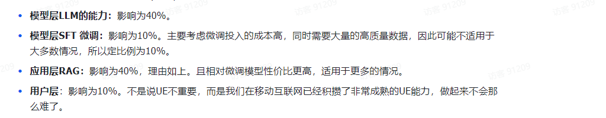

# 引言
**针对大模型的各部分的不同能力的占比：**

# RAG是什么？
大模型没有RAG时，即大模型没有知识资料库，
有RAG，即Retrieval Argumentrd Generation.相当于具有检索（资料库）结果发给大模型，增强大模型的能力。openai开发研究者分享RAG比想象中困难许多！！！
# How:RAG流水线概述
数据提取，分块，向量化，创建索引，检索环节，检索评估。大模型后：重排序（对前面的初步检索结果进行重排序），重排评测，生成（系统找到准确资料，即将重排序后的资料片段加上用户提示词），终极评估（用于评估RAG的框架RAGAS）。
# RAG中的数据采集

