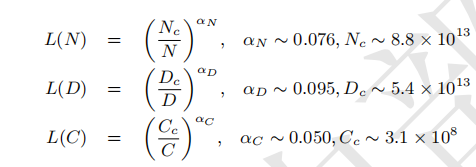
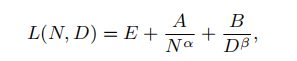
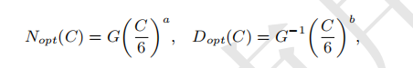
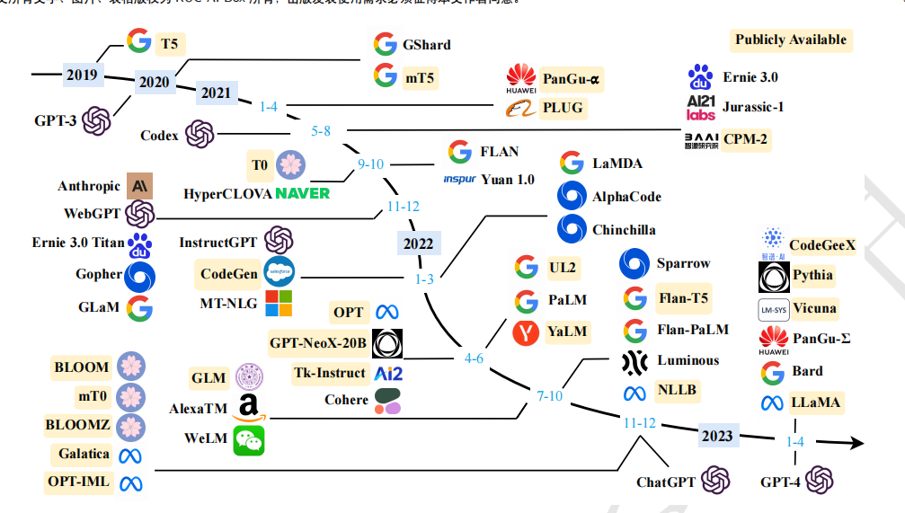

# 引言
语言建模（LM）是提高机器语言智能的主要方法之一。一般来说，LM 旨在对词序列的生成概率进行建模，以预测未来（或缺失）tokens的概率。主要四个阶段：
- 统计语言模型SLM，兴起于20世纪90年代，基于马尔可夫等传统机器学习来预测模型。（信息检索IR，NLP领域）。维数灾难问题。
- 神经语言模型NLM，循环神经网络RNN等。各种上下文特征的表示方法，分布式词向量，word2vec等。
- 预训练语言模型PLM，预训练一个双向LSTM来捕捉语言上下文的此表示，下游再微调一个网络；再到并行化的transformer，BERT。预训练的上下文感知此作为通用语义非常有效。基本确定了"预训练加微调"学习范式，通过统一的上下文表达加上微调，来适配不同的下游任务。
- **大语言模型LLM**，研究发现扩大上游的PLM以及数据的大小，可以提升下游的模型性能（即上游的上下文特征表示更加准确）；且当模型大小的很大时，在解决复杂任务上展示了惊人能力（涌现能力）。和PLM区别有三点：一是LLM大模型带来的涌现能力，二是LLM改变人类开发和使用人工智能算法方式，gpt系列依靠提示接口，三是LLM的发展不区分研究和工程，不管训练还是部署，都需要如大规模数据处理，分布式并行训练等工程上的复杂问题。
LLM的出现看到了通往AGI的大门。chatgpt（聊天机器人），gpt-4整合视觉支持多模态输入。Copilot自动化办公工作等。
**问题**？
LLM尽管有很多应用，但是其基本原理尚未充分了解。
研究界训练出有能力的LLM很难，主要工业界。
LLM与人类价值观或偏好保持一致有挑战性。
本文主要四方面研究LLM。
一是预训练，二是适配微调（有效，安全，针对性的微调），三是使用（解决下游任务），四是能力评估（评估LLM能力和现有的经验性发现）
# 概述
LLM背景以及GPT系列模型计数演变
## 大语言模型背景
### LLM的扩展法则
扩展可以大幅度提高LLM的模型能力
- KM扩展法则：
描述神经网络语言模型性能和模型规模（N），数据集规模（D），训练计算量（C）的幂律关系。

显然N,D,C越大，对应的L(.)的交叉熵损失越小，则对应的信息预测越准确。显然模型的性能和这三个值呈强依赖关系。（**假设三个因素弱相关**）
- Chinchilla扩展法则
对N,D有如下关系：

以下是约束条件C约等于6ND的优化损失

大致是KM倾向于更多运算分给模型大小，而Chinchilla倾向于模型大小N和数据大小D应该以相同比例增加。即a，b取值相近。
### LLM的涌现能力
介绍三种典型涌现能力：
- 上下文学习
ICL能力不仅取决于上游模型（无需额外训练或梯度更新即可产生预期输出），还取决于具体的下游任务（下游任务的难易和类型也决定了模型的涌现能力表现）。
- 指令遵循
使用自然语言描述的混合多任务数据集进行微调。LLM可在未见过的指令形式任务上表现出色。**指令微调需要一定的模型大小基础**。
- 逐步推理
使用思维链提示策略（CoT）可以解决包含中间复杂推理的任务，得到最终结果。此外对于不同任务，CoT提示的性能改进也有差异。
### LLM的关键技术
- 扩展，基于transformer的语言模型存在明显的扩展效应。利用扩展法则高效分配计算资源，（数据和模型扩展）。对于数据扩展，需要谨慎，质量很重要。
- 训练
分布式训练优化框架，如DeepSpeed和Megatron-LM。**优化技巧对于训练稳定性和模型性能也重要**。
- 能力引导
LLM执行特定任务，通用任务求解器的能力可能不会展示出来，但设计合适的任务指令或者具体的ICL策略即可激发。CoT提示以及自然语言表达对LLM进行指令微调。
- 对齐微调
LLM的训练数据有高也有低质量数据，为使LLM与人类价值观保持一致（有用性，诚实，无害），设计一种有效微调方法，基于RLHF技术进行微调。
- 工具操作
即将外部工具如计算器，搜索引擎作为LLM的衍生，来处理一些自己没有接触训练过的事，如数值计算，最新信息检索。
## GPT系列模型技术演进

- GPT-1 
是基于生成型的、仅解码器的 Transformer 架构开发的，并采用了无监督预训练和有监督微调的混合方法。GPT-1 为 GPT 系列模型建立了核心
架构，并确立了对自然语言文本进行建模的基本原则，预测下一个单词。
- GPT-2
采用和GPT-1类似的架构，但GPT2只通过无监督训练来执行任务，不需显示的进行微调。他们认为，有监督目标和无监督目标相同，但无监督目标的最小值
肯定也是有监督任务最小值。（看出了全局最小值和局部最小值的关系）。GPT2虽然期望是无监督的多任务学习，但最终效果不尽如意，和监督微调相比，性能较差。
- GPT-3
模型参数1750亿的规模，介绍了ICL的概念。大致就是让大量的训练输入数据，测试数据按照已经给出的少量数据模板（输入和输出模板）来进行转换，这极大提升了GPT-3的模型的ICL能力，是一种经典的LLMs方法。
**使用代码数据进行训练**（CodeX采用github的数据进行训练，可解决非常困难的编程问题），GPT3.5模型是基于代码的GPT模型的基础上开发的。
**与人类对齐**，即通过人类偏好来训练模型，最终诞生了RLHF即基于人类反馈的强化学习算法。这些技术使GPT-3.5诞生。
- ChatGPT
类似InstructGPT的方式进行训练，但针对对话能力进行优化，训练数据包含
通过人类生成的对话（用户和AI两个角色）。
- GPT-4
开展人类生成问题的定性测试研究GPT-4性能，GPT-4比ChatGPT有更出色的性能。RLHF算法迭代对齐，生成的内容更安全，多种策略减轻语言模型的如幻觉，隐私，过度依赖的问题。OpenAI已经提出了开发部署生命周期完成LLM的部署开发。
