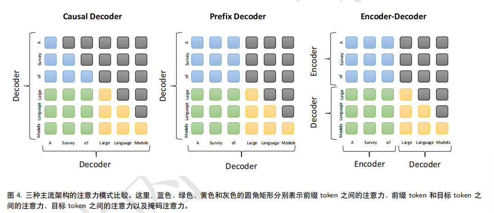

# 引言
语言建模（LM）是提高机器语言智能的主要方法之一。一般来说，LM 旨在对词序列的生成概率进行建模，以预测未来（或缺失）tokens的概率。主要四个阶段：
- 统计语言模型SLM，兴起于20世纪90年代，基于马尔可夫等传统机器学习来预测模型。（信息检索IR，NLP领域）。维数灾难问题。
- 神经语言模型NLM，循环神经网络RNN等。各种上下文特征的表示方法，分布式词向量，word2vec等。
- 预训练语言模型PLM，预训练一个双向LSTM来捕捉语言上下文的此表示，下游再微调一个网络；再到并行化的transformer，BERT。预训练的上下文感知此作为通用语义非常有效。基本确定了"预训练加微调"学习范式，通过统一的上下文表达加上微调，来适配不同的下游任务。
- **大语言模型LLM**，研究发现扩大上游的PLM以及数据的大小，可以提升下游的模型性能（即上游的上下文特征表示更加准确）；且当模型大小的很大时，在解决复杂任务上展示了惊人能力（涌现能力）。和PLM区别有三点：一是LLM大模型带来的涌现能力，二是LLM改变人类开发和使用人工智能算法方式，gpt系列依靠提示接口，三是LLM的发展不区分研究和工程，不管训练还是部署，都需要如大规模数据处理，分布式并行训练等工程上的复杂问题。
LLM的出现看到了通往AGI的大门。chatgpt（聊天机器人），gpt-4整合视觉支持多模态输入。Copilot自动化办公工作等。
**问题**？
LLM尽管有很多应用，但是其基本原理尚未充分了解。
研究界训练出有能力的LLM很难，主要工业界。
LLM与人类价值观或偏好保持一致有挑战性。
本文主要四方面研究LLM。
一是预训练，二是适配微调（有效，安全，针对性的微调），三是使用（解决下游任务），四是能力评估（评估LLM能力和现有的经验性发现）
# 概述
LLM背景以及GPT系列模型计数演变
## 大语言模型背景
### LLM的扩展法则
扩展可以大幅度提高LLM的模型能力
- KM扩展法则：
描述神经网络语言模型性能和模型规模（N），数据集规模（D），训练计算量（C）的幂律关系。

显然N,D,C越大，对应的L(.)的交叉熵损失越小，则对应的信息预测越准确。显然模型的性能和这三个值呈强依赖关系。（**假设三个因素弱相关**）
- Chinchilla扩展法则
对N,D有如下关系：

以下是约束条件C约等于6ND的优化损失

大致是KM倾向于更多运算分给模型大小，而Chinchilla倾向于模型大小N和数据大小D应该以相同比例增加。即a，b取值相近。
### LLM的涌现能力
介绍三种典型涌现能力：
- 上下文学习
ICL能力不仅取决于上游模型（无需额外训练或梯度更新即可产生预期输出），还取决于具体的下游任务（下游任务的难易和类型也决定了模型的涌现能力表现）。
- 指令遵循
使用自然语言描述的混合多任务数据集进行微调。LLM可在未见过的指令形式任务上表现出色。**指令微调需要一定的模型大小基础**。
- 逐步推理
使用思维链提示策略（CoT）可以解决包含中间复杂推理的任务，得到最终结果。此外对于不同任务，CoT提示的性能改进也有差异。
### LLM的关键技术
- 扩展，基于transformer的语言模型存在明显的扩展效应。利用扩展法则高效分配计算资源，（数据和模型扩展）。对于数据扩展，需要谨慎，质量很重要。
- 训练
分布式训练优化框架，如DeepSpeed和Megatron-LM。**优化技巧对于训练稳定性和模型性能也重要**。
- 能力引导
LLM执行特定任务，通用任务求解器的能力可能不会展示出来，但设计合适的任务指令或者具体的ICL策略即可激发。CoT提示以及自然语言表达对LLM进行指令微调。
- 对齐微调
LLM的训练数据有高也有低质量数据，为使LLM与人类价值观保持一致（有用性，诚实，无害），设计一种有效微调方法，基于RLHF技术进行微调。
- 工具操作
即将外部工具如计算器，搜索引擎作为LLM的衍生，来处理一些自己没有接触训练过的事，如数值计算，最新信息检索。
## GPT系列模型技术演进

- GPT-1 
是基于生成型的、仅解码器的 Transformer 架构开发的，并采用了无监督预训练和有监督微调的混合方法。GPT-1 为 GPT 系列模型建立了核心
架构，并确立了对自然语言文本进行建模的基本原则，预测下一个单词。
- GPT-2
采用和GPT-1类似的架构，但GPT2只通过无监督训练来执行任务，不需显示的进行微调。他们认为，有监督目标和无监督目标相同，但无监督目标的最小值
肯定也是有监督任务最小值。（看出了全局最小值和局部最小值的关系）。GPT2虽然期望是无监督的多任务学习，但最终效果不尽如意，和监督微调相比，性能较差。
- GPT-3
模型参数1750亿的规模，介绍了ICL的概念。大致就是让大量的训练输入数据，测试数据按照已经给出的少量数据模板（输入和输出模板）来进行转换，这极大提升了GPT-3的模型的ICL能力，是一种经典的LLMs方法。
**使用代码数据进行训练**（CodeX采用github的数据进行训练，可解决非常困难的编程问题），GPT3.5模型是基于代码的GPT模型的基础上开发的。
**与人类对齐**，即通过人类偏好来训练模型，最终诞生了RLHF即基于人类反馈的强化学习算法。这些技术使GPT-3.5诞生。
- ChatGPT
类似InstructGPT的方式进行训练，但针对对话能力进行优化，训练数据包含
通过人类生成的对话（用户和AI两个角色）。
- GPT-4
开展人类生成问题的定性测试研究GPT-4性能，GPT-4比ChatGPT有更出色的性能。RLHF算法迭代对齐，生成的内容更安全，多种策略减轻语言模型的如幻觉，隐私，过度依赖的问题。OpenAI已经提出了并遵循五阶段的开发部署生命周期完成LLM的部署开发。
# 大语言模型资源
## 公开可用的模型检查点或者API
公开模型划分为百亿参数量级别和千亿参数量级别。
GPT系列提供的API接口和作用可以在下面连个网站查询
- https://platform.openai.com/docs/api-reference/introduction
- https://platform.openai.com/docs/models/overview
## 常用语料库
将语料库划分为六个组：
- Books：如BookCorpus和Gutenberg。是开源的语料数据，主要是各种书籍数据。
- CommonCrawl：最大的开源网络爬虫数据库之一，但网页由大量噪音且有大量低质量信息，需进行数据预处理。
- Reddit Links:Reddit是一个社交媒体平台，获取上面的高赞帖子，构建高质量的数据集.
- Wikipedia,维基百科的高质量数据
- Code,主要是github和stackoverflow。
- Others,大规模，多样化，开源的文本数据集。包括，书籍，网站，社交媒体平台，科学论文和代码数据等。
现代的LLM，通常是混合使用不同的语料库。
## 代码库资源
可用于开发LLM的代码库：
Transformers(Hugging Face),DeepSpeed(兼容pytorch，分布式训练优化)，Megatron-LM(NVIDIA开发，分布式训练优化)。JAX（Google,高效），Colossal-AI。BMTrain(简洁高效，低资源占用)，FastMoE等，还有传统的TensorFlow，pytorch，mxnet，paddlepaddle。mindspore，oneflow等也可。
# 预训练
主要是语料库的规模以及质量，模型架构，加速方法和优化技术。
## 数据收集
预训练语料库来源广义分为：通用文本数据和专用文本数据。
通用文本数据：如网页（质量参差不齐，需要进行数据的过滤），书籍（正式的长文本），对话文本（将对话数据转换成树形结构）。
专用文本数据：**专用数据集对于提高 LLM 在特定下游任务中的能力非常有用。**
如多语言文本（用于翻译，多语言摘要，多语言问答等）。科学文本（各种论文，科学教材，数学网页，科学数据复杂性（需要统一处理为LLM的适配输入）），代码（大量的代码语料库可显著提高编写程序的质量）
### 数据预处理
消除噪声，冗余，无关和潜在有害的数据，来构建预训练语料库。
- 质量过滤，基于分类器/基于启发式方法。分类器（Wiki百科正样本，候选数据为负样本训练二元分类器，并给每个数据打分，可能删除方言，口语，社会语言的高质量数据）。采用启发式，设计一套规则来消除低质量文本（语言过滤，度量过滤（检测和删除不自然的句子），统计过滤（语料库的统计特征，标点符号分布，符号单词比率买橘子长度等），关键词过滤（关键词集合删除文本噪声或无用元素））。
- 去重，语料库数据重复影响模型性能。三个方面。一是句子级，删除重复单词和短低质量句子。二是文档级别上，利用单词和n元重叠等重叠比率检测和删除相似内容的重复文档。三是数据集级别上，训练集删除测试集可能出现的重复文本。
- 隐私去除，删除个人识别信息PII，什么关键词识别（姓名，电话等）。
- 分词，将原始的文本分割成词序列。（通用的也可，但是专门为预训练语料库设计的分词器更有效（SentencePiece可训练定制化分词器））。
### 预训练数据和对大语言模型的影响
- 混合来源，当混合不同来源的数据时，需要仔细设置预训练数据的分布，因为这也可能会影响 LLM 在下游任务上的性能。
- 预训练数据的数量，采用相等规模的模型参数和训练token是必要的。
- 预训练数据的质量，去除噪声，冗余无关以及有害数据。提升训练稳定性以及避免其对模型的影响。
## 架构
主流架构，预训练目标和详细配置。
### 主流架构
大致三种类型：即编码器-解码器（如BART，Flan-T5,现在只有少数LLM这样）、因果解码器（注意力掩码，只关注过去token和其本身；如GPT系列模型）和前缀解码器（==修正因果解码器的掩码机制，可对前缀token执行双向注意力；而对生成的token的掩码机制还未改变====**需要再学习？？**==）。

如上为三种结构的各token和掩码，注意力的关系。目标token可见前缀token以及之前生成的目标token。因果解码器的前缀token只能见到以前的前缀token，可能缺乏对前缀token的上下文表示。
#### 详细配置
讨论Transformer的四个主要部分配置：标准化，位置编码，激活函数，注意力和偏置。
- 标准化，最初采用后置LN，但大多数LLM采用前置LLM（性能有一定损失，但训练稳定）。LN逐渐被RMS Norm,DeepNorm等取代。
- 激活函数，广泛使用GeLU激活函数，使用GLU的变体（如SwiGLU，GeGLU变体等，性能更好，但于GeLU比，需额外50%参数）。
- 位置编码，transformer的自注意模块有置换不变性（即对输入序列顺序不敏感）的特点.（需要使用位置编码来注入绝对或相对位置信息）。绝对位置（正弦函数，学习的位置编码）；相对位置（如ALiBi基于键和查询之间的偏移量生成嵌入；RoPE在键和查询之间的分数可以使用相对位置信息计算。）
- 注意力机制和偏置：全自注意力机制，稀疏注意力机制，其他特殊的注意力模式（考虑显存访问，高校建模更长序列）。大多数LLM在线性层和层标准化都保留偏置，但也有偏置被移除。（去除偏置可以增强训练的稳定性）。
#### 预训练任务
语言建模和去噪自编码。
语言建模主是基于序列前的token，自回归的预测目标token。
去噪自编码（DAE），DAE任务输入是有一些随机替换区间的损坏文本。再训练语言模型以恢复被替换的原token。由于其实现比LM复杂，并没有广泛应用于LLM.
#### 总结讨论
因果编码器似乎有更优越的零样本和小样本泛化能力。扩展法则的体现。
## 模型训练

